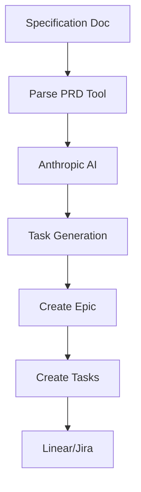

# Alfred Task Manager - System Architecture

## Overview
Alfred is an AI-powered task execution assistant that bridges the gap between AI agents and professional task management platforms (Linear/Jira). It provides an MCP (Model Context Protocol) interface for managing tasks through established platforms, leveraging their robust features while adding intelligent AI capabilities.

## System Components

### 1. Core Architecture

```
alfred/
├── MCP Server Layer
│   ├── mcp_server.py (FastMCP server)
│   ├── tools/ (MCP tool implementations)
│   │   ├── __init__.py
│   │   ├── task_creation.py
│   │   ├── task_management.py
│   │   ├── task_analysis.py
│   │   └── utilities.py
│   └── utils.py (Helper functions)
│
├── Backend Adapters
│   ├── base.py (Abstract adapter interface)
│   ├── linear_adapter.py (Linear API integration)
│   └── jira_adapter.py (Jira API integration - future)
│
├── AI Integration
│   ├── anthropic_client.py (Anthropic Claude integration)
│   └── prompts/
│       ├── create_tasks.py
│       ├── decompose.py
│       ├── analyze.py
│       └── research.py
│
└── Configuration
    ├── settings.py (Environment and config management)
    └── .alfred/
        ├── config.json (Workspace selection, preferences)
        └── .env.example (API keys template)
```

## Key Design Patterns

### 1. **Stateless Architecture**
Alfred maintains no local state - all data resides in Linear/Jira:
- No local task database
- No file system complexity
- All state managed by professional platforms
- Configuration minimal (workspace selection only)

### 2. **Adapter Pattern**
Abstract interface for platform integration:
```python
class TaskAdapter(ABC):
    async def create_task(self, title, description, epic_id=None)
    async def get_tasks(self, epic_id=None, status=None)
    async def update_task(self, task_id, updates)
    async def create_subtask(self, parent_id, title, description)
```

### 3. **Hierarchical Task Mapping**
Universal 4-level hierarchy across platforms:
```
Alfred Level    | Linear         | Jira
----------------|----------------|----------------
Project         | Team           | Project
Epic            | Project        | Epic
Task            | Issue          | Story/Task
Subtask         | Sub-issue      | Sub-task
```

### 4. **Single AI Provider (MVP)**
Simplified AI integration with Anthropic only:
- Claude 3.5 Sonnet for all operations
- Structured prompts in Python modules
- Easy to extend to multiple providers later

## MCP Tools Catalog

### Group 1: Project Setup (1 tool)
- **initialize_project**: Connect to Linear/Jira workspace and configure Alfred

### Group 2: Task Creation (3 tools)
- **create_tasks_from_spec**: Parse specifications and create tasks with AI
- **decompose_task**: Break task into subtasks using AI
- **decompose_all_tasks**: Batch decomposition of eligible tasks

### Group 3: Task Management (2 tools)
- **enhance_task_scope**: Increase task complexity/scope with AI
- **simplify_task**: Reduce task complexity/scope with AI

### Group 4: Task Analysis (5 tools)
- **assess_complexity**: Analyze task complexity and provide recommendations
- **get_complexity_report**: View complexity analysis report
- **get_tasks**: List all tasks with filtering options
- **get_task**: Get detailed information about specific task(s)
- **get_next_task**: Suggest next actionable task based on status and dependencies

### Group 5: Task Operations (9 tools)
- **create_task**: Create individual task with optional AI assistance
- **add_subtask**: Add subtask to existing task
- **update_task**: Add AI-generated context to existing task
- **update_subtask**: Append information to subtask
- **update**: Apply bulk updates to multiple tasks
- **set_task_status**: Update task progress status
- **remove_task**: Delete task
- **remove_subtask**: Delete subtask
- **archive_subtasks**: Archive all subtasks of a task

### Group 6: Task Hierarchy (5 tools)
- **link_tasks**: Create dependencies between tasks
- **unlink_tasks**: Remove task dependencies
- **check_task_links**: Validate task dependencies
- **repair_task_links**: Fix broken dependencies
- **reassign_task**: Move task to different epic or parent

### Group 7: Epic Management (6 tools)
- **list_epics**: Show all available epics/projects
- **create_epic**: Create new epic/project
- **switch_epic**: Change active epic context
- **rename_epic**: Rename existing epic
- **duplicate_epic**: Copy epic with all tasks
- **delete_epic**: Remove epic and its tasks

### Group 8: Utilities (1 tool)
- **export_tasks**: Export tasks to various formats

### Group 9: Special Utilities (2 tools)
- **research**: AI-powered research with context gathering
- **export_to_markdown**: Export tasks as markdown documentation

## Data Flow Examples

### 1. Task Creation Flow


### 2. Spec Parsing Flow


### 3. Research Flow


## AI Integration Architecture

### Simplified Prompt System
```python
class TaskPrompts:
    @staticmethod
    def create_tasks(spec_content: str, num_tasks: int = None) -> str:
        return f"""
        Analyze this specification and generate {num_tasks or 'appropriate'} tasks.
        Each task should be actionable and well-defined.
        
        Specification:
        {spec_content}
        
        Return as JSON array with: title, description, priority
        """
    
    @staticmethod
    def decompose_task(task: dict, num_subtasks: int = None) -> str:
        return f"""
        Break down this task into {num_subtasks or '3-5'} subtasks.
        Task: {task['title']}
        Description: {task['description']}
        """
```

### Single Provider Configuration
```python
# .env
ANTHROPIC_API_KEY=sk-xxx
LINEAR_API_KEY=lin_api_xxx

# MVP: One model for all operations
model = "claude-3-5-sonnet-20241022"
```

## State Management

### Platform-Native States
**Linear Status Mapping:**
- `backlog`: Not started
- `todo`: Ready to work
- `in_progress`: Currently active
- `done`: Completed
- `canceled`: No longer needed

**Jira Status Mapping:**
- `To Do`: Not started
- `In Progress`: Currently active
- `Done`: Completed
- `Blocked`: Waiting on dependencies

### Epic Context
- **Active Epic**: Current working context (stored in config)
- **Default Epic**: Main epic for general tasks
- All tasks belong to exactly one epic

## Configuration Structure

### Minimal Local Storage
```
.alfred/
├── config.json          # Workspace and epic selection
│   {
│     "platform": "linear",
│     "workspace_id": "xxx",
│     "team_id": "xxx",
│     "active_epic_id": "xxx"
│   }
└── .env                 # API keys (not in git)
    LINEAR_API_KEY=xxx
    ANTHROPIC_API_KEY=xxx
```

## Security Considerations

### API Key Management
- Environment variables for all secrets
- Never stored in config files
- Validated on initialization

### Platform Security
- OAuth tokens preferred over API keys
- Workspace-level permissions respected
- No direct database access

### MCP Security
- Session-based operation
- Tool permission system
- No persistent state

## Performance Optimization

### API Efficiency
- Batch operations where possible
- Pagination for large datasets
- Custom field caching

### AI Optimization
- Prompt templates cached in memory
- Token usage tracking
- Response streaming for long operations

## Error Handling

### Error Categories
1. **Configuration Errors**: Missing API keys, invalid workspace
2. **Platform Errors**: API failures, permission issues
3. **AI Errors**: Rate limits, token limits
4. **Network Errors**: Connection issues, timeouts

### Recovery Strategies
- Graceful API failure handling
- Clear error messages for users
- Retry logic with exponential backoff

## Extension Points

### Adding Platform Support
```python
class JiraAdapter(TaskAdapter):
    async def create_task(self, title, description, epic_id=None):
        # Jira-specific implementation
        pass
```

### Custom MCP Tools
```python
@server.tool()
async def custom_tool(args: dict) -> str:
    # Custom functionality
    pass
```

### Prompt Extensions
```python
class CustomPrompts(TaskPrompts):
    @staticmethod
    def custom_analysis(task):
        return f"Custom prompt for {task}"
```

## Deployment Architecture

### MCP Server Setup
```json
{
  "mcpServers": {
    "alfred": {
      "command": "python",
      "args": ["-m", "alfred.mcp_server"],
      "env": {
        "LINEAR_API_KEY": "...",
        "ANTHROPIC_API_KEY": "..."
      }
    }
  }
}
```

### Python Package Installation
```bash
pip install alfred-task-manager
# or
uv add alfred-task-manager
```

## Integration Examples

### Linear Integration
```python
from linear_api import LinearClient

client = LinearClient(api_key=os.getenv("LINEAR_API_KEY"))
team = await client.teams.get(team_id)
project = await team.projects.create(name="New Epic")
issue = await project.issues.create(title="Task", description="...")
```

### Jira Integration (Future)
```python
from jira import JIRA

jira = JIRA(server="...", basic_auth=(...))
epic = jira.create_issue(project="KEY", issuetype="Epic")
task = jira.create_issue(project="KEY", parent=epic.key)
```

## Future Enhancements

### Phase 2 Features
1. **Jira Support**: Complete adapter implementation
2. **Webhook Support**: Real-time updates from Linear/Jira
3. **Multiple AI Providers**: OpenAI, Gemini support
4. **Custom Fields**: Better complexity tracking
5. **Team Features**: Multi-user support

### Phase 3 Vision
- GitHub integration for code-task linking
- Slack notifications
- Time tracking integration
- Sprint planning assistance
- Automated status updates

---

*This architecture document outlines Alfred's design as a stateless, platform-integrated task execution assistant.*