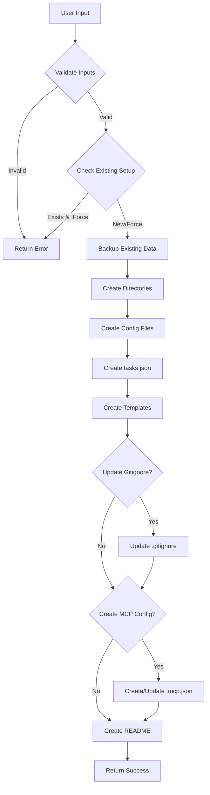

# Tool: initialize_project

## Purpose
Initialize Task Master in a new or existing project by setting up the required directory structure, configuration files, and templates for AI-powered task management.

## Business Value
- **Who uses this**: Developers starting a new project or adding Task Master to an existing codebase
- **What problem it solves**: Eliminates manual setup, ensures consistent project structure, and provides immediate working configuration
- **Why it's better than manual approach**: Automated setup prevents configuration errors, includes best practices, and takes seconds instead of minutes

## Functionality Specification

### Input Requirements

| Parameter | Type | Required | Default | Description |
|-----------|------|----------|---------|-------------|
| `projectRoot` | string | Yes | - | Absolute path to the project directory where Task Master should be initialized |
| `profile` | string | No | "standard" | Setup profile: "basic", "standard", or "advanced" |
| `createMcpConfig` | boolean | No | true | Whether to create `.mcp.json` for Claude integration |
| `skipGitignore` | boolean | No | false | Skip updating .gitignore file |
| `force` | boolean | No | false | Overwrite existing Task Master configuration |

#### Validation Rules
1. `projectRoot` must be an existing directory with write permissions
2. `profile` must be one of: "basic", "standard", "advanced"
3. Cannot initialize if `.taskmaster/` exists unless `force` is true

#### Profile Configurations
- **basic**: defaultNumTasks=5, defaultSubtasks=2 (for smaller projects)
- **standard**: defaultNumTasks=10, defaultSubtasks=3 (balanced approach)
- **advanced**: defaultNumTasks=15, defaultSubtasks=5 (complex projects)

### Processing Logic

#### Step-by-Step Algorithm

```
1. VALIDATE_INPUTS
   - Check projectRoot exists and is writable
   - Validate profile value
   - Check Node.js version compatibility (>=18.0.0)
   
2. CHECK_EXISTING_SETUP
   - Check if .taskmaster/ directory exists
   - If exists and !force:
     - Return error: "Task Master already initialized. Use --force to reinitialize"
   - If exists and force:
     - Log warning: "Overwriting existing Task Master configuration"
     - Backup existing tasks.json to .taskmaster/backups/
     
3. CREATE_DIRECTORY_STRUCTURE
   - Create .taskmaster/ (root directory)
   - Create .taskmaster/tasks/ (task storage)
   - Create .taskmaster/reports/ (analysis reports)
   - Create .taskmaster/docs/ (documentation)
   - Create .taskmaster/docs/templates/ (PRD templates)
   - Create .taskmaster/backups/ (for data safety)
   
4. CREATE_CONFIGURATION_FILES
   
   4.1 Create .taskmaster/config.json:
   ```json
   {
     "version": "1.0.0",
     "profile": "<profile>",
     "settings": {
       "responseLanguage": "en",
       "defaultPriority": "medium",
       "defaultNumTasks": <profile-based>,
       "defaultSubtasks": <profile-based>,
       "streamingEnabled": true
     },
     "activeModels": {
       "main": null,
       "research": null,
       "fallback": null
     },
     "providers": {},
     "createdAt": "<ISO-8601-timestamp>",
     "lastModified": "<ISO-8601-timestamp>"
   }
   ```
   
   4.2 Create .taskmaster/tasks/tasks.json:
   ```json
   []
   ```
   
   4.3 Create .taskmaster/.current-tag:
   ```
   master
   ```
   
5. CREATE_TEMPLATE_FILES
   
   5.1 Create .taskmaster/docs/templates/example-prd.txt:
   ```
   PROJECT REQUIREMENTS DOCUMENT
   
   ## Overview
   [Describe the project goal and vision]
   
   ## User Stories
   - As a [user type], I want to [action] so that [benefit]
   - As a [user type], I want to [action] so that [benefit]
   
   ## Technical Requirements
   - [Requirement 1]
   - [Requirement 2]
   
   ## Acceptance Criteria
   - [ ] [Criterion 1]
   - [ ] [Criterion 2]
   
   ## Timeline
   - Phase 1: [Description] - [Duration]
   - Phase 2: [Description] - [Duration]
   ```
   
6. UPDATE_GITIGNORE (if !skipGitignore)
   - Read existing .gitignore (create if doesn't exist)
   - Check if Task Master entries exist
   - If not, append:
   ```
   # Task Master
   .taskmaster/config.json
   .taskmaster/backups/
   .taskmaster/.current-tag
   .env
   ```
   
7. CREATE_MCP_CONFIG (if createMcpConfig)
   - Check if .mcp.json exists
   - If exists, parse and merge new config
   - If not, create new:
   ```json
   {
     "mcpServers": {
       "task-master-ai": {
         "command": "npx",
         "args": ["-y", "--package=task-master-ai", "task-master-ai"],
         "env": {
           "ANTHROPIC_API_KEY": "${ANTHROPIC_API_KEY}",
           "OPENAI_API_KEY": "${OPENAI_API_KEY}",
           "PERPLEXITY_API_KEY": "${PERPLEXITY_API_KEY}",
           "GOOGLE_API_KEY": "${GOOGLE_API_KEY}",
           "GROQ_API_KEY": "${GROQ_API_KEY}",
           "MISTRAL_API_KEY": "${MISTRAL_API_KEY}",
           "XAI_API_KEY": "${XAI_API_KEY}",
           "OPENROUTER_API_KEY": "${OPENROUTER_API_KEY}"
         }
       }
     }
   }
   ```
   
8. CREATE_README_FILE
   - Create .taskmaster/README.md:
   ```markdown
   # Task Master Project
   
   ## Getting Started
   1. Configure AI models: `task-master models --setup`
   2. Create a PRD document in `.taskmaster/docs/`
   3. Generate tasks: `task-master parse-prd .taskmaster/docs/your-prd.txt`
   4. View tasks: `task-master list`
   5. Get next task: `task-master next`
   
   ## Configuration
   - Profile: <profile>
   - Created: <timestamp>
   
   ## Documentation
   Visit: https://github.com/eyaltoledano/task-master
   ```
   
9. RETURN_SUCCESS
```

### Output Specification

#### Success Response
```javascript
{
  success: true,
  message: "Task Master initialized successfully",
  data: {
    projectRoot: "/absolute/path/to/project",
    profile: "standard",
    directories: {
      root: ".taskmaster",
      tasks: ".taskmaster/tasks",
      reports: ".taskmaster/reports",
      docs: ".taskmaster/docs",
      templates: ".taskmaster/docs/templates",
      backups: ".taskmaster/backups"
    },
    files: [
      ".taskmaster/config.json",
      ".taskmaster/tasks/tasks.json",
      ".taskmaster/.current-tag",
      ".taskmaster/docs/templates/example-prd.txt",
      ".taskmaster/README.md"
    ],
    mcpConfigured: true,
    gitignoreUpdated: true,
    nextSteps: [
      "Run 'task-master models --setup' to configure AI models",
      "Create a PRD in .taskmaster/docs/",
      "Run 'task-master parse-prd' to generate tasks"
    ]
  }
}
```

#### Error Response
```javascript
{
  success: false,
  error: {
    code: "INIT_FAILED",
    message: "Failed to initialize Task Master",
    details: "Specific error message",
    suggestion: "How to fix the issue"
  }
}
```

#### Error Codes
- `ALREADY_INITIALIZED`: Task Master already exists (use --force)
- `PERMISSION_DENIED`: Cannot write to project directory
- `INVALID_PROFILE`: Unknown profile specified
- `FILE_SYSTEM_ERROR`: Failed to create files/directories
- `NODE_VERSION`: Node.js version < 18.0.0

### Side Effects
1. Creates `.taskmaster/` directory structure
2. Creates configuration files
3. Modifies `.gitignore` (unless skipped)
4. Creates/modifies `.mcp.json` (if requested)

## Data Flow



## Implementation Details

### Data Storage
- **Primary Storage**: `.taskmaster/tasks/tasks.json` - Array of task objects
- **Configuration**: `.taskmaster/config.json` - Settings and model configuration
- **Current Tag**: `.taskmaster/.current-tag` - Active workflow tag (text file)
- **Reports**: `.taskmaster/reports/` - JSON files for analysis results
- **Backups**: `.taskmaster/backups/` - Timestamped backup files

### File Operations
- All file operations use synchronous Node.js fs methods
- JSON files are pretty-printed with 2-space indentation
- Files are created with UTF-8 encoding
- Directory creation is recursive (creates parent directories)

## AI Integration Points
This tool has minimal AI integration:
- No AI calls during initialization
- Sets up configuration for future AI operations
- Prepares templates optimized for AI parsing
- Creates structure for AI-generated content storage

## Dependencies
- **File System Access**: Read/write permissions in project directory
- **Node.js**: Version 18.0.0 or higher
- **External Tools**: None required
- **Other Task Master Tools**: None (this is the entry point)

## Test Scenarios

### 1. Happy Path Test
```javascript
// Test: Initialize new project
Input: {
  projectRoot: "/tmp/test-project",
  profile: "standard"
}
Expected: Success with all directories and files created
```

### 2. Existing Setup Without Force
```javascript
// Test: Try to initialize already-initialized project
Setup: Project already has .taskmaster/ directory
Input: {
  projectRoot: "/tmp/existing-project",
  force: false
}
Expected: Error with code "ALREADY_INITIALIZED"
```

### 3. Force Reinitialize
```javascript
// Test: Reinitialize with force flag
Setup: Project already initialized with tasks
Input: {
  projectRoot: "/tmp/existing-project",
  force: true,
  profile: "advanced"
}
Expected: 
- Success with new configuration
- Existing tasks.json backed up to .taskmaster/backups/
```

### 4. Permission Denied
```javascript
// Test: Initialize in read-only directory
Input: {
  projectRoot: "/read-only-dir"
}
Expected: Error with code "PERMISSION_DENIED"
```

### 5. Skip Gitignore
```javascript
// Test: Initialize without modifying gitignore
Input: {
  projectRoot: "/tmp/test-project",
  skipGitignore: true
}
Expected: Success without .gitignore modification
```

### 6. No MCP Config
```javascript
// Test: Initialize without MCP configuration
Input: {
  projectRoot: "/tmp/test-project",
  createMcpConfig: false
}
Expected: Success without .mcp.json creation
```

### 7. Profile Variations
```javascript
// Test: Initialize with each profile type
["basic", "standard", "advanced"].forEach(profile => {
  Input: {
    projectRoot: `/tmp/test-${profile}`,
    profile: profile
  }
  Expected: Success with profile-specific defaults
})
```

## Implementation Notes
- **Complexity**: Simple (mostly file operations)
- **Estimated Effort**: 2-3 hours for complete implementation
- **Critical Success Factors**:
  1. Robust error handling for file system operations
  2. Clear validation messages for configuration errors
  3. Atomic operations (rollback on failure)
  4. Preserve existing data when using force flag

## Performance Considerations
- File operations are synchronous for simplicity
- Small file sizes mean performance is not a concern
- Directory creation is done in single recursive call
- No network operations involved

## Security Considerations
- Never store API keys in config.json
- Use environment variables for sensitive data
- Validate file paths to prevent directory traversal
- Set appropriate file permissions (644 for files, 755 for directories)
- Backup existing data before overwriting

## Code References
- Current implementation: `scripts/init.js:1-300`
- MCP tool: `mcp-server/src/tools/initialize-project.js`
- Key functions:
  - `initializeProject()`: Main initialization logic
  - `createDirectoryStructure()`: Directory creation
  - `createConfigFiles()`: Configuration setup
  - `updateGitignore()`: Gitignore management
- Design patterns: Command pattern for CLI integration

---

*This documentation captures the actual current implementation of the initialize_project tool without any speculative features.*