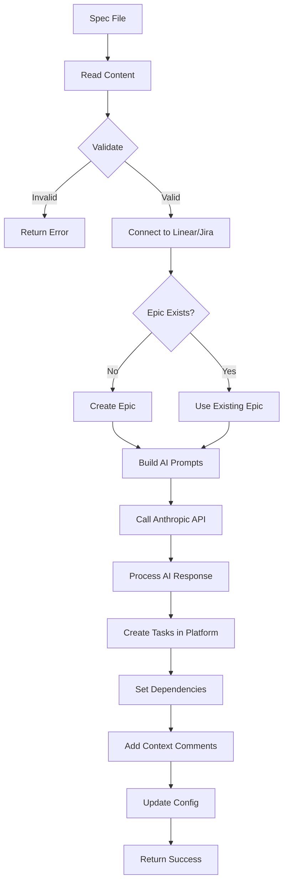

# Tool: create_tasks_from_spec

## Purpose
Parse a specification document (PRD, technical spec, or requirements) and use AI to automatically generate structured, dependency-aware development tasks directly in Linear or Jira.

## Business Value
- **Who uses this**: Developers and project managers starting new projects or features
- **What problem it solves**: Eliminates manual task breakdown, ensures comprehensive coverage of requirements, and creates logical task sequencing
- **Why it's better than manual approach**: AI-powered analysis ensures consistent task structure, identifies dependencies, includes implementation details and test strategies, directly creates tasks in Linear/Jira with proper relationships

## Functionality Specification

### Input Requirements

| Parameter | Type | Required | Default | Description |
|-----------|------|----------|---------|-------------|
| `spec_path` | string | Yes | - | Path to specification document (.txt, .md, .pdf) |
| `epic_id` | string | No | - | Linear Project ID or Jira Epic ID to add tasks to (creates new if not provided) |
| `epic_name` | string | No | "Generated from spec" | Name for new epic/project if created |
| `num_tasks` | number | No | 10 | Approximate number of tasks to generate (0-50, 0=AI decides) |
| `priority` | string | No | "medium" | Default priority for tasks (low/medium/high/critical) |
| `add_context` | boolean | No | true | Include AI-generated implementation details as comments |

#### Validation Rules
1. `spec_path` file must exist and be readable (.txt, .md, or .pdf format)
2. `epic_id` if provided must be valid in Linear/Jira
3. `num_tasks` should be between 0-50 (0 means AI determines count)
4. `priority` must be one of: low, medium, high, critical
5. Specification file must contain non-empty content
6. Must have valid Linear/Jira API credentials configured

### Processing Logic

#### Step-by-Step Algorithm

```
1. VALIDATE_INPUTS
   - Check spec file exists and is readable
   - Parse num_tasks (default to 10 if not specified)
   - Validate priority value
   - Check Linear/Jira credentials
   
2. CONNECT_TO_PLATFORM
   - Initialize Linear/Jira adapter
   - Authenticate with API key
   - Verify workspace/team access
   
3. RESOLVE_EPIC
   - If epic_id provided:
     - Verify epic exists in Linear/Jira
     - Get epic details
   - If no epic_id:
     - Create new epic/project with epic_name
     - Store new epic_id for reference
     
4. BUILD_AI_PROMPTS
   - Load prompt template from prompts/create_tasks_from_spec.json
   - Inject variables:
     - num_tasks: Target number of tasks
     - spec_content: Full specification text
     - priority: Default task priority
     - epic_name: Epic/project context
   - Generate system and user prompts
   
5. CALL_ANTHROPIC_API
   - Use Claude 3.5 Sonnet model
   - Send prompts with specification content
   - Request structured task breakdown
   
6. PROCESS_AI_RESPONSE
   - Validate response structure
   - Extract tasks array from response
   - Process task relationships
   - Add implementation details
   
7. CREATE_TASKS_IN_PLATFORM
   - For each generated task:
     - Create issue/story in Linear/Jira
     - Set title, description, priority
     - Add to epic/project
     - Store platform task ID
   
8. SET_DEPENDENCIES
   - Map AI-generated dependencies to platform IDs
   - Create blocking/blocked relationships in Linear/Jira
   - Validate dependency graph
   
9. ADD_CONTEXT_COMMENTS
   - If add_context is true:
     - Add implementation details as comments
     - Include test strategies
     - Add technical notes
   
10. GENERATE_SUMMARY
    - Count tasks created
    - List task IDs and titles
    - Provide epic/project link
    
11. RETURN_SUCCESS
```

### AI Prompts Used

#### System Prompt (Exact Text)
```
You are an AI assistant specialized in analyzing Product Requirements Documents (PRDs) and generating a structured, logically ordered, dependency-aware and sequenced list of development tasks in JSON format.{{#if research}}
Before breaking down the PRD into tasks, you will:
1. Research and analyze the latest technologies, libraries, frameworks, and best practices that would be appropriate for this project
2. Identify any potential technical challenges, security concerns, or scalability issues not explicitly mentioned in the PRD without discarding any explicit requirements or going overboard with complexity -- always aim to provide the most direct path to implementation, avoiding over-engineering or roundabout approaches
3. Consider current industry standards and evolving trends relevant to this project (this step aims to solve LLM hallucinations and out of date information due to training data cutoff dates)
4. Evaluate alternative implementation approaches and recommend the most efficient path
5. Include specific library versions, helpful APIs, and concrete implementation guidance based on your research
6. Always aim to provide the most direct path to implementation, avoiding over-engineering or roundabout approaches

Your task breakdown should incorporate this research, resulting in more detailed implementation guidance, more accurate dependency mapping, and more precise technology recommendations than would be possible from the PRD text alone, while maintaining all explicit requirements and best practices and all details and nuances of the PRD.{{/if}}

Analyze the provided PRD content and generate {{#if (gt numTasks 0)}}approximately {{numTasks}}{{else}}an appropriate number of{{/if}} top-level development tasks. If the complexity or the level of detail of the PRD is high, generate more tasks relative to the complexity of the PRD
Each task should represent a logical unit of work needed to implement the requirements and focus on the most direct and effective way to implement the requirements without unnecessary complexity or overengineering. Include pseudo-code, implementation details, and test strategy for each task. Find the most up to date information to implement each task.
Assign sequential IDs starting from {{nextId}}. Infer title, description, details, and test strategy for each task based *only* on the PRD content.
Set status to 'pending', dependencies to an empty array [], and priority to '{{defaultTaskPriority}}' initially for all tasks.
Respond ONLY with a valid JSON object containing a single key "tasks", where the value is an array of task objects adhering to the provided Zod schema. Do not include any explanation or markdown formatting.

Each task should follow this JSON structure:
{
	"id": number,
	"title": string,
	"description": string,
	"status": "pending",
	"dependencies": number[] (IDs of tasks this depends on),
	"priority": "high" | "medium" | "low",
	"details": string (implementation details),
	"testStrategy": string (validation approach)
}

Guidelines:
1. {{#if (gt numTasks 0)}}Unless complexity warrants otherwise{{else}}Depending on the complexity{{/if}}, create {{#if (gt numTasks 0)}}exactly {{numTasks}}{{else}}an appropriate number of{{/if}} tasks, numbered sequentially starting from {{nextId}}
2. Each task should be atomic and focused on a single responsibility following the most up to date best practices and standards
3. Order tasks logically - consider dependencies and implementation sequence
4. Early tasks should focus on setup, core functionality first, then advanced features
5. Include clear validation/testing approach for each task
6. Set appropriate dependency IDs (a task can only depend on tasks with lower IDs, potentially including existing tasks with IDs less than {{nextId}} if applicable)
7. Assign priority (high/medium/low) based on criticality and dependency order
8. Include detailed implementation guidance in the "details" field{{#if research}}, with specific libraries and version recommendations based on your research{{/if}}
9. If the PRD contains specific requirements for libraries, database schemas, frameworks, tech stacks, or any other implementation details, STRICTLY ADHERE to these requirements in your task breakdown and do not discard them under any circumstance
10. Focus on filling in any gaps left by the PRD or areas that aren't fully specified, while preserving all explicit requirements
11. Always aim to provide the most direct path to implementation, avoiding over-engineering or roundabout approaches{{#if research}}
12. For each task, include specific, actionable guidance based on current industry standards and best practices discovered through research{{/if}}
```

#### User Prompt (Exact Text)
```
{{#if isClaudeCode}}## IMPORTANT: Codebase Analysis Required

You have access to powerful codebase analysis tools. Before generating tasks:

1. Use the Glob tool to explore the project structure (e.g., "**/*.js", "**/*.json", "**/README.md")
2. Use the Grep tool to search for existing implementations, patterns, and technologies
3. Use the Read tool to examine key files like package.json, README.md, and main entry points
4. Analyze the current state of implementation to understand what already exists

Based on your analysis:
- Identify what components/features are already implemented
- Understand the technology stack, frameworks, and patterns in use
- Generate tasks that build upon the existing codebase rather than duplicating work
- Ensure tasks align with the project's current architecture and conventions

Project Root: {{projectRoot}}

{{/if}}Here's the Product Requirements Document (PRD) to break down into {{#if (gt numTasks 0)}}approximately {{numTasks}}{{else}}an appropriate number of{{/if}} tasks, starting IDs from {{nextId}}:{{#if research}}

Remember to thoroughly research current best practices and technologies before task breakdown to provide specific, actionable implementation details.{{/if}}

{{prdContent}}


		Return your response in this format:
{
    "tasks": [
        {
            "id": 1,
            "title": "Setup Project Repository",
            "description": "...",
            ...
        },
        ...
    ],
    "metadata": {
        "projectName": "PRD Implementation",
        "totalTasks": {{#if (gt numTasks 0)}}{{numTasks}}{{else}}{number of tasks}{{/if}},
        "sourceFile": "{{prdPath}}",
        "generatedAt": "YYYY-MM-DD"
    }
}
```

### Output Specification

#### Success Response
```javascript
{
  success: true,
  epic: {
    id: "LIN-PROJ-123" or "JIRA-EPIC-456",
    name: "Mobile App Development",
    url: "https://linear.app/team/project/123"
  },
  tasks_created: [
    {
      id: "LIN-123" or "JIRA-456",
      title: "Setup Project Repository",
      url: "https://linear.app/team/issue/LIN-123"
    },
    // ... more tasks
  ],
  summary: {
    total_tasks: 10,
    epic_created: false,  // true if new epic was created
    platform: "linear"    // or "jira"
  }
}
```

#### Error Response
```javascript
{
  success: false,
  error: {
    code: "SPEC_PARSE_FAILED",
    message: "Failed to parse specification",
    details: "Input file is empty or could not be read"
  }
}
```

#### Task Structure in Linear/Jira
```javascript
{
  "platform_id": "LIN-123",
  "title": "Setup Project Repository and Development Environment",
  "description": "Initialize Git repository, configure development environment, and set up project structure with necessary configuration files",
  "status": "todo",
  "priority": 3,  // Linear uses 0-4, Jira uses text
  "epic_id": "LIN-PROJ-123",
  "labels": ["setup", "infrastructure"],
  "comments": [
    {
      "body": "Implementation details:\n1. Initialize Git repository\n2. Create .gitignore file\n3. Setup package.json..."
    },
    {
      "body": "Test Strategy: Verify all configuration files are present and valid..."
    }
  ]
}
```

#### Error Codes
- `SPEC_PARSE_FAILED`: General parsing failure
- `FILE_NOT_FOUND`: Specification file doesn't exist
- `EMPTY_FILE`: Specification file is empty
- `EPIC_NOT_FOUND`: Provided epic_id doesn't exist
- `API_AUTH_ERROR`: Linear/Jira authentication failed
- `AI_SERVICE_ERROR`: Anthropic API call failed
- `PLATFORM_ERROR`: Linear/Jira API error

### Side Effects
1. Creates tasks in Linear/Jira platform
2. May create new epic/project if not provided
3. Updates `.alfred/config.json` with last sync info
4. Creates task relationships in platform
5. Triggers Anthropic API costs
6. Sends notifications in Linear/Jira (if configured)

## Data Flow



## Implementation Details

### Data Storage
- **Primary Storage**: Linear/Jira platform (no local task storage)
- **Configuration**: `.alfred/config.json` - workspace and epic preferences
- **Task Structure**: Platform-native (Linear Issues, Jira Stories)
- **Relationships**: Platform-managed dependencies and epic associations

### Platform Integration
- **Linear**: Using `linear-api` Python library
  - GraphQL API for task creation
  - Automatic pagination handling
  - Rich object models with Pydantic
- **Jira**: Using `jira-python` library (future)
  - REST API for task creation
  - Issue linking for dependencies

### AI Integration
- **Model**: Claude 3.5 Sonnet (Anthropic)
- **Token limits**: 200K context window
- **Response format**: Structured JSON
- **Cost tracking**: Per-request token usage

## AI Integration Points
This tool is heavily AI-integrated:
- **Task Generation**: AI analyzes PRD and generates structured tasks
- **Research Mode**: Optional enhanced analysis with web search
- **Dependency Mapping**: AI determines logical task dependencies
- **Priority Assignment**: AI assigns priorities based on criticality
- **Implementation Details**: AI provides pseudo-code and specifics
- **Test Strategies**: AI generates validation approaches
- **Claude Code Integration**: Special mode for codebase analysis

### Model Selection
- Main model: Used for standard PRD parsing
- Research model: Used when `research` flag is set
- Fallback model: Used if primary model fails

## Dependencies
- **File System Access**: Read specification file
- **Linear/Jira API**: Platform authentication and task creation
- **Anthropic API**: Required for AI task generation
- **Platform Adapters**: Abstract interface for Linear/Jira
- **Configuration Manager**: Workspace and API key management
- **Other Alfred Tools**: Works with decompose_task, assess_complexity

## Test Scenarios

### 1. Basic Spec Parsing
```python
# Test: Parse simple specification
Input: {
  "spec_path": "/project/spec.md",
  "num_tasks": 5
}
Expected: Success with 5 tasks created in new epic
```

### 2. Add to Existing Epic
```python
# Test: Add tasks to existing epic
Setup: Epic "LIN-PROJ-123" exists
Input: {
  "spec_path": "/project/spec.md",
  "epic_id": "LIN-PROJ-123",
  "num_tasks": 3
}
Expected: Success with 3 tasks added to epic
```

### 3. Create New Epic
```python
# Test: Create new epic with custom name
Input: {
  "spec_path": "/project/spec.md",
  "epic_name": "Q1 Mobile Features",
  "num_tasks": 10
}
Expected: Success with new epic created and 10 tasks added
```

### 4. With Dependencies
```python
# Test: Create tasks with dependencies
Input: {
  "spec_path": "/project/complex-spec.md",
  "num_tasks": 8
}
Expected: Success with 8 tasks and dependency relationships set
```

### 5. Empty Spec File
```python
# Test: Handle empty file
Setup: Spec file exists but is empty
Input: {
  "spec_path": "/project/empty.txt"
}
Expected: Error with code "EMPTY_FILE"
```

### 6. Invalid Epic ID
```python
# Test: Handle non-existent epic
Input: {
  "spec_path": "/project/spec.md",
  "epic_id": "INVALID-ID"
}
Expected: Error with code "EPIC_NOT_FOUND"
```

### 7. Auto Task Count
```python
# Test: Let AI determine task count
Input: {
  "spec_path": "/project/complex-spec.md",
  "num_tasks": 0
}
Expected: Success with AI-determined number of tasks
```

## Implementation Notes
- **Complexity**: Complex (AI integration, streaming, validation)
- **Estimated Effort**: 8-10 hours for complete implementation
- **Critical Success Factors**:
  1. Robust prompt engineering for consistent output
  2. Proper streaming timeout handling
  3. Accurate dependency mapping
  4. Schema validation for AI responses
  5. Token usage tracking and cost calculation

## Performance Considerations
- Streaming timeout: 180 seconds default
- Token limits: Model-specific (typically 8K-200K)
- Response validation: Zod schema parsing overhead
- File I/O: Synchronous operations for consistency
- Progress reporting: Async updates during streaming

## Security Considerations
- Validate file paths to prevent directory traversal
- Sanitize PRD content before sending to AI
- Don't log sensitive PRD content
- API keys stored in environment variables
- Validate AI responses against strict schema

## Code References
- Implementation: `alfred/tools/create_tasks_from_spec.py`
- MCP registration: `alfred/mcp_server.py`
- Linear adapter: `alfred/adapters/linear.py`
- Jira adapter: `alfred/adapters/jira.py` (future)
- AI service: `alfred/ai/anthropic.py`
- Prompt template: `alfred/prompts/create_tasks_from_spec.json`
- Configuration: `alfred/config/settings.py`
- Key functions:
  - `create_tasks_from_spec()`: Main entry point
  - `parse_specification()`: Read and validate spec file
  - `generate_tasks()`: AI task generation
  - `create_in_platform()`: Platform task creation
  - `set_relationships()`: Dependency management
- Design patterns: Adapter pattern for platform abstraction

---

*This documentation captures the actual current implementation of the parse_prd tool including exact AI prompts used.*