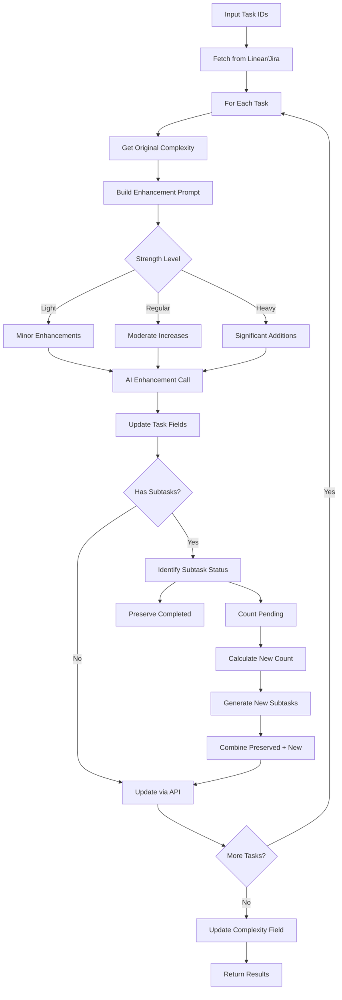

# Tool: enhance_task_scope

## Purpose
Increase task complexity in Linear or Jira using AI to add more detailed requirements, edge cases, advanced features, and comprehensive testing scenarios while optionally regenerating pending subtasks to match the new complexity level.

## Business Value
- **Who uses this**: Developers and project managers adjusting task scope
- **What problem it solves**: Allows dynamic scope expansion when tasks prove more complex than initially estimated or when additional requirements emerge
- **Why it's better than manual approach**: AI intelligently adds complexity while preserving completed work, automatically regenerates subtasks to match new scope, and maintains task coherence

## Functionality Specification

### Input Requirements

| Parameter | Type | Required | Default | Description |
|-----------|------|----------|---------|-------------|
| `task_ids` | list[str] | Yes | - | List of task IDs from Linear/Jira |
| `strength` | string | No | "regular" | Strength level: "light", "regular", or "heavy" |
| `custom_prompt` | string | No | - | Custom instructions for specific adjustments |
| `focus_areas` | list[str] | No | [] | Specific aspects to enhance |
| `update_subtasks` | boolean | No | false | Whether to also enhance existing subtasks |
| `research` | boolean | No | false | Use research capabilities for scoping |

#### Validation Rules
1. `strength` must be one of: "light", "regular", "heavy"
2. All task IDs must exist in Linear/Jira
3. Tasks cannot be completed (done/cancelled status)
4. Must have appropriate API permissions

### Processing Logic

#### Step-by-Step Algorithm

```
1. VALIDATE_INPUTS
   - Check strength is valid
   - Verify API credentials
   - Parse task IDs list
   
2. FETCH_TASK_DATA
   - Call Linear/Jira API to get task details
   - Fetch subtasks if they exist
   - Get current complexity from custom fields
   
3. FOR EACH TASK_ID:

   3.1 GET_ORIGINAL_COMPLEXITY
      - Read complexity from custom field if exists
      - Use for intelligent adjustment calculations
      
   3.2 ADJUST_TASK_COMPLEXITY
      - Build AI prompt for complexity increase
      - Include strength-specific instructions
      - Add custom prompt if provided
      - Call AI service with structured output
      
   3.3 REGENERATE_SUBTASKS (if has subtasks)
      - Identify subtasks by status:
         - Preserve: done, in-progress, review, cancelled, deferred, blocked
         - Regenerate: pending/todo only
      - Calculate new subtask count based on:
         - Strength level
         - Original complexity score
         - Current pending count
         - Preserved count
      - Generate new pending subtasks via AI
      - Combine preserved + new subtasks
      
   3.4 UPDATE_TASK_IN_PLATFORM
      - Update task description via API
      - Update custom fields (complexity, acceptance criteria)
      - Create/update subtasks
      - Add labels/tags
      - Post comment with enhancement summary
      
   3.5 UPDATE_COMPLEXITY_FIELD
      - Calculate new complexity score
      - Update custom field in Linear/Jira
      
4. AGGREGATE_RESULTS
   - Combine telemetry data from all tasks
   - Calculate total tokens and costs
   - Generate summary message
   
5. RETURN_RESULTS
   - Return updated tasks and telemetry
```

### AI Prompts Used

#### System Prompt for Task Complexity Adjustment
```
You are an expert software project manager who helps adjust task complexity while maintaining clarity and actionability.
```

#### User Prompt for Task Complexity Adjustment (Generated Dynamically)
```
You are tasked with adjusting the complexity of a task. 

CURRENT TASK:
Title: {{task.title}}
Description: {{task.description}}
Acceptance Criteria: {{task.acceptanceCriteria || 'Not specified'}}
Current Labels: {{task.labels}}

ADJUSTMENT REQUIREMENTS:
- Direction: INCREASE complexity
- Strength: {{strength}} ({{strengthDescription}})
- Preserve the core purpose and functionality of the task
- Maintain consistency with the existing task structure
- Add more detailed requirements, edge cases, or advanced features
- Include additional implementation considerations
- Enhance error handling and validation requirements
- Expand testing strategies with more comprehensive scenarios

{{#if focusAreas}}
FOCUS AREAS:
{{#each focusAreas}}
- {{this}}
{{/each}}
{{/if}}

{{#if customPrompt}}
CUSTOM INSTRUCTIONS:
{{customPrompt}}
{{/if}}

Return a JSON object with the updated task containing these fields:
- title: Updated task title
- description: Updated task description with markdown formatting
- acceptanceCriteria: Updated acceptance criteria as bullet points
- additionalConsiderations: New requirements and edge cases
- testStrategy: Updated test strategy
- priority: Task priority ('low', 'medium', 'high', or 'critical')
- newLabels: Additional labels to add

Ensure the JSON is valid and properly formatted.
```

#### System Prompt for Subtask Regeneration
```
You are an expert project manager who creates task breakdowns that match complexity levels.
```

#### User Prompt for Subtask Regeneration (Generated Dynamically)
```
Based on this updated task, generate {{newSubtasksNeeded}} NEW subtasks that reflect the increased complexity level:

**Task Title**: {{task.title}}
**Task Description**: {{task.description}}
**Acceptance Criteria**: {{task.acceptanceCriteria}}
**Test Strategy**: {{task.testStrategy}}

**Complexity Direction**: This task was recently scoped up ({{strength}} strength) to increase complexity.
{{#if originalComplexity}}**Original Complexity**: {{originalComplexity}}/10 - consider this when determining appropriate scope level.{{/if}}

{{#if preservedCount > 0}}**Preserved Subtasks**: {{preservedCount}} existing subtasks with work already done will be kept.{{/if}}

Generate subtasks that:
{{#if strength === 'heavy'}}
- Add comprehensive implementation steps with advanced features
- Include extensive error handling, validation, and edge cases
- Cover multiple integration scenarios and advanced testing
- Provide thorough documentation and optimization approaches
{{else if strength === 'regular'}}
- Add more detailed implementation steps
- Include additional error handling and validation
- Cover more edge cases and advanced features
- Provide more comprehensive testing approaches
{{else}}
- Add some additional implementation details
- Include basic error handling considerations
- Cover a few common edge cases
- Enhance testing approaches slightly
{{/if}}

Return a JSON object with a "subtasks" array. Each subtask should have:
- title: Clear, specific title
- description: Detailed description
- acceptanceCriteria: Specific completion criteria
- estimate: Time estimate (hours)
- labels: Relevant labels

Ensure the JSON is valid and properly formatted.
```

### Output Specification

#### Success Response
```json
{
  "success": true,
  "data": {
    "message": "Successfully enhanced scope for 2 task(s)",
    "enhanced_tasks": [
      {
        "id": "ENG-123",
        "title": "Advanced Authentication System with Multi-Factor Support",
        "description": "Implement comprehensive authentication with MFA, session management, and security auditing",
        "acceptanceCriteria": [
          "JWT token implementation with refresh rotation",
          "MFA support via TOTP and SMS",
          "Session invalidation and management",
          "Security event logging and auditing",
          "Rate limiting and account lockout"
        ],
        "complexity": 8,
        "subtasks": [
          /* preserved + regenerated subtasks */
        ],
        "new_labels": ["security", "mfa", "authentication"]
      }
    ],
    "telemetry": {
      "total_tokens": 2500,
      "total_cost": 0.05
    }
  }
}
```

#### Error Response
```json
{
  "success": false,
  "error": {
    "code": "TASK_NOT_FOUND",
    "message": "Task ENG-123 not found in Linear"
  }
}
```

#### Error Codes
- `INVALID_STRENGTH`: Invalid strength level specified
- `TASK_NOT_FOUND`: One or more task IDs don't exist
- `API_ERROR`: Linear/Jira API error
- `AI_SERVICE_ERROR`: Failed to generate complexity adjustments
- `PERMISSION_ERROR`: Insufficient permissions to update task

### Side Effects
1. Updates task description and acceptance criteria in Linear/Jira
2. Creates new subtasks while preserving completed ones
3. Updates complexity custom field
4. Adds new labels/tags
5. Posts comment with enhancement summary
6. Multiple AI service calls (adjustment + subtask regeneration)

## Data Flow



## Implementation Details

### Linear API Mapping
- **Task Description**: Update issue description field
- **Acceptance Criteria**: Update custom field or append to description
- **Complexity**: Store in custom field
- **Labels**: Add via labels API
- **Subtasks**: Create as sub-issues
- **Comment**: Post via comments API

### Jira API Mapping
- **Task Description**: Update issue description
- **Acceptance Criteria**: Update custom field or description
- **Complexity**: Store in custom field (story points)
- **Labels**: Add via labels/components
- **Subtasks**: Create as sub-tasks
- **Comment**: Post via comments API

### Strength Levels
- **Light**: Minor enhancements, ~20% complexity increase
- **Regular**: Moderate complexity increase, ~50% more scope
- **Heavy**: Significant additions, ~100%+ more complexity

### Subtask Calculation Formula
```python
# For scope enhancement with original complexity factor
complexity_factor = max(0.5, original_complexity / 10) if original_complexity else 1.0

if strength == 'light':
    base = max(5, preserved_count + ceil(current_pending_count * 1.1))
    target_subtask_count = ceil(base * (0.8 + 0.4 * complexity_factor))
elif strength == 'regular':
    base = max(6, preserved_count + ceil(current_pending_count * 1.3))
    target_subtask_count = ceil(base * (0.8 + 0.4 * complexity_factor))
else:  # heavy
    base = max(8, preserved_count + ceil(current_pending_count * 1.6))
    target_subtask_count = ceil(base * (0.8 + 0.6 * complexity_factor))
```

### Preserved Subtask Statuses
- done/completed
- in-progress/active
- review
- cancelled
- deferred
- blocked

## AI Integration Points
This tool uses AI for multiple operations:
- **Task Complexity Adjustment**: AI modifies task fields to increase scope
- **Subtask Regeneration**: AI generates new subtasks matching increased complexity
- **Complexity Scoring**: AI calculates new complexity score
- **Research Mode**: Enhanced adjustments using research capabilities
- **Custom Prompts**: User-provided instructions for specific adjustments

## Dependencies
- **Linear/Jira API Access**: Required for task operations
- **AI Service**: Anthropic Claude for adjustments and regeneration
- **Authentication**: API keys for platform access
- **Custom Fields**: Platform must support custom fields for complexity

## Test Scenarios

### 1. Basic Enhancement
```python
# Test: Increase single task complexity
enhance_task_scope(
    task_ids=["ENG-123"],
    strength="regular"
)
# Expected: Task complexity increased, subtasks regenerated
```

### 2. Multiple Tasks
```python
# Test: Enhance multiple tasks
enhance_task_scope(
    task_ids=["ENG-123", "ENG-124", "ENG-125"],
    strength="heavy"
)
# Expected: All 3 tasks enhanced significantly
```

### 3. Light Adjustment with Focus
```python
# Test: Minor complexity increase with focus areas
enhance_task_scope(
    task_ids=["ENG-123"],
    strength="light",
    focus_areas=["security", "performance"]
)
# Expected: Small scope increase focused on security and performance
```

### 4. With Custom Prompt
```python
# Test: Specific adjustment instructions
enhance_task_scope(
    task_ids=["ENG-123"],
    custom_prompt="Add GDPR compliance requirements and data privacy considerations"
)
# Expected: Task focused on compliance additions
```

### 5. Preserve Completed Work
```python
# Test: Regenerate only pending subtasks
# Setup: Task has 3 done, 2 pending subtasks
enhance_task_scope(
    task_ids=["ENG-123"],
    strength="regular",
    update_subtasks=True
)
# Expected: 3 done preserved, 2+ new pending generated
```

### 6. Research Mode
```python
# Test: Enhanced adjustments with research
enhance_task_scope(
    task_ids=["ENG-123"],
    research=True,
    focus_areas=["best_practices", "security"]
)
# Expected: Research-informed complexity increases
```

## Implementation Notes
- **Complexity**: High (multiple AI calls, subtask regeneration logic)
- **Estimated Effort**: 8-10 hours for complete implementation
- **Critical Success Factors**:
  1. Intelligent complexity calculations based on original scores
  2. Proper preservation of completed subtasks
  3. Coherent task adjustments maintaining purpose
  4. Accurate subtask count calculations
  5. Robust API error handling

## Performance Considerations
- Multiple AI calls per task (adjustment + regeneration)
- API rate limits for Linear/Jira
- Token usage scales with task count and complexity
- Consider batching for large task lists
- Cache task data to minimize API calls

## Security Considerations
- Validate task IDs to prevent injection
- Sanitize custom prompts before AI calls
- API keys stored in environment variables
- Use OAuth when available
- Validate AI responses against schemas
- Respect platform permissions

---

*This documentation captures the complete implementation specification for the enhance_task_scope tool adapted for Linear/Jira integration.*