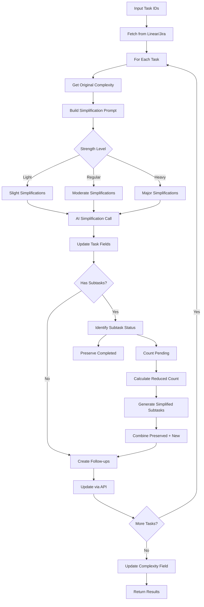

# Tool: simplify_task

## Purpose
Decrease task complexity in Linear or Jira using AI to focus on core functionality, remove non-essential features, and simplify implementation while optionally regenerating pending subtasks to match the reduced complexity level.

## Business Value
- **Who uses this**: Developers and project managers adjusting task scope
- **What problem it solves**: Allows dynamic scope reduction when tasks prove simpler than estimated, time constraints emerge, or MVP approaches are needed
- **Why it's better than manual approach**: AI intelligently simplifies while preserving completed work, automatically regenerates subtasks to match new scope, and maintains task coherence

## Functionality Specification

### Input Requirements

| Parameter | Type | Required | Default | Description |
|-----------|------|----------|---------|-------------|
| `task_ids` | list[str] | Yes | - | List of task IDs from Linear/Jira |
| `strength` | string | No | "regular" | Strength level: "light", "regular", or "heavy" |
| `custom_prompt` | string | No | - | Custom instructions for specific adjustments |
| `preserve_areas` | list[str] | No | [] | Aspects to keep unchanged |
| `create_follow_up` | boolean | No | true | Create follow-up tasks for removed scope |
| `research` | boolean | No | false | Use research capabilities for scoping |

#### Validation Rules
1. `strength` must be one of: "light", "regular", "heavy"
2. All task IDs must exist in Linear/Jira
3. Tasks cannot be completed (done/cancelled status)
4. Must have appropriate API permissions

### Processing Logic

#### Step-by-Step Algorithm

```
1. VALIDATE_INPUTS
   - Check strength is valid
   - Verify API credentials
   - Parse task IDs list
   
2. FETCH_TASK_DATA
   - Call Linear/Jira API to get task details
   - Fetch subtasks if they exist
   - Get current complexity from custom fields
   
3. FOR EACH TASK_ID:

   3.1 GET_ORIGINAL_COMPLEXITY
      - Read complexity from custom field if exists
      - Use for intelligent adjustment calculations
      
   3.2 ADJUST_TASK_COMPLEXITY
      - Build AI prompt for complexity decrease
      - Include strength-specific instructions
      - Add custom prompt if provided
      - Call AI service with structured output
      
   3.3 REGENERATE_SUBTASKS (if has subtasks)
      - Identify subtasks by status:
         - Preserve: done, in-progress, review, cancelled, deferred, blocked
         - Regenerate: pending/todo only
      - Calculate new subtask count based on:
         - Strength level
         - Original complexity score (aggressive reduction for high complexity)
         - Current pending count
         - Preserved count
      - Generate new pending subtasks via AI
      - Combine preserved + new subtasks
      
   3.4 CREATE_FOLLOW_UP_TASKS (if enabled)
      - Extract removed features from AI response
      - Create new tasks for deferred functionality
      - Link follow-up tasks to original
      
   3.5 UPDATE_TASK_IN_PLATFORM
      - Update task description via API
      - Update custom fields (complexity, acceptance criteria)
      - Create/update subtasks
      - Add labels/tags (mvp, simplified)
      - Create follow-up tasks
      - Post comment with simplification summary
      
   3.6 UPDATE_COMPLEXITY_FIELD
      - Calculate new complexity score
      - Update custom field in Linear/Jira
      
4. AGGREGATE_RESULTS
   - Combine telemetry data from all tasks
   - Calculate total tokens and costs
   - Generate summary message
   
5. RETURN_RESULTS
   - Return updated tasks and telemetry
```

### AI Prompts Used

#### System Prompt for Task Complexity Adjustment
```
You are an expert software project manager who helps adjust task complexity while maintaining clarity and actionability.
```

#### User Prompt for Task Complexity Adjustment (Generated Dynamically)
```
You are tasked with adjusting the complexity of a task. 

CURRENT TASK:
Title: {{task.title}}
Description: {{task.description}}
Acceptance Criteria: {{task.acceptanceCriteria || 'Not specified'}}
Current Labels: {{task.labels}}

ADJUSTMENT REQUIREMENTS:
- Direction: DECREASE complexity
- Strength: {{strength}} ({{strengthDescription}})
- Preserve the core purpose and functionality of the task
- Maintain consistency with the existing task structure
- Focus on core functionality and essential requirements
- Remove or simplify non-essential features  
- Streamline implementation details
- Simplify testing to focus on basic functionality

{{#if preserveAreas}}
PRESERVE THESE AREAS:
{{#each preserveAreas}}
- {{this}}
{{/each}}
{{/if}}

{{#if customPrompt}}
CUSTOM INSTRUCTIONS:
{{customPrompt}}
{{/if}}

Return a JSON object with the updated task containing these fields:
- title: Updated task title
- description: Updated task description with markdown formatting
- acceptanceCriteria: Simplified acceptance criteria as bullet points
- removedFeatures: List of features/requirements being removed
- testStrategy: Simplified test strategy
- priority: Task priority ('low', 'medium', 'high', or 'critical')
- newLabels: Labels to add (e.g., "mvp", "simplified")

Ensure the JSON is valid and properly formatted.
```

#### System Prompt for Subtask Regeneration
```
You are an expert project manager who creates task breakdowns that match complexity levels.
```

#### User Prompt for Subtask Regeneration (Generated Dynamically)
```
Based on this updated task, generate {{newSubtasksNeeded}} NEW subtasks that reflect the decreased complexity level:

**Task Title**: {{task.title}}
**Task Description**: {{task.description}}
**Acceptance Criteria**: {{task.acceptanceCriteria}}
**Test Strategy**: {{task.testStrategy}}

**Complexity Direction**: This task was recently scoped down ({{strength}} strength) to decrease complexity.
{{#if originalComplexity}}**Original Complexity**: {{originalComplexity}}/10 - consider this when determining appropriate scope level.{{/if}}

{{#if preservedCount > 0}}**Preserved Subtasks**: {{preservedCount}} existing subtasks with work already done will be kept.{{/if}}

Generate subtasks that:
{{#if strength === 'heavy'}}
- Focus ONLY on absolutely essential core functionality
- Strip out ALL non-critical features (error handling, advanced testing, etc.)
- Provide only the minimum viable implementation
- Eliminate any complex integrations or advanced scenarios
- Aim for the simplest possible working solution
{{else if strength === 'regular'}}
- Focus on core functionality only
- Simplify implementation steps
- Remove non-essential features
- Streamline to basic requirements
{{else}}
- Focus mainly on core functionality
- Slightly simplify implementation steps
- Remove some non-essential features
- Streamline most requirements
{{/if}}

Return a JSON object with a "subtasks" array. Each subtask should have:
- title: Clear, specific title
- description: Detailed description
- acceptanceCriteria: Specific completion criteria
- estimate: Time estimate (hours)
- labels: Relevant labels

Ensure the JSON is valid and properly formatted.
```

#### Prompt for Follow-up Task Creation
```
Based on the features removed from the task, create follow-up tasks for future implementation:

REMOVED FEATURES:
{{#each removedFeatures}}
- {{this}}
{{/each}}

Create tasks that can be implemented after the MVP is complete. Each task should be:
- Self-contained and implementable independently
- Clearly scoped with specific objectives
- Sized appropriately (not too large)

Return a JSON array with follow-up tasks, each containing:
- title: Clear task title
- description: What needs to be implemented
- acceptanceCriteria: Completion criteria
- priority: "low" or "medium"
- labels: ["enhancement", "future"]
```

### Output Specification

#### Success Response
```json
{
  "success": true,
  "data": {
    "message": "Successfully simplified 2 task(s)",
    "simplified_tasks": [
      {
        "id": "ENG-123",
        "title": "Basic Authentication System",
        "description": "Implement simple authentication with email/password login",
        "acceptanceCriteria": [
          "Users can register with email/password",
          "Users can login and receive JWT token",
          "Basic session management"
        ],
        "complexity": 3,
        "removed_features": [
          "Multi-factor authentication",
          "OAuth integration",
          "Password reset flow",
          "Account lockout policies"
        ],
        "follow_up_tasks": ["ENG-234", "ENG-235"],
        "subtasks": [
          /* preserved + regenerated simplified subtasks */
        ],
        "new_labels": ["mvp", "simplified"]
      }
    ],
    "telemetry": {
      "total_tokens": 2200,
      "total_cost": 0.04
    }
  }
}
```

#### Error Response
```json
{
  "success": false,
  "error": {
    "code": "TASK_NOT_FOUND",
    "message": "Task ENG-123 not found in Linear"
  }
}
```

#### Error Codes
- `INVALID_STRENGTH`: Invalid strength level specified
- `TASK_NOT_FOUND`: One or more task IDs don't exist
- `API_ERROR`: Linear/Jira API error
- `AI_SERVICE_ERROR`: Failed to generate complexity adjustments
- `PERMISSION_ERROR`: Insufficient permissions to update task

### Side Effects
1. Updates task description and acceptance criteria in Linear/Jira
2. Creates new simplified subtasks while preserving completed ones
3. Updates complexity custom field
4. Adds new labels/tags (mvp, simplified)
5. Creates follow-up tasks for removed features
6. Posts comment with simplification summary
7. Multiple AI service calls (adjustment + subtask regeneration + follow-ups)

## Data Flow



## Implementation Details

### Linear API Mapping
- **Task Description**: Update issue description field
- **Acceptance Criteria**: Update custom field or append to description
- **Complexity**: Store in custom field
- **Labels**: Add via labels API (mvp, simplified)
- **Subtasks**: Create as sub-issues
- **Follow-ups**: Create as new issues with links
- **Comment**: Post via comments API

### Jira API Mapping
- **Task Description**: Update issue description
- **Acceptance Criteria**: Update custom field or description
- **Complexity**: Store in custom field (story points)
- **Labels**: Add via labels/components
- **Subtasks**: Create as sub-tasks
- **Follow-ups**: Create as linked issues
- **Comment**: Post via comments API

### Strength Levels
- **Light**: Slight simplifications, ~20% complexity reduction
- **Regular**: Moderate simplifications, ~50% scope reduction  
- **Heavy**: Major simplifications, ~75%+ reduction to core MVP

### Subtask Calculation Formula
```python
# For scope-down with aggressive reduction for high complexity tasks
aggressive_factor = (
    0.7 if original_complexity >= 8 else
    0.85 if original_complexity >= 6 else
    1.0
)

if strength == 'light':
    base = max(3, preserved_count + ceil(current_pending_count * 0.8))
    target_subtask_count = ceil(base * aggressive_factor)
elif strength == 'regular':
    base = max(3, preserved_count + ceil(current_pending_count * 0.5))
    target_subtask_count = ceil(base * aggressive_factor)
else:  # heavy
    # Ultra-aggressive for very high complexity tasks
    ultra_aggressive_factor = (
        0.3 if original_complexity >= 9 else
        0.5 if original_complexity >= 7 else
        0.7
    )
    base = max(2, preserved_count + ceil(current_pending_count * 0.25))
    target_subtask_count = max(1, ceil(base * ultra_aggressive_factor))
```

### Preserved Subtask Statuses
- done/completed
- in-progress/active
- review
- cancelled
- deferred
- blocked

### Aggressive Reduction for High Complexity
Tasks with high original complexity (8-10/10) get more aggressive reductions:
- Complexity 9-10: Ultra-aggressive reduction factors (0.3x for heavy)
- Complexity 7-8: Very aggressive reduction (0.5x for heavy)
- Complexity 6+: Moderately aggressive reduction (0.7-0.85x)

## AI Integration Points
This tool uses AI for multiple operations:
- **Task Complexity Adjustment**: AI modifies task fields to decrease scope
- **Subtask Regeneration**: AI generates new subtasks matching reduced complexity
- **Follow-up Task Creation**: AI creates tasks for removed features
- **Complexity Scoring**: AI calculates new complexity score
- **Research Mode**: Enhanced adjustments using research capabilities
- **Custom Prompts**: User-provided instructions for specific adjustments

## Dependencies
- **Linear/Jira API Access**: Required for task operations
- **AI Service**: Anthropic Claude for adjustments and regeneration
- **Authentication**: API keys for platform access
- **Custom Fields**: Platform must support custom fields for complexity

## Test Scenarios

### 1. Basic Simplification
```python
# Test: Decrease single task complexity
simplify_task(
    task_ids=["ENG-123"],
    strength="regular"
)
# Expected: Task complexity decreased, subtasks simplified
```

### 2. Multiple Tasks
```python
# Test: Simplify multiple tasks
simplify_task(
    task_ids=["ENG-123", "ENG-124", "ENG-125"],
    strength="heavy"
)
# Expected: All 3 tasks reduced to MVP functionality
```

### 3. Light Adjustment with Preservation
```python
# Test: Minor complexity decrease preserving areas
simplify_task(
    task_ids=["ENG-123"],
    strength="light",
    preserve_areas=["security", "core_functionality"]
)
# Expected: Small scope decrease, security and core preserved
```

### 4. With Custom Prompt
```python
# Test: Specific adjustment instructions
simplify_task(
    task_ids=["ENG-123"],
    custom_prompt="Remove all advanced features and integrations, focus on basic CRUD",
    create_follow_up=True
)
# Expected: Task focused on basic implementation, follow-ups created
```

### 5. Preserve Completed Work
```python
# Test: Regenerate only pending subtasks
# Setup: Task has 5 done, 4 pending subtasks
simplify_task(
    task_ids=["ENG-123"],
    strength="regular"
)
# Expected: 5 done preserved, 2-3 new simplified pending generated
```

### 6. High Complexity Reduction
```python
# Test: Aggressive reduction of complex task
# Setup: Task has complexity score 9/10
simplify_task(
    task_ids=["ENG-123"],
    strength="heavy"
)
# Expected: Ultra-aggressive reduction to minimal MVP
```

### 7. Research Mode
```python
# Test: Enhanced adjustments with research
simplify_task(
    task_ids=["ENG-123"],
    research=True,
    preserve_areas=["performance"]
)
# Expected: Research-informed complexity decreases
```

### 8. Already Simple Task
```python
# Test: Simplify low complexity task
# Setup: Task has complexity score 3/10
simplify_task(
    task_ids=["ENG-123"],
    strength="regular"
)
# Expected: Minimal changes, warning that task is already simple
```

## Implementation Notes
- **Complexity**: High (multiple AI calls, subtask regeneration logic, follow-up creation)
- **Estimated Effort**: 8-10 hours for complete implementation (shares code with enhance_task_scope)
- **Critical Success Factors**:
  1. Intelligent complexity calculations based on original scores
  2. Aggressive reduction for high-complexity tasks
  3. Proper preservation of completed subtasks
  4. Coherent task adjustments maintaining core purpose
  5. Accurate subtask count calculations
  6. Meaningful follow-up task creation

## Performance Considerations
- Multiple AI calls per task (adjustment + regeneration + follow-ups)
- API rate limits for Linear/Jira
- Token usage scales with task count and removed features
- Consider batching for large task lists
- Cache task data to minimize API calls

## Security Considerations
- Validate task IDs to prevent injection
- Sanitize custom prompts before AI calls
- API keys stored in environment variables
- Use OAuth when available
- Validate AI responses against schemas
- Respect platform permissions

---

*This documentation captures the complete implementation specification for the simplify_task tool adapted for Linear/Jira integration.*