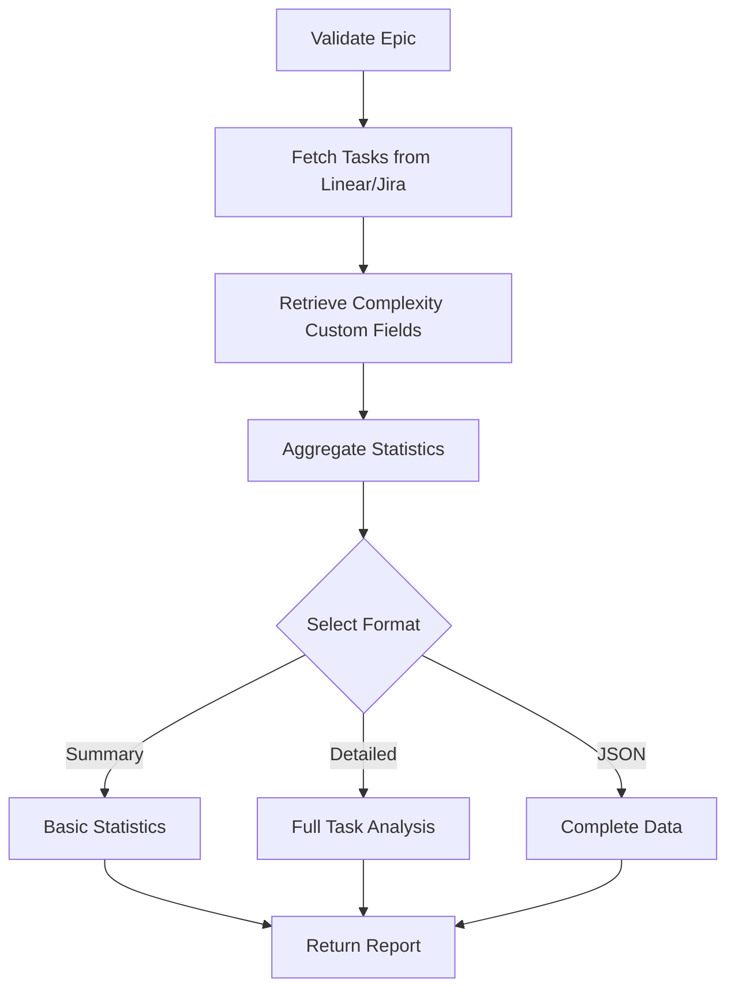

# Tool: get_complexity_report

## Purpose
Retrieve and display the complexity analysis report for tasks in Linear/Jira, showing complexity scores stored as custom fields, recommended subtask counts, and AI-generated analysis reasoning.

## Business Value
- **Who uses this**: Developers and project managers reviewing task complexity
- **What problem it solves**: Provides visibility into task complexity analysis results and recommendations for task breakdown
- **Why it's better than manual approach**: Fetches complexity data from Linear/Jira custom fields and presents it in a clear, actionable format

## Functionality Specification

### Input Requirements

| Parameter | Type | Required | Default | Description |
|-----------|------|----------|---------|-------------|
| `epic_id` | string | No | Current epic | Epic/Project ID to get complexity report for |
| `format` | string | No | "json" | Output format: 'json', 'summary', 'detailed' |
| `include_recommendations` | boolean | No | true | Include AI recommendations for task breakdown |

#### Validation Rules
1. Epic must exist in Linear/Jira
2. Format must be one of: json, summary, detailed
3. Epic must have had complexity analysis run previously

### Processing Logic

#### Step-by-Step Algorithm

```
1. VALIDATE_INPUTS
   - Verify epic exists via API
   - Check for complexity custom fields
   
2. FETCH_COMPLEXITY_DATA
   - Query Linear/Jira for tasks in epic
   - Retrieve complexity score custom field
   - Retrieve complexity analysis custom field
   - Retrieve subtask recommendation field
   
3. AGGREGATE_STATISTICS
   - Calculate total tasks analyzed
   - Calculate average complexity
   - Group by complexity levels:
     * Low (1-3)
     * Medium (4-6)
     * High (7-10)
   - Identify tasks needing breakdown
   
4. FORMAT_REPORT
   IF format == "summary":
      - Basic statistics only
      - Task count by complexity
   ELIF format == "detailed":
      - Full task-by-task breakdown
      - Include all recommendations
      - Include reasoning
   ELSE: // json
      - Complete data structure
      - All fields preserved
   
5. RETURN_REPORT
   - Include epic metadata
   - Include timestamp of analysis
   - Include statistics
   - Include task details based on format
```

### AI Prompts Used

**This tool does not use AI** for report retrieval. It:
- Fetches existing complexity data from Linear/Jira
- Formats stored analysis results
- No new AI analysis performed
- Complexity was generated by `assess_complexity` tool

### Output Specification

#### Success Response (Detailed Format)
```javascript
{
  success: true,
  data: {
    epic: {
      id: "ENG-123",
      title: "Authentication System",
      url: "https://linear.app/team/issue/ENG-123"
    },
    report: {
      timestamp: "2024-01-15T10:30:00.000Z",
      tasksAnalyzed: 10,
      totalComplexity: 65,
      averageComplexity: 6.5,
      complexityDistribution: {
        low: 2,      // 1-3 complexity
        medium: 5,   // 4-6 complexity  
        high: 3      // 7-10 complexity
      },
      tasksNeedingBreakdown: 3,
      taskAnalyses: [
        {
          id: "ENG-124",
          title: "Implement JWT service",
          url: "https://linear.app/team/issue/ENG-124",
          complexity: {
            score: 8,
            category: "high",
            reasoning: "Complex security requirements, multiple integration points, session management",
            recommendedSubtasks: 7,
            factors: {
              technical: "High - Security protocols, encryption",
              integration: "Medium - Database, API endpoints",
              testing: "High - Security testing required"
            }
          },
          currentSubtasks: 2,
          needsExpansion: true
        }
      ],
      recommendations: [
        "Prioritize breaking down high-complexity tasks (ENG-124, ENG-127)",
        "Consider adding security specialist for authentication tasks",
        "Allocate extra time for testing complex integrations"
      ]
    }
  }
}
```

#### Summary Format Response
```javascript
{
  success: true,
  data: {
    epic: {
      id: "ENG-123",
      title: "Authentication System"
    },
    summary: {
      tasksAnalyzed: 10,
      averageComplexity: 6.5,
      distribution: {
        low: 2,
        medium: 5,
        high: 3
      },
      tasksNeedingBreakdown: 3,
      estimatedTotalSubtasks: 45
    }
  }
}
```

#### Error Response
```javascript
{
  success: false,
  error: {
    code: "NO_COMPLEXITY_DATA",
    message: "No complexity analysis found for epic ENG-123. Run assess_complexity first."
  }
}
```

#### Error Codes
- `EPIC_NOT_FOUND`: Epic doesn't exist
- `NO_COMPLEXITY_DATA`: No analysis has been run
- `API_ERROR`: Linear/Jira API error
- `INVALID_FORMAT`: Unknown format requested

### Side Effects
1. **Makes API calls** to Linear/Jira
2. No data modifications
3. No file creation

## Data Flow



## Implementation Details

### Linear Custom Fields
```python
# Linear stores complexity in custom fields
custom_fields = {
    "complexity_score": "customField_12345",
    "complexity_analysis": "customField_12346",
    "recommended_subtasks": "customField_12347"
}
```

### Jira Custom Fields
```python
# Jira uses similar custom field approach
custom_fields = {
    "customfield_10100": "complexity_score",
    "customfield_10101": "complexity_analysis",
    "customfield_10102": "recommended_subtasks"
}
```

### Complexity Categories
```python
def categorize_complexity(score):
    if score <= 3:
        return "low"
    elif score <= 6:
        return "medium"
    else:
        return "high"
```

### Statistics Calculation
```python
# Aggregate complexity statistics
stats = {
    "total": sum(task.complexity_score for task in tasks),
    "average": total / len(tasks),
    "distribution": {
        "low": len([t for t in tasks if t.complexity_score <= 3]),
        "medium": len([t for t in tasks if 4 <= t.complexity_score <= 6]),
        "high": len([t for t in tasks if t.complexity_score >= 7])
    }
}
```

## Dependencies
- **Linear/Jira API Client**: For fetching task data
- **Custom Field Access**: Read permissions for complexity fields
- **JSON Formatter**: For structured output

## Test Scenarios

### 1. Get Full Complexity Report
```javascript
Input: {
  epic_id: "ENG-123",
  format: "detailed"
}
Expected: Complete task-by-task complexity analysis
```

### 2. Get Summary Only
```javascript
Input: {
  epic_id: "ENG-123",
  format: "summary"
}
Expected: High-level statistics without task details
```

### 3. No Previous Analysis
```javascript
Input: {
  epic_id: "ENG-456"  // Never analyzed
}
Expected: Error message suggesting to run assess_complexity
```

### 4. JSON Format Export
```javascript
Input: {
  epic_id: "ENG-123",
  format: "json"
}
Expected: Raw JSON data structure
```

### 5. Without Recommendations
```javascript
Input: {
  epic_id: "ENG-123",
  include_recommendations: false
}
Expected: Report without AI recommendations section
```

## Implementation Notes
- **Complexity**: Low (data retrieval only)
- **Estimated Effort**: 2-3 hours for implementation
- **Critical Success Factors**:
  1. Proper custom field mapping
  2. Handling missing complexity data
  3. Clear presentation of results
  4. Performance with large task lists

## Performance Considerations
- Cache complexity data for repeated queries
- Batch API calls for large epics
- Consider pagination for 50+ tasks
- Minimal processing overhead

## Security Considerations
- Respect Linear/Jira permissions
- No sensitive data exposure
- API keys in environment variables
- Read-only operations

## Related Commands
- assess_complexity - Run complexity analysis on tasks
- decompose_task - Break down high-complexity tasks
- export_tasks - Export tasks with complexity data
- get_tasks - View tasks with basic information

---

*This documentation defines the get_complexity_report tool for Alfred's Linear/Jira integration.*