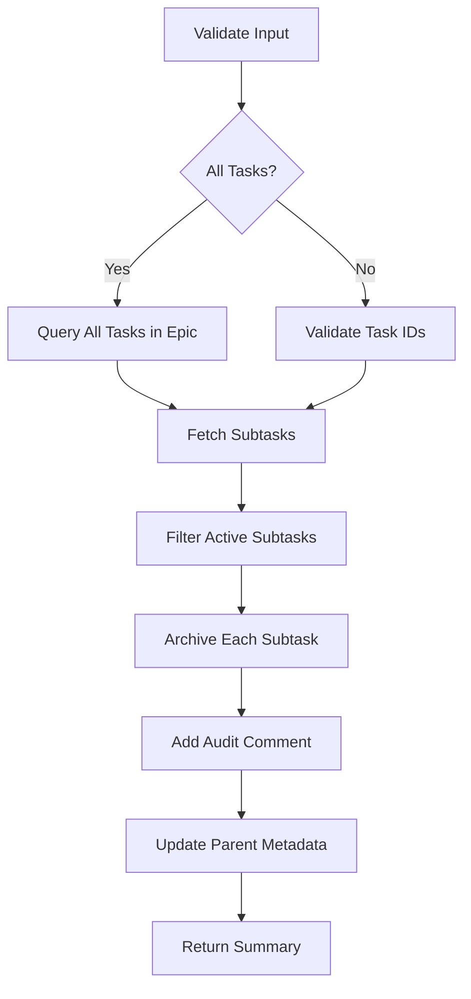

# Tool: archive_subtasks

## Purpose
Mark all subtasks of specified tasks as completed/archived in Linear/Jira, effectively clearing active subtasks while preserving history.

## Business Value
- **Who uses this**: Developers needing to close out completed task groups or reset task breakdown
- **What problem it solves**: Allows bulk completion of subtasks when parent task is done or scope changes
- **Why it's better than manual approach**: Efficiently archives multiple subtasks across tasks in a single operation while maintaining audit trail

## Functionality Specification

### Input Requirements

| Parameter | Type | Required | Default | Description |
|-----------|------|----------|---------|-------------|
| `task_ids` | string | No* | - | Task IDs (comma-separated) to archive subtasks for |
| `all` | boolean | No* | false | Archive subtasks from all tasks in epic |
| `epic_id` | string | No | Current epic | Epic/Project ID containing the tasks |
| `status` | string | No | "completed" | Status to set (completed, cancelled, archived) |
| `add_comment` | boolean | No | true | Add comment noting bulk archive operation |

*Note: Either `task_ids` or `all` must be provided

#### Validation Rules
1. Either `task_ids` or `all` parameter must be provided (not both)
2. Task IDs must exist in Linear/Jira
3. Epic must exist and be accessible
4. Status must be a valid completion state
5. User must have permission to update tasks

### Processing Logic

#### Step-by-Step Algorithm

```
1. VALIDATE_INPUTS
   - Check either task_ids or all is provided
   - Verify epic exists via API
   - Validate status is allowed
   
2. DETERMINE_SCOPE
   IF all === true:
   - Query all tasks in epic
   - Build list of task IDs with subtasks
   ELSE:
   - Parse comma-separated ID list
   - Validate each task exists
   
3. FETCH_SUBTASKS
   For each task ID:
   - Query Linear/Jira for subtasks
   - Filter out already completed subtasks
   - Count active subtasks
   
4. ARCHIVE_SUBTASKS
   For each active subtask:
   - Update status to specified value
   - If add_comment:
     * Add comment: "Bulk archived on [date]"
   - Track success/failure
   - Collect subtask metadata
   
5. UPDATE_PARENT_TASKS
   For each parent task:
   - Check if all subtasks now complete
   - Optionally suggest parent completion
   - Update custom fields if needed
   
6. RETURN_SUMMARY
   - Report tasks processed
   - Report subtasks archived
   - Include any failures
   - Provide Linear/Jira links
```

### AI Prompts Used

**This tool does not use AI**. It performs direct API operations to:
- Query task hierarchies
- Update subtask statuses
- Add audit comments
- No AI generation involved

### Output Specification

#### Success Response
```javascript
{
  success: true,
  data: {
    message: "Successfully archived 15 subtasks across 3 tasks",
    epic: {
      id: "ENG-123",
      title: "Authentication System"
    },
    results: [
      {
        taskId: "ENG-124",
        taskTitle: "Implement JWT service",
        subtasksArchived: 5,
        subtaskIds: ["ENG-124-1", "ENG-124-2", "ENG-124-3", "ENG-124-4", "ENG-124-5"],
        status: "completed"
      },
      {
        taskId: "ENG-125",
        taskTitle: "Create user model",
        subtasksArchived: 3,
        subtaskIds: ["ENG-125-1", "ENG-125-2", "ENG-125-3"],
        status: "completed"
      },
      {
        taskId: "ENG-126",
        taskTitle: "Setup database",
        subtasksArchived: 7,
        subtaskIds: ["ENG-126-1", "ENG-126-2", "ENG-126-3", "ENG-126-4", "ENG-126-5", "ENG-126-6", "ENG-126-7"],
        status: "completed"
      }
    ],
    totalSubtasksArchived: 15,
    parentTasksFullyComplete: 2
  }
}
```

#### Partial Success Response
```javascript
{
  success: true,
  data: {
    message: "Archived 12 of 15 subtasks (3 failed)",
    failures: [
      {
        subtaskId: "ENG-124-3",
        error: "Permission denied"
      },
      {
        subtaskId: "ENG-125-2",
        error: "Task locked by another user"
      },
      {
        subtaskId: "ENG-126-5",
        error: "Invalid state transition"
      }
    ],
    // ... rest of success data
  }
}
```

#### Error Response
```javascript
{
  success: false,
  error: {
    code: "INPUT_VALIDATION_ERROR",
    message: "Either task_ids or all parameter must be provided"
  }
}
```

#### Error Codes
- `INPUT_VALIDATION_ERROR`: Missing required parameters
- `TASK_NOT_FOUND`: Specified task doesn't exist
- `PERMISSION_ERROR`: No permission to update tasks
- `API_ERROR`: Linear/Jira API failure
- `INVALID_STATUS`: Status not allowed for subtasks

### Side Effects
1. **Updates subtask statuses** in Linear/Jira
2. **Adds audit comments** if enabled
3. **May trigger webhooks** in Linear/Jira
4. **Updates parent task metadata** if configured
5. No local file changes

## Data Flow



## Implementation Details

### Linear API Calls
```python
# Archive subtask in Linear
mutation = """
  mutation($id: String!, $status: String!) {
    issueUpdate(
      id: $id,
      input: {
        stateId: $status
      }
    ) {
      success
      issue {
        id
        title
        state { name }
      }
    }
  }
"""

# Add comment
comment_mutation = """
  mutation($issueId: String!, $body: String!) {
    commentCreate(
      input: {
        issueId: $issueId,
        body: $body
      }
    ) {
      success
    }
  }
"""
```

### Jira API Calls
```python
# Archive subtask in Jira
PUT /rest/api/3/issue/{issueId}
{
  "fields": {
    "status": {
      "name": "Done"
    }
  }
}

# Add comment
POST /rest/api/3/issue/{issueId}/comment
{
  "body": {
    "content": [
      {
        "type": "paragraph",
        "content": [
          {
            "type": "text",
            "text": "Bulk archived on 2024-01-20"
          }
        ]
      }
    ]
  }
}
```

### Status Mapping
```python
STATUS_MAP = {
    "completed": {
        "linear": "completed_state_id",
        "jira": "Done"
    },
    "cancelled": {
        "linear": "cancelled_state_id",
        "jira": "Cancelled"
    },
    "archived": {
        "linear": "archived_state_id",
        "jira": "Archived"
    }
}
```

## Dependencies
- **Linear/Jira API Client**: For task operations
- **Batch Processing**: Handle multiple API calls
- **Error Recovery**: Partial success handling

## Test Scenarios

### 1. Archive Specific Task Subtasks
```javascript
Input: {
  task_ids: "ENG-124,ENG-125",
  status: "completed"
}
Expected: Subtasks of both tasks marked complete
```

### 2. Archive All Epic Subtasks
```javascript
Input: {
  all: true,
  epic_id: "ENG-123",
  status: "completed"
}
Expected: All subtasks in epic archived
```

### 3. Cancel Instead of Complete
```javascript
Input: {
  task_ids: "ENG-124",
  status: "cancelled",
  add_comment: true
}
Expected: Subtasks cancelled with audit comment
```

### 4. No Active Subtasks
```javascript
Input: {
  task_ids: "ENG-999"  // Has no active subtasks
}
Expected: Success with zero subtasks archived
```

### 5. Mixed Permissions
```javascript
Input: {
  task_ids: "ENG-124,ENG-125"  // ENG-125 is read-only
}
Expected: Partial success, ENG-124 archived, ENG-125 failed
```

## Implementation Notes
- **Complexity**: Medium (batch API operations)
- **Estimated Effort**: 3-4 hours
- **Critical Success Factors**:
  1. Efficient batch processing
  2. Proper error handling
  3. Clear audit trail
  4. Permission validation
  5. Partial success handling

## Performance Considerations
- Batch API calls to avoid rate limits
- Process subtasks in parallel where possible
- Cache task hierarchy during operation
- Consider pagination for large task lists
- Implement retry logic for transient failures

## Security Considerations
- Validate user permissions before archiving
- Respect Linear/Jira access controls
- Audit all bulk operations
- No bypassing of workflow rules
- Secure API key storage

## Related Commands
- create_subtask - Add new subtasks
- delete_subtask - Remove subtasks permanently
- update_task_status - Update individual task status
- get_tasks - View task hierarchy

---

*This documentation defines the archive_subtasks tool for Alfred's Linear/Jira integration.*