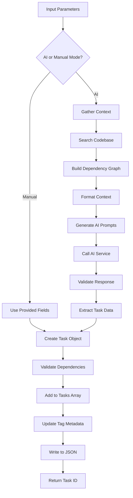

# Tool: create_task

## Purpose
Create a new task in Linear/Jira using AI to generate comprehensive task details from a description, or manually specify task fields directly, with automatic platform integration.

## Business Value
- **Who uses this**: Developers needing to add new work items to the project
- **What problem it solves**: Converts high-level task descriptions into fully structured tasks with implementation details, test strategies, and proper dependencies
- **Why it's better than manual approach**: AI generates comprehensive task details, automatically analyzes codebase context, suggests dependencies, and ensures consistency with existing tasks

## Functionality Specification

### Input Requirements

| Parameter | Type | Required | Default | Description |
|-----------|------|----------|---------|-------------|
| `prompt` | string | Conditional | - | Task description (required for AI mode) |
| `title` | string | Conditional | - | Task title (for manual mode) |
| `description` | string | Conditional | - | Task description (for manual mode) |
| `epic_id` | string | No | - | Epic/Project ID to add task to |
| `assignee_id` | string | No | - | User ID to assign task to |
| `labels` | string[] | No | [] | Labels/tags for the task |
| `priority` | string | No | "medium" | Priority: urgent, high, medium, low |
| `workspace_id` | string | Yes | - | Linear/Jira workspace identifier |
| `research` | boolean | No | false | Use research for generation |

#### Validation Rules
1. Either `prompt` OR both `title` and `description` must be provided
2. `priority` must be one of: high, medium, low
3. Dependencies must reference existing task IDs
4. `projectRoot` must be an existing directory

### Processing Logic

#### Step-by-Step Algorithm

```
1. VALIDATE_INPUTS
   - Check for AI mode (prompt) or manual mode (title+description)
   - Validate priority value
   - Parse dependencies to numeric array
   - Resolve tag context
   
2. LOAD_EXISTING_TASKS
   - Read tasks.json from specified path
   - Extract all tasks across all tags
   - Get tasks for target tag
   - Calculate next task ID
   
3. IF MANUAL_MODE:
   - Use provided title, description, details, testStrategy
   - Apply specified dependencies
   - Skip to step 7
   
4. GATHER_CONTEXT (AI Mode)
   - Search codebase for relevant files
   - Extract project structure information
   - Build dependency graph for specified tasks
   - Identify related existing tasks
   - Format context for AI
   
5. GENERATE_WITH_AI
   - Build system and user prompts
   - Include gathered context
   - Call AI service with schema validation
   - Parse and validate response
   
6. VALIDATE_AI_SUGGESTIONS
   - Check suggested dependencies exist
   - Filter invalid dependency IDs
   - Ensure task fields are complete
   
7. CREATE_TASK_OBJECT
   - Assign new task ID
   - Set all task fields
   - Initialize with empty subtasks array
   - Set status to "pending"
   
8. SAVE_AND_RETURN
   - Add task to target tag's tasks
   - Update tag metadata
   - Write to tasks.json
   - Return new task ID and telemetry
```

### AI Prompts Used

#### System Prompt (Default)
```
You are a helpful assistant that creates well-structured tasks for a software development project. Generate a single new task based on the user's description, adhering strictly to the provided JSON schema. Pay special attention to dependencies between tasks, ensuring the new task correctly references any tasks it depends on.

When determining dependencies for a new task, follow these principles:
1. Select dependencies based on logical requirements - what must be completed before this task can begin.
2. Prioritize task dependencies that are semantically related to the functionality being built.
3. Consider both direct dependencies (immediately prerequisite) and indirect dependencies.
4. Avoid adding unnecessary dependencies - only include tasks that are genuinely prerequisite.
5. Consider the current status of tasks - prefer completed tasks as dependencies when possible.
6. Pay special attention to foundation tasks (1-5) but don't automatically include them without reason.
7. Recent tasks (higher ID numbers) may be more relevant for newer functionality.

The dependencies array should contain task IDs (numbers) of prerequisite tasks.{{#if useResearch}}

Research current best practices and technologies relevant to this task.{{/if}}
```

#### User Prompt (Default)
```
You are generating the details for Task #{{newTaskId}}. Based on the user's request: "{{prompt}}", create a comprehensive new task for a software development project.
      
      {{gatheredContext}}
      
      {{#if useResearch}}Research current best practices, technologies, and implementation patterns relevant to this task. {{/if}}Based on the information about existing tasks provided above, include appropriate dependencies in the "dependencies" array. Only include task IDs that this new task directly depends on.
      
      Return your answer as a single JSON object matching the schema precisely:
      
      {
        "title": "Task title goes here",
        "description": "A concise one or two sentence description of what the task involves",
    "details": "Detailed implementation steps, considerations, code examples, or technical approach",
    "testStrategy": "Specific steps to verify correct implementation and functionality",
    "dependencies": [1, 3] // Example: IDs of tasks that must be completed before this task
  }
      
      Make sure the details and test strategy are comprehensive and specific{{#if useResearch}}, incorporating current best practices from your research{{/if}}. DO NOT include the task ID in the title.
      {{#if contextFromArgs}}{{contextFromArgs}}{{/if}}
```

### Output Specification

#### Success Response
```javascript
{
  success: true,
  data: {
    taskId: 15,
    message: "Successfully added new task #15",
    telemetryData: {
      totalTokens: 1500,
      totalCost: 0.03,
      provider: "anthropic",
      model: "claude-3-5-sonnet-20241022"
    },
    tagInfo: {
      currentTag: "master",
      taskCount: 15
    }
  }
}
```

#### Error Response
```javascript
{
  success: false,
  error: {
    code: "MISSING_PARAMETER",
    message: "Either the prompt parameter or both title and description parameters are required for adding a task"
  }
}
```

#### Error Codes
- `MISSING_ARGUMENT`: Required parameters not provided
- `MISSING_PARAMETER`: Neither AI nor manual mode requirements met
- `ADD_TASK_ERROR`: Error during task creation
- `INVALID_PRIORITY`: Priority value not valid
- `INVALID_DEPENDENCIES`: Referenced task IDs don't exist

### Side Effects
1. **Creates new task** in tasks.json
2. Increments task ID counter
3. Updates tag metadata
4. Makes AI service call (AI mode only)
5. Searches codebase for context (AI mode only)

## Data Flow



## Implementation Details

### Data Storage
- **Input/Output**: `.taskmaster/tasks/tasks.json` - Task data by tag
- Creates new task with auto-incremented ID
- Preserves tagged data structure

### Context Gathering
```javascript
// Searches for relevant files based on prompt
const gatherer = new ContextGatherer(projectRoot);
const searchTerms = extractSearchTerms(prompt);
const gatheredContext = await gatherer.gatherContext(searchTerms);

// Builds dependency graph for specified tasks
function buildDependencyGraph(tasks, taskId, visited, depthMap, depth) {
  // Recursive graph building
  // Tracks visited nodes and depth
  // Returns structured dependency data
}
```

### AI Schema Validation
```javascript
const AiTaskDataSchema = z.object({
  title: z.string().describe('Clear, concise title for the task'),
  description: z.string().describe('A one or two sentence description of the task'),
  details: z.string().describe('In-depth implementation details, considerations, and guidance'),
  testStrategy: z.string().describe('Detailed approach for verifying task completion'),
  dependencies: z.array(z.number()).nullable().describe(
    'Array of task IDs that this task depends on (must be completed before this task can start)'
  )
});
```

### Manual Mode
- Bypasses AI generation completely
- Uses provided title, description, details, testStrategy
- Still validates dependencies and priority
- No context gathering or AI calls

### Research Mode
- Uses research model instead of main model
- Adds research instructions to prompts
- Gathers current best practices
- Requires research API key configured

## AI Integration Points
This tool uses AI for task generation (AI mode):
- **Context Gathering**: Searches codebase for relevant information
- **Prompt Generation**: Uses template system with Handlebars
- **AI Service Call**: Generates structured task data
- **Schema Validation**: Ensures AI response matches expected format
- **Dependency Suggestion**: AI analyzes and suggests task dependencies
- **Research Mode**: Optional enhanced generation with research

## Dependencies
- **File System Access**: Read/write access to JSON files
- **AI Service**: Required for AI mode generation
- **Context Gatherer**: Searches codebase for context
- **Prompt Manager**: Loads and processes prompt templates
- **Zod**: Schema validation for AI responses

## Test Scenarios

### 1. AI Mode - Basic Task
```javascript
// Test: Generate task from description
Input: {
  prompt: "Add user authentication",
  projectRoot: "/project"
}
Expected: New task with AI-generated details
```

### 2. Manual Mode - Full Details
```javascript
// Test: Create task with all manual fields
Input: {
  title: "Setup database",
  description: "Configure PostgreSQL",
  details: "Install and configure...",
  testStrategy: "Verify connection...",
  projectRoot: "/project"
}
Expected: Task created with exact provided details
```

### 3. With Dependencies
```javascript
// Test: Task with dependency specification
Input: {
  prompt: "Add login API endpoint",
  dependencies: "1,3,5",
  projectRoot: "/project"
}
Expected: Task with dependencies [1, 3, 5]
```

### 4. Priority Setting
```javascript
// Test: High priority task
Input: {
  prompt: "Fix critical security bug",
  priority: "high",
  projectRoot: "/project"
}
Expected: Task with priority "high"
```

### 5. Research Mode
```javascript
// Test: Enhanced generation with research
Input: {
  prompt: "Implement OAuth 2.0",
  research: true,
  projectRoot: "/project"
}
Expected: Task with research-enhanced details
```

### 6. Invalid Dependencies
```javascript
// Test: Filter invalid dependency IDs
Setup: AI suggests dependency on non-existent task 999
Input: {
  prompt: "New feature",
  projectRoot: "/project"
}
Expected: Invalid dependencies filtered out
```

### 7. Tag-Specific Task
```javascript
// Test: Add task to specific tag
Input: {
  prompt: "Feature-specific task",
  tag: "feature-auth",
  projectRoot: "/project"
}
Expected: Task added to feature-auth tag
```

### 8. Context Gathering
```javascript
// Test: Gather relevant context
Input: {
  prompt: "Refactor user service",
  projectRoot: "/project"
}
Expected: Context includes user service files
```

## Implementation Notes
- **Complexity**: High (AI integration, context gathering)
- **Estimated Effort**: 8-10 hours for complete implementation
- **Critical Success Factors**:
  1. Effective context gathering
  2. Clear AI prompt engineering
  3. Robust schema validation
  4. Dependency validation logic
  5. Dual mode support (AI/manual)

## Performance Considerations
- Context gathering can be slow for large codebases
- AI calls add 2-5 second latency
- Token usage scales with context size
- Consider caching for repeated searches
- File I/O for each task addition

## Security Considerations
- Validate all user inputs
- Sanitize prompts before AI calls
- API keys stored in environment variables
- Validate file paths for directory traversal
- Schema validation prevents injection

## Code References
- Current implementation: `scripts/modules/task-manager/add-task.js`
- MCP tool: `mcp-server/src/tools/add-task.js`
- Direct function: `mcp-server/src/core/direct-functions/add-task.js`
- Prompt template: `src/prompts/add-task.json`
- Key functions:
  - `addTask()`: Main task addition logic
  - `buildDependencyGraph()`: Dependency analysis
  - `generateObjectService()`: AI service integration
  - `ContextGatherer.gatherContext()`: Context collection
- Design patterns: Factory pattern (AI/manual modes), Template pattern (prompts)

---

*This documentation captures the actual current implementation of the add_task tool including exact AI prompts used.*