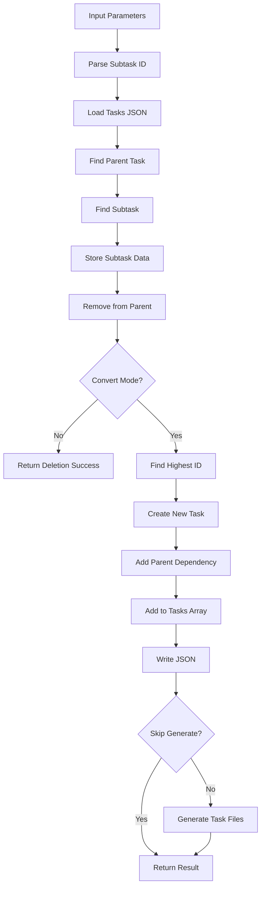

# Tool: remove_subtask

## Purpose
Remove a subtask from its parent task or convert it to a standalone task without AI assistance.

## Business Value
- **Who uses this**: Developers reorganizing task structure and hierarchy
- **What problem it solves**: Allows flexible task management by removing or promoting subtasks
- **Why it's better than manual approach**: Automatically handles dependencies and task ID assignment when converting

## Functionality Specification

### Input Requirements

| Parameter | Type | Required | Default | Description |
|-----------|------|----------|---------|-------------|
| `id` | string | Yes | - | Subtask ID in format "parentId.subtaskId" (e.g., "5.2") |
| `convert` | boolean | No | false | Convert subtask to standalone task instead of deleting |
| `file` | string | No | "tasks/tasks.json" | Path to tasks file |
| `skipGenerate` | boolean | No | false | Skip regenerating task files |
| `projectRoot` | string | Yes | - | Absolute path to project directory |
| `tag` | string | No | Current tag | Tag context to operate on |

#### Validation Rules
1. `id` must be in format "parentId.subtaskId" with dot separator
2. Both parent ID and subtask ID must be valid integers
3. Parent task must exist and have subtasks
4. Subtask must exist within parent's subtasks array
5. `projectRoot` must be an existing directory

### Processing Logic

#### Step-by-Step Algorithm

```
1. VALIDATE_INPUTS
   - Check id format contains dot separator
   - Parse parent and subtask IDs
   - Validate projectRoot exists
   - Resolve tag context
   
2. LOAD_AND_FIND
   - Read tasks.json file
   - Find parent task by ID
   - Verify parent has subtasks
   - Find subtask in parent's array
   - Store subtask data
   
3. REMOVE_SUBTASK
   - Remove subtask from parent's array
   - If parent has no more subtasks:
     * Set subtasks to undefined
   - Update parent task structure
   
4. CONVERT_IF_REQUESTED
   If convert === true:
   - Find highest task ID in system
   - Create new task ID (highest + 1)
   - Build new task from subtask:
     * Copy title, description, details
     * Preserve status and dependencies
     * Inherit priority from parent
   - Add parent as dependency
   - Add to main tasks array
   
5. SAVE_AND_GENERATE
   - Write updated tasks.json
   - If !skipGenerate:
     * Regenerate task files
   - Return result based on operation
```

### Output Specification

#### Success Response (Deletion)
```javascript
{
  success: true,
  data: {
    message: "Subtask 5.2 successfully removed"
  }
}
```

#### Success Response (Conversion)
```javascript
{
  success: true,
  data: {
    message: "Subtask 5.2 successfully converted to task #10",
    task: {
      id: 10,
      title: "Write unit tests",
      description: "Create comprehensive test coverage",
      details: "Test all edge cases...",
      status: "pending",
      dependencies: [5],  // Parent added as dependency
      priority: "high"    // Inherited from parent
    }
  }
}
```

#### Error Response
```javascript
{
  success: false,
  error: {
    code: "INPUT_VALIDATION_ERROR",
    message: "Invalid subtask ID format: 5. Expected format: \"parentId.subtaskId\""
  }
}
```

#### Error Codes
- `MISSING_ARGUMENT`: Required parameters not provided
- `INPUT_VALIDATION_ERROR`: Invalid ID format or parameters
- `CORE_FUNCTION_ERROR`: Error during removal/conversion operation
- Parent task not found
- Subtask not found in parent
- Invalid tasks file structure

### Side Effects
1. **Removes subtask** from parent task's array
2. **Creates new task** if convert mode enabled
3. **Updates dependencies** when converting (adds parent as dependency)
4. **Regenerates task files** unless skipGenerate is true
5. Sets parent's subtasks to undefined if last subtask removed

## Data Flow



## Implementation Details

### Data Storage
- **Input/Output**: `.taskmaster/tasks/tasks.json` - Task data by tag
- Subtasks stored in parent task's `subtasks` array
- Converted tasks added to main `tasks` array
- Preserves tag context during operations

### Subtask Conversion
```javascript
// Create new task from subtask
convertedTask = {
  id: newTaskId,
  title: removedSubtask.title,
  description: removedSubtask.description || '',
  details: removedSubtask.details || '',
  status: removedSubtask.status || 'pending',
  dependencies: removedSubtask.dependencies || [],
  priority: parentTask.priority || 'medium'
};

// Add parent as dependency
if (!convertedTask.dependencies.includes(parentId)) {
  convertedTask.dependencies.push(parentId);
}
```

### ID Assignment
```javascript
// Find next available ID
const highestId = Math.max(...data.tasks.map((t) => t.id));
const newTaskId = highestId + 1;
```

### Parent Cleanup
```javascript
// Remove empty subtasks array
if (parentTask.subtasks.length === 0) {
  parentTask.subtasks = undefined;
}
```

## AI Integration Points
This tool **does not use AI**. It performs pure data operations:
- Direct array manipulation for subtask removal
- Deterministic ID assignment for conversion
- Simple data transformation when converting
- No content generation or analysis

## Dependencies
- **File System Access**: Read/write access to JSON files
- **Path Utils**: Path resolution and validation
- **Generate Task Files**: Optional file regeneration
- **Silent Mode**: Console output suppression for MCP

## Test Scenarios

### 1. Basic Removal
```javascript
// Test: Remove subtask
Input: {
  id: "5.2",
  projectRoot: "/project"
}
Expected: Subtask removed from parent task 5
```

### 2. Convert to Task
```javascript
// Test: Convert subtask to task
Input: {
  id: "5.2",
  convert: true,
  projectRoot: "/project"
}
Expected: New task created with parent as dependency
```

### 3. Invalid Format
```javascript
// Test: Missing dot separator
Input: {
  id: "5",
  projectRoot: "/project"
}
Expected: Error - invalid format
```

### 4. Parent Not Found
```javascript
// Test: Non-existent parent
Input: {
  id: "999.1",
  projectRoot: "/project"
}
Expected: Error - parent task not found
```

### 5. Subtask Not Found
```javascript
// Test: Non-existent subtask
Input: {
  id: "5.999",
  projectRoot: "/project"
}
Expected: Error - subtask not found
```

### 6. Last Subtask Removal
```javascript
// Test: Remove only subtask
Setup: Task 5 has only one subtask
Input: {
  id: "5.1",
  projectRoot: "/project"
}
Expected: Subtask removed, parent.subtasks = undefined
```

### 7. Priority Inheritance
```javascript
// Test: Convert inherits priority
Setup: Parent has priority "high"
Input: {
  id: "5.2",
  convert: true,
  projectRoot: "/project"
}
Expected: New task has priority "high"
```

### 8. Skip File Generation
```javascript
// Test: Skip task file generation
Input: {
  id: "5.2",
  skipGenerate: true,
  projectRoot: "/project"
}
Expected: Subtask removed, no file generation
```

## Implementation Notes
- **Complexity**: Low (direct data manipulation)
- **Estimated Effort**: 2-3 hours for complete implementation
- **Critical Success Factors**:
  1. Proper ID format validation
  2. Parent-subtask relationship validation
  3. Clean conversion with dependency management
  4. Proper cleanup of empty arrays
  5. ID assignment for new tasks

## Performance Considerations
- Single file read/write operation
- Linear search for parent and subtask
- Max() operation for ID assignment
- Optional file generation adds overhead
- No external API calls

## Security Considerations
- Validate subtask ID format
- Ensure parent task exists
- Path traversal protection
- Tag isolation maintained
- No sensitive data exposure

## Code References
- Current implementation: `scripts/modules/task-manager/remove-subtask.js`
- MCP tool: `mcp-server/src/tools/remove-subtask.js`
- Direct function: `mcp-server/src/core/direct-functions/remove-subtask.js`
- Key functions:
  - `removeSubtask()`: Main removal/conversion logic
  - `generateTaskFiles()`: Optional file regeneration
  - `readJSON()`/`writeJSON()`: Tag-aware file operations
- Design patterns: Convert pattern (transform subtask to task), Cleanup pattern (remove empty arrays)

---

*This documentation captures the actual current implementation of the remove_subtask tool as a pure data operation without AI integration.*