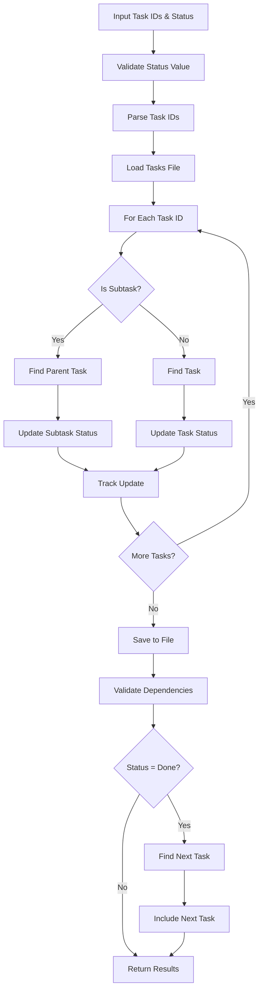

# Tool: set_task_status

## Purpose
Update the status of one or more tasks or subtasks in the task management system, with automatic next task suggestions when marking tasks as complete.

## Business Value
- **Who uses this**: Developers tracking their work progress
- **What problem it solves**: Provides systematic status tracking for tasks and subtasks throughout the development lifecycle
- **Why it's better than manual approach**: Validates status transitions, maintains dependencies, automatically suggests next tasks, and supports batch updates

## Functionality Specification

### Input Requirements

| Parameter | Type | Required | Default | Description |
|-----------|------|----------|---------|-------------|
| `id` | string | Yes | - | Task ID(s) - comma-separated for multiple |
| `status` | string | Yes | - | New status to set |
| `file` | string | No | ".taskmaster/tasks/tasks.json" | Path to tasks file |
| `complexityReport` | string | No | - | Path to complexity report file |
| `projectRoot` | string | Yes | - | Absolute path to project directory |
| `tag` | string | No | Current tag | Tag context to operate on |

#### Validation Rules
1. `status` must be one of: pending, in-progress, done, review, deferred, cancelled, blocked
2. Task ID(s) must exist in the tasks file
3. `projectRoot` must be an existing directory
4. Multiple IDs separated by commas are supported

### Processing Logic

#### Step-by-Step Algorithm

```
1. VALIDATE_INPUTS
   - Verify projectRoot exists
   - Validate status is allowed value
   - Resolve tag (use current if not specified)
   - Parse task IDs from comma-separated string
   
2. LOAD_TASK_DATA
   - Find tasks.json file path
   - Read tasks for specified tag
   - Preserve raw tagged data structure
   
3. FOR EACH TASK_ID:
   - Capture current status for logging
   - Find task or subtask by ID
   - Update status field
   - Track update for response
   
4. UPDATE_SINGLE_TASK_STATUS
   - IF subtask (ID contains "."):
      - Parse parent and subtask IDs
      - Find parent task
      - Update subtask status
   - ELSE regular task:
      - Find task by ID
      - Update task status
   - Mark data as modified
   
5. SAVE_UPDATED_DATA
   - Update tag-specific task array
   - Ensure tag metadata exists
   - Write JSON back to file
   
6. VALIDATE_DEPENDENCIES
   - Check all task dependencies
   - Ensure no circular dependencies
   - Verify dependency consistency
   
7. IF STATUS_IS_DONE:
   - Call nextTaskDirect to find next task
   - Include next task in response
   - Add implementation guidance
   
8. RETURN_RESULTS
   - Include updated task IDs
   - Show old and new statuses
   - Include next task if applicable
```

### AI Prompts Used

**This tool does not use AI**. It's a pure data manipulation tool that:
- Updates status fields in JSON
- Validates status transitions
- Checks dependencies
- No AI calls or prompts involved

### Output Specification

#### Success Response (Single Task)
```javascript
{
  success: true,
  data: {
    message: "Successfully updated task 1.2 status to \"done\"",
    taskId: "1.2",
    status: "done",
    tasksPath: "/project/.taskmaster/tasks/tasks.json",
    // If status is "done", includes next task:
    nextTask: {
      id: "1.3",
      title: "Implement error handling",
      status: "pending",
      priority: "high"
    },
    isNextSubtask: true,
    nextSteps: "When ready to work on the subtask, use set-status to set the status to \"in progress\"..."
  }
}
```

#### Success Response (Multiple Tasks)
```javascript
{
  success: true,
  data: {
    message: "Successfully updated task 1,2,3 status to \"in-progress\"",
    updatedTasks: [
      { id: "1", oldStatus: "pending", newStatus: "in-progress" },
      { id: "2", oldStatus: "pending", newStatus: "in-progress" },
      { id: "3", oldStatus: "blocked", newStatus: "in-progress" }
    ]
  }
}
```

#### Error Response
```javascript
{
  success: false,
  error: {
    code: "TASK_NOT_FOUND",
    message: "Task with ID 999 not found"
  }
}
```

#### Error Codes
- `MISSING_ARGUMENT`: Required parameters not provided
- `MISSING_TASK_ID`: No task ID specified
- `MISSING_STATUS`: No status value provided
- `INVALID_STATUS`: Status value not in allowed list
- `TASK_NOT_FOUND`: Specified task doesn't exist
- `SET_STATUS_ERROR`: Error during status update

### Side Effects
1. **Modifies tasks.json** - Updates task status fields
2. Validates all task dependencies after update
3. Optionally finds next task when marking done
4. Updates tag metadata if needed
5. No AI service calls

## Data Flow



## Implementation Details

### Data Storage
- **Input/Output**: `.taskmaster/tasks/tasks.json` - Task data by tag
- **Complexity Report**: `.taskmaster/reports/task-complexity-report.json` - For next task
- Updates preserve tagged data structure

### Valid Status Values
```javascript
const TASK_STATUS_OPTIONS = [
  'pending',      // Not started
  'in-progress',  // Currently working on
  'done',         // Completed
  'review',       // Ready for review
  'deferred',     // Postponed
  'cancelled',    // No longer needed
  'blocked'       // Waiting on dependencies
];
```

### Subtask Handling
```javascript
// Parse subtask ID format
if (id.includes('.')) {
  const [parentId, subtaskId] = id.split('.').map(id => parseInt(id, 10));
  // Update subtask within parent
}
```

### Batch Updates
- Comma-separated IDs: "1,2,3" or "1.1,2.3,4"
- All tasks updated to same status
- Each update tracked individually
- Single file write after all updates

### Next Task Integration
- Automatically called when status set to "done"
- Uses same complexity report path
- Provides seamless workflow continuation
- Includes contextual advice for next steps

## AI Integration Points
**This tool has no AI integration**. It's a pure data operation that:
- Updates status fields
- Validates transitions
- Manages dependencies
- No model calls or prompts

## Dependencies
- **File System Access**: Read/write access to JSON files
- **Dependency Manager**: Validates task dependencies
- **Next Task**: Optionally finds next task when done
- **Silent Mode**: Prevents console output interference

## Test Scenarios

### 1. Set Single Task Status
```javascript
// Test: Update single task status
Input: {
  id: "1",
  status: "in-progress",
  projectRoot: "/project"
}
Expected: Task 1 status updated to in-progress
```

### 2. Set Subtask Status
```javascript
// Test: Update subtask status
Input: {
  id: "1.2",
  status: "done",
  projectRoot: "/project"
}
Expected: Subtask 1.2 marked done, next task suggested
```

### 3. Batch Status Update
```javascript
// Test: Update multiple tasks at once
Input: {
  id: "1,2,3",
  status: "review",
  projectRoot: "/project"
}
Expected: All three tasks set to review status
```

### 4. Invalid Status Value
```javascript
// Test: Reject invalid status
Input: {
  id: "1",
  status: "invalid-status",
  projectRoot: "/project"
}
Expected: INVALID_STATUS error
```

### 5. Mark Task Complete
```javascript
// Test: Completion triggers next task
Input: {
  id: "1",
  status: "done",
  projectRoot: "/project"
}
Expected: Task marked done, next task included
```

### 6. Task Not Found
```javascript
// Test: Handle non-existent task
Input: {
  id: "999",
  status: "done",
  projectRoot: "/project"
}
Expected: TASK_NOT_FOUND error
```

### 7. Tag-Specific Update
```javascript
// Test: Update task in specific tag
Input: {
  id: "1",
  status: "in-progress",
  tag: "feature-auth",
  projectRoot: "/project"
}
Expected: Task in feature-auth tag updated
```

### 8. Mixed Task/Subtask Batch
```javascript
// Test: Update tasks and subtasks together
Input: {
  id: "1,2.3,4.5.6",
  status: "blocked",
  projectRoot: "/project"
}
Expected: All specified items set to blocked
```

## Implementation Notes
- **Complexity**: Low (simple field updates)
- **Estimated Effort**: 2-3 hours for complete implementation
- **Critical Success Factors**:
  1. Proper status validation
  2. Correct subtask parsing
  3. Batch update handling
  4. Dependency validation
  5. Next task integration

## Performance Considerations
- O(n) for finding tasks
- Single file read and write
- Dependency validation scales with task count
- No network calls or AI operations
- Fast response times

## Security Considerations
- Validate status values to prevent injection
- Validate file paths for directory traversal
- No external API calls
- No sensitive data exposure
- File locking for concurrent updates

## Code References
- Current implementation: `scripts/modules/task-manager/set-task-status.js`
- MCP tool: `mcp-server/src/tools/set-task-status.js`
- Direct function: `mcp-server/src/core/direct-functions/set-task-status.js`
- Key functions:
  - `setTaskStatus()`: Main status update logic
  - `updateSingleTaskStatus()`: Individual task update
  - `validateTaskDependencies()`: Dependency checking
  - `nextTaskDirect()`: Next task finding
- Design patterns: Batch processing, state management

---

*This documentation captures the actual current implementation of the set_task_status tool.*