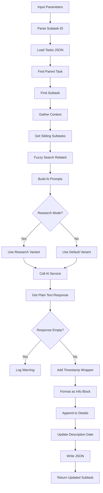

# Tool: update_subtask

## Purpose
Append timestamped information to a specific subtask without replacing existing content using AI to generate contextually relevant additions based on parent task context and sibling subtasks.

## Business Value
- **Who uses this**: Developers logging implementation notes, findings, or progress on subtasks
- **What problem it solves**: Enables incremental documentation of subtask work without losing previous context
- **Why it's better than manual approach**: AI generates contextually aware additions considering parent task and sibling subtasks, maintains timestamped history

## Functionality Specification

### Input Requirements

| Parameter | Type | Required | Default | Description |
|-----------|------|----------|---------|-------------|
| `id` | string | Yes | - | Subtask ID in format "parentId.subtaskId" (e.g., "5.2") |
| `prompt` | string | Yes | - | Information to add to the subtask |
| `research` | boolean | No | false | Use Perplexity AI for research-backed updates |
| `file` | string | No | ".taskmaster/tasks/tasks.json" | Path to tasks file |
| `projectRoot` | string | Yes | - | Absolute path to project directory |
| `tag` | string | No | Current tag | Tag context to operate on |

#### Validation Rules
1. `id` must be in format "parentId.subtaskId" with dots
2. Both parent ID and subtask ID must be positive integers
3. Parent task must exist and have subtasks
4. `prompt` must describe what to append
5. `projectRoot` must be an existing directory

### Processing Logic

#### Step-by-Step Algorithm

```
1. VALIDATE_INPUTS
   - Parse subtask ID format (e.g., "5.2")
   - Verify parent and subtask IDs are positive integers
   - Check prompt is not empty
   - Resolve project root and tag context
   
2. LOAD_AND_FIND_SUBTASK
   - Read tasks.json file
   - Find parent task by ID
   - Find subtask within parent's subtasks array
   - Verify subtask exists
   
3. GATHER_CONTEXT
   - Build parent task context (id, title)
   - Get previous subtask if exists
   - Get next subtask if exists
   - Use fuzzy search for related tasks
   - Gather codebase context
   
4. BUILD_AI_PROMPTS
   - Load update-subtask prompt template
   - Include parent and sibling context
   - Add current subtask details
   - Include update prompt and gathered context
   - Select research variant if requested
   
5. CALL_AI_SERVICE
   - Send prompts to AI service
   - Get plain text response (not JSON)
   - Handle research mode if enabled
   
6. PROCESS_RESPONSE
   - Check if response is non-empty
   - Add timestamp wrapper
   - Format as info block
   - Append to existing details
   
7. UPDATE_AND_SAVE
   - Update subtask details with appended content
   - Add date to description if prompt < 100 chars
   - Write updated tasks.json
   - Return updated subtask
```

### AI Prompts Used

#### System Prompt (Default)
```
You are an AI assistant helping to update a subtask. You will be provided with the subtask's existing details, context about its parent and sibling tasks, and a user request string.{{#if useResearch}} You have access to current best practices and latest technical information to provide research-backed updates.{{/if}}

Your Goal: Based *only* on the user's request and all the provided context (including existing details if relevant to the request), GENERATE the new text content that should be added to the subtask's details.
Focus *only* on generating the substance of the update.

Output Requirements:
1. Return *only* the newly generated text content as a plain string. Do NOT return a JSON object or any other structured data.
2. Your string response should NOT include any of the subtask's original details, unless the user's request explicitly asks to rephrase, summarize, or directly modify existing text.
3. Do NOT include any timestamps, XML-like tags, markdown, or any other special formatting in your string response.
4. Ensure the generated text is concise yet complete for the update based on the user request. Avoid conversational fillers or explanations about what you are doing (e.g., do not start with "Okay, here's the update...").{{#if useResearch}}
5. Include specific libraries, versions, and current best practices relevant to the subtask implementation.
6. Provide research-backed technical recommendations and proven approaches.{{/if}}
```

#### User Prompt (Default)
```
Task Context:

Parent Task: {{{json parentTask}}}
{{#if prevSubtask}}Previous Subtask: {{{json prevSubtask}}}
{{/if}}{{#if nextSubtask}}Next Subtask: {{{json nextSubtask}}}
{{/if}}Current Subtask Details (for context only):
{{currentDetails}}

User Request: "{{updatePrompt}}"

{{#if useResearch}}Research and incorporate current best practices, latest stable versions, and proven approaches into your update. {{/if}}Based on the User Request and all the Task Context (including current subtask details provided above), what is the new information or text that should be appended to this subtask's details? Return ONLY this new text as a plain string.{{#if useResearch}} Include specific technical recommendations based on current industry standards.{{/if}}
{{#if gatheredContext}}

# Additional Project Context

{{gatheredContext}}
{{/if}}
```

### Output Specification

#### Success Response
```javascript
{
  success: true,
  data: {
    message: "Successfully updated subtask with ID 5.2",
    subtaskId: "5.2",
    parentId: "5",
    subtask: {
      id: 2,
      title: "Implement validation",
      description: "Add input validation [Updated: 1/15/2024]",
      status: "in-progress",
      details: "Original details\n<info added on 2024-01-15T10:30:00Z>\nNew information about validation implementation approaches and edge cases to consider\n</info added on 2024-01-15T10:30:00Z>"
    },
    tasksPath: ".taskmaster/tasks/tasks.json",
    useResearch: false,
    telemetryData: {
      totalTokens: 800,
      totalCost: 0.016
    },
    tagInfo: {
      currentTag: "master",
      taskCount: 25
    }
  }
}
```

#### Error Response
```javascript
{
  success: false,
  error: {
    code: "INVALID_SUBTASK_ID",
    message: "Invalid subtask ID format. Must be in format \"parentId.subtaskId\" (e.g., \"5.2\")."
  }
}
```

#### Error Codes
- `MISSING_ARGUMENT`: Required parameters not provided
- `INVALID_SUBTASK_ID`: Subtask ID format is invalid
- `INVALID_SUBTASK_ID_FORMAT`: Not in "parent.subtask" format
- `INVALID_SUBTASK_ID_TYPE`: ID is not string or number
- `MISSING_PROMPT`: Update prompt not provided
- `SUBTASK_NOT_FOUND`: Subtask or parent not found
- `UPDATE_SUBTASK_CORE_ERROR`: Error during update
- `DIRECT_FUNCTION_SETUP_ERROR`: Setup error

### Side Effects
1. **Appends to subtask details** in tasks.json
2. Makes AI service call for content generation
3. Adds timestamp wrapper to new content
4. Updates description with date if prompt is short
5. Never replaces existing content, only appends

## Data Flow



## Implementation Details

### Data Storage
- **Input/Output**: `.taskmaster/tasks/tasks.json` - Task data by tag
- Subtasks stored in parent task's `subtasks` array
- Details field contains timestamped append history
- Preserves all existing subtask data

### Timestamp Formatting
```javascript
const timestamp = new Date().toISOString();
const formattedBlock = `<info added on ${timestamp}>
${generatedContentString.trim()}
</info added on ${timestamp}>`;
```

### Context Building
```javascript
const parentContext = {
  id: parentTask.id,
  title: parentTask.title
};

const prevSubtask = subtaskIndex > 0 
  ? parentTask.subtasks[subtaskIndex - 1]
  : undefined;

const nextSubtask = subtaskIndex < parentTask.subtasks.length - 1
  ? parentTask.subtasks[subtaskIndex + 1]
  : undefined;
```

### Description Update
```javascript
// Add date to description if prompt is short
if (prompt.length < 100) {
  subtask.description += ` [Updated: ${new Date().toLocaleDateString()}]`;
}
```

## AI Integration Points
This tool uses AI for contextual content generation:
- **Context Gathering**: Parent task and sibling subtask context
- **Fuzzy Search**: Finds related tasks and code
- **Prompt Generation**: Uses template system with Handlebars
- **AI Service Call**: Generates plain text additions
- **Research Mode**: Optional enhanced content with current practices
- **No JSON Parsing**: Returns plain text only

## Dependencies
- **File System Access**: Read/write access to JSON files
- **AI Service**: Required for content generation
- **Context Gatherer**: Searches for relevant context
- **Fuzzy Task Search**: Finds related tasks
- **Prompt Manager**: Loads and processes prompt templates

## Test Scenarios

### 1. Basic Append
```javascript
// Test: Append info to subtask
Input: {
  id: "5.2",
  prompt: "Added error handling for null inputs",
  projectRoot: "/project"
}
Expected: Timestamped info added to details
```

### 2. Research Mode
```javascript
// Test: Research-backed append
Input: {
  id: "10.3",
  prompt: "Research best practices for API rate limiting",
  research: true,
  projectRoot: "/project"
}
Expected: Research-based content appended
```

### 3. Invalid Format
```javascript
// Test: Missing dot separator
Input: {
  id: "5",
  prompt: "Update info",
  projectRoot: "/project"
}
Expected: Error - invalid format
```

### 4. Parent Not Found
```javascript
// Test: Non-existent parent
Input: {
  id: "999.1",
  prompt: "Update info",
  projectRoot: "/project"
}
Expected: Error - parent task not found
```

### 5. Subtask Not Found
```javascript
// Test: Non-existent subtask
Input: {
  id: "5.999",
  prompt: "Update info",
  projectRoot: "/project"
}
Expected: Error - subtask not found
```

### 6. Empty Response Handling
```javascript
// Test: AI returns empty
AI returns: "" or whitespace only
Expected: Warning logged, no update made
```

### 7. Short Prompt Description Update
```javascript
// Test: Short prompt adds date
Input: {
  id: "3.1",
  prompt: "Fixed bug",
  projectRoot: "/project"
}
Expected: Description gets "[Updated: MM/DD/YYYY]"
```

### 8. Context Integration
```javascript
// Test: Uses sibling context
Setup: Task 5 has subtasks 1, 2, 3
Input: {
  id: "5.2",
  prompt: "Continue from previous subtask",
  projectRoot: "/project"
}
Expected: Context includes subtask 1 and 3
```

## Implementation Notes
- **Complexity**: Medium (context building, timestamp formatting)
- **Estimated Effort**: 4-5 hours for complete implementation
- **Critical Success Factors**:
  1. Proper subtask ID parsing
  2. Context gathering from siblings
  3. Timestamp wrapper formatting
  4. Plain text response handling
  5. Append-only behavior

## Performance Considerations
- AI calls add 2-3 second latency
- Token usage varies by context size
- Context gathering for sibling subtasks
- Append operations preserve history
- File I/O for each update

## Security Considerations
- Validate subtask ID format
- Sanitize prompts before AI calls
- API keys stored in environment variables
- Validate file paths for directory traversal
- Preserve existing content integrity

## Code References
- Current implementation: `scripts/modules/task-manager/update-subtask-by-id.js`
- MCP tool: `mcp-server/src/tools/update-subtask.js`
- Direct function: `mcp-server/src/core/direct-functions/update-subtask-by-id.js`
- Prompt template: `src/prompts/update-subtask.json`
- Key functions:
  - `updateSubtaskById()`: Main update logic
  - `ContextGatherer.gather()`: Context collection
  - `FuzzyTaskSearch.findRelevantTasks()`: Related task search
  - `generateTextService()`: AI text generation
- Design patterns: Append-only pattern, Template pattern (prompts)

---

*This documentation captures the actual current implementation of the update_subtask tool including exact AI prompts used.*