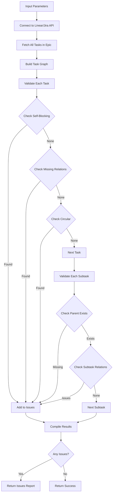

# Tool: check_task_links

## Purpose
Validate task relationships in Linear/Jira to identify broken links, circular dependencies, or orphaned relationships without making any changes.

## Business Value
- **Who uses this**: Developers ensuring task relationship integrity in Linear/Jira
- **What problem it solves**: Identifies broken or problematic task relationships that could block workflow
- **Why it's better than manual approach**: Automatically queries Linear/Jira APIs to detect complex relationship issues across the entire project

## Functionality Specification

### Input Requirements

| Parameter | Type | Required | Default | Description |
|-----------|------|----------|---------|-------------|
| `epic_id` | string | No | Current epic | Epic/Project ID in Linear/Jira to validate |

#### Validation Rules
1. Connects to Linear/Jira via API
2. Validates all tasks and subtasks in the epic/project
3. Does not modify any data (read-only operation)
4. Reports all issues found without fixing them

### Processing Logic

#### Step-by-Step Algorithm

```
1. CONNECT_TO_PLATFORM
   - Initialize Linear/Jira client with API credentials
   - Verify connection and permissions
   - Get epic/project details
   
2. FETCH_TASKS
   - Query all tasks in the epic/project via API
   - Include subtasks and relationship data
   - Build task graph in memory
   
3. VALIDATE_TASK_RELATIONSHIPS
   For each task:
   - Check for self-blocking relationships
   - Verify blocking/blocked task IDs exist
   - Check for circular blocking chains
   
4. VALIDATE_SUBTASK_RELATIONSHIPS
   For each subtask:
   - Check parent task exists
   - Verify subtask blocking relationships
   - Validate cross-subtask dependencies
   
5. ISSUE_COLLECTION
   Track issues by type:
   - self: Task blocks itself
   - missing: Related task doesn't exist
   - circular: Part of circular blocking chain
   - orphaned: Subtask without valid parent
   
6. GENERATE_REPORT
   - Count all relationships verified
   - Compile issue list
   - Format validation summary
   - Return validation result
```

### Validation Types

| Issue Type | Description | Example |
|-----------|-------------|---------|
| `self` | Task blocks itself | Task ABC-123 blocks ABC-123 |
| `missing` | Related task doesn't exist | Task ABC-123 blocks non-existent ABC-999 |
| `circular` | Part of circular blocking chain | ABC-123 → ABC-124 → ABC-125 → ABC-123 |
| `orphaned` | Subtask without valid parent | Subtask exists but parent deleted |

### Output Specification

#### Success Response (All Valid)
```javascript
{
  success: true,
  data: {
    message: "Task relationships validated successfully",
    platform: "linear", // or "jira"
    epicId: "PROJ-123",
    summary: {
      tasksChecked: 10,
      subtasksChecked: 25,
      totalRelationships: 45,
      issuesFound: 0
    }
  }
}
```

#### Success Response (Issues Found)
```javascript
{
  success: true,
  data: {
    message: "Relationship validation failed. Found 3 issue(s)",
    platform: "linear",
    epicId: "PROJ-123",
    issues: [
      {
        type: "self",
        taskId: "ABC-123",
        message: "Task ABC-123 blocks itself"
      },
      {
        type: "missing",
        taskId: "ABC-124",
        relatedId: "ABC-999",
        message: "Task ABC-124 blocks non-existent task ABC-999"
      },
      {
        type: "circular",
        taskId: "ABC-125",
        chain: ["ABC-125", "ABC-126", "ABC-127", "ABC-125"],
        message: "Task ABC-125 is part of a circular blocking chain"
      }
    ],
    summary: {
      tasksChecked: 10,
      subtasksChecked: 25,
      totalRelationships: 45,
      issuesFound: 3
    }
  }
}
```

#### Error Response
```javascript
{
  success: false,
  error: {
    code: "API_ERROR",
    message: "Failed to connect to Linear API"
  }
}
```

#### Error Codes
- `API_ERROR`: Failed to connect to Linear/Jira API
- `AUTH_ERROR`: Invalid API credentials
- `EPIC_NOT_FOUND`: Epic/Project doesn't exist
- `VALIDATION_ERROR`: Error during validation process

### Side Effects
1. **No data modifications** - read-only operation
2. Does not fix any issues found
3. API rate limit consumption
4. Logs validation results for debugging
5. Returns comprehensive issue report

## Data Flow



## Implementation Details

### API Integration
- **Linear**: Uses `linear-api` Python library
- **Jira**: Uses `jira-python` SDK
- All data fetched via API, no local storage
- Results returned in response only
- Issues tracked in memory during validation

### Circular Blocking Detection (Linear)
```python
async def is_circular_blocking(client, task_id, chain=[]):
    """Detect circular blocking relationships in Linear"""
    if task_id in chain:
        return True
    
    # Fetch task with blocking relationships
    task = await client.issue(task_id)
    if not task or not task.blocks:
        return False
    
    new_chain = chain + [task_id]
    for blocked_id in task.blocks:
        if await is_circular_blocking(client, blocked_id, new_chain):
            return True
    return False
```

### Subtask Validation (Linear)
```python
async def validate_subtasks(client, epic_id):
    """Validate all subtasks in an epic"""
    issues = []
    
    # Fetch all tasks in epic
    tasks = await client.issues(project_id=epic_id)
    
    for task in tasks:
        # Check if task has parent (is a subtask)
        if task.parent_id:
            parent = await client.issue(task.parent_id)
            if not parent:
                issues.append({
                    'type': 'orphaned',
                    'taskId': task.id,
                    'message': f'Subtask {task.id} has non-existent parent'
                })
        
        # Check subtask blocking relationships
        for blocked_id in task.blocks or []:
            if not await task_exists(client, blocked_id):
                issues.append({
                    'type': 'missing',
                    'taskId': task.id,
                    'relatedId': blocked_id,
                    'message': f'Subtask {task.id} blocks non-existent task {blocked_id}'
                })
    
    return issues
```

### Relationship Counting
```python
async def count_all_relationships(client, epic_id):
    """Count all task relationships in an epic"""
    count = 0
    
    tasks = await client.issues(project_id=epic_id)
    for task in tasks:
        # Count blocking relationships
        if task.blocks:
            count += len(task.blocks)
        # Count blocked-by relationships
        if task.blocked_by:
            count += len(task.blocked_by)
    
    return count
```

## AI Integration Points
This tool **does not use AI**. It performs pure data validation:
- Algorithmic relationship checking via API
- Graph traversal for circular detection
- Simple existence validation
- No content generation or analysis

## Dependencies
- **API Libraries**: `linear-api` or `jira-python`
- **Authentication**: API credentials from environment
- **Network**: Internet connection for API access
- **Async Support**: Python asyncio for concurrent API calls

## Test Scenarios

### 1. All Relationships Valid
```python
# Test: Clean relationship structure in Linear
Setup: Epic with valid task relationships only
Input: {
  epic_id: "PROJ-123"
}
Expected: Success with 0 issues
```

### 2. Self-Blocking Detection
```python
# Test: Task blocks itself
Setup: Task ABC-123 blocks ABC-123 in Linear
Input: {
  epic_id: "PROJ-123"
}
Expected: Issue - self blocking for task ABC-123
```

### 3. Missing Task Detection
```python
# Test: Blocking relationship to non-existent task
Setup: Task ABC-124 blocks non-existent ABC-999
Input: {
  epic_id: "PROJ-123"
}
Expected: Issue - missing task ABC-999
```

### 4. Circular Blocking Detection
```python
# Test: Circular blocking chain
Setup: 
  Task ABC-125 blocks ABC-126
  Task ABC-126 blocks ABC-127
  Task ABC-127 blocks ABC-125
Input: {
  epic_id: "PROJ-123"
}
Expected: Issues - circular blocking for tasks ABC-125, ABC-126, ABC-127
```

### 5. Orphaned Subtask Detection
```python
# Test: Subtask without parent
Setup: Subtask exists but parent task deleted
Input: {
  epic_id: "PROJ-123"
}
Expected: Issue - orphaned subtask
```

### 6. Cross-Subtask Relationships
```python
# Test: Valid cross-subtask blocking
Setup: 
  Subtask ABC-125.1 blocks ABC-126.1
  Both subtasks exist
Input: {
  epic_id: "PROJ-123"
}
Expected: Success - valid relationship
```

### 7. Mixed Issue Types
```python
# Test: Multiple issue types
Setup: 
  Task ABC-130 blocks itself
  Task ABC-131 blocks non-existent ABC-999
  Tasks ABC-132-133-134 form circular chain
Input: {
  epic_id: "PROJ-123"
}
Expected: 4+ issues of different types
```

### 8. No Relationships
```python
# Test: Tasks with no blocking relationships
Setup: All tasks have no blocking/blocked-by relationships
Input: {
  epic_id: "PROJ-123"
}
Expected: Success with 0 relationships verified
```

## Implementation Notes
- **Complexity**: Medium (API calls + graph traversal)
- **Estimated Effort**: 2-3 hours for Linear implementation
- **Critical Success Factors**:
  1. Efficient API usage to minimize calls
  2. Accurate circular blocking detection
  3. Proper handling of Linear/Jira data models
  4. Performance with large epic/project
  5. Clear issue reporting

## Performance Considerations
- Batch API calls where possible
- O(n²) worst case for circular detection
- Memory usage proportional to task count
- Async/await for concurrent API operations
- Results cached during single validation run

## Security Considerations
- Read-only API operations
- No data modification risks
- API credentials secured in environment
- Network traffic over HTTPS
- Safe for production use

## Implementation Structure
```python
# alfred/tools/check_task_links.py
class TaskLinkChecker:
    def __init__(self, platform: str):
        self.adapter = LinearAdapter() if platform == "linear" else JiraAdapter()
    
    async def validate(self, epic_id: str) -> dict:
        """Main validation entry point"""
        tasks = await self.adapter.fetch_tasks(epic_id)
        issues = await self._validate_relationships(tasks)
        return self._format_response(issues)
```

---

*This documentation reflects Alfred's integration with Linear/Jira for task relationship validation.*