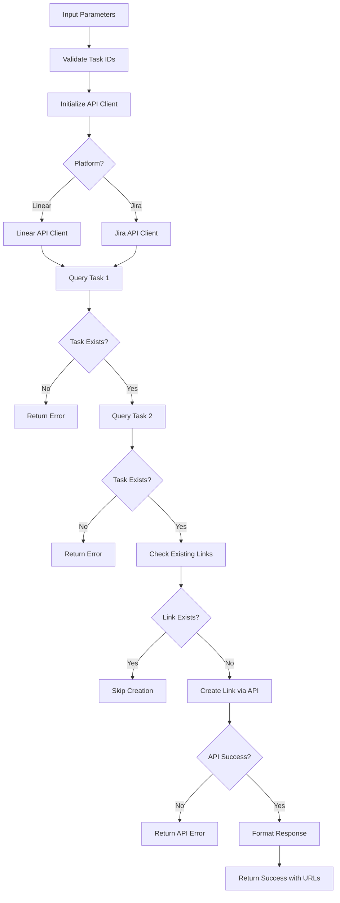

# Tool: link_tasks

## Purpose
Create a blocking/blocked relationship between two tasks in Linear (or link issues in Jira) to establish task dependencies and execution order.

## Business Value
- **Who uses this**: Developers establishing task prerequisites and execution order in Linear/Jira
- **What problem it solves**: Creates clear task dependencies using Linear's native blocking/blocked relationships (or Jira's issue links)
- **Why it's better than manual approach**: Automates task linking through API, validates task existence, and maintains consistency across the project management platform

## Functionality Specification

### Input Requirements

| Parameter | Type | Required | Default | Description |
|-----------|------|----------|---------|-------------|
| `task_id` | string | Yes | - | Linear issue ID or Jira issue key of the task that will be blocked |
| `blocks_task_id` | string | Yes | - | Linear issue ID or Jira issue key of the task that will block the first task |
| `link_type` | string | No | "blocks" | Type of relationship: "blocks", "relates", "duplicates" (Jira supports more types) |
| `workspace_id` | string | No | From config | Linear workspace ID or Jira project key |

#### Validation Rules
1. Both task IDs must exist in Linear/Jira
2. Task cannot block itself
3. Linear automatically prevents circular dependencies
4. Both issues and sub-issues can be linked
5. Cross-project linking may be restricted based on permissions

### Processing Logic

#### Step-by-Step Algorithm

```
1. VALIDATE_INPUTS
   - Check both task IDs are provided
   - Validate link type is supported
   - Load workspace configuration
   
2. AUTHENTICATE_API
   - Initialize Linear/Jira client with API key
   - Verify authentication is valid
   
3. VERIFY_TASKS_EXIST
   For Linear:
   - Query issue by ID for both tasks
   - Verify both issues exist in workspace
   For Jira:
   - Query issue by key for both tasks
   - Verify both issues exist in project
   
4. CHECK_EXISTING_LINKS
   For Linear:
   - Query existing relations for the task
   - Check if link already exists
   For Jira:
   - Get issue links for the task
   - Check if link already exists
   
5. CREATE_LINK
   For Linear:
   - Use issueRelation.create mutation
   - Set relatedIssueId and type
   For Jira:
   - Use issue link API
   - Create link with specified type
   
6. RETURN_SUCCESS
   - Return confirmation with task IDs
   - Include link type created
   - Provide direct URLs to both tasks
```

### Output Specification

#### Success Response (Linear)
```javascript
{
  success: true,
  data: {
    message: "Successfully linked tasks: TASK-123 is now blocked by TASK-456",
    blockedTask: {
      id: "TASK-123",
      title: "Implement authentication",
      url: "https://linear.app/team/issue/TASK-123"
    },
    blockingTask: {
      id: "TASK-456", 
      title: "Setup database schema",
      url: "https://linear.app/team/issue/TASK-456"
    },
    linkType: "blocks"
  }
}
```

#### Success Response (Jira)
```javascript
{
  success: true,
  data: {
    message: "Successfully linked issues: PROJ-123 is now blocked by PROJ-456",
    blockedIssue: {
      key: "PROJ-123",
      summary: "Implement authentication",
      url: "https://company.atlassian.net/browse/PROJ-123"
    },
    blockingIssue: {
      key: "PROJ-456",
      summary: "Setup database schema", 
      url: "https://company.atlassian.net/browse/PROJ-456"
    },
    linkType: "Blocks"
  }
}
```

#### Error Response
```javascript
{
  success: false,
  error: {
    code: "TASK_NOT_FOUND",
    message: "Task TASK-999 does not exist in Linear workspace"
  }
}
```

#### Error Codes
- `MISSING_ARGUMENT`: Required parameters not provided
- `TASK_NOT_FOUND`: One or both tasks don't exist
- `AUTHENTICATION_ERROR`: API key invalid or expired
- `PERMISSION_ERROR`: User lacks permission to link tasks
- `DUPLICATE_LINK`: Link already exists between tasks
- `API_ERROR`: Linear/Jira API returned an error

### Side Effects
1. **Creates relationship in Linear/Jira** that is visible in the UI
2. Updates both tasks to show the blocking/blocked relationship
3. Linear automatically prevents circular dependencies
4. Changes affect task workflow and board views
5. May trigger webhooks or notifications in Linear/Jira

## Data Flow



## Implementation Details

### API Integration
- **Linear**: Uses GraphQL API with `linear-api` Python library
- **Jira**: Uses REST API with `jira-python` library
- All dependency data stored in Linear/Jira, not locally
- Relationships are bidirectional and visible in both tasks

### Linear API Example
```python
from linear_api import LinearClient

async def link_tasks_linear(client, task_id, blocks_task_id):
    # Create blocking relationship
    relation = await client.issue_relation.create(
        issue_id=task_id,
        related_issue_id=blocks_task_id,
        type="blocks"
    )
    return relation
```

### Jira API Example
```python
from jira import JIRA

def link_tasks_jira(jira_client, task_key, blocks_task_key):
    # Create issue link
    jira_client.create_issue_link(
        type="Blocks",
        inwardIssue=task_key,
        outwardIssue=blocks_task_key
    )
```

### Link Types
#### Linear
- `blocks` - Task is blocked by another task
- `related` - Tasks are related
- `duplicate` - Task duplicates another

#### Jira (Common Types)
- `Blocks` - Task blocks another
- `Is Blocked By` - Task is blocked by another
- `Relates To` - General relationship
- `Duplicates` - Task duplicates another
- `Clones` - Task is a clone

## AI Integration Points
This tool **does not use AI**. It performs pure API operations:
- Direct API calls to Linear/Jira
- Simple validation checks
- No content generation or analysis
- Only uses platform APIs for linking

## Dependencies
- **API Libraries**: `linear-api` for Linear, `jira-python` for Jira
- **Authentication**: API key management via environment variables
- **Config Manager**: Workspace and project configuration
- **Adapter Pattern**: Platform-specific implementations

## Test Scenarios

### 1. Linear Task Blocking
```python
# Test: Create blocking relationship in Linear
Input: {
  task_id: "TASK-123",
  blocks_task_id: "TASK-456",
  link_type: "blocks"
}
Expected: TASK-123 is blocked by TASK-456 in Linear
```

### 2. Jira Issue Linking
```python
# Test: Create blocking relationship in Jira
Input: {
  task_id: "PROJ-123",
  blocks_task_id: "PROJ-456",
  link_type: "Blocks"
}
Expected: PROJ-123 is blocked by PROJ-456 in Jira
```

### 3. Sub-issue Linking
```python
# Test: Link sub-issues in Linear
Input: {
  task_id: "TASK-123-SUB-1",
  blocks_task_id: "TASK-456-SUB-2",
  link_type: "blocks"
}
Expected: Sub-issue blocked relationship created
```

### 4. Duplicate Prevention
```python
# Test: Adding existing link
Setup: TASK-123 already blocked by TASK-456
Input: {
  task_id: "TASK-123",
  blocks_task_id: "TASK-456"
}
Expected: Skip creation, return existing link info
```

### 5. Invalid Task ID
```python
# Test: Task doesn't exist
Input: {
  task_id: "TASK-999999",
  blocks_task_id: "TASK-456"
}
Expected: Error - TASK_NOT_FOUND
```

### 6. Self-Linking Prevention
```python
# Test: Task blocks itself
Input: {
  task_id: "TASK-123",
  blocks_task_id: "TASK-123"
}
Expected: Error - cannot link task to itself
```

### 7. Cross-Project Linking
```python
# Test: Link tasks from different projects
Input: {
  task_id: "PROJ1-123",
  blocks_task_id: "PROJ2-456"
}
Expected: Success if permissions allow, error otherwise
```

### 8. Invalid Link Type
```python
# Test: Unsupported link type
Input: {
  task_id: "TASK-123",
  blocks_task_id: "TASK-456",
  link_type: "invalid_type"
}
Expected: Error - unsupported link type
```

## Implementation Notes
- **Complexity**: Low (simple API calls)
- **Estimated Effort**: 2-3 hours for complete implementation
- **Critical Success Factors**:
  1. Proper API authentication
  2. Task existence validation via API
  3. Platform-specific adapter implementation
  4. Duplicate link prevention
  5. Error handling for API failures

## Performance Considerations
- Single API call for link creation
- Two API calls for task validation
- Async operations for better performance
- API rate limiting handled by libraries
- Caching of task data for efficiency

## Security Considerations
- API keys stored in environment variables
- Validate all task IDs before API calls
- Prevent self-linking
- Respect platform permissions
- Handle API errors gracefully

## Code References
- Python implementation: `alfred/adapters/linear.py` and `alfred/adapters/jira.py`
- MCP tool: `alfred/tools/link_tasks.py`
- Key functions:
  - `link_tasks()`: Main linking logic
  - `verify_task_exists()`: Validates task via API
  - `create_link()`: Platform-specific link creation
  - `get_task_url()`: Generates direct URLs
- Design patterns: Adapter pattern for platform abstraction

---

*This documentation defines the link_tasks tool for creating task dependencies in Linear and Jira via their native APIs.*