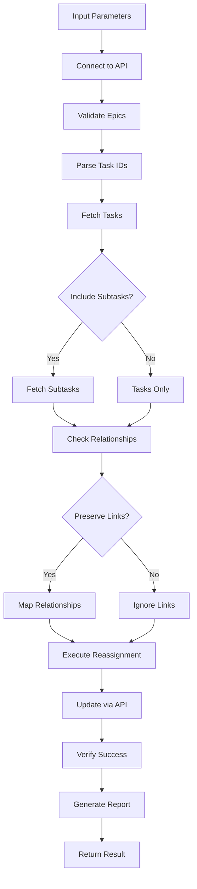

# Tool: reassign_task

## Purpose
Move tasks between epics/projects in Linear/Jira, supporting bulk reassignment and hierarchy preservation.

## Business Value
- **Who uses this**: Developers reorganizing task structure across epics/projects
- **What problem it solves**: Allows flexible task reorganization between different epics or projects
- **Why it's better than manual approach**: Bulk operations via API, preserves relationships and metadata

## Functionality Specification

### Input Requirements

| Parameter | Type | Required | Default | Description |
|-----------|------|----------|---------|-------------|
| `task_ids` | string | Yes | - | Comma-separated task IDs to move (e.g., "ABC-123,ABC-124") |
| `from_epic` | string | No | Current epic | Source epic/project ID |
| `to_epic` | string | Yes | - | Target epic/project ID |
| `with_subtasks` | boolean | No | true | Include subtasks in the move |
| `preserve_links` | boolean | No | true | Maintain task relationships if possible |

#### Validation Rules
1. Tasks must exist in Linear/Jira
2. User must have permissions for both epics
3. Target epic must exist and be accessible
4. Subtasks move with parent by default
5. Cross-epic relationships preserved when possible

### Processing Logic

#### Step-by-Step Algorithm

```
1. CONNECT_TO_PLATFORM
   - Initialize Linear/Jira client with API credentials
   - Verify connection and permissions
   
2. VALIDATE_INPUTS
   - Parse comma-separated task IDs
   - Verify source and target epics exist
   - Check user permissions for both epics
   
3. FETCH_TASKS
   For each task ID:
   - Fetch task details via API
   - Include subtasks if with_subtasks=true
   - Track relationships and metadata
   
4. VALIDATE_MOVE
   - Check if tasks exist in source epic
   - Verify no conflicts in target epic
   - Identify cross-epic relationships
   
5. EXECUTE_REASSIGNMENT
   For each task:
   - Update epic/project assignment via API
   - Move subtasks if included
   - Update task metadata (labels, custom fields)
   
6. HANDLE_RELATIONSHIPS
   If preserve_links=true:
   - Maintain blocking/blocked relationships
   - Update cross-epic links where possible
   - Log any broken relationships
   
7. VERIFY_AND_REPORT
   - Confirm all tasks moved successfully
   - Generate move summary
   - Return statistics and any warnings
```

### Reassignment Scenarios

| Platform | Source | Destination | Operation | Result |
|----------|--------|-------------|-----------|---------|
| Linear | Project A | Project B | Reassign | Task in new project |
| Linear | Project | Different Team | Cross-team | Task moved to new team's project |
| Jira | Epic A | Epic B | Reassign | Story in new epic |
| Jira | Project A | Project B | Move | Issue in new project |
| Both | With subtasks | Any | Bulk move | Parent + children moved together |

### Output Specification

#### Success Response (Single Task)
```javascript
{
  success: true,
  data: {
    message: "Successfully reassigned task ABC-123 to epic PROJ-456",
    platform: "linear",
    movedTask: {
      id: "ABC-123",
      title: "Implement validation",
      fromEpic: "PROJ-123",
      toEpic: "PROJ-456"
    }
  }
}
```

#### Success Response (Bulk Reassignment)
```javascript
{
  success: true,
  data: {
    message: "Successfully reassigned 3 tasks to epic PROJ-456",
    platform: "linear",
    movedTasks: [
      { id: "ABC-123", title: "Task 1", subtasksMoved: 2 },
      { id: "ABC-124", title: "Task 2", subtasksMoved: 0 },
      { id: "ABC-125", title: "Task 3", subtasksMoved: 3 }
    ],
    statistics: {
      totalTasks: 3,
      totalSubtasks: 5,
      relationshipsPreserved: 4,
      relationshipsBroken: 1
    }
  }
}
```

#### Warning Response (Partial Success)
```javascript
{
  success: true,
  data: {
    message: "Reassigned tasks with warnings",
    movedTasks: ["ABC-123", "ABC-124"],
    warnings: [
      {
        taskId: "ABC-123",
        warning: "Cross-epic relationship to ABC-789 broken"
      }
    ]
  }
}
```

#### Error Response
```javascript
{
  success: false,
  error: {
    code: "EPIC_NOT_FOUND",
    message: "Target epic PROJ-999 not found in Linear"
  }
}
```

#### Error Codes
- `API_ERROR`: Failed to connect to Linear/Jira API
- `AUTH_ERROR`: Invalid API credentials
- `TASK_NOT_FOUND`: Source task doesn't exist
- `EPIC_NOT_FOUND`: Epic/Project doesn't exist
- `PERMISSION_DENIED`: No permission to move tasks
- `INVALID_TASK_IDS`: Malformed task ID format

### Side Effects
1. **Updates epic/project assignment** in Linear/Jira
2. **Moves subtasks with parent** by default
3. **May break cross-epic relationships** if tasks depend on tasks in other epics
4. **Updates task metadata** including labels and custom fields
5. **Triggers webhooks/notifications** in Linear/Jira

## Data Flow



## Implementation Details

### API Integration
- **Linear**: Uses `linear-api` Python library
- **Jira**: Uses `jira-python` SDK
- All operations via API, no local storage
- Batch operations for efficiency

### Linear Reassignment
```python
async def reassign_task_linear(client, task_id, target_project_id):
    """Reassign task to different project in Linear"""
    task = await client.issue(task_id)
    
    # Update project assignment
    await task.update(project_id=target_project_id)
    
    # Handle subtasks if present
    if task.children:
        for child in task.children:
            await client.issue(child.id).update(
                project_id=target_project_id
            )
    
    return task
```

### Jira Reassignment
```python
def reassign_task_jira(client, issue_key, target_epic_key):
    """Reassign issue to different epic in Jira"""
    issue = client.issue(issue_key)
    
    # Update epic link
    issue.update(fields={'customfield_10014': target_epic_key})
    
    # Handle subtasks
    for subtask in issue.fields.subtasks:
        client.issue(subtask.key).update(
            fields={'customfield_10014': target_epic_key}
        )
    
    return issue
```

### Relationship Preservation
```python
async def preserve_relationships(client, task_id, old_project, new_project):
    """Attempt to preserve task relationships across projects"""
    task = await client.issue(task_id)
    preserved = []
    broken = []
    
    for blocked_id in task.blocks or []:
        blocked_task = await client.issue(blocked_id)
        if blocked_task.project_id == new_project:
            preserved.append(blocked_id)
        else:
            # Cross-project relationship - may break
            broken.append(blocked_id)
    
    return preserved, broken
```

### Batch Processing
```python
async def bulk_reassign(client, task_ids, target_epic):
    """Process multiple task reassignments"""
    results = []
    
    for task_id in task_ids:
        try:
            result = await reassign_task_linear(
                client, task_id, target_epic
            )
            results.append({
                'id': task_id,
                'status': 'success',
                'subtasks_moved': len(result.children or [])
            })
        except Exception as e:
            results.append({
                'id': task_id,
                'status': 'failed',
                'error': str(e)
            })
    
    return results
```

## AI Integration Points
This tool **does not use AI**. It performs pure API operations:
- Direct task reassignment via Linear/Jira APIs
- Deterministic epic/project updates
- Rule-based relationship handling
- No content generation or analysis

## Dependencies
- **API Libraries**: `linear-api` or `jira-python`
- **Authentication**: API credentials from environment
- **Network**: Internet connection for API access
- **Async Support**: Python asyncio for concurrent operations

## Test Scenarios

### 1. Single Task Reassignment (Linear)
```python
# Test: Move task to different project
Input: {
  task_ids: "ABC-123",
  from_epic: "PROJ-100",
  to_epic: "PROJ-200"
}
Expected: Task ABC-123 moved to PROJ-200 with subtasks
```

### 2. Bulk Reassignment (Linear)
```python
# Test: Move multiple tasks at once
Input: {
  task_ids: "ABC-123,ABC-124,ABC-125",
  to_epic: "PROJ-200"
}
Expected: All three tasks moved to new project
```

### 3. Cross-Team Move (Linear)
```python
# Test: Move task to different team's project
Input: {
  task_ids: "ABC-123",
  from_epic: "TEAM1-PROJ",
  to_epic: "TEAM2-PROJ"
}
Expected: Task moved, relationships may break
```

### 4. Epic Reassignment (Jira)
```python
# Test: Move story to different epic
Input: {
  task_ids: "PROJ-123",
  from_epic: "EPIC-100",
  to_epic: "EPIC-200"
}
Expected: Story PROJ-123 reassigned to EPIC-200
```

### 5. With Subtasks
```python
# Test: Move parent with all children
Input: {
  task_ids: "ABC-123",
  to_epic: "PROJ-200",
  with_subtasks: true
}
Expected: Parent and 3 subtasks moved together
```

### 6. Preserve Relationships
```python
# Test: Maintain blocking relationships
Input: {
  task_ids: "ABC-123",
  to_epic: "PROJ-200",
  preserve_links: true
}
Expected: Task moved, in-project relationships preserved
```

### 7. Permission Error
```python
# Test: No permission for target epic
Input: {
  task_ids: "ABC-123",
  to_epic: "RESTRICTED-PROJ"
}
Expected: Error - PERMISSION_DENIED
```

### 8. Invalid Epic
```python
# Test: Target epic doesn't exist
Input: {
  task_ids: "ABC-123",
  to_epic: "PROJ-999"
}
Expected: Error - EPIC_NOT_FOUND
```

## Implementation Notes
- **Complexity**: Medium (API operations, batch processing)
- **Estimated Effort**: 3-4 hours for Linear implementation
- **Critical Success Factors**:
  1. Efficient API usage
  2. Proper error handling
  3. Relationship preservation logic
  4. Batch operation support
  5. Clear reporting of broken links

## Performance Considerations
- Batch API calls where possible
- Async/await for concurrent operations
- Minimize API calls with field selection
- Cache task data during operation
- Rate limit aware implementation

## Security Considerations
- API credentials secured in environment
- Validate all task IDs before operations
- Permission checks for both epics
- Network traffic over HTTPS
- Audit trail via Linear/Jira history

## Implementation Structure
```python
# alfred/tools/reassign_task.py
class TaskReassigner:
    def __init__(self, platform: str):
        self.adapter = LinearAdapter() if platform == "linear" else JiraAdapter()
    
    async def reassign(self, task_ids: list, from_epic: str, to_epic: str, **options) -> dict:
        """Main reassignment entry point"""
        tasks = await self.adapter.fetch_tasks(task_ids)
        results = await self._execute_reassignment(tasks, to_epic, options)
        return self._format_response(results)
```

---

*This documentation reflects Alfred's integration with Linear/Jira for task reassignment operations.*