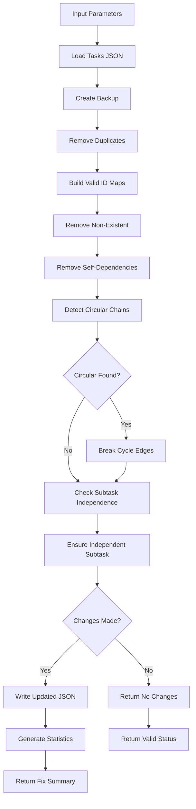

# Tool: repair_task_links

## Purpose
Automatically fix invalid task relationships in Linear/Jira including removing broken links, self-blocking relationships, and circular blocking chains.

## Business Value
- **Who uses this**: Developers maintaining task relationship integrity in Linear/Jira
- **What problem it solves**: Automatically resolves relationship issues that would block workflow
- **Why it's better than manual approach**: Fixes complex issues across the platform via API automatically

## Functionality Specification

### Input Requirements

| Parameter | Type | Required | Default | Description |
|-----------|------|----------|---------|-------------|
| `epic_id` | string | No | Current epic | Epic/Project ID in Linear/Jira to fix |

#### Validation Rules
1. Connects to Linear/Jira via API
2. Fixes all tasks and subtasks in the epic/project
3. Validates relationships before making changes
4. Only makes changes if fixes are needed

### Processing Logic

#### Step-by-Step Algorithm

```
1. CONNECT_AND_VALIDATE
   - Initialize Linear/Jira client with API credentials
   - Verify connection and permissions
   - Run validation check first to identify issues
   
2. FETCH_RELATIONSHIPS
   For each task in epic:
   - Get blocking relationships
   - Get blocked-by relationships
   - Track relationship statistics
   
3. REMOVE_SELF_BLOCKING
   For each task:
   - Check for self-blocking
   - Remove via API if found
   - Track fixes applied
   
4. VALIDATE_REFERENCES
   For each task:
   - Check if blocked tasks exist
   - Remove broken relationships via API
   - Track non-existent references removed
   
5. FIX_CIRCULAR_BLOCKING
   - Build relationship graph
   - Detect circular chains
   - Break cycles by removing one edge via API
   - Choose edge that minimizes workflow impact
   
6. APPLY_FIXES
   - Execute API calls to update relationships
   - Verify each fix was applied
   - Generate fix summary
   - Return statistics
```

### Fix Types

| Fix Type | Description | Example |
|----------|-------------|---------|
| Duplicate Removal | Remove duplicate dependency entries | [3, 3, 4] → [3, 4] |
| Non-existent Removal | Remove references to missing tasks | Depends on 99 (doesn't exist) → removed |
| Self-dependency Removal | Remove task depending on itself | Task 5 depends on 5 → removed |
| Circular Chain Breaking | Break circular dependency loops | 5→6→7→5 → break one edge |

### Output Specification

#### Success Response (Fixes Applied)
```javascript
{
  success: true,
  data: {
    message: "Dependencies fixed successfully",
    tasksPath: "/project/.taskmaster/tasks/tasks.json",
    statistics: {
      nonExistentDependenciesRemoved: 3,
      selfDependenciesRemoved: 1,
      duplicateDependenciesRemoved: 5,
      circularDependenciesFixed: 2,
      tasksFixed: 4,
      subtasksFixed: 7
    }
  }
}
```

#### Success Response (No Fixes Needed)
```javascript
{
  success: true,
  data: {
    message: "No dependency issues found - all dependencies are valid",
    tasksPath: "/project/.taskmaster/tasks/tasks.json",
    statistics: {
      tasksChecked: 10,
      totalDependenciesVerified: 45
    }
  }
}
```

#### Error Response
```javascript
{
  success: false,
  error: {
    code: "FILE_NOT_FOUND",
    message: "Tasks file not found at /project/.taskmaster/tasks/tasks.json"
  }
}
```

#### Error Codes
- `MISSING_ARGUMENT`: Required parameters not provided
- `FILE_NOT_FOUND`: Tasks file doesn't exist
- `FIX_DEPENDENCIES_ERROR`: Error during fix process

### Side Effects
1. **Modifies tasks.json file** if fixes are needed
2. Removes invalid dependencies permanently
3. Breaks circular chains (may affect intended flow)
4. Ensures at least one independent subtask per task
5. Does not regenerate task markdown files

## Data Flow



## Implementation Details

### Data Storage
- **Input/Output**: `.taskmaster/tasks/tasks.json` - Task data by tag
- Backup created in memory before modifications
- Changes written only if fixes applied
- Statistics tracked during processing

### Duplicate Removal
```javascript
// Remove duplicate dependencies
task.dependencies = task.dependencies.filter((depId) => {
  const depIdStr = String(depId);
  if (uniqueDeps.has(depIdStr)) {
    stats.duplicateDependenciesRemoved++;
    return false;
  }
  uniqueDeps.add(depIdStr);
  return true;
});
```

### Reference Validation
```javascript
// Build valid ID maps
const validTaskIds = new Set(data.tasks.map(t => t.id));
const validSubtaskIds = new Set();
data.tasks.forEach(task => {
  if (task.subtasks) {
    task.subtasks.forEach(subtask => {
      validSubtaskIds.add(`${task.id}.${subtask.id}`);
    });
  }
});

// Remove invalid references
task.dependencies = task.dependencies.filter(depId => {
  if (typeof depId === 'string' && depId.includes('.')) {
    return validSubtaskIds.has(depId);
  }
  return validTaskIds.has(depId);
});
```

### Circular Dependency Breaking
```javascript
// Detect and break circular chains
const cycleEdges = findCycles(subtaskId, dependencyMap, visited, recursionStack);

if (cycleEdges.length > 0) {
  subtask.dependencies = subtask.dependencies.filter(depId => {
    if (edgesToRemove.includes(depId)) {
      stats.circularDependenciesFixed++;
      return false;
    }
    return true;
  });
}
```

### Independent Subtask Enforcement
```javascript
// Ensure at least one subtask has no dependencies
const hasIndependentSubtask = task.subtasks.some(st => 
  !st.dependencies || st.dependencies.length === 0
);

if (!hasIndependentSubtask && task.subtasks.length > 0) {
  task.subtasks[0].dependencies = [];
}
```

## AI Integration Points
This tool **does not use AI**. It performs pure data operations:
- Algorithmic duplicate detection
- Graph traversal for circular detection
- Rule-based fix application
- No content generation or analysis

## Dependencies
- **File System Access**: Read/write access to JSON files
- **Dependency Manager**: Core fix functions
- **Utils**: JSON operations, silent mode
- **Graph Algorithms**: Cycle detection utilities

## Test Scenarios

### 1. Remove Duplicates
```javascript
// Test: Duplicate dependencies
Setup: Task 5 has dependencies: [3, 3, 4, 4]
Input: {
  projectRoot: "/project"
}
Expected: Task 5.dependencies = [3, 4]
Stats: duplicateDependenciesRemoved = 2
```

### 2. Remove Non-Existent
```javascript
// Test: Invalid references
Setup: Task 5 depends on [3, 99] (99 doesn't exist)
Input: {
  projectRoot: "/project"
}
Expected: Task 5.dependencies = [3]
Stats: nonExistentDependenciesRemoved = 1
```

### 3. Remove Self-Dependencies
```javascript
// Test: Self-reference
Setup: Task 5 depends on [5, 3]
Input: {
  projectRoot: "/project"
}
Expected: Task 5.dependencies = [3]
Stats: selfDependenciesRemoved = 1
```

### 4. Break Circular Chain
```javascript
// Test: Circular dependency
Setup: 
  Task 5 depends on 6
  Task 6 depends on 7
  Task 7 depends on 5
Input: {
  projectRoot: "/project"
}
Expected: One edge removed to break cycle
Stats: circularDependenciesFixed >= 1
```

### 5. Fix Subtask Dependencies
```javascript
// Test: Invalid subtask references
Setup: Subtask 5.2 depends on [99, "3.99"] (both invalid)
Input: {
  projectRoot: "/project"
}
Expected: Subtask 5.2.dependencies = []
Stats: nonExistentDependenciesRemoved = 2
```

### 6. Ensure Independent Subtask
```javascript
// Test: All subtasks have dependencies
Setup: 
  Task 5 has 3 subtasks
  All subtasks have dependencies
Input: {
  projectRoot: "/project"
}
Expected: First subtask dependencies cleared
```

### 7. Multiple Fix Types
```javascript
// Test: Combined issues
Setup: 
  Duplicates: [3, 3]
  Self: [5]
  Non-existent: [99]
  Circular: 7→8→7
Input: {
  projectRoot: "/project"
}
Expected: All issues fixed
Stats: All fix counters > 0
```

### 8. No Issues Found
```javascript
// Test: Clean dependencies
Setup: All dependencies valid
Input: {
  projectRoot: "/project"
}
Expected: No changes made
Stats: All fix counters = 0
```

## Implementation Notes
- **Complexity**: Medium-High (multiple fix algorithms)
- **Estimated Effort**: 4-5 hours for complete implementation
- **Critical Success Factors**:
  1. Safe circular dependency breaking
  2. Proper reference validation
  3. Subtask independence enforcement
  4. Accurate statistics tracking
  5. Data integrity preservation

## Performance Considerations
- Single file read/write operation
- Multiple passes through task arrays
- O(n²) worst case for circular detection
- Memory usage for data backup
- No external API calls

## Security Considerations
- Backup data before modifications
- Validate all changes before writing
- Path traversal protection
- Tag isolation maintained
- Safe automatic fixing

## Code References
- Current implementation: `scripts/modules/dependency-manager.js` (fixDependenciesCommand function, lines 719-1102)
- MCP tool: `mcp-server/src/tools/fix-dependencies.js`
- Direct function: `mcp-server/src/core/direct-functions/fix-dependencies.js`
- Key functions:
  - `fixDependenciesCommand()`: Main fix orchestration
  - `removeDuplicateDependencies()`: Duplicate removal
  - `cleanupSubtaskDependencies()`: Invalid reference removal
  - `findCycles()`: Circular dependency detection
  - `ensureAtLeastOneIndependentSubtask()`: Subtask independence
- Design patterns: Strategy pattern (fix types), Command pattern (fix operations)

---

*This documentation captures the actual current implementation of the fix_dependencies tool as a pure data operation without AI integration.*