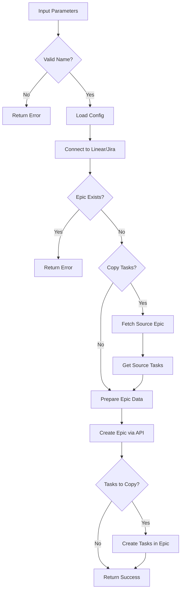

# Tool: create_epic

## Purpose
Create a new Epic (Project in Linear, Epic in Jira) for organizing related tasks, optionally copying tasks from existing epics.

## Business Value
- **Who uses this**: Developers organizing work into logical groups or features
- **What problem it solves**: Enables proper task organization and tracking in Linear/Jira
- **Why it's better than manual approach**: Automates epic creation with AI-generated metadata and task copying

## Functionality Specification

### Input Requirements

| Parameter | Type | Required | Default | Description |
|-----------|------|----------|---------|-------------|
| `name` | string | Yes | - | Name of the new Epic/Project |
| `description` | string | No | Auto-generated | Description for the epic |
| `copy_from` | string | No | - | ID of epic to copy tasks from |
| `team_id` | string | No | From config | Linear team ID (defaults to configured team) |
| `icon` | string | No | "📋" | Icon/emoji for the epic |
| `color` | string | No | Platform default | Color for epic visualization |
| `start_date` | string | No | - | Optional start date (ISO format) |
| `target_date` | string | No | - | Optional target/end date (ISO format) |

#### Validation Rules
1. Epic name must be unique within the team/project
2. Name length: 1-255 characters
3. Description length: max 10,000 characters
4. Valid ISO date format for dates
5. Team must exist and user must have permission

### Processing Logic

#### Step-by-Step Algorithm

```
1. VALIDATE_EPIC_NAME
   - Check name is provided
   - Validate length constraints
   - Check for special characters
   
2. LOAD_CONFIGURATION
   - Get Linear/Jira adapter configuration
   - Load team/workspace settings
   - Get authentication credentials
   
3. CHECK_EXISTING_EPIC
   - Query Linear/Jira for existing epics
   - Verify name uniqueness
   - Prevent duplicate creation
   
4. PREPARE_EPIC_DATA
   - Format name and description
   - Set dates if provided
   - Add icon and color
   - Set epic state (active/planned)
   
5. COPY_TASKS_IF_REQUESTED
   If copy_from provided:
   - Fetch source epic tasks from Linear/Jira
   - Prepare task data for copying
   - Map relationships and dependencies
   
6. CREATE_EPIC_VIA_API
   For Linear:
   - Call createProject API
   - Set team association
   - Configure project settings
   For Jira:
   - Call createEpic API
   - Set project association
   - Configure epic fields
   
7. COPY_TASKS_TO_NEW_EPIC
   If tasks to copy:
   - Create tasks in new epic
   - Preserve task hierarchy
   - Map dependencies
   
8. RETURN_CONFIRMATION
   - Return epic ID and details
   - Include task copy count
   - Provide direct link to epic
```

### Output Specification

#### Success Response
```javascript
{
  success: true,
  data: {
    id: "PRJ_abc123",  // Linear project ID or Jira epic key
    name: "Authentication System",
    description: "User authentication and authorization implementation",
    url: "https://linear.app/team/project/abc123",
    tasks_copied: 15,
    source_epic: "PRJ_xyz789",
    platform: "linear",
    message: "Successfully created epic \"Authentication System\""
  }
}
```

#### Success Response (With Task Copy)
```javascript
{
  success: true,
  data: {
    id: "PROJ-100",  // Jira epic key
    name: "Payment Integration",
    tasks_copied: 8,
    tasks_created: [
      { id: "PROJ-101", title: "Setup payment gateway" },
      { id: "PROJ-102", title: "Implement checkout flow" }
    ],
    platform: "jira",
    url: "https://company.atlassian.net/browse/PROJ-100",
    message: "Created epic with 8 tasks copied from PROJ-50"
  }
}
```

#### Error Response
```javascript
{
  success: false,
  error: {
    code: "EPIC_EXISTS",
    message: "Epic \"Authentication System\" already exists in this team",
    existing_id: "PRJ_abc123"
  }
}
```

#### Error Codes
- `MISSING_NAME`: Epic name not provided
- `EPIC_EXISTS`: Epic with same name already exists
- `INVALID_TEAM`: Team not found or no access
- `API_ERROR`: Linear/Jira API error
- `COPY_SOURCE_NOT_FOUND`: Source epic for copying doesn't exist
- `PERMISSION_DENIED`: No permission to create epics
- `RATE_LIMIT`: API rate limit exceeded

### Side Effects
1. **Creates new epic** in Linear/Jira
2. Copies tasks if specified (creates new tasks, not references)
3. Updates local configuration with epic ID
4. Triggers notifications in Linear/Jira
5. May affect team velocity/burndown charts

## Data Flow



## Implementation Details

### Linear API Integration
```python
# Using linear-api library
from linear import LinearClient

client = LinearClient(api_key=os.getenv("LINEAR_API_KEY"))

# Create project (epic)
project = client.projects.create(
    team_id=team_id,
    name=epic_name,
    description=description,
    icon=icon,
    color=color,
    state="started",
    start_date=start_date,
    target_date=target_date
)
```

### Jira API Integration
```python
# Using jira-python library
from jira import JIRA

jira = JIRA(server=server_url, basic_auth=(email, api_token))

# Create epic
epic_data = {
    'project': {'key': project_key},
    'summary': epic_name,
    'description': description,
    'issuetype': {'name': 'Epic'},
    'customfield_10011': epic_name,  # Epic name field
}
epic = jira.create_issue(fields=epic_data)
```

### Configuration Storage
```json
{
  "platform": "linear",
  "workspace_id": "abc123",
  "team_id": "team_xyz",
  "current_epic": "PRJ_abc123",
  "epics": {
    "PRJ_abc123": {
      "name": "Authentication System",
      "created": "2024-01-20T14:30:00Z"
    }
  }
}
```

## AI Integration Points
This tool **optionally uses AI** for:
- Generating epic descriptions from name if not provided
- Suggesting epic color/icon based on name
- No complex content generation

## Dependencies
- **Linear API Client**: `linear-api` Python library
- **Jira API Client**: `jira-python` library
- **Configuration Manager**: Load/save epic settings
- **Adapter Pattern**: Platform-agnostic interface
- **Authentication**: API key management

## Test Scenarios

### 1. Create Basic Epic
```python
# Test: Basic epic creation
Input: {
  name: "Authentication System"
}
Expected: Epic created with auto-generated description
```

### 2. Create Epic with Description
```python
# Test: Epic with custom description
Input: {
  name: "Payment Integration",
  description: "Stripe payment gateway integration"
}
Expected: Epic with provided description
```

### 3. Copy Tasks from Epic
```python
# Test: Copy tasks from existing epic
Setup: Epic "PRJ_abc123" has 10 tasks
Input: {
  name: "Payment V2",
  copy_from: "PRJ_abc123"
}
Expected: New epic with 10 copied tasks
```

### 4. Epic Already Exists
```python
# Test: Duplicate epic name
Setup: Epic "Authentication" exists
Input: {
  name: "Authentication"
}
Expected: Error - EPIC_EXISTS
```

### 5. Invalid Team
```python
# Test: Non-existent team
Input: {
  name: "New Epic",
  team_id: "invalid_team"
}
Expected: Error - INVALID_TEAM
```

### 6. With Dates
```python
# Test: Epic with timeline
Input: {
  name: "Q1 Features",
  start_date: "2024-01-01",
  target_date: "2024-03-31"
}
Expected: Epic with timeline set
```

### 7. API Error Handling
```python
# Test: API failure
Setup: Invalid API key
Input: {
  name: "Test Epic"
}
Expected: Error - API_ERROR
```

### 8. Copy Non-existent Epic
```python
# Test: Invalid source epic
Input: {
  name: "New Epic",
  copy_from: "invalid_id"
}
Expected: Error - COPY_SOURCE_NOT_FOUND
```

## Implementation Notes
- **Complexity**: Medium (API integration required)
- **Estimated Effort**: 3-4 hours for complete implementation
- **Critical Success Factors**:
  1. Proper API authentication
  2. Epic name uniqueness validation
  3. Task copying with relationship preservation
  4. Error handling for API failures
  5. Platform abstraction

## Performance Considerations
- API calls are rate-limited (Linear: 500/min, Jira: varies)
- Task copying is O(n) where n = number of tasks
- Batch operations for task creation
- Connection pooling for API clients
- Async operations for better performance

## Security Considerations
- API keys stored in environment variables
- No credentials in logs or responses
- Input validation for all parameters
- Rate limiting awareness
- Secure HTTPS connections only

## Implementation References
- Linear adapter: `alfred/adapters/linear.py`
- Jira adapter: `alfred/adapters/jira.py`
- MCP tool: `alfred/tools/epic_management.py`
- Configuration: `alfred/config/settings.py`
- Key classes:
  - `LinearAdapter`: Linear API integration
  - `JiraAdapter`: Jira API integration
  - `EpicManager`: Epic operations orchestration
  - `ConfigManager`: Settings and state management

---

*This documentation defines the create_epic tool for Alfred's Linear/Jira integration.*