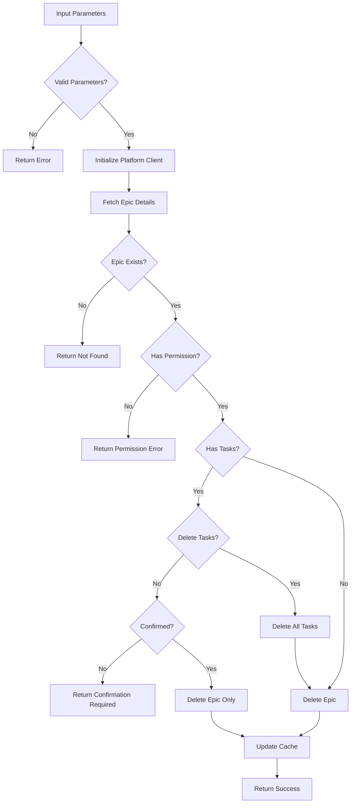

# Tool: delete_epic

## Purpose
Delete an existing Epic (Project in Linear, Epic in Jira) and optionally all its associated tasks from the platform.

## Business Value
- **Who uses this**: Developers cleaning up completed Epics or obsolete work streams
- **What problem it solves**: Removes unused Epics to maintain a clean workspace in Linear/Jira
- **Why it's better than manual approach**: Handles deletion through platform APIs with proper permission checks and cleanup

## Functionality Specification

### Input Requirements

| Parameter | Type | Required | Default | Description |
|-----------|------|----------|---------|-------------|
| `epic_id` | string | Yes | - | ID of the Epic/Project to delete |
| `delete_tasks` | boolean | No | false | Whether to delete all associated tasks |
| `confirm` | boolean | No | false | Skip confirmation prompts |
| `platform` | string | No | "linear" | Platform being used (linear/jira) |

#### Validation Rules
1. Epic ID must be valid and exist in the platform
2. User must have permission to delete the Epic
3. Confirmation required if Epic has tasks
4. Platform may have restrictions on Epic deletion

### Processing Logic

#### Step-by-Step Algorithm

```
1. VALIDATE_PARAMETERS
   - Check epic_id provided
   - Validate delete_tasks flag
   
2. GET_PLATFORM_CLIENT
   - Initialize Linear or Jira client
   - Authenticate with API token
   
3. FETCH_EPIC_DETAILS
   - Get Epic/Project details
   - Count associated tasks
   - Check if currently selected
   
4. CHECK_PERMISSIONS
   - Verify user can delete Epic
   - Check if tasks can be deleted
   - Return error if insufficient
   
5. CONFIRMATION_CHECK
   If not confirmed and has tasks:
   - Return task count warning
   - Require explicit confirmation
   
6. DELETE_TASKS (if delete_tasks=true)
   - Delete all associated tasks
   - Handle subtasks recursively
   - Track deletion count
   
7. DELETE_EPIC
   For Linear:
   - Call deleteProject mutation
   For Jira:
   - Call DELETE /rest/api/3/epic/{epicId}
   
8. UPDATE_LOCAL_CACHE
   - Remove Epic from cache
   - Clear current Epic if deleted
   
9. RETURN_CONFIRMATION
   - Return deletion details
   - Include task deletion count
```

### Output Specification

#### Success Response
```javascript
{
  success: true,
  data: {
    epic_id: "PRJ-123",
    epic_name: "Authentication Feature",
    deleted: true,
    tasks_deleted: 15,
    platform: "linear",
    message: "Successfully deleted Epic 'Authentication Feature' with 15 tasks"
  }
}
```

#### Success Response (Epic Only)
```javascript
{
  success: true,
  data: {
    epic_id: "PRJ-123",
    epic_name: "Authentication Feature",
    deleted: true,
    tasks_deleted: 0,
    tasks_preserved: 15,
    platform: "linear",
    message: "Successfully deleted Epic, tasks preserved"
  }
}
```

#### Error Response
```javascript
{
  success: false,
  error: {
    code: "PERMISSION_DENIED",
    message: "Insufficient permissions to delete Epic"
  }
}
```

#### Error Codes
- `MISSING_PARAMETERS`: Required parameters not provided
- `EPIC_NOT_FOUND`: Epic doesn't exist
- `PERMISSION_DENIED`: Insufficient permissions
- `HAS_TASKS`: Epic has tasks but delete_tasks=false
- `API_ERROR`: Platform API returned an error
- `NETWORK_ERROR`: Unable to reach platform API

### Side Effects
1. **Permanently deletes Epic** from Linear/Jira
2. **Optionally deletes all tasks** if requested
3. Platform maintains deletion audit trail
4. Webhooks may be triggered
5. Local cache updated

## Data Flow



## Implementation Details

### Platform Integration
- **Linear**: Uses GraphQL mutation to delete Project
- **Jira**: Uses REST API DELETE endpoint for Epic
- Task deletion handled by platform or explicitly via API
- Platform maintains referential integrity

### API Examples

#### Linear GraphQL
```graphql
mutation DeleteProject($id: String!) {
  projectDelete(id: $id) {
    success
  }
}

mutation DeleteIssue($id: String!) {
  issueDelete(id: $id) {
    success
  }
}
```

#### Jira REST
```javascript
// Delete Epic
DELETE /rest/api/3/epic/{epicId}

// Delete Issue
DELETE /rest/api/3/issue/{issueId}?deleteSubtasks=true
```

### Confirmation Logic
```javascript
if (taskCount > 0 && !confirm) {
  return {
    requiresConfirmation: true,
    taskCount: taskCount,
    message: "Epic has tasks. Set confirm=true to delete."
  };
}
```

## AI Integration Points
This tool **does not use AI**. It performs pure API operations:
- Direct platform API calls for deletion
- No content generation or analysis
- Simple data removal

## Dependencies
- **Platform Clients**: Linear API or Jira API client
- **Authentication**: API token management
- **Config Manager**: Current Epic tracking
- **Error Handler**: API error handling

## Test Scenarios

### 1. Delete Empty Epic
```javascript
// Test: Delete Epic with no tasks
Setup: Epic "PRJ-123" has 0 tasks
Input: {
  epic_id: "PRJ-123",
  confirm: true
}
Expected: Epic deleted, tasks_deleted: 0
```

### 2. Delete Epic with Tasks
```javascript
// Test: Delete Epic and all tasks
Setup: Epic "PRJ-123" has 15 tasks
Input: {
  epic_id: "PRJ-123",
  delete_tasks: true,
  confirm: true
}
Expected: Epic deleted, tasks_deleted: 15
```

### 3. Delete Epic Keep Tasks
```javascript
// Test: Delete Epic only
Setup: Epic "PRJ-123" has 15 tasks
Input: {
  epic_id: "PRJ-123",
  delete_tasks: false,
  confirm: true
}
Expected: Epic deleted, tasks_preserved: 15
```

### 4. No Confirmation
```javascript
// Test: Requires confirmation
Setup: Epic has tasks
Input: {
  epic_id: "PRJ-123",
  delete_tasks: true,
  confirm: false
}
Expected: Confirmation required message
```

### 5. Epic Not Found
```javascript
// Test: Non-existent Epic
Input: {
  epic_id: "PRJ-999",
  confirm: true
}
Expected: Error - EPIC_NOT_FOUND
```

### 6. Permission Denied
```javascript
// Test: No delete permission
Setup: User is viewer only
Input: {
  epic_id: "PRJ-123",
  confirm: true
}
Expected: Error - PERMISSION_DENIED
```

### 7. API Error
```javascript
// Test: API failure
Setup: API returns 500
Input: {
  epic_id: "PRJ-123",
  confirm: true
}
Expected: Error - API_ERROR
```

### 8. Large Epic Deletion
```javascript
// Test: Many tasks
Setup: Epic has 100+ tasks
Input: {
  epic_id: "PRJ-123",
  delete_tasks: true,
  confirm: true
}
Expected: All tasks deleted successfully
```

## Implementation Notes
- **Complexity**: Medium (multiple API calls for tasks)
- **Estimated Effort**: 3-4 hours for complete implementation
- **Critical Success Factors**:
  1. Permission validation
  2. Confirmation for destructive operations
  3. Proper task deletion if requested
  4. Error handling and rollback
  5. Cache cleanup

## Performance Considerations
- Multiple API calls if deleting tasks
- Batch deletion where platform supports
- Rate limiting consideration
- Async operations for efficiency
- Platform handles cascade deletion

## Security Considerations
- Permission checks before deletion
- Confirmation required for data loss
- API tokens stored securely
- Platform maintains audit trail
- No direct database access

## Python Implementation
- **Linear Client**: `linear-api` library
- **Jira Client**: `jira-python` library
- **Async Operations**: `asyncio` for batch deletions
- **Error Handling**: Proper rollback on failure
- **Confirmation**: Explicit flag required

---

*This documentation defines the delete_epic tool for Alfred's Epic management functionality using Linear/Jira APIs.*