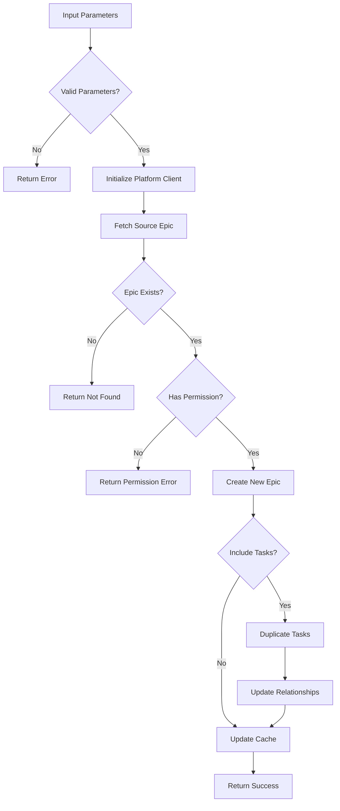

# Tool: duplicate_epic

## Purpose
Create a duplicate of an existing Epic (Project in Linear, Epic in Jira) with all its tasks, enabling parallel work streams or variations.

## Business Value
- **Who uses this**: Developers who need to create variations of existing Epics or branch work for different approaches
- **What problem it solves**: Allows duplicating Epics with all associated tasks for experimentation or parallel development
- **Why it's better than manual approach**: Handles the duplication through platform APIs, maintaining proper relationships and metadata

## Functionality Specification

### Input Requirements

| Parameter | Type | Required | Default | Description |
|-----------|------|----------|---------|-------------|
| `source_epic_id` | string | Yes | - | ID of the Epic/Project to duplicate |
| `new_name` | string | Yes | - | Name for the new Epic |
| `description` | string | No | Auto-generated | Optional description for the new Epic |
| `include_tasks` | boolean | No | true | Whether to duplicate all tasks |
| `platform` | string | No | "linear" | Platform being used (linear/jira) |

#### Validation Rules
1. Source Epic ID must be valid and exist
2. New name must meet platform naming requirements
3. User must have permissions to create Epics
4. New name should be unique within the team/project

### Processing Logic

#### Step-by-Step Algorithm

```
1. VALIDATE_PARAMETERS
   - Check epic_id and new_name provided
   - Validate new name format
   
2. GET_PLATFORM_CLIENT
   - Initialize Linear or Jira client
   - Authenticate with API token
   
3. FETCH_SOURCE_EPIC
   - Get Epic/Project details
   - Verify it exists and user has access
   
4. CHECK_PERMISSIONS
   - Verify user can create new Epics
   - Return error if insufficient permissions
   
5. CREATE_NEW_EPIC
   For Linear:
   - Call createProject mutation
   - Set name and description
   For Jira:
   - Call POST /rest/api/3/epic
   - Create new Epic
   
6. DUPLICATE_TASKS (if include_tasks=true)
   - Fetch all tasks from source Epic
   - For each task:
     - Create duplicate in new Epic
     - Maintain relationships
     - Copy descriptions/comments
   
7. UPDATE_RELATIONSHIPS
   - Recreate task dependencies
   - Link related tasks
   
8. UPDATE_LOCAL_CACHE
   - Add new Epic to cache
   - Track duplication metadata
   
9. RETURN_CONFIRMATION
   - Return source and target details
   - Include task count copied
```

### Output Specification

#### Success Response
```javascript
{
  success: true,
  data: {
    source_epic_id: "PRJ-123",
    new_epic_id: "PRJ-456",
    new_epic_name: "Authentication V2",
    tasks_copied: 15,
    platform: "linear",
    description: "Duplicate of PRJ-123 created on 1/20/2024",
    message: "Successfully duplicated Epic with 15 tasks"
  }
}
```

#### Success Response (Without Tasks)
```javascript
{
  success: true,
  data: {
    source_epic_id: "PRJ-123",
    new_epic_id: "PRJ-456",
    new_epic_name: "Authentication V2",
    tasks_copied: 0,
    platform: "linear",
    message: "Successfully created Epic without tasks"
  }
}
```

#### Error Response
```javascript
{
  success: false,
  error: {
    code: "EPIC_NOT_FOUND",
    message: "Source Epic PRJ-999 does not exist"
  }
}
```

#### Error Codes
- `MISSING_PARAMETERS`: Required parameters not provided
- `EPIC_NOT_FOUND`: Source Epic doesn't exist
- `PERMISSION_DENIED`: Insufficient permissions
- `INVALID_NAME`: New name doesn't meet requirements
- `API_ERROR`: Platform API returned an error
- `NETWORK_ERROR`: Unable to reach platform API

### Side Effects
1. **Creates new Epic** in Linear/Jira
2. **Duplicates all tasks** if requested
3. Platform maintains audit trail
4. Source Epic remains unchanged
5. Webhooks may be triggered

## Data Flow



## Implementation Details

### Platform Integration
- **Linear**: Uses GraphQL mutations for Project creation and Issue duplication
- **Jira**: Uses REST API for Epic creation and Issue cloning
- Platform handles all data consistency
- Task relationships preserved automatically

### API Examples

#### Linear GraphQL
```graphql
mutation CreateProject($input: ProjectCreateInput!) {
  projectCreate(input: $input) {
    project {
      id
      name
      description
    }
  }
}

mutation DuplicateIssue($id: String!, $projectId: String!) {
  issueCreate(input: {
    projectId: $projectId,
    title: $title,
    description: $description
  }) {
    issue {
      id
    }
  }
}
```

#### Jira REST
```javascript
// Create Epic
POST /rest/api/3/epic
{
  "name": "New Epic Name",
  "summary": "Epic Description"
}

// Clone Issue
POST /rest/api/3/issue/{issueId}/clone
{
  "epicId": "new-epic-id",
  "copySubtasks": true
}
```

## AI Integration Points
This tool **does not use AI**. It performs pure API operations:
- Direct platform API calls
- Task duplication through platform
- No content generation or analysis

## Dependencies
- **Platform Clients**: Linear API or Jira API client
- **Authentication**: API token management
- **Async Operations**: For bulk task duplication
- **Error Handler**: API error handling

## Test Scenarios

### 1. Basic Epic Duplication
```javascript
// Test: Duplicate with tasks
Input: {
  source_epic_id: "PRJ-123",
  new_name: "Authentication V2",
  include_tasks: true
}
Expected: Epic duplicated with all tasks
```

### 2. Duplicate Without Tasks
```javascript
// Test: Epic only, no tasks
Input: {
  source_epic_id: "PRJ-123",
  new_name: "Empty Template",
  include_tasks: false
}
Expected: Epic created without tasks
```

### 3. Source Epic Not Found
```javascript
// Test: Non-existent Epic
Input: {
  source_epic_id: "PRJ-999",
  new_name: "New Epic"
}
Expected: Error - EPIC_NOT_FOUND
```

### 4. Permission Denied
```javascript
// Test: No create permission
Setup: User is viewer only
Input: {
  source_epic_id: "PRJ-123",
  new_name: "New Epic"
}
Expected: Error - PERMISSION_DENIED
```

### 5. API Error Handling
```javascript
// Test: API failure
Setup: API returns 500
Input: {
  source_epic_id: "PRJ-123",
  new_name: "New Epic"
}
Expected: Error - API_ERROR
```

### 6. Large Epic Duplication
```javascript
// Test: Epic with many tasks
Setup: Source has 100+ tasks
Input: {
  source_epic_id: "PRJ-123",
  new_name: "Large Epic Copy",
  include_tasks: true
}
Expected: All tasks duplicated
```

### 7. Complex Relationships
```javascript
// Test: Tasks with dependencies
Setup: Tasks have blocking relationships
Input: {
  source_epic_id: "PRJ-123",
  new_name: "Complex Epic",
  include_tasks: true
}
Expected: Dependencies recreated
```

### 8. Partial Duplication
```javascript
// Test: Some tasks fail to copy
Setup: API fails on task 50 of 100
Input: {
  source_epic_id: "PRJ-123",
  new_name: "Partial Copy",
  include_tasks: true
}
Expected: Rollback or partial success handling
```

## Implementation Notes
- **Complexity**: Medium (multiple API calls for tasks)
- **Estimated Effort**: 4 hours for complete implementation
- **Critical Success Factors**:
  1. Efficient batch task duplication
  2. Relationship preservation
  3. Error handling and rollback
  4. Progress tracking for large Epics
  5. Permission validation

## Performance Considerations
- Multiple API calls for task duplication
- Batch operations where platform supports
- Async/parallel task creation
- Rate limiting consideration
- Progress tracking for large operations

## Security Considerations
- API tokens stored securely
- Permission validation before operations
- No direct database access
- Platform handles security
- Audit trail maintained by platform

## Python Implementation
- **Linear Client**: `linear-api` library with batch operations
- **Jira Client**: `jira-python` library with bulk operations
- **Async Operations**: `asyncio` for parallel task creation
- **Progress Tracking**: Report progress for large duplications
- **Transaction Management**: Rollback on failure

---

*This documentation defines the duplicate_epic tool for Alfred's Epic management functionality using Linear/Jira APIs.*