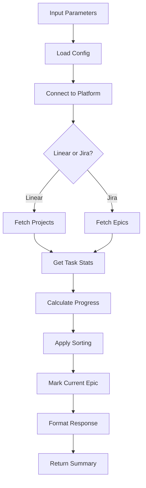

# Tool: list_epics

## Purpose
List all available epics (Projects in Linear, Epics in Jira) with task counts, completion status, and metadata from the platform.

## Business Value
- **Who uses this**: Developers managing multiple features or work streams
- **What problem it solves**: Provides overview of all epics and their progress
- **Why it's better than manual approach**: Automatically aggregates task statistics and progress metrics from Linear/Jira

## Functionality Specification

### Input Requirements

| Parameter | Type | Required | Default | Description |
|-----------|------|----------|---------|-------------|
| `team_id` | string | No | From config | Team ID to list epics for |
| `include_archived` | boolean | No | false | Include archived/completed epics |
| `include_stats` | boolean | No | true | Include task statistics |
| `sort_by` | string | No | "updated" | Sort order: updated, created, name, progress |

#### Validation Rules
1. Valid authentication to Linear/Jira
2. Team must exist and user has access
3. Platform connection must be active

### Processing Logic

#### Step-by-Step Algorithm

```
1. LOAD_CONFIGURATION
   - Get platform adapter (Linear/Jira)
   - Load team configuration
   - Get current epic from config
   
2. FETCH_EPICS_FROM_API
   For Linear:
   - Call projects.list(team_id)
   - Filter by state if needed
   For Jira:
   - Query epics in project
   - Filter by status
   
3. CALCULATE_STATISTICS
   For each epic (if include_stats):
   - Fetch issues/tasks count
   - Get completed count
   - Calculate progress percentage
   - Get task status breakdown
   
4. SORT_EPICS
   Based on sort_by parameter:
   - updated: Most recently updated
   - created: Newest first
   - name: Alphabetical
   - progress: Completion percentage
   
5. FORMAT_OUTPUT
   - Include epic ID and name
   - Add URLs to platform
   - Include statistics
   - Mark current epic
   
6. RETURN_SUMMARY
   - Return structured epic list
   - Include platform metadata
   - Provide summary totals
```

### Output Specification

#### Success Response
```javascript
{
  success: true,
  data: {
    platform: "linear",
    team: "Engineering",
    current_epic: "PRJ_abc123",
    epics: [
      {
        id: "PRJ_abc123",
        name: "Authentication System",
        description: "User auth implementation",
        is_current: true,
        url: "https://linear.app/team/project/abc123",
        state: "started",
        progress: 33.3,
        stats: {
          total_tasks: 15,
          completed_tasks: 5,
          in_progress: 3,
          todo: 7
        },
        created_at: "2024-01-15T10:00:00Z",
        updated_at: "2024-01-20T15:00:00Z"
      },
      {
        id: "PRJ_xyz789",
        name: "Payment Integration",
        description: "Stripe payment gateway",
        is_current: false,
        url: "https://linear.app/team/project/xyz789",
        state: "planned",
        progress: 0,
        stats: {
          total_tasks: 8,
          completed_tasks: 0,
          in_progress: 0,
          todo: 8
        },
        created_at: "2024-01-20T14:30:00Z",
        updated_at: "2024-01-20T14:30:00Z"
      }
    ],
    summary: {
      total_epics: 2,
      active_epics: 1,
      total_tasks: 23,
      completed_tasks: 5,
      overall_progress: 21.7
    },
    message: "Found 2 epic(s) in Engineering team"
  }
}
```

#### Error Response
```javascript
{
  success: false,
  error: {
    code: "API_ERROR",
    message: "Failed to fetch epics from Linear",
    details: "Invalid authentication token"
  }
}
```

#### Error Codes
- `API_ERROR`: Linear/Jira API error
- `AUTH_ERROR`: Authentication failed
- `TEAM_NOT_FOUND`: Team doesn't exist
- `PERMISSION_DENIED`: No access to team epics
- `RATE_LIMIT`: API rate limit exceeded

### Side Effects
1. **No data modifications** - read-only operation
2. API calls count toward rate limits
3. May cache results for performance
4. Updates last_accessed timestamp locally

## Data Flow



## Implementation Details

### Linear API Implementation
```python
async def list_linear_epics(team_id, include_archived=False):
    client = LinearClient(api_key)
    
    # Fetch projects for team
    projects = await client.projects.list(
        team_id=team_id,
        include_archived=include_archived
    )
    
    epics = []
    for project in projects:
        # Get issue statistics
        issues = await client.issues.list(project_id=project.id)
        
        stats = calculate_stats(issues)
        epics.append({
            'id': project.id,
            'name': project.name,
            'stats': stats,
            'progress': calculate_progress(stats)
        })
    
    return epics
```

### Jira API Implementation
```python
def list_jira_epics(project_key):
    jira = JIRA(server=server_url, basic_auth=auth)
    
    # JQL query for epics
    jql = f'project = {project_key} AND issuetype = Epic'
    if not include_archived:
        jql += ' AND status != Done'
    
    epics = jira.search_issues(jql, expand='subtasks')
    
    return format_jira_epics(epics)
```

### Progress Calculation
```python
def calculate_progress(stats):
    total = stats['total_tasks']
    if total == 0:
        return 0
    completed = stats['completed_tasks']
    return round((completed / total) * 100, 1)
```

## AI Integration Points
This tool **does not use AI**. It performs pure API operations:
- Direct API calls to Linear/Jira
- Statistical calculations
- Progress tracking
- No content generation or analysis

## Dependencies
- **Linear API Client**: `linear-api` Python library
- **Jira API Client**: `jira-python` library
- **Configuration Manager**: Current epic tracking
- **Adapter Pattern**: Platform-agnostic interface

## Test Scenarios

### 1. List All Epics
```python
# Test: Default listing
Input: {}
Expected: All active epics with statistics
```

### 2. Include Archived
```python
# Test: Include completed epics
Input: {
  include_archived: True
}
Expected: All epics including completed ones
```

### 3. Without Statistics
```python
# Test: Quick list without stats
Input: {
  include_stats: False
}
Expected: Epic list without task counts
```

### 4. Sort by Progress
```python
# Test: Sort by completion
Input: {
  sort_by: "progress"
}
Expected: Epics ordered by completion percentage
```

### 5. Empty Team
```python
# Test: Team with no epics
Setup: New team with no projects
Input: {
  team_id: "new_team"
}
Expected: Empty epic list
```

### 6. API Error
```python
# Test: API failure
Setup: Invalid API key
Input: {}
Expected: Error - API_ERROR
```

### 7. Rate Limiting
```python
# Test: Rate limit handling
Setup: Many rapid requests
Input: {}
Expected: Graceful rate limit handling
```

### 8. Current Epic Detection
```python
# Test: Mark current epic
Setup: Current epic set in config
Input: {}
Expected: Correct epic has is_current: true
```

## Implementation Notes
- **Complexity**: Low (API calls and aggregation)
- **Estimated Effort**: 2-3 hours for complete implementation
- **Critical Success Factors**:
  1. Proper API authentication
  2. Accurate statistics calculation
  3. Current epic tracking
  4. Error handling
  5. Platform abstraction

## Performance Considerations
- API rate limits (Linear: 500/min)
- Caching for repeated calls
- Batch API requests where possible
- Async operations for speed
- Pagination for large datasets

## Security Considerations
- API keys in environment variables
- No credentials in responses
- Read-only operation
- Secure HTTPS connections
- Rate limit awareness

## Implementation References
- Linear adapter: `alfred/adapters/linear.py`
- Jira adapter: `alfred/adapters/jira.py`
- MCP tool: `alfred/tools/epic_management.py`
- Key functions:
  - `list_epics()`: Main listing logic
  - `get_current_epic()`: Current epic detection
  - `calculate_stats()`: Statistics aggregation
  - `format_response()`: Response formatting

---

*This documentation defines the list_epics tool for Alfred's Linear/Jira integration.*