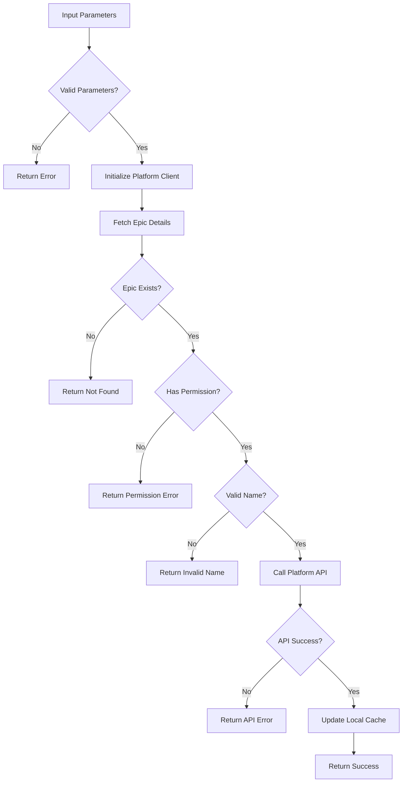

# Tool: rename_epic

## Purpose
Rename an existing Epic (Project in Linear, Epic in Jira) while preserving all its tasks and maintaining platform consistency.

## Business Value
- **Who uses this**: Developers who need to rename Epics to better reflect scope changes or align with project naming conventions
- **What problem it solves**: Allows Epic renaming without losing task associations or disrupting workflow
- **Why it's better than manual approach**: Handles the renaming through Linear/Jira APIs, maintaining all relationships and metadata

## Functionality Specification

### Input Requirements

| Parameter | Type | Required | Default | Description |
|-----------|------|----------|---------|-------------|
| `epic_id` | string | Yes | - | ID of the Epic/Project to rename |
| `new_name` | string | Yes | - | New name for the Epic |
| `platform` | string | No | "linear" | Platform being used (linear/jira) |

#### Validation Rules
1. Epic ID must be valid and exist in Linear/Jira
2. New name must meet platform naming requirements
3. User must have permissions to rename the Epic
4. New name should be unique within the team/project context

### Processing Logic

#### Step-by-Step Algorithm

```
1. VALIDATE_PARAMETERS
   - Check epic_id and new_name provided
   - Validate new name format
   
2. GET_PLATFORM_CLIENT
   - Initialize Linear or Jira client
   - Authenticate with API token
   
3. FETCH_EPIC_DETAILS
   - Get current Epic/Project details
   - Verify it exists and user has access
   
4. CHECK_PERMISSIONS
   - Verify user can rename this Epic
   - Return error if insufficient permissions
   
5. VALIDATE_NEW_NAME
   - Check name meets platform requirements
   - Ensure uniqueness if required
   
6. RENAME_EPIC
   For Linear:
   - Call updateProject mutation
   - Pass new name parameter
   For Jira:
   - Call PUT /rest/api/3/epic/{epicId}
   - Update name field
   
7. VERIFY_RENAME
   - Fetch Epic again to confirm
   - Check name was updated
   
8. UPDATE_LOCAL_CACHE
   - Update any local Epic references
   - Update config if this is current Epic
   
9. RETURN_CONFIRMATION
   - Return old and new names
   - Include Epic ID and platform
```

### Output Specification

#### Success Response
```javascript
{
  success: true,
  data: {
    epic_id: "PRJ-123",
    old_name: "Authentication Feature",
    new_name: "User Authentication System",
    platform: "linear",
    task_count: 15,
    message: "Successfully renamed Epic from 'Authentication Feature' to 'User Authentication System'"
  }
}
```

#### Error Response
```javascript
{
  success: false,
  error: {
    code: "EPIC_NOT_FOUND",
    message: "Epic with ID PRJ-123 not found"
  }
}
```

#### Error Codes
- `MISSING_PARAMETERS`: Required parameters not provided
- `EPIC_NOT_FOUND`: Epic doesn't exist in platform
- `PERMISSION_DENIED`: User lacks permission to rename
- `INVALID_NAME`: New name doesn't meet platform requirements
- `API_ERROR`: Platform API returned an error
- `NETWORK_ERROR`: Unable to reach platform API

### Side Effects
1. **Renames Epic** in Linear/Jira platform
2. **Updates local cache** if Epic is currently selected
3. All task associations are preserved automatically by platform
4. Platform handles audit trail and history
5. Webhooks may be triggered on the platform side

## Data Flow



## Implementation Details

### Platform Integration
- **Linear**: Uses GraphQL API with `updateProject` mutation
- **Jira**: Uses REST API v3 with PUT endpoint for Epic updates
- Epic rename is atomic operation handled by platform
- All task associations maintained automatically

### API Examples

#### Linear GraphQL
```graphql
mutation UpdateProject($id: String!, $input: ProjectUpdateInput!) {
  projectUpdate(id: $id, input: $input) {
    project {
      id
      name
      issues {
        totalCount
      }
    }
  }
}
```

#### Jira REST
```javascript
PUT /rest/api/3/epic/{epicId}
{
  "name": "New Epic Name",
  "summary": "New Epic Name"
}
```

### Local Cache Structure
```javascript
{
  "current_epic": {
    "id": "PRJ-123",
    "name": "User Authentication System",
    "platform": "linear",
    "last_sync": "2024-01-20T14:30:00Z"
  }
}
```

## AI Integration Points
This tool **does not use AI**. It performs pure API operations:
- Direct platform API calls
- No content generation or analysis
- Simple data updates

## Dependencies
- **Platform Clients**: Linear API or Jira API client
- **Authentication**: API token management
- **Config Manager**: Current Epic tracking
- **Error Handler**: API error handling

## Test Scenarios

### 1. Basic Epic Rename (Linear)
```javascript
// Test: Simple rename in Linear
Input: {
  epic_id: "PRJ-123",
  new_name: "Updated Authentication System",
  platform: "linear"
}
Expected: Epic renamed successfully
```

### 2. Basic Epic Rename (Jira)
```javascript
// Test: Simple rename in Jira
Input: {
  epic_id: "EPIC-456",
  new_name: "Updated Authentication Epic",
  platform: "jira"
}
Expected: Epic renamed successfully
```

### 3. Epic Not Found
```javascript
// Test: Non-existent Epic
Input: {
  epic_id: "PRJ-999",
  new_name: "New Name"
}
Expected: Error - EPIC_NOT_FOUND
```

### 4. Permission Denied
```javascript
// Test: No permission to rename
Setup: User is viewer only
Input: {
  epic_id: "PRJ-123",
  new_name: "New Name"
}
Expected: Error - PERMISSION_DENIED
```

### 5. Invalid Name
```javascript
// Test: Name too long for platform
Input: {
  epic_id: "PRJ-123",
  new_name: "A".repeat(500) // 500 characters
}
Expected: Error - INVALID_NAME
```

### 6. API Error Handling
```javascript
// Test: API returns error
Setup: API returns 500
Input: {
  epic_id: "PRJ-123",
  new_name: "New Name"
}
Expected: Error - API_ERROR
```

### 7. Network Error
```javascript
// Test: Network unavailable
Setup: Network disconnected
Input: {
  epic_id: "PRJ-123",
  new_name: "New Name"
}
Expected: Error - NETWORK_ERROR
```

### 8. Rename with Many Tasks
```javascript
// Test: Epic with 50+ tasks
Setup: Epic has 50 associated tasks
Input: {
  epic_id: "PRJ-123",
  new_name: "Large Epic Renamed"
}
Expected: All tasks remain associated
```

## Implementation Notes
- **Complexity**: Low (simple API call)
- **Estimated Effort**: 2 hours for complete implementation
- **Critical Success Factors**:
  1. Proper API authentication
  2. Error handling for API failures
  3. Permission validation
  4. Cache updates
  5. Platform-specific handling

## Performance Considerations
- Single API call for rename
- Platform handles all data consistency
- No bulk data transfer needed
- Response time depends on platform API
- Async operation with proper error handling

## Security Considerations
- API tokens stored securely in environment
- Permission checks before rename
- No direct database access
- Platform handles all security
- Rate limiting respected

## Python Implementation
- **Linear Client**: `linear-api` library
- **Jira Client**: `jira-python` library
- **Async Operations**: `asyncio` for API calls
- **Error Handling**: Custom exception classes
- **Config**: Environment variables for tokens

---

*This documentation defines the rename_epic tool for Alfred's Epic management functionality using Linear/Jira APIs.*