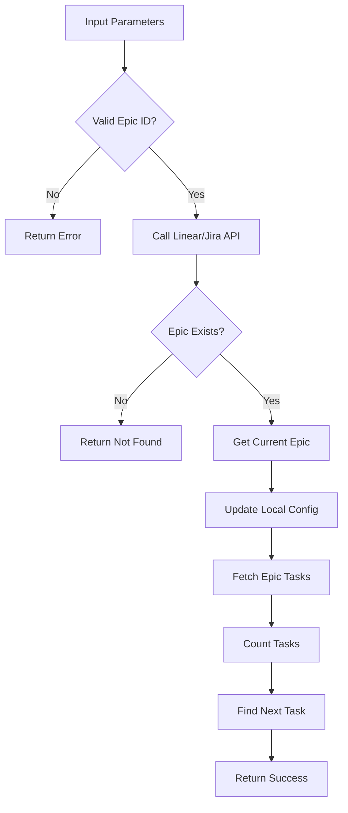

# Tool: switch_epic

## Purpose
Switch the current active epic (Project in Linear, Epic in Jira) context to work with a different set of tasks without losing progress in other epics.

## Business Value
- **Who uses this**: Developers switching between features, milestones, or different work contexts
- **What problem it solves**: Enables seamless context switching between parallel work streams in Linear/Jira
- **Why it's better than manual approach**: Maintains task state across epics and automatically identifies next available task

## Functionality Specification

### Input Requirements

| Parameter | Type | Required | Default | Description |
|-----------|------|----------|---------|-------------|
| `epic_id` | string | Yes | - | ID of the epic/project to switch to (Linear Project ID or Jira Epic key) |
| `projectRoot` | string | Yes | - | Absolute path to project directory |

#### Validation Rules
1. Epic ID must be provided and must be a string
2. Epic must exist in Linear/Jira
3. Updates current epic setting in local configuration
4. Loads tasks specific to the selected epic

### Processing Logic

#### Step-by-Step Algorithm

```
1. VALIDATE_EPIC_ID
   - Check epic ID provided
   - Verify is string type
   
2. FETCH_EPIC_DATA
   - Call Linear/Jira API to verify epic exists
   - Get epic details (name, status, task count)
   
3. VERIFY_EPIC_EXISTS
   - Check epic exists in platform
   - Return error if not found
   
4. GET_CURRENT_EPIC
   - Read from local config
   - Store previous epic ID
   
5. SWITCH_CURRENT_EPIC
   - Update .alfred/config.json
   - Set new current epic
   
6. FETCH_EPIC_TASKS
   - Query Linear/Jira for tasks in epic
   - Count available tasks
   
7. FIND_NEXT_TASK
   - Identify next available task
   - Consider status and blocking relationships
   
8. RETURN_SWITCH_DETAILS
   - Previous epic ID
   - New current epic
   - Task count and next task
```

### Output Specification

#### Success Response
```javascript
{
  success: true,
  data: {
    epicId: "LIN-PRJ-123",  // or "JIRA-456" for Jira
    epicName: "Authentication System",
    switched: true,
    previousEpicId: "LIN-PRJ-100",
    previousEpicName: "User Dashboard",
    taskCount: 15,
    completedCount: 5,
    nextTask: {
      id: "LIN-42",
      title: "Implement JWT authentication",
      status: "In Progress",
      assignee: "current_user"
    },
    message: "Successfully switched to epic \"Authentication System\""
  }
}
```

#### Success Response (No Tasks)
```javascript
{
  success: true,
  data: {
    epicId: "LIN-PRJ-789",
    epicName: "New Feature",
    switched: true,
    previousEpicId: "LIN-PRJ-123",
    previousEpicName: "Authentication System",
    taskCount: 0,
    completedCount: 0,
    nextTask: null,
    message: "Successfully switched to epic \"New Feature\" (no tasks yet)"
  }
}
```

#### Error Response
```javascript
{
  success: false,
  error: {
    code: "EPIC_NOT_FOUND",
    message: "Epic \"LIN-PRJ-999\" does not exist in Linear"
  }
}
```

#### Error Codes
- `MISSING_ARGUMENT`: Required parameters not provided
- `MISSING_PARAMETER`: Epic ID not provided
- `EPIC_NOT_FOUND`: Epic doesn't exist in Linear/Jira
- `API_ERROR`: Linear/Jira API call failed
- `SWITCH_EPIC_ERROR`: General error during epic switch

### Side Effects
1. **Updates current epic** in `.alfred/config.json`
2. All subsequent task operations use the new epic context
3. Does not modify task data in Linear/Jira
4. Previous epic remains unchanged
5. Session context updated locally

## Data Flow



## Implementation Details

### Data Storage
- **Local Config**: `.alfred/config.json` - Current epic setting
- **Remote Data**: All task data stays in Linear/Jira
- Epic ID stored as string in config
- Tasks fetched on-demand from API

### Current Epic Configuration
```javascript
// .alfred/config.json structure
{
  "platform": "linear",  // or "jira"
  "currentEpicId": "LIN-PRJ-123",
  "currentEpicName": "Authentication System",
  "teamId": "TEAM-456",
  "workspaceId": "WS-789",
  // other configuration...
}
```

### Next Task Algorithm
```javascript
async function findNextTask(epicId) {
  // For Linear
  const tasks = await linear.issues({
    filter: {
      project: { id: { eq: epicId } },
      state: { type: { in: ["unstarted", "started"] } }
    },
    orderBy: LinearDocument.IssueOrderBy.Priority
  });
  
  // Priority order:
  // 1. In-progress tasks assigned to user
  // 2. Unblocked tasks with high priority
  // 3. Any available unstarted tasks
  return tasks.nodes.find(task => 
    (task.state.type === 'started' && task.assignee?.id === userId) ||
    (task.state.type === 'unstarted' && !task.blockedByIssues?.length)
  );
}
```

### Platform-Specific Handling
```javascript
// Linear Projects
if (platform === 'linear') {
  const project = await linear.project(epicId);
  return {
    id: project.id,
    name: project.name,
    taskCount: project.issues.totalCount
  };
}

// Jira Epics
if (platform === 'jira') {
  const epic = await jira.getEpic(epicId);
  const issues = await jira.search(`parent = ${epicId}`);
  return {
    id: epic.key,
    name: epic.fields.summary,
    taskCount: issues.total
  };
}
```

## AI Integration Points
This tool **does not use AI**. It performs pure API operations:
- Configuration update
- Linear/Jira API calls
- Task loading and counting
- Next task identification
- No content generation or analysis

## Dependencies
- **Linear SDK**: `linear-api` package for Linear integration
- **Jira SDK**: `jira-python` for Jira integration
- **File System Access**: Read/write JSON config
- **Config Manager**: Current epic persistence
- **API Authentication**: Linear/Jira API tokens

## Test Scenarios

### 1. Switch to Existing Epic
```javascript
// Test: Basic epic switch in Linear
Setup: Current epic is "LIN-PRJ-100"
Input: {
  projectRoot: "/project",
  epic_id: "LIN-PRJ-123"
}
Expected: Switched to Authentication System epic
```

### 2. Switch with Tasks
```javascript
// Test: Switch to epic with tasks
Setup: Epic "LIN-PRJ-123" has 15 tasks
Input: {
  projectRoot: "/project",
  epic_id: "LIN-PRJ-123"
}
Expected: taskCount: 15, nextTask provided
```

### 3. Switch to Empty Epic
```javascript
// Test: Switch to epic with no tasks
Setup: Epic "LIN-PRJ-789" has 0 tasks
Input: {
  projectRoot: "/project",
  epic_id: "LIN-PRJ-789"
}
Expected: taskCount: 0, nextTask: null
```

### 4. Non-Existent Epic
```javascript
// Test: Epic doesn't exist
Input: {
  projectRoot: "/project",
  epic_id: "LIN-PRJ-999"
}
Expected: Error - EPIC_NOT_FOUND
```

### 5. Cross-Platform Switch
```javascript
// Test: Switch between Linear and Jira
Setup: Config has platform: "linear"
Input: {
  projectRoot: "/project",
  epic_id: "JIRA-123"  // Should fail
}
Expected: Error - Invalid epic format for Linear
```

## Implementation Notes
- **Complexity**: Medium (API integration required)
- **Estimated Effort**: 3-4 hours for complete implementation
- **Critical Success Factors**:
  1. API authentication handling
  2. Epic existence validation
  3. Current epic persistence
  4. Next task algorithm
  5. Platform abstraction

## Performance Considerations
- API call to verify epic (cached for session)
- Paginated task fetching for large epics
- Local config update is instant
- Consider rate limiting for API calls
- Cache epic metadata for quick switches

## Security Considerations
- API tokens stored securely in environment
- No sensitive data in local config
- Epic ID validation
- User permission checks via API
- No direct database access

---

*This documentation reflects the Alfred tool for switching between epics in Linear/Jira platforms.*