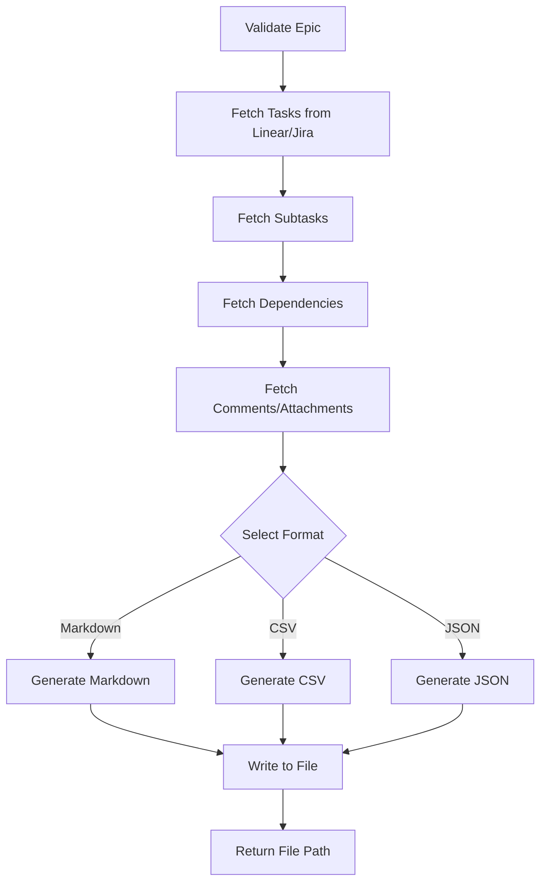

# Tool: export_tasks

## Purpose
Export tasks from Linear/Jira to various formats (markdown, CSV, JSON) for documentation, reporting, or offline viewing.

## Business Value
- **Who uses this**: Developers, project managers, and stakeholders needing task documentation
- **What problem it solves**: Creates exportable task documentation for sharing, reporting, and offline access
- **Why it's better than manual approach**: Automatically fetches and formats task data from Linear/Jira, maintains consistency, and supports multiple output formats

## Functionality Specification

### Input Requirements

| Parameter | Type | Required | Default | Description |
|-----------|------|----------|---------|-------------|
| `format` | string | No | "markdown" | Export format: 'markdown', 'csv', 'json' |
| `epic_id` | string | No | Current epic | Epic/Project ID to export tasks from |
| `output` | string | No | "./exports/tasks-{timestamp}.{format}" | Output file path |
| `include_subtasks` | boolean | No | true | Include subtasks in export |
| `status_filter` | string | No | None | Filter by status (e.g., 'in_progress', 'completed') |
| `include_comments` | boolean | No | false | Include task comments in export |
| `include_attachments` | boolean | No | false | Include attachment links |

#### Validation Rules
1. Epic ID must exist in Linear/Jira
2. Format must be one of: markdown, csv, json
3. Output directory will be created if it doesn't exist
4. Status filter must be valid Linear/Jira status

### Processing Logic

#### Step-by-Step Algorithm

```
1. VALIDATE_INPUTS
   - Verify epic exists via Linear/Jira API
   - Validate format parameter
   - Prepare output path with timestamp
   
2. FETCH_TASK_DATA
   - Query Linear/Jira API for epic's tasks
   - Apply status filter if provided
   - Fetch subtasks if include_subtasks is true
   - Fetch comments if include_comments is true
   - Get attachment metadata if needed
   
3. PROCESS_DEPENDENCIES
   - Fetch blocking/blocked relationships
   - Map dependency IDs to task titles
   - Build dependency graph
   
4. FORMAT_DATA
   IF format == "markdown":
      - Create hierarchical markdown structure
      - Add task links to Linear/Jira
      - Format dependencies as references
      - Include metadata header
   ELIF format == "csv":
      - Flatten task hierarchy
      - Create CSV columns for all fields
      - Convert subtasks to rows with parent references
   ELIF format == "json":
      - Preserve complete data structure
      - Include all custom fields
      - Add export metadata
   
5. WRITE_OUTPUT
   - Create output directory if needed
   - Write formatted data to file
   - Add export timestamp and source info
   
6. RETURN_RESULTS
   - Report file location
   - Include task count exported
   - Provide Linear/Jira links for reference
```

### AI Prompts Used

**This tool does not use AI** for the core export functionality. It:
- Fetches data from Linear/Jira APIs
- Transforms data into requested format
- Writes to output files
- No AI generation involved

### Output Specification

#### Success Response
```javascript
{
  success: true,
  data: {
    message: "Successfully exported 25 tasks to markdown",
    outputFile: "./exports/tasks-2024-01-20-143022.md",
    epic: {
      id: "ENG-123",
      title: "Authentication System",
      url: "https://linear.app/team/issue/ENG-123"
    },
    stats: {
      totalTasks: 25,
      subtasks: 45,
      completed: 15,
      inProgress: 8,
      pending: 2
    }
  }
}
```

#### Markdown Output Format
```markdown
# Tasks Export: Authentication System
**Epic**: ENG-123  
**Exported**: 2024-01-20 14:30:22  
**Source**: Linear  
**Total Tasks**: 25 (15 completed, 8 in progress, 2 pending)

## Tasks

### 1. Implement JWT Service
**ID**: ENG-124  
**Status**: In Progress  
**Priority**: High  
**Assignee**: John Doe  
**Link**: [View in Linear](https://linear.app/team/issue/ENG-124)

**Description**: Create JWT token generation and validation service

**Dependencies**:
- Blocks: ENG-125 (Database Setup)
- Blocked by: ENG-123 (Epic)

#### Subtasks:
1. **Generate tokens** (ENG-124-1) - Completed
2. **Validate tokens** (ENG-124-2) - In Progress
3. **Refresh logic** (ENG-124-3) - Pending
```

#### CSV Output Format
```csv
ID,Title,Description,Status,Priority,Assignee,Parent,Epic,Dependencies,Link
ENG-124,Implement JWT Service,Create JWT token service,In Progress,High,John Doe,,ENG-123,ENG-125,https://linear.app/...
ENG-124-1,Generate tokens,Token generation logic,Completed,High,John Doe,ENG-124,ENG-123,,https://linear.app/...
```

#### JSON Output Format
```json
{
  "export": {
    "timestamp": "2024-01-20T14:30:22Z",
    "source": "linear",
    "epic": {
      "id": "ENG-123",
      "title": "Authentication System"
    }
  },
  "tasks": [
    {
      "id": "ENG-124",
      "title": "Implement JWT Service",
      "description": "Create JWT token service",
      "status": "in_progress",
      "priority": 1,
      "assignee": {
        "id": "user-123",
        "name": "John Doe"
      },
      "dependencies": {
        "blocks": ["ENG-125"],
        "blockedBy": ["ENG-123"]
      },
      "subtasks": [...]
    }
  ]
}
```

#### Error Response
```javascript
{
  success: false,
  error: {
    code: "EPIC_NOT_FOUND",
    message: "Epic ENG-123 not found in Linear"
  }
}
```

#### Error Codes
- `EPIC_NOT_FOUND`: Epic doesn't exist
- `API_ERROR`: Linear/Jira API error
- `EXPORT_ERROR`: File writing error
- `PERMISSION_ERROR`: No access to epic

### Side Effects
1. **Creates export file** in specified location
2. **Makes API calls** to Linear/Jira
3. Creates output directory if needed
4. No modifications to Linear/Jira data

## Data Flow



## Implementation Details

### Linear API Integration
```python
# Fetch tasks from Linear
query = """
  query($epicId: String!) {
    issue(id: $epicId) {
      children {
        nodes {
          id
          title
          description
          state { name }
          priority
          assignee { name }
          children { nodes { ... } }
        }
      }
    }
  }
"""
```

### File Naming Convention
```python
# Default naming pattern
filename = f"tasks-{datetime.now().strftime('%Y%m%d-%H%M%S')}.{format}"

# Custom naming preserves extension
if output:
    filename = output if '.' in output else f"{output}.{format}"
```

### Status Filtering
```python
# Apply status filter during API query
if status_filter:
    tasks = [t for t in tasks if t.status == status_filter]
```

## Dependencies
- **Linear API Client**: For fetching task data
- **CSV Writer**: For CSV formatting
- **JSON Encoder**: For JSON output
- **File System**: Write access for exports

## Test Scenarios

### 1. Export All Tasks to Markdown
```javascript
Input: {
  epic_id: "ENG-123",
  format: "markdown"
}
Expected: Markdown file with all tasks and subtasks
```

### 2. Export Completed Tasks to CSV
```javascript
Input: {
  epic_id: "ENG-123",
  format: "csv",
  status_filter: "completed"
}
Expected: CSV with only completed tasks
```

### 3. Export Without Subtasks
```javascript
Input: {
  epic_id: "ENG-123",
  include_subtasks: false
}
Expected: Only parent tasks exported
```

### 4. Custom Output Path
```javascript
Input: {
  epic_id: "ENG-123",
  output: "./reports/sprint-tasks.md"
}
Expected: File created at specified path
```

### 5. Include Comments and Attachments
```javascript
Input: {
  epic_id: "ENG-123",
  include_comments: true,
  include_attachments: true
}
Expected: Export includes comment history and attachment links
```

## Implementation Notes
- **Complexity**: Medium (API integration and formatting)
- **Estimated Effort**: 4-5 hours for complete implementation
- **Critical Success Factors**:
  1. Proper API authentication
  2. Correct data transformation
  3. Multiple format support
  4. Error handling for API limits
  5. Preserving task relationships

## Performance Considerations
- API rate limits may affect large exports
- Consider pagination for epics with 100+ tasks
- Cache task data during export to minimize API calls
- Async/await for API calls
- Stream writing for large files

## Security Considerations
- API keys stored securely in environment variables
- No sensitive data in export metadata
- Validate file paths to prevent directory traversal
- Respect Linear/Jira permissions
- Sanitize task content for CSV format

## Related Commands
- get_tasks - View tasks before exporting
- list_epics - Find epic IDs to export
- export_to_markdown - Specialized markdown export for documentation
- assess_complexity - Export with complexity analysis

---

*This documentation defines the export_tasks tool for Alfred's Linear/Jira integration.*