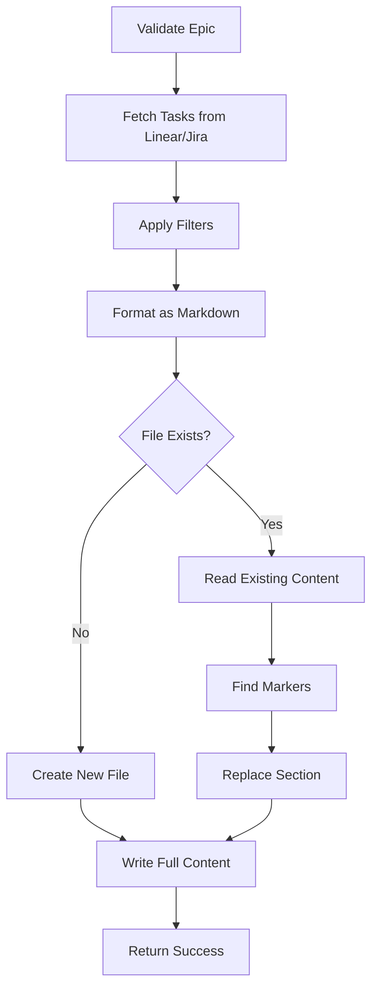

# Tool: export_to_markdown

## Purpose
Export tasks from Linear/Jira to a markdown file (README.md or custom file) for documentation, project visibility, and stakeholder communication.

## Business Value
- **Who uses this**: Development teams sharing project progress with stakeholders
- **What problem it solves**: Keeps documentation updated with current task status from Linear/Jira
- **Why it's better than manual approach**: Automated task export with live data, consistent formatting, and preserves existing documentation

## Functionality Specification

### Input Requirements

| Parameter | Type | Required | Default | Description |
|-----------|------|----------|---------|-------------|
| `epic_id` | string | No | Current epic | Epic/Project ID to export from |
| `output_file` | string | No | "./README.md" | Markdown file to update |
| `include_subtasks` | boolean | No | true | Include subtasks in output |
| `status_filter` | string | No | - | Filter by status (in_progress, completed, etc.) |
| `section_title` | string | No | "Task List" | Title for the tasks section |
| `preserve_content` | boolean | No | true | Preserve existing file content |
| `include_links` | boolean | No | true | Include Linear/Jira links |

#### Validation Rules
1. Epic must exist in Linear/Jira
2. Output file directory must be writable
3. Valid status values if filtering
4. Preserve existing content by default

### Processing Logic

#### Step-by-Step Algorithm

```
1. VALIDATE_INPUTS
   - Verify epic exists via API
   - Check output file permissions
   - Validate status filter if provided
   
2. FETCH_TASKS
   - Query Linear/Jira for epic's tasks
   - Apply status filter if specified
   - Fetch subtasks if included
   - Get task metadata (assignee, status, priority)
   
3. FORMAT_TASKS
   - Convert to markdown checklist format
   - Group by status or priority
   - Include task links if enabled
   - Format subtasks with indentation
   
4. PREPARE_CONTENT
   - Create section markers:
     * Start: <!-- ALFRED_TASKS_START -->
     * End: <!-- ALFRED_TASKS_END -->
   - Add metadata comment:
     * Export timestamp
     * Source epic
     * Filter applied
   
5. UPDATE_FILE
   IF preserve_content AND file exists:
   - Read existing content
   - Find existing Alfred markers
   - Replace content between markers
   - If no markers, append to end
   ELSE:
   - Create new file or overwrite
   
6. WRITE_FILE
   - Save updated markdown
   - Report statistics
   - Provide Linear/Jira epic link
```

### AI Prompts Used

**This tool does not use AI**. It performs:
- API data fetching from Linear/Jira
- Markdown formatting
- File I/O operations
- No AI generation involved

### Output Specification

#### Markdown Output Format
```markdown
<!-- ALFRED_TASKS_START -->
<!-- 
  Exported from Linear/Jira by Alfred
  Date: 2024-01-20 10:30:00 UTC
  Epic: ENG-123 - Authentication System
  Filter: status=in_progress
  Source: https://linear.app/team/issue/ENG-123
-->

## 📋 Task List

### 🚀 In Progress (3)

- [ ] **[ENG-124](https://linear.app/team/issue/ENG-124)** - Implement JWT service (@john.doe)
  - [x] Generate tokens
  - [ ] Validate tokens  
  - [ ] Refresh logic
- [ ] **[ENG-125](https://linear.app/team/issue/ENG-125)** - Create user model (@jane.smith)
- [ ] **[ENG-126](https://linear.app/team/issue/ENG-126)** - Setup database (@bob.wilson)

### ✅ Completed (5)

- [x] **[ENG-120](https://linear.app/team/issue/ENG-120)** - Project setup
- [x] **[ENG-121](https://linear.app/team/issue/ENG-121)** - Environment configuration
- [x] **[ENG-122](https://linear.app/team/issue/ENG-122)** - CI/CD pipeline
- [x] **[ENG-123](https://linear.app/team/issue/ENG-123)** - Docker setup
- [x] **[ENG-119](https://linear.app/team/issue/ENG-119)** - Repository structure

### 📝 Pending (2)

- [ ] **[ENG-127](https://linear.app/team/issue/ENG-127)** - Integration tests
- [ ] **[ENG-128](https://linear.app/team/issue/ENG-128)** - Documentation

---
*Last updated: 2024-01-20 | [View in Linear](https://linear.app/team/issue/ENG-123)*
<!-- ALFRED_TASKS_END -->
```

#### Success Response
```javascript
{
  success: true,
  data: {
    message: "Successfully exported 10 tasks to README.md",
    file: "./README.md",
    epic: {
      id: "ENG-123",
      title: "Authentication System",
      url: "https://linear.app/team/issue/ENG-123"
    },
    stats: {
      tasksExported: 10,
      subtasksExported: 15,
      sectionsCreated: 3
    },
    preserved: true
  }
}
```

#### Error Response
```javascript
{
  success: false,
  error: {
    code: "FILE_WRITE_ERROR",
    message: "Cannot write to README.md: Permission denied"
  }
}
```

#### Error Codes
- `EPIC_NOT_FOUND`: Epic doesn't exist
- `FILE_WRITE_ERROR`: Cannot write to output file
- `API_ERROR`: Linear/Jira API error
- `INVALID_FORMAT`: Markdown generation error

### Side Effects
1. **Creates or updates markdown file**
2. **Makes API calls** to Linear/Jira
3. Preserves existing content by default
4. Adds tracking markers to file

## Data Flow



## Implementation Details

### Markdown Formatting
```python
def format_task_as_markdown(task):
    checkbox = "[x]" if task.status == "completed" else "[ ]"
    link = f"[{task.id}]({task.url})" if include_links else task.id
    assignee = f"(@{task.assignee})" if task.assignee else ""
    
    return f"- {checkbox} **{link}** - {task.title} {assignee}"
```

### Status Grouping
```python
STATUS_GROUPS = {
    "in_progress": "🚀 In Progress",
    "completed": "✅ Completed",
    "pending": "📝 Pending",
    "blocked": "🚫 Blocked"
}
```

### Marker Detection
```python
def find_markers(content):
    start_pattern = r"<!-- ALFRED_TASKS_START -->"
    end_pattern = r"<!-- ALFRED_TASKS_END -->"
    
    start_pos = content.find(start_pattern)
    end_pos = content.find(end_pattern)
    
    if start_pos != -1 and end_pos != -1:
        return (start_pos, end_pos + len(end_pattern))
    return None
```

## Dependencies
- **Linear/Jira API Client**: For fetching tasks
- **Markdown Formatter**: For structured output
- **File System Access**: Read/write permissions

## Test Scenarios

### 1. Export to New File
```javascript
Input: {
  epic_id: "ENG-123",
  output_file: "./tasks.md"
}
Expected: New file created with all tasks
```

### 2. Update Existing README
```javascript
Input: {
  epic_id: "ENG-123",
  output_file: "./README.md",
  preserve_content: true
}
Expected: README updated, existing content preserved
```

### 3. Filter by Status
```javascript
Input: {
  epic_id: "ENG-123",
  status_filter: "in_progress"
}
Expected: Only in-progress tasks exported
```

### 4. Without Subtasks
```javascript
Input: {
  epic_id: "ENG-123",
  include_subtasks: false
}
Expected: Parent tasks only
```

### 5. Custom Section Title
```javascript
Input: {
  epic_id: "ENG-123",
  section_title: "Sprint 5 Tasks"
}
Expected: Custom heading in markdown
```

## Implementation Notes
- **Complexity**: Low-Medium
- **Estimated Effort**: 3-4 hours
- **Critical Success Factors**:
  1. Preserve existing documentation
  2. Clear markdown formatting
  3. Proper link generation
  4. Status grouping
  5. Marker-based updates

## Performance Considerations
- Cache API responses during export
- Batch fetch tasks and subtasks
- Stream write for large files
- Minimal memory footprint

## Security Considerations
- Validate file paths to prevent traversal
- Respect Linear/Jira permissions
- No sensitive data in markdown
- Preserve file permissions
- API keys in environment variables

## Related Commands
- export_tasks - Export to multiple formats
- get_tasks - View tasks before export
- list_epics - Find epics to export

---

*This documentation defines the export_to_markdown tool for Alfred's Linear/Jira integration.*