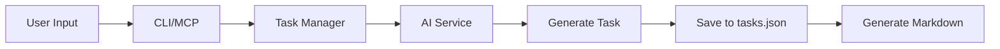
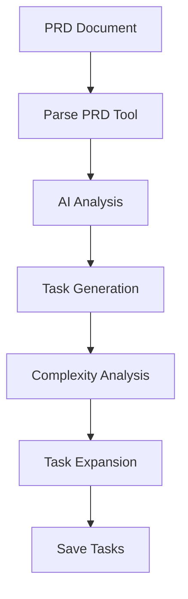
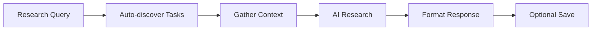

# Task Master AI - System Architecture

## Overview
Task Master AI is a comprehensive task management system designed for AI-assisted software development workflows. It provides both CLI and MCP (Model Context Protocol) interfaces for managing hierarchical tasks with AI-powered features.

## System Components

### 1. Core Architecture

```
task-master-ai/
├── CLI Layer (bin/task-master.js)
│   ├── Command Parser (Commander.js)
│   ├── UI Module (scripts/modules/ui.js)
│   └── Command Registry (scripts/modules/commands.js)
│
├── MCP Server Layer (mcp-server/)
│   ├── FastMCP Server (src/index.js)
│   ├── Tool Registry (src/tools/index.js)
│   └── Direct Functions (src/core/direct-functions/)
│
├── Business Logic Layer (scripts/modules/)
│   ├── Task Manager (task-manager.js)
│   ├── Dependency Manager (dependency-manager.js)
│   ├── Config Manager (config-manager.js)
│   ├── Prompt Manager (prompt-manager.js)
│   └── Tag Management (task-manager/tag-management.js)
│
├── AI Integration Layer
│   ├── Provider Registry (src/provider-registry/)
│   ├── AI Service (scripts/modules/ai-service.js)
│   └── Prompt Templates (src/prompts/*.json)
│
└── Data Layer (.taskmaster/)
    ├── tasks.json (Task database)
    ├── config.json (Configuration)
    ├── docs/ (Documentation)
    ├── templates/ (Templates)
    └── reports/ (Analysis reports)
```

## Key Design Patterns

### 1. **Dual Interface Pattern**
Every major functionality is exposed through both CLI and MCP interfaces:
- **CLI**: Direct command-line access via `task-master` command
- **MCP**: Tool protocol for AI agents via MCP server

### 2. **Tag-Based Multi-Context**
Tasks are organized by tags (like git branches):
```javascript
{
  "master": { tasks: [...] },     // Default tag
  "feature-auth": { tasks: [...] }, // Feature branch tag
  "bug-fix-123": { tasks: [...] }   // Bug fix tag
}
```

### 3. **Hierarchical Task Structure**
```
Task 1 (id: "1")
├── Subtask 1.1 (id: "1.1")
│   └── Sub-subtask 1.1.1 (id: "1.1.1")
└── Subtask 1.2 (id: "1.2")
```

### 4. **AI Provider Abstraction**
Multiple AI providers supported through unified interface:
- Anthropic (Claude)
- OpenAI (GPT)
- Google (Gemini)
- Perplexity (Research)
- And 10+ more providers

## Tool Categories & Workflows

### Group 1: Initialization & Setup (4 tools)
- **initialize_project**: Create .taskmaster structure
- **models**: Configure AI providers
- **rules**: Manage coding rules/profiles
- **parse_prd**: Generate tasks from PRD

### Group 2: Task Analysis & Expansion (5 tools)
- **analyze_project_complexity**: Analyze task complexity
- **expand_task**: Break task into subtasks
- **expand_all**: Expand all eligible tasks
- **scope_up**: Increase task scope
- **scope_down**: Decrease task scope

### Group 3: Task Listing & Viewing (4 tools)
- **get_tasks**: List all tasks
- **get_task**: Show task details
- **next_task**: Get next available task
- **complexity_report**: View complexity analysis

### Group 4: Task Status & Management (2 tools)
- **set_task_status**: Update task status
- **generate**: Generate markdown files

### Group 5: Task Creation & Modification (9 tools)
- **add_task**: Create new task
- **add_subtask**: Add subtask
- **update**: Bulk update tasks
- **update_task**: Update single task
- **update_subtask**: Update subtask
- **remove_task**: Delete task
- **remove_subtask**: Delete subtask
- **clear_subtasks**: Remove all subtasks
- **move_task**: Reorganize tasks

### Group 6: Dependency Management (4 tools)
- **add_dependency**: Create dependency
- **remove_dependency**: Remove dependency
- **validate_dependencies**: Check dependencies
- **fix_dependencies**: Repair issues

### Group 7: Configuration (1 tool)
- **response_language**: Set output language

### Group 8: Tag Management (6 tools)
- **list_tags**: Show all tags
- **add_tag**: Create new tag
- **delete_tag**: Remove tag
- **use_tag**: Switch active tag
- **rename_tag**: Rename tag
- **copy_tag**: Duplicate tag

### Group 9: Special Utilities (5 tools)
- **research**: AI-powered research
- **get_operation_status**: Check async operations (inactive)
- **help**: Show available commands (CLI-only)
- **migrate**: Migrate old structure (CLI-only)
- **sync_readme**: Export to README (CLI-only)

## Data Flow Examples

### 1. Task Creation Flow


### 2. PRD Parsing Flow


### 3. Research Flow


## AI Integration Architecture

### Prompt Template System
```javascript
{
  "id": "task-generation",
  "prompts": {
    "default": {
      "system": "You are a task planning assistant...",
      "user": "Generate tasks for: {{description}}"
    },
    "detailed": {
      "condition": "detailLevel === 'high'",
      "system": "You are an expert task planner...",
      "user": "Create detailed tasks: {{description}}"
    }
  }
}
```

### Provider Registry
- **Main Model**: Primary task operations
- **Research Model**: Online research (Perplexity)
- **Fallback Model**: Backup when primary fails

## State Management

### Task States
- `pending`: Ready to work
- `in-progress`: Currently active
- `done`: Completed
- `blocked`: Waiting on dependencies
- `deferred`: Postponed
- `cancelled`: No longer needed

### Tag States
- **Active Tag**: Current working context
- **Master Tag**: Default/main context
- **Feature Tags**: Parallel work contexts

## File System Structure

### Project Layout
```
project/
├── .taskmaster/
│   ├── tasks/
│   │   ├── tasks.json       # Main task database
│   │   ├── task-1.md        # Generated task files
│   │   └── task-2.md
│   ├── config.json          # AI configuration
│   ├── docs/               # Documentation
│   │   └── prd.txt         # Product requirements
│   ├── templates/          # Template files
│   │   └── example_prd.txt
│   └── reports/           # Analysis reports
│       └── task-complexity-report.json
├── .env                   # API keys
└── README.md             # With synced tasks
```

## Security Considerations

### API Key Management
- Environment variables for API keys
- Never stored in config files
- Validated before operations

### File Operations
- Path validation for all file operations
- Sandbox to project directory
- No execution of user content

### MCP Security
- Session-based authentication
- Tool permission system
- Rate limiting support

## Performance Optimization

### Caching Strategy
- Prompt template caching
- Task lookup optimization
- AI response caching (15 min)

### Batch Operations
- Bulk task updates
- Parallel task expansion
- Efficient dependency validation

## Error Handling

### Error Categories
1. **Configuration Errors**: Missing API keys, invalid config
2. **Task Errors**: Invalid IDs, circular dependencies
3. **AI Errors**: API failures, rate limits
4. **File System Errors**: Permission issues, missing files

### Recovery Strategies
- Automatic fallback to backup AI models
- Graceful degradation for missing features
- Transaction-like operations with rollback

## Extension Points

### Custom Providers
```javascript
// Add new AI provider
ProviderRegistry.registerProvider({
  name: 'custom-ai',
  generateText: async (prompt) => {...}
});
```

### Custom Tools
```javascript
// Register MCP tool
server.addTool({
  name: 'custom_tool',
  description: 'Custom functionality',
  execute: async (args) => {...}
});
```

### Custom Prompts
Place new prompt templates in `src/prompts/`:
```json
{
  "id": "custom-prompt",
  "prompts": {
    "default": {
      "system": "...",
      "user": "..."
    }
  }
}
```

## Deployment Architecture

### CLI Installation
```bash
npm install -g task-master-ai
```

### MCP Server Setup
```json
{
  "mcpServers": {
    "task-master-ai": {
      "command": "npx",
      "args": ["task-master-ai"],
      "env": { "ANTHROPIC_API_KEY": "..." }
    }
  }
}
```

## Monitoring & Telemetry

### Metrics Tracked
- Task creation/completion rates
- AI token usage
- Command frequency
- Error rates

### Logging Levels
- `debug`: Detailed execution flow
- `info`: Normal operations
- `warn`: Potential issues
- `error`: Operation failures

## Future Architecture Considerations

### Planned Enhancements
1. **AsyncOperationManager**: Background task processing
2. **WebSocket Support**: Real-time updates
3. **Plugin System**: Third-party extensions
4. **Cloud Sync**: Multi-device support
5. **Team Collaboration**: Shared task contexts

### Scalability Path
- Database backend option (SQLite/PostgreSQL)
- Distributed task processing
- Webhook integrations
- REST API layer

---

*This architecture document provides a comprehensive overview of Task Master AI's system design, components, and operational patterns.*