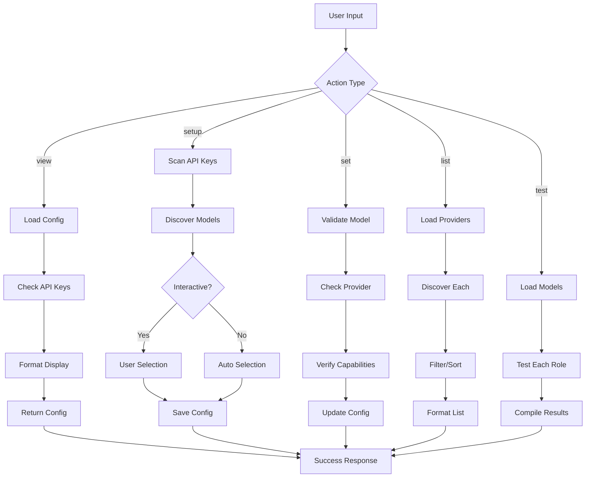

# Tool: models

## Purpose
Configure and manage AI models for different roles (main, research, fallback) in Task Master, including provider setup, API key validation, and model discovery.

## Business Value
- **Who uses this**: Developers and teams configuring AI capabilities for task management
- **What problem it solves**: Eliminates manual AI configuration, ensures optimal model selection for different tasks, and manages fallback strategies when primary models fail
- **Why it's better than manual approach**: Automated model discovery, cost optimization, intelligent role assignment, and seamless provider switching without code changes

## Functionality Specification

### Input Requirements

| Parameter | Type | Required | Default | Description |
|-----------|------|----------|---------|-------------|
| `projectRoot` | string | Yes | - | Absolute path to the project directory |
| `action` | string | No | "view" | Action to perform: "view", "setup", "set", "list", "test" |
| `role` | string | No* | - | Model role: "main", "research", "fallback" (*required for "set" action) |
| `modelId` | string | No* | - | Model identifier (*required for "set" action) |
| `provider` | string | No | - | Provider name for filtering in "list" action |
| `interactive` | boolean | No | false | Enable interactive setup mode |
| `testPrompt` | string | No | "Hello" | Test prompt for model validation |

#### Validation Rules
1. `projectRoot` must contain `.taskmaster/config.json`
2. `action` must be one of: "view", "setup", "set", "list", "test"
3. `role` must be one of: "main", "research", "fallback" (when required)
4. `modelId` must be in format: `provider/model-name` or valid model identifier
5. API keys must be set for the selected provider (checked via environment variables)

#### Action Descriptions
- **view**: Display current model configuration
- **setup**: Interactive wizard to configure all roles
- **set**: Set a specific model for a role
- **list**: List all available models from configured providers
- **test**: Test model configuration with a sample prompt

### Processing Logic

#### Step-by-Step Algorithm

```
1. LOAD_CONFIGURATION
   - Read .taskmaster/config.json
   - Parse activeModels section
   - Load provider configurations
   - Get environment variables for API keys
   
2. DETERMINE_ACTION
   
   IF action == "view":
      EXECUTE_VIEW_ACTION()
   ELSE IF action == "setup":
      EXECUTE_SETUP_ACTION()
   ELSE IF action == "set":
      EXECUTE_SET_ACTION()
   ELSE IF action == "list":
      EXECUTE_LIST_ACTION()
   ELSE IF action == "test":
      EXECUTE_TEST_ACTION()
      
3. EXECUTE_VIEW_ACTION:
   - Load current model configuration
   - For each role (main, research, fallback):
     - Get assigned model
     - Get provider details
     - Check API key status
     - Calculate estimated costs
   - Format and return configuration summary
   
4. EXECUTE_SETUP_ACTION:
   4.1 Check API Keys:
       - Scan environment for provider API keys:
         * ANTHROPIC_API_KEY
         * OPENAI_API_KEY
         * GOOGLE_API_KEY
         * PERPLEXITY_API_KEY
         * GROQ_API_KEY
         * MISTRAL_API_KEY
         * XAI_API_KEY
         * OPENROUTER_API_KEY
         * OLLAMA_API_KEY (or OLLAMA_BASE_URL)
         * AWS credentials (for Bedrock)
         * AZURE_OPENAI_API_KEY
       - Build list of available providers
       
   4.2 Discover Available Models:
       FOR each available provider:
         - Call provider-specific discovery method:
           * OpenRouter: GET https://openrouter.ai/api/v1/models
           * Ollama: GET http://localhost:11434/api/tags
           * OpenAI: GET https://api.openai.com/v1/models
           * Anthropic: Use hardcoded list (no API endpoint)
           * Others: Use predefined model lists
         - Parse and normalize model information
         
   4.3 Interactive Role Assignment:
       IF interactive:
         FOR each role in [main, research, fallback]:
           - Display role description:
             * main: "Primary model for task operations"
             * research: "Model with web search for research tasks"
             * fallback: "Backup model when primary fails"
           - Show available models with capabilities
           - Let user select model
           - Validate selection
       ELSE:
         - Auto-assign based on capabilities and cost:
           * main: Best general-purpose model
           * research: Model with search capability (prefer Perplexity)
           * fallback: Cheapest reliable model
           
   4.4 Save Configuration:
       - Update config.json with selected models
       - Store provider details
       - Save cost estimates
       
5. EXECUTE_SET_ACTION:
   5.1 Validate Model:
       - Parse modelId to extract provider and model
       - Check if provider is available
       - Verify API key for provider
       - Validate model exists in provider
       
   5.2 Check Capabilities:
       - For research role: Verify model supports web search
       - For main role: Verify sufficient context window
       - For fallback: Verify it's different from main
       
   5.3 Update Configuration:
       - Load current config
       - Update specific role
       - Maintain other roles unchanged
       - Save to config.json
       
6. EXECUTE_LIST_ACTION:
   6.1 Build Model Catalog:
       providers = []
       
       FOR each configured provider:
         models = DISCOVER_PROVIDER_MODELS(provider)
         FOR each model:
           - Get model specifications:
             * Context window size
             * Max output tokens
             * Cost per million tokens (input/output)
             * Capabilities (vision, function calling, web search)
             * Speed rating
           - Add to catalog with provider prefix
           
   6.2 Filter and Sort:
       IF provider specified:
         - Filter to only that provider's models
       
       Sort by:
         1. Provider tier (Anthropic, OpenAI, Google, etc.)
         2. Model capability score
         3. Cost (ascending)
         
   6.3 Format Output:
       - Group by provider
       - Show model details in table format
       - Include cost estimates
       - Mark models with special capabilities
       
7. EXECUTE_TEST_ACTION:
   7.1 Load Model Configuration:
       - Get models for all roles
       - Prepare test prompts
       
   7.2 Test Each Model:
       FOR each role:
         model = GET_MODEL_FOR_ROLE(role)
         
         TRY:
           - Create provider client
           - Send test prompt
           - Measure response time
           - Count tokens used
           - Calculate cost
         CATCH error:
           - Record failure reason
           - Note if this is an API key issue
           
   7.3 Compile Results:
       - Success/failure for each role
       - Response times
       - Token usage
       - Estimated costs
       - Error messages if any
       
8. PROVIDER_SPECIFIC_DISCOVERY:

   8.1 OpenRouter Discovery:
       response = HTTP_GET("https://openrouter.ai/api/v1/models")
       models = []
       FOR each model in response.data:
         models.push({
           id: model.id,
           name: model.name,
           contextLength: model.context_length,
           pricing: model.pricing,
           capabilities: model.capabilities
         })
       
   8.2 Ollama Discovery:
       baseUrl = ENV.OLLAMA_BASE_URL || "http://localhost:11434"
       response = HTTP_GET(`${baseUrl}/api/tags`)
       models = []
       FOR each model in response.models:
         models.push({
           id: `ollama/${model.name}`,
           name: model.name,
           contextLength: model.details.parameter_size,
           pricing: { input: 0, output: 0 }, // Local models are free
           capabilities: ['local']
         })
       
   8.3 Static Provider Lists:
       anthropic_models = [
         "claude-3-opus-20240229",
         "claude-3-sonnet-20240229",
         "claude-3-haiku-20240307",
         "claude-3-5-sonnet-20241022"
       ]
       
       openai_models = [
         "gpt-4-turbo-preview",
         "gpt-4",
         "gpt-3.5-turbo",
         "o1-preview",
         "o1-mini"
       ]
       
9. COST_CALCULATION:
   FOR each model:
     - Get base pricing (per million tokens)
     - Estimate typical usage:
       * Task creation: ~2000 input, ~500 output tokens
       * Task expansion: ~1500 input, ~1000 output tokens
       * Research: ~3000 input, ~2000 output tokens
     - Calculate monthly cost estimate based on usage patterns
     
10. RETURN_RESULT
```

### Output Specification

#### Success Response - View Action
```javascript
{
  success: true,
  action: "view",
  data: {
    activeModels: {
      main: {
        modelId: "anthropic/claude-3-sonnet",
        provider: "anthropic",
        contextWindow: 200000,
        costPerMillion: { input: 3.00, output: 15.00 },
        apiKeySet: true,
        capabilities: ["general", "coding", "analysis"]
      },
      research: {
        modelId: "perplexity/sonar-large",
        provider: "perplexity",
        contextWindow: 128000,
        costPerMillion: { input: 1.00, output: 1.00 },
        apiKeySet: true,
        capabilities: ["research", "web-search", "citations"]
      },
      fallback: {
        modelId: "openai/gpt-3.5-turbo",
        provider: "openai",
        contextWindow: 16385,
        costPerMillion: { input: 0.50, output: 1.50 },
        apiKeySet: true,
        capabilities: ["general", "fast"]
      }
    },
    estimatedMonthlyCost: {
      currency: "USD",
      main: 45.00,
      research: 15.00,
      fallback: 5.00,
      total: 65.00
    },
    warnings: []
  }
}
```

#### Success Response - List Action
```javascript
{
  success: true,
  action: "list",
  data: {
    providers: {
      anthropic: {
        available: true,
        models: [
          {
            id: "claude-3-opus-20240229",
            name: "Claude 3 Opus",
            contextWindow: 200000,
            maxOutput: 4096,
            costPerMillion: { input: 15.00, output: 75.00 },
            capabilities: ["general", "coding", "vision", "analysis"],
            speed: "slow",
            intelligence: "highest"
          },
          // ... more models
        ]
      },
      openai: {
        available: true,
        models: [
          {
            id: "gpt-4-turbo-preview",
            name: "GPT-4 Turbo",
            contextWindow: 128000,
            maxOutput: 4096,
            costPerMillion: { input: 10.00, output: 30.00 },
            capabilities: ["general", "coding", "vision", "function-calling"],
            speed: "medium",
            intelligence: "high"
          },
          // ... more models
        ]
      },
      // ... more providers
    },
    totalModels: 47,
    recommendedConfiguration: {
      main: "anthropic/claude-3-sonnet",
      research: "perplexity/sonar-large",
      fallback: "groq/mixtral-8x7b"
    }
  }
}
```

#### Error Response
```javascript
{
  success: false,
  error: {
    code: "NO_API_KEYS",
    message: "No AI provider API keys found",
    details: "Please set at least one provider API key in environment variables",
    suggestion: "Set ANTHROPIC_API_KEY, OPENAI_API_KEY, or another provider key"
  }
}
```

#### Error Codes
- `CONFIG_NOT_FOUND`: Task Master not initialized
- `NO_API_KEYS`: No provider API keys configured
- `INVALID_MODEL`: Specified model doesn't exist
- `PROVIDER_UNAVAILABLE`: Provider API key not set
- `CAPABILITY_MISMATCH`: Model doesn't support required capability
- `API_ERROR`: Failed to connect to provider API
- `TEST_FAILED`: Model test failed

### Side Effects
1. Modifies `.taskmaster/config.json` (for set/setup actions)
2. Makes network requests to provider APIs (for discovery)
3. Creates API connections for testing
4. Updates environment variable cache

## Data Flow



## Implementation Details

### Configuration Storage
- **Location**: `.taskmaster/config.json`
- **Structure**: `activeModels` object with main, research, fallback roles
- **Provider Details**: Stored in `providers` section
- **Settings**: Default values and preferences

### Model Discovery Implementation
```javascript
// OpenRouter API discovery
async function discoverOpenRouterModels() {
  const response = await fetch("https://openrouter.ai/api/v1/models");
  const data = await response.json();
  return data.data.map(model => ({
    id: model.id,
    name: model.name,
    contextLength: model.context_length,
    pricing: model.pricing
  }));
}

// Ollama local model discovery
async function discoverOllamaModels() {
  const baseUrl = process.env.OLLAMA_BASE_URL || "http://localhost:11434";
  const response = await fetch(`${baseUrl}/api/tags`);
  const data = await response.json();
  return data.models.map(model => ({
    id: `ollama/${model.name}`,
    name: model.name,
    contextLength: 4096, // Default
    pricing: { input: 0, output: 0 }
  }));
}
```

## AI Integration Points

### Model Discovery
- **OpenRouter API**: Real-time model listing
- **Ollama API**: Local model discovery
- **Static Lists**: Hardcoded for providers without discovery APIs

### Capability Detection
```javascript
// Research capability detection
hasResearchCapability(model) {
  return model.provider === 'perplexity' || 
         model.capabilities.includes('web-search') ||
         model.id.includes('online');
}

// Context window validation
hasAdequateContext(model, role) {
  const minContext = {
    main: 32000,      // Minimum for main operations
    research: 64000,  // Larger for research context
    fallback: 8000    // Can be smaller for fallback
  };
  return model.contextWindow >= minContext[role];
}
```

### Cost Optimization
```javascript
// Model scoring algorithm
scoreModel(model, role) {
  let score = 0;
  
  // Base scores by intelligence
  const intelligenceScores = {
    highest: 100,
    high: 80,
    medium: 60,
    low: 40
  };
  score += intelligenceScores[model.intelligence] || 50;
  
  // Adjust for cost (inverse relationship)
  const costFactor = 1 / (model.costPerMillion.input + model.costPerMillion.output);
  score += costFactor * 20;
  
  // Role-specific adjustments
  if (role === 'research' && model.capabilities.includes('web-search')) {
    score += 50;
  }
  if (role === 'fallback') {
    score += costFactor * 30; // Prioritize cost for fallback
  }
  
  return score;
}
```

## Dependencies
- **Network Access**: For provider API discovery
- **Environment Variables**: For API key detection
- **File System**: Read/write config.json
- **HTTP Client**: For API requests
- **Other Tools**: Used by all AI-powered tools

## Test Scenarios

### 1. Happy Path - Interactive Setup
```javascript
// Test: Complete interactive setup with all providers
Setup: Set multiple API keys in environment
Input: {
  projectRoot: "/project",
  action: "setup",
  interactive: true
}
Interaction: Select models for each role
Expected: Success with all roles configured
```

### 2. No API Keys Available
```javascript
// Test: Attempt setup with no API keys
Setup: Clear all provider API keys
Input: {
  projectRoot: "/project",
  action: "setup"
}
Expected: Error with code "NO_API_KEYS"
```

### 3. Set Invalid Model
```javascript
// Test: Try to set non-existent model
Input: {
  projectRoot: "/project",
  action: "set",
  role: "main",
  modelId: "invalid/model-xyz"
}
Expected: Error with code "INVALID_MODEL"
```

### 4. Research Role Validation
```javascript
// Test: Set non-research model to research role
Input: {
  projectRoot: "/project",
  action: "set",
  role: "research",
  modelId: "openai/gpt-4"  // No web search capability
}
Expected: Warning about missing research capability
```

### 5. Provider Discovery
```javascript
// Test: List models from specific provider
Input: {
  projectRoot: "/project",
  action: "list",
  provider: "anthropic"
}
Expected: List of Anthropic models only
```

### 6. Model Testing
```javascript
// Test: Test all configured models
Setup: Configure models for all roles
Input: {
  projectRoot: "/project",
  action: "test",
  testPrompt: "What is 2+2?"
}
Expected: Test results for all three roles
```

### 7. Cost Calculation
```javascript
// Test: View with cost estimates
Setup: Configure expensive models
Input: {
  projectRoot: "/project",
  action: "view"
}
Expected: Accurate monthly cost estimates
```

### 8. Auto-Configuration
```javascript
// Test: Non-interactive setup with auto-selection
Setup: Set ANTHROPIC_API_KEY and PERPLEXITY_API_KEY
Input: {
  projectRoot: "/project",
  action: "setup",
  interactive: false
}
Expected: Automatic optimal model selection
```

## Implementation Notes

### Complexity: Medium
- Multiple external API integrations
- Complex decision logic for model selection
- Cost calculation algorithms

### Estimated Effort: 8-10 hours
- 2 hours: Core configuration management
- 3 hours: Provider discovery implementations
- 2 hours: Interactive setup flow
- 2 hours: Testing and cost calculations
- 1 hour: Error handling and validation

### Critical Success Factors
1. **Robust API Discovery**: Handle provider API failures gracefully
2. **Smart Defaults**: Auto-configuration should make intelligent choices
3. **Clear Cost Communication**: Users must understand pricing implications
4. **Capability Matching**: Ensure models match role requirements
5. **Provider Abstraction**: Easy to add new providers

## Performance Considerations
- Cache discovered models for session (5-minute TTL)
- Parallel provider discovery requests
- Lazy load provider clients only when needed
- Store provider responses to minimize API calls

## Security Considerations
- Never store API keys in config.json
- Validate API keys without exposing them
- Use environment variables exclusively
- Mask keys in output (show only last 4 characters)
- Implement rate limiting for discovery requests

## Code References
- Current implementation: `scripts/modules/task-manager/models.js`
- MCP tool: `mcp-server/src/tools/models.js`
- Config manager: `scripts/modules/config-manager.js`
- AI services: `scripts/modules/ai-services-unified.js`
- Provider registry: `src/provider-registry/index.js`

---

*This documentation captures the actual current implementation of the models configuration tool.*