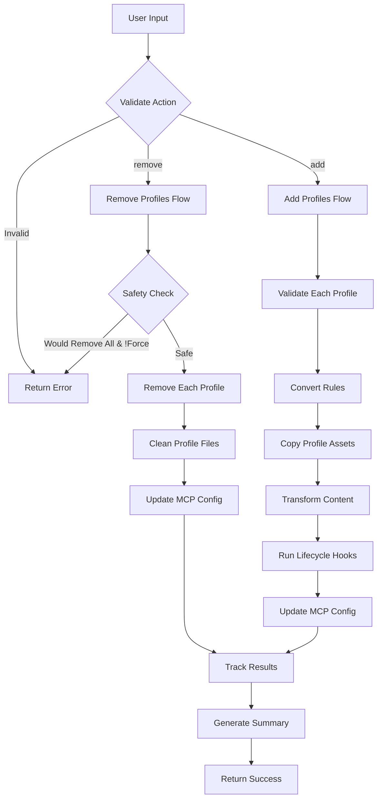

# Tool: rules

## Purpose
Add or remove AI assistant-specific rule profiles to configure Task Master for different development environments like Claude, Cursor, Windsurf, and other AI coding assistants.

## Business Value
- **Who uses this**: Developers using AI coding assistants who want Task Master integration
- **What problem it solves**: Eliminates manual configuration of AI assistant rules and provides IDE-specific optimizations
- **Why it's better than manual approach**: Automated profile management prevents configuration errors and ensures consistent setup across different AI coding environments

## Functionality Specification

### Input Requirements

| Parameter | Type | Required | Default | Description |
|-----------|------|----------|---------|-------------|
| `action` | string | Yes | - | Action to perform: "add" or "remove" |
| `profiles` | string[] | Yes | - | List of rule profiles to add or remove |
| `projectRoot` | string | Yes | - | Absolute path to the project directory |
| `force` | boolean | No | false | Force removal even if it would leave no rule profiles |

#### Validation Rules
1. `action` must be either "add" or "remove"
2. `profiles` must contain at least one valid profile name
3. `profiles` must be from supported list: amp, claude, cline, codex, cursor, gemini, kiro, opencode, kilo, roo, trae, vscode, windsurf, zed
4. `projectRoot` must be an existing directory with write permissions
5. Cannot remove all profiles unless `force` is true (safety check)

#### Supported Profiles
- **amp**: Amp Code integration
- **claude**: Claude Code integration (.claude folder, CLAUDE.md import)
- **cline**: Cline IDE rules
- **codex**: Codex integration
- **cursor**: Cursor IDE rules (.mdc files)
- **gemini**: Gemini integration
- **kiro**: Kiro IDE rules
- **opencode**: OpenCode integration
- **kilo**: Kilo Code integration
- **roo**: Roo Code IDE rules (multi-mode support)
- **trae**: Trae IDE rules
- **vscode**: VS Code with GitHub Copilot integration
- **windsurf**: Windsurf IDE rules
- **zed**: Zed IDE rules

### Processing Logic

#### Step-by-Step Algorithm

```
1. VALIDATE_INPUTS
   - Verify action is "add" or "remove"
   - Validate all profiles exist in RULE_PROFILES constant
   - Check projectRoot exists and is writable
   
2. IF action === "remove"
   2.1 SAFETY_CHECK
      - Get currently installed profiles
      - Check if removal would leave no profiles
      - If would remove all and !force:
        - Return CRITICAL_REMOVAL_BLOCKED error
        
   2.2 PROCESS_REMOVALS
      For each profile:
      - Validate profile exists
      - Call removeProfileRules(projectRoot, profileConfig)
      - Remove profile-specific directories/files
      - Clean up MCP configuration if applicable
      - Track results (success/skipped/error)
      
   2.3 GENERATE_SUMMARY
      - List successful removals
      - List skipped profiles (default/protected)
      - List errors with details
      
3. IF action === "add"
   3.1 PROCESS_ADDITIONS
      For each profile:
      - Validate profile exists
      - Get profile configuration
      - Call convertAllRulesToProfileRules()
      - Copy profile-specific files from assets/rules/
      - Transform rule content (term replacements)
      - Create profile directory structure
      - Setup MCP configuration if applicable
      - Execute lifecycle hooks (onAddRulesProfile)
      - Track results
      
   3.2 PROFILE_SPECIFIC_SETUP
      For Claude profile:
      - Copy .claude directory recursively
      - Create .taskmaster/CLAUDE.md
      - Add import to user's CLAUDE.md if exists
      - Setup commands and settings.json
      
      For Cursor profile:
      - Create .cursor directory
      - Generate .mdc rule files
      - Setup tool mappings
      
      For Roo profile:
      - Setup multi-mode configuration
      - Create mode-specific rule files
      
   3.3 GENERATE_SUMMARY
      - List successful additions
      - List any conversion failures
      - Report created directories/files
      
4. RETURN_RESULT
```

### Output Specification

#### Success Response
```javascript
{
  success: true,
  data: {
    summary: "Successfully added rules: claude, cursor.",
    results: [
      {
        profileName: "claude",
        mcpConfigCreated: true,
        rulesDirCreated: true,
        profileFolderCreated: true,
        skipped: false,
        error: null,
        success: true
      },
      {
        profileName: "cursor",
        mcpConfigCreated: false,  // Cursor doesn't use MCP
        rulesDirCreated: true,
        profileFolderCreated: true,
        skipped: false,
        error: null,
        success: true
      }
    ]
  }
}
```

#### Error Response
```javascript
{
  success: false,
  error: {
    code: "CRITICAL_REMOVAL_BLOCKED",
    message: "CRITICAL: This operation would remove ALL remaining rule profiles (claude), leaving your project with no rules configurations.",
    details: "Currently installed profiles: claude. If you're certain you want to proceed, set force: true"
  }
}
```

#### Error Codes
- `MISSING_ARGUMENT`: Required parameters not provided
- `INVALID_ACTION`: Action is not "add" or "remove"
- `CRITICAL_REMOVAL_BLOCKED`: Would remove all profiles without force flag
- `PROFILE_NOT_FOUND`: Specified profile doesn't exist
- `RULES_ERROR`: General error during rule processing

### Side Effects
1. Creates/removes profile-specific directories (.claude, .cursor, etc.)
2. Creates/removes rule files in profile directories
3. Modifies user's CLAUDE.md file (Claude profile only)
4. Creates/updates .mcp.json for MCP-enabled profiles
5. Copies assets from assets/rules/ directory
6. Executes profile lifecycle hooks

## Data Flow



## Implementation Details

### Data Storage
- **Profile Rules**: `.{profile}/rules/` directory (e.g., `.claude/rules/`)
- **Profile Config**: Profile-specific directories (.claude/, .cursor/, etc.)
- **Assets Source**: `assets/rules/` directory with profile templates
- **MCP Configuration**: `.mcp.json` for MCP-enabled profiles
- **Task Master Rules**: `.taskmaster/CLAUDE.md` for Claude integration

### File Operations
- Recursive directory copying for profile assets
- Text file transformation with regex replacements
- JSON manipulation for MCP configuration
- Markdown file updates with import detection

### Rule Transformation
- Term replacements (Cursor → Profile-specific terms)
- Tool name mappings (Read → different tool names per IDE)
- File extension changes (.cursorrules → .mdc, etc.)
- Context-aware content transformation

## AI Integration Points
This tool has minimal AI integration:
- No AI calls during rule management
- Rules are pre-written templates optimized for each AI assistant
- Transformation is rule-based, not AI-powered
- Profiles configure how AI assistants interact with Task Master

## Dependencies
- **File System Access**: Read/write permissions in project directory
- **Assets Directory**: `assets/rules/` must exist with profile templates
- **Profile Modules**: Profile definitions in `src/profiles/`
- **Other Task Master Tools**: Works independently but affects AI assistant behavior

## Test Scenarios

### 1. Add Single Profile
```javascript
// Test: Add Claude profile
Input: {
  action: "add",
  profiles: ["claude"],
  projectRoot: "/tmp/test-project"
}
Expected: 
- Success with .claude directory created
- CLAUDE.md import added
- .taskmaster/CLAUDE.md created
```

### 2. Add Multiple Profiles
```javascript
// Test: Add Claude and Cursor profiles
Input: {
  action: "add",
  profiles: ["claude", "cursor"],
  projectRoot: "/tmp/test-project"
}
Expected: Success with both profile directories created
```

### 3. Remove Profile
```javascript
// Test: Remove Cursor profile
Setup: Project has claude and cursor profiles
Input: {
  action: "remove",
  profiles: ["cursor"],
  projectRoot: "/tmp/test-project"
}
Expected: Success with cursor files removed, claude retained
```

### 4. Critical Removal Blocked
```javascript
// Test: Try to remove last profile without force
Setup: Project only has claude profile
Input: {
  action: "remove",
  profiles: ["claude"],
  projectRoot: "/tmp/test-project",
  force: false
}
Expected: Error with code "CRITICAL_REMOVAL_BLOCKED"
```

### 5. Force Remove All
```javascript
// Test: Force remove last profile
Setup: Project only has claude profile
Input: {
  action: "remove",
  profiles: ["claude"],
  projectRoot: "/tmp/test-project",
  force: true
}
Expected: Success with all profiles removed
```

### 6. Invalid Profile
```javascript
// Test: Try to add non-existent profile
Input: {
  action: "add",
  profiles: ["invalid-profile"],
  projectRoot: "/tmp/test-project"
}
Expected: Error indicating invalid profile
```

### 7. Re-add Existing Profile
```javascript
// Test: Add profile that already exists
Setup: Project already has claude profile
Input: {
  action: "add",
  profiles: ["claude"],
  projectRoot: "/tmp/test-project"
}
Expected: Success with existing files updated/overwritten
```

## Implementation Notes
- **Complexity**: Medium (file operations and transformations)
- **Estimated Effort**: 4-5 hours for complete implementation
- **Critical Success Factors**:
  1. Accurate profile detection and validation
  2. Safe removal with protection against removing all profiles
  3. Complete cleanup when removing profiles
  4. Non-destructive CLAUDE.md updates
  5. Proper lifecycle hook execution

## Performance Considerations
- File operations are synchronous for consistency
- Directory copying is recursive but typically small
- Text transformations use compiled regex patterns
- No network operations or AI calls

## Security Considerations
- Validate all file paths to prevent directory traversal
- Check write permissions before operations
- Preserve existing user files when possible
- Use force flag for dangerous operations
- Don't overwrite user content without clear indication

## Code References
- Current implementation: `mcp-server/src/tools/rules.js`
- Direct function: `mcp-server/src/core/direct-functions/rules.js`
- Profile definitions: `src/profiles/*.js`
- Constants: `src/constants/profiles.js`
- Key functions:
  - `rulesDirect()`: Main rules management logic
  - `convertAllRulesToProfileRules()`: Add profiles
  - `removeProfileRules()`: Remove profiles
  - `getRulesProfile()`: Get profile configuration
- Design patterns: Strategy pattern for profile-specific behavior

---

*This documentation captures the actual current implementation of the rules tool without any speculative features.*