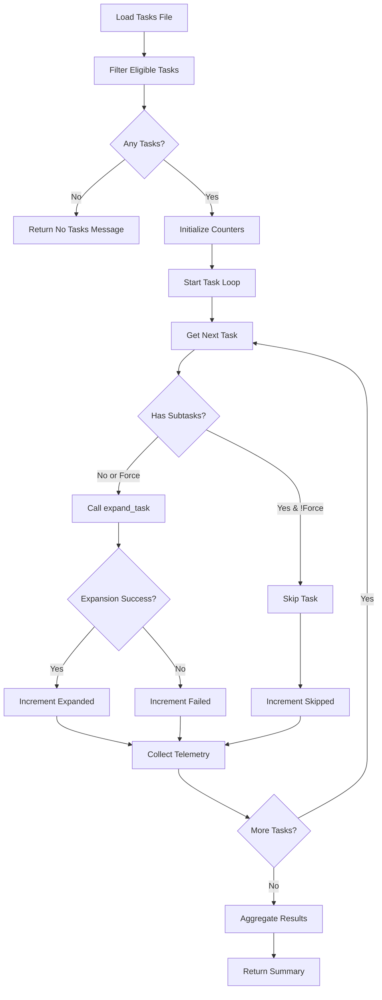

# Tool: expand_all

## Purpose
Batch expand all eligible pending or in-progress tasks into subtasks using AI, processing each task individually with the expand_task tool.

## Business Value
- **Who uses this**: Project managers and developers needing to break down multiple tasks at once
- **What problem it solves**: Eliminates the tedious process of expanding tasks one by one, enabling rapid project decomposition
- **Why it's better than manual approach**: Batch processes all eligible tasks automatically while respecting complexity recommendations and existing subtasks

## Functionality Specification

### Input Requirements

| Parameter | Type | Required | Default | Description |
|-----------|------|----------|---------|-------------|
| `num` | string | No | Based on complexity report | Target number of subtasks per task |
| `research` | boolean | No | false | Enable research-backed subtask generation |
| `prompt` | string | No | - | Additional context for all task expansions |
| `force` | boolean | No | false | Force regeneration even if tasks have subtasks |
| `file` | string | No | ".taskmaster/tasks/tasks.json" | Path to tasks file |
| `projectRoot` | string | Yes | - | Absolute path to project directory |
| `tag` | string | No | Current tag | Tag context to operate on |

#### Validation Rules
1. `projectRoot` must be an existing directory
2. Tasks file must exist and contain valid JSON
3. If `num` provided, must be positive integer
4. Only expands tasks with status "pending" or "in-progress"

### Processing Logic

#### Step-by-Step Algorithm

```
1. VALIDATE_INPUTS
   - Check projectRoot exists
   - Resolve tag (use current if not specified)
   - Find tasks.json file path
   
2. LOAD_TASK_DATA
   - Read tasks.json from specified path
   - Extract tasks for target tag
   - Validate data structure
   
3. FILTER_ELIGIBLE_TASKS
   - Include tasks with status:
      - "pending"
      - "in-progress"
   - Exclude completed/cancelled/deferred tasks
   - Check subtask conditions:
      - IF !force AND has subtasks: Skip task
      - IF force OR no subtasks: Include task
      
4. CHECK_TASK_COUNT
   - Count eligible tasks
   - IF count = 0:
      - Return success with "No tasks eligible" message
   - ELSE:
      - Continue with expansion
      
5. INITIALIZE_TRACKING
   - expandedCount = 0
   - failedCount = 0
   - skippedCount = 0
   - telemetryData = []
   
6. ITERATE_TASKS
   FOR each eligible task:
   
   6.1 START_TASK_EXPANSION
      - Log task ID being expanded
      - Show loading indicator (CLI mode)
      
   6.2 CALL_EXPAND_TASK
      - Use expandTask function with:
         - tasksPath
         - task.id
         - numSubtasks (if provided)
         - useResearch flag
         - additionalContext
         - force flag
         - Full context object
         
   6.3 HANDLE_RESULT
      - IF success:
         - Increment expandedCount
         - Collect telemetry data
      - IF failure:
         - Increment failedCount
         - Log error details
      - IF skipped (has subtasks):
         - Increment skippedCount
         
   6.4 UPDATE_PROGRESS
      - Stop task loading indicator
      - Show progress in CLI mode
      
7. AGGREGATE_TELEMETRY
   - Combine all telemetry data
   - Calculate total token usage
   - Sum costs across all expansions
   
8. GENERATE_SUMMARY
   - Create summary message
   - Include counts and statistics
   - Format for output mode (text/json)
   
9. RETURN_RESULTS
   - Success status
   - Expansion counts
   - Aggregated telemetry
   - Summary message
```

### AI Prompts Used

This tool **does not have its own AI prompts**. It uses the `expand_task` tool internally for each task, which means:

- Each task expansion uses the prompts from `src/prompts/expand-task.json`
- The same prompt variants apply (complexity-report, research, default)
- Context gathering and prompt selection logic from expand_task is reused
- All AI interactions happen through the individual expand_task calls

### Output Specification

#### Success Response
```javascript
{
  success: true,
  data: {
    message: "Expand all operation completed. Expanded: 5, Failed: 1, Skipped: 2",
    details: {
      expandedCount: 5,
      failedCount: 1,
      skippedCount: 2,
      tasksToExpand: 8
    },
    telemetryData: {
      totalTokensUsed: 12500,
      totalCost: 0.25,
      operations: [
        // Individual expansion telemetry
      ]
    }
  }
}
```

#### No Tasks Response
```javascript
{
  success: true,
  data: {
    message: "No tasks eligible for expansion.",
    details: {
      expandedCount: 0,
      failedCount: 0,
      skippedCount: 0,
      tasksToExpand: 0
    },
    telemetryData: []
  }
}
```

#### Error Response
```javascript
{
  success: false,
  error: {
    code: "INVALID_TASKS_FILE",
    message: "Invalid tasks data in /project/.taskmaster/tasks/tasks.json"
  }
}
```

#### Error Codes
- `MISSING_ARGUMENT`: Required parameters not provided
- `INVALID_TASKS_FILE`: Tasks file is corrupted or invalid
- `CORE_FUNCTION_ERROR`: Error during batch expansion process
- Individual task errors from expand_task tool

### Side Effects
1. Updates tasks.json with subtasks for all expanded tasks
2. Generates/updates task markdown files for each task
3. May clear existing subtasks if force=true
4. Multiple AI service calls (one per task)
5. Can take significant time for large task lists

## Data Flow



## Implementation Details

### Data Storage
- **Input**: `.taskmaster/tasks/tasks.json` - Task data by tag
- **Output**: Updates same file with subtasks for each expanded task
- **Task Files**: `.taskmaster/tasks/task-{id}.md` - Updated for each task

### Task Eligibility Criteria
```javascript
// Task is eligible if:
task.status === 'pending' || task.status === 'in-progress'
  && (!task.subtasks || task.subtasks.length === 0 || force)
```

### Batch Processing
- Sequential processing (not parallel) to avoid AI rate limits
- Each task expansion is independent
- Failures don't stop the batch process
- Progress tracking for long-running operations

### Performance Optimizations
- Filters tasks before processing
- Skips ineligible tasks quickly
- Aggregates telemetry data efficiently
- Uses streaming for individual expansions

## AI Integration Points
This tool orchestrates AI operations through expand_task:
- **No Direct AI Calls**: All AI interaction via expand_task
- **Research Mode**: Passed through to each expansion
- **Context Sharing**: Additional context applied to all tasks
- **Complexity Integration**: Each task uses its own complexity recommendations
- **Claude Code Support**: Inherits from expand_task implementation

## Dependencies
- **expand_task**: Core expansion logic for individual tasks
- **File System Access**: Read/write tasks.json
- **UI Module**: Loading indicators and progress display
- **Telemetry Aggregation**: Combines usage data from all expansions
- **Silent Mode**: Manages output for batch operations

## Test Scenarios

### 1. Expand All Eligible
```javascript
// Test: Multiple pending tasks without subtasks
Setup: 5 pending tasks, 0 subtasks each
Input: {
  projectRoot: "/project"
}
Expected: All 5 tasks expanded
```

### 2. Mixed Task Status
```javascript
// Test: Various task states
Setup: 3 pending, 2 done, 1 cancelled, 2 in-progress
Input: {
  projectRoot: "/project"
}
Expected: Only 5 tasks expanded (pending + in-progress)
```

### 3. Force Regeneration
```javascript
// Test: Override existing subtasks
Setup: 3 tasks with subtasks, 2 without
Input: {
  force: true,
  projectRoot: "/project"
}
Expected: All 5 tasks expanded/regenerated
```

### 4. With Specific Count
```javascript
// Test: Custom subtask count
Input: {
  num: "4",
  projectRoot: "/project"
}
Expected: Each task gets exactly 4 subtasks
```

### 5. Research Mode
```javascript
// Test: Enhanced generation for all
Input: {
  research: true,
  projectRoot: "/project"
}
Expected: All tasks use research role
```

### 6. No Eligible Tasks
```javascript
// Test: All tasks completed
Setup: All tasks have status "done"
Input: {
  projectRoot: "/project"
}
Expected: Success with "No tasks eligible" message
```

### 7. Partial Failures
```javascript
// Test: Some expansions fail
Setup: 5 tasks, simulate AI failure for 2
Input: {
  projectRoot: "/project"
}
Expected: 3 expanded, 2 failed, summary shows both
```

### 8. With Additional Context
```javascript
// Test: Shared context for all tasks
Input: {
  prompt: "Focus on testing and documentation",
  projectRoot: "/project"
}
Expected: All expansions use additional context
```

## Implementation Notes
- **Complexity**: Medium (orchestration of multiple expand_task calls)
- **Estimated Effort**: 4-6 hours for complete implementation
- **Critical Success Factors**:
  1. Proper task filtering logic
  2. Robust error handling for partial failures
  3. Clear progress reporting
  4. Telemetry aggregation accuracy
  5. Maintaining atomic operations per task

## Performance Considerations
- Sequential processing prevents API overload
- Can be time-consuming for large task lists
- Token usage scales with number of tasks
- Memory usage for telemetry aggregation
- File I/O happens multiple times

## Security Considerations
- Inherits all security concerns from expand_task
- Batch operations increase API key exposure time
- Validate projectRoot to prevent traversal
- Monitor for excessive API usage
- Consider rate limiting for large batches

## Code References
- Current implementation: `scripts/modules/task-manager/expand-all-tasks.js`
- MCP tool: `mcp-server/src/tools/expand-all.js`
- Direct function: `mcp-server/src/core/direct-functions/expand-all-tasks.js`
- Key functions:
  - `expandAllTasks()`: Main batch expansion logic
  - `expandTask()`: Called for each individual task
  - `aggregateTelemetry()`: Combines usage data
  - `expandAllTasksDirect()`: MCP wrapper
- Design patterns: Iterator pattern for task processing, delegation to expand_task

---

*This documentation captures the actual current implementation of the expand_all tool.*