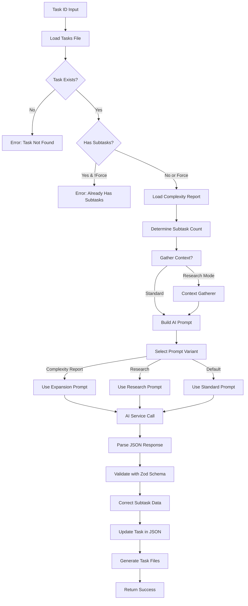

# Tool: expand_task

## Purpose
Break down a single task into detailed subtasks using AI to create actionable implementation steps with proper dependencies and test strategies.

## Business Value
- **Who uses this**: Developers and project managers planning task implementation
- **What problem it solves**: Transforms high-level tasks into specific, actionable subtasks that can be implemented incrementally
- **Why it's better than manual approach**: AI generates consistent, well-structured subtasks with proper dependencies, implementation details, and test strategies based on project context and complexity analysis

## Functionality Specification

### Input Requirements

| Parameter | Type | Required | Default | Description |
|-----------|------|----------|---------|-------------|
| `id` | string | Yes | - | ID of task to expand (e.g., "1", "2.3") |
| `num` | string | No | Based on complexity report | Number of subtasks to generate |
| `research` | boolean | No | false | Use research model for enhanced generation |
| `prompt` | string | No | - | Additional context to guide subtask generation |
| `file` | string | No | ".taskmaster/tasks/tasks.json" | Path to tasks file |
| `projectRoot` | string | Yes | - | Absolute path to project directory |
| `force` | boolean | No | false | Force expansion even if subtasks exist |
| `tag` | string | No | Current tag | Tag context to operate on |

#### Validation Rules
1. `id` must correspond to an existing task
2. Task must not be completed (done/cancelled status)
3. If `num` provided, must be positive integer
4. `projectRoot` must be an existing directory
5. If subtasks exist and `force` is false, operation is blocked

### Processing Logic

#### Step-by-Step Algorithm

```
1. VALIDATE_INPUTS
   - Check projectRoot exists
   - Resolve tag (use current if not specified)
   - Parse task ID
   
2. LOCATE_FILES
   - Find tasks.json file path
   - Find complexity report if exists
   - Load existing data
   
3. FIND_TARGET_TASK
   - Search for task by ID
   - Validate task exists
   - Check task status (not done/cancelled)
   
4. CHECK_EXISTING_SUBTASKS
   - Count existing subtasks
   - IF subtasks exist AND !force:
      - Return warning with existing subtasks
   - IF force:
      - Clear existing subtasks
      
5. DETERMINE_SUBTASK_COUNT
   - IF num provided:
      - Use provided number
   - ELSE IF complexity report exists:
      - Load complexity report
      - Find task's recommended subtasks
      - Use recommendation or default (3)
   - ELSE:
      - Use default from config or 3
      
6. GATHER_CONTEXT (Optional)
   - IF research mode OR Claude Code:
      - Use ContextGatherer to collect project context
      - Use FuzzyTaskSearch for related tasks
      - Format context for AI consumption
      
7. BUILD_AI_PROMPT
   - Load prompt template from src/prompts/expand-task.json
   - Select variant based on conditions:
      - "complexity-report" if expansionPrompt exists
      - "research" if useResearch && !expansionPrompt
      - "default" otherwise
   - Inject variables:
      - task object
      - subtaskCount
      - nextSubtaskId (starting ID)
      - expansionPrompt (from complexity report)
      - additionalContext (from user prompt)
      - gatheredContext (project context)
      - isClaudeCode flag
      - projectRoot path
      
8. CALL_AI_SERVICE
   - Use generateTextService (streaming)
   - Role: 'research' if research mode, else 'main'
   - Parse JSON response with Zod schema
   
9. VALIDATE_AI_RESPONSE
   - Clean response (remove markdown)
   - Parse JSON structure
   - Validate with subtaskWrapperSchema:
      - Each subtask has required fields
      - IDs are sequential from nextSubtaskId
      - Dependencies use proper format
   
10. CORRECT_SUBTASK_DATA
    - Fix ID sequences if needed
    - Add parent task ID prefix
    - Validate dependency format (taskId.subtaskId)
    - Set status to "pending"
    - Ensure all fields present
    
11. UPDATE_TASK_DATA
    - Add subtasks to parent task
    - Update task metadata
    - Save to tasks.json
    
12. GENERATE_TASK_FILES
    - Create/update markdown files
    - Update task structure
    
13. RETURN_SUCCESS
    - Include generated subtasks
    - Return telemetry data
```

### AI Prompts Used

#### System Prompt - Complexity Report Variant (from expand-task.json)
```
You are an AI assistant helping with task breakdown. Generate {{#if (gt subtaskCount 0)}}exactly {{subtaskCount}}{{else}}an appropriate number of{{/if}} subtasks based on the provided prompt and context.
Respond ONLY with a valid JSON object containing a single key "subtasks" whose value is an array of the generated subtask objects.
Each subtask object in the array must have keys: "id", "title", "description", "dependencies", "details", "status".
Ensure the 'id' starts from {{nextSubtaskId}} and is sequential.
For 'dependencies', use the full subtask ID format: "{{task.id}}.1", "{{task.id}}.2", etc. Only reference subtasks within this same task.
Ensure 'status' is 'pending'.
Do not include any other text or explanation.
```

#### User Prompt - Complexity Report Variant (from expand-task.json)
```
Break down the following task based on the analysis prompt:

Parent Task:
ID: {{task.id}}
Title: {{task.title}}
Description: {{task.description}}
Current details: {{#if task.details}}{{task.details}}{{else}}None{{/if}}

Expansion Guidance:
{{expansionPrompt}}{{#if additionalContext}}

{{additionalContext}}{{/if}}{{#if complexityReasoningContext}}

{{complexityReasoningContext}}{{/if}}{{#if gatheredContext}}

# Project Context

{{gatheredContext}}{{/if}}

Generate {{#if (gt subtaskCount 0)}}exactly {{subtaskCount}}{{else}}an appropriate number of{{/if}} subtasks with sequential IDs starting from {{nextSubtaskId}}.
```

#### System Prompt - Research Variant (from expand-task.json)
```
You are an AI assistant that responds ONLY with valid JSON objects as requested. The object should contain a 'subtasks' array.
```

#### User Prompt - Research Variant (from expand-task.json)
```
{{#if isClaudeCode}}## IMPORTANT: Codebase Analysis Required

You have access to powerful codebase analysis tools. Before generating subtasks:

1. Use the Glob tool to explore relevant files for this task (e.g., "**/*.js", "src/**/*.ts")
2. Use the Grep tool to search for existing implementations related to this task
3. Use the Read tool to examine files that would be affected by this task
4. Understand the current implementation state and patterns used

Based on your analysis:
- Identify existing code that relates to this task
- Understand patterns and conventions to follow
- Generate subtasks that integrate smoothly with existing code
- Ensure subtasks are specific and actionable based on the actual codebase

Project Root: {{projectRoot}}

{{/if}}Analyze the following task and break it down into {{#if (gt subtaskCount 0)}}exactly {{subtaskCount}}{{else}}an appropriate number of{{/if}} specific subtasks using your research capabilities. Assign sequential IDs starting from {{nextSubtaskId}}.

Parent Task:
ID: {{task.id}}
Title: {{task.title}}
Description: {{task.description}}
Current details: {{#if task.details}}{{task.details}}{{else}}None{{/if}}{{#if additionalContext}}
Consider this context: {{additionalContext}}{{/if}}{{#if complexityReasoningContext}}
Complexity Analysis Reasoning: {{complexityReasoningContext}}{{/if}}{{#if gatheredContext}}

# Project Context

{{gatheredContext}}{{/if}}

CRITICAL: Respond ONLY with a valid JSON object containing a single key "subtasks". The value must be an array of the generated subtasks, strictly matching this structure:

{
  "subtasks": [
    {
      "id": <number>, // Sequential ID starting from {{nextSubtaskId}}
      "title": "<string>",
      "description": "<string>",
      "dependencies": ["<string>"], // Use full subtask IDs like ["{{task.id}}.1", "{{task.id}}.2"]. If no dependencies, use an empty array [].
      "details": "<string>",
      "testStrategy": "<string>" // Optional
    },
    // ... (repeat for {{#if (gt subtaskCount 0)}}{{subtaskCount}}{{else}}appropriate number of{{/if}} subtasks)
  ]
}

Important: For the 'dependencies' field, if a subtask has no dependencies, you MUST use an empty array, for example: "dependencies": []. Do not use null or omit the field.

Do not include ANY explanatory text, markdown, or code block markers. Just the JSON object.
```

#### System Prompt - Default Variant (from expand-task.json)
```
You are an AI assistant helping with task breakdown for software development.
You need to break down a high-level task into {{#if (gt subtaskCount 0)}}{{subtaskCount}}{{else}}an appropriate number of{{/if}} specific subtasks that can be implemented one by one.

Subtasks should:
1. Be specific and actionable implementation steps
2. Follow a logical sequence
3. Each handle a distinct part of the parent task
4. Include clear guidance on implementation approach
5. Have appropriate dependency chains between subtasks (using full subtask IDs)
6. Collectively cover all aspects of the parent task

For each subtask, provide:
- id: Sequential integer starting from the provided nextSubtaskId
- title: Clear, specific title
- description: Detailed description
- dependencies: Array of prerequisite subtask IDs using full format like ["{{task.id}}.1", "{{task.id}}.2"]
- details: Implementation details, the output should be in string
- testStrategy: Optional testing approach

Respond ONLY with a valid JSON object containing a single key "subtasks" whose value is an array matching the structure described. Do not include any explanatory text, markdown formatting, or code block markers.
```

#### User Prompt - Default Variant (from expand-task.json)
```
{{#if isClaudeCode}}## IMPORTANT: Codebase Analysis Required

You have access to powerful codebase analysis tools. Before generating subtasks:

1. Use the Glob tool to explore relevant files for this task (e.g., "**/*.js", "src/**/*.ts")
2. Use the Grep tool to search for existing implementations related to this task
3. Use the Read tool to examine files that would be affected by this task
4. Understand the current implementation state and patterns used

Based on your analysis:
- Identify existing code that relates to this task
- Understand patterns and conventions to follow
- Generate subtasks that integrate smoothly with existing code
- Ensure subtasks are specific and actionable based on the actual codebase

Project Root: {{projectRoot}}

{{/if}}Break down this task into {{#if (gt subtaskCount 0)}}exactly {{subtaskCount}}{{else}}an appropriate number of{{/if}} specific subtasks:

Task ID: {{task.id}}
Title: {{task.title}}
Description: {{task.description}}
Current details: {{#if task.details}}{{task.details}}{{else}}None{{/if}}{{#if additionalContext}}
Additional context: {{additionalContext}}{{/if}}{{#if complexityReasoningContext}}
Complexity Analysis Reasoning: {{complexityReasoningContext}}{{/if}}{{#if gatheredContext}}

# Project Context

{{gatheredContext}}{{/if}}

Return ONLY the JSON object containing the "subtasks" array, matching this structure:

{
  "subtasks": [
    {
      "id": {{nextSubtaskId}}, // First subtask ID
      "title": "Specific subtask title",
      "description": "Detailed description",
      "dependencies": [], // e.g., ["{{task.id}}.1", "{{task.id}}.2"] for dependencies. Use empty array [] if no dependencies
      "details": "Implementation guidance",
      "testStrategy": "Optional testing approach"
    },
    // ... (repeat for {{#if (gt subtaskCount 0)}}a total of {{subtaskCount}}{{else}}an appropriate number of{{/if}} subtasks with sequential IDs)
  ]
}
```

### Output Specification

#### Success Response
```javascript
{
  success: true,
  data: {
    message: "Task 1 expanded into 5 subtasks",
    task: {
      id: 1,
      title: "Setup authentication system",
      subtasks: [
        {
          id: "1.1",
          title: "Create user model and database schema",
          description: "Design and implement the User model with necessary fields",
          dependencies: [],
          details: "Create User model with fields: id, email, passwordHash, createdAt, updatedAt...",
          status: "pending",
          testStrategy: "Unit tests for model validation and database operations"
        },
        {
          id: "1.2",
          title: "Implement JWT token generation",
          description: "Create JWT token generation and validation utilities",
          dependencies: ["1.1"],
          details: "Implement token generation with secret key, expiration...",
          status: "pending",
          testStrategy: "Unit tests for token generation and validation"
        }
      ]
    }
  }
}
```

#### Error Response
```javascript
{
  success: false,
  error: {
    code: "TASK_HAS_SUBTASKS",
    message: "Task 1 already has 3 subtasks. Use --force to override."
  }
}
```

#### Error Codes
- `MISSING_ARGUMENT`: Required parameters not provided
- `TASK_NOT_FOUND`: Specified task ID doesn't exist
- `TASK_COMPLETED`: Task is already done/cancelled
- `TASK_HAS_SUBTASKS`: Task has existing subtasks and force not specified
- `INPUT_VALIDATION_ERROR`: Invalid input parameters
- `AI_RESPONSE_ERROR`: AI returned invalid JSON structure
- `SUBTASK_PARSING_ERROR`: Failed to parse subtasks from AI response

### Side Effects
1. Updates tasks.json with new subtasks
2. Generates/updates task markdown files
3. May clear existing subtasks if force=true
4. Triggers AI service call with streaming response
5. Creates subtask entries with proper parent-child relationships

## Data Flow



## Implementation Details

### Data Storage
- **Input**: `.taskmaster/tasks/tasks.json` - Task data by tag
- **Complexity Report**: `.taskmaster/reports/task-complexity-report.json` - Optional guidance
- **Output**: Updates tasks.json with subtasks array
- **Task Files**: `.taskmaster/tasks/task-{id}.md` - Markdown representation

### Subtask Structure
```javascript
{
  "id": "1.1",           // Parent.Sequential format
  "title": "Subtask title",
  "description": "Detailed description",
  "dependencies": ["1.2", "1.3"], // Same-parent dependencies only
  "details": "Implementation guidance and notes",
  "status": "pending",   // Always starts as pending
  "testStrategy": "How to test this subtask"
}
```

### Dependency Rules
- Subtasks can only depend on siblings (same parent)
- Dependencies use full ID format: "parentId.subtaskId"
- No circular dependencies allowed
- Empty array [] for no dependencies

### AI Response Parsing
- Streaming response for real-time feedback
- JSON extraction from markdown if needed
- Zod schema validation for structure
- Automatic correction of common issues:
  - Sequential ID fixing
  - Dependency format correction
  - Missing field defaults

## AI Integration Points
This tool is heavily AI-integrated:
- **Subtask Generation**: AI creates detailed implementation steps
- **Dependency Analysis**: AI determines logical task sequencing
- **Implementation Details**: AI provides specific technical guidance
- **Test Strategy**: AI suggests testing approaches
- **Research Mode**: Enhanced generation with current best practices
- **Claude Code Integration**: Special mode for codebase-aware subtask generation
- **Complexity Integration**: Uses complexity report recommendations

## Dependencies
- **File System Access**: Read/write tasks.json
- **AI Service**: Required for subtask generation
- **Prompt Manager**: Loads and renders prompt templates
- **Context Gatherer**: Optional project context collection
- **Fuzzy Task Search**: Finding related tasks for context
- **Zod**: Schema validation for AI responses
- **Complexity Report**: Optional guidance for subtask count

## Test Scenarios

### 1. Basic Expansion
```javascript
// Test: Expand task with default settings
Input: {
  id: "1",
  projectRoot: "/project"
}
Expected: Success with 3 default subtasks
```

### 2. Specific Subtask Count
```javascript
// Test: Generate exact number of subtasks
Input: {
  id: "2",
  num: "5",
  projectRoot: "/project"
}
Expected: Success with exactly 5 subtasks
```

### 3. Research Mode
```javascript
// Test: Enhanced generation with research
Input: {
  id: "3",
  research: true,
  projectRoot: "/project"
}
Expected: Success with research-enhanced subtasks
```

### 4. Force Expansion
```javascript
// Test: Override existing subtasks
Input: {
  id: "4",
  force: true,
  projectRoot: "/project"
}
Expected: Clear existing subtasks, generate new ones
```

### 5. With Additional Context
```javascript
// Test: Custom prompt guidance
Input: {
  id: "5",
  prompt: "Focus on security and performance aspects",
  projectRoot: "/project"
}
Expected: Subtasks emphasize security and performance
```

### 6. Complexity Report Integration
```javascript
// Test: Use complexity report recommendation
Setup: Complexity report recommends 7 subtasks for task 6
Input: {
  id: "6",
  projectRoot: "/project"
}
Expected: Generate 7 subtasks based on report
```

### 7. Task Already Complete
```javascript
// Test: Prevent expansion of done task
Setup: Task 7 has status "done"
Input: {
  id: "7",
  projectRoot: "/project"
}
Expected: Error - cannot expand completed task
```

## Implementation Notes
- **Complexity**: High (AI integration, schema validation, context gathering)
- **Estimated Effort**: 8-10 hours for complete implementation
- **Critical Success Factors**:
  1. Proper subtask ID generation and sequencing
  2. Dependency validation and formatting
  3. Robust JSON parsing from AI response
  4. Integration with complexity report
  5. Proper error handling for edge cases

## Performance Considerations
- Streaming response for better UX
- Context gathering adds overhead
- AI token usage scales with task complexity
- Synchronous file I/O for consistency
- Subtask validation can be compute-intensive

## Security Considerations
- Validate task IDs to prevent injection
- Sanitize AI prompts to avoid prompt injection
- Validate file paths for directory traversal
- API keys stored in environment variables
- Validate AI response against strict schema

## Code References
- Current implementation: `scripts/modules/task-manager/expand-task.js`
- MCP tool: `mcp-server/src/tools/expand-task.js`
- Direct function: `mcp-server/src/core/direct-functions/expand-task.js`
- Prompt template: `src/prompts/expand-task.json`
- Key functions:
  - `expandTask()`: Main expansion logic
  - `parseSubtasksFromText()`: AI response parsing
  - `correctSubtaskData()`: Data correction and validation
  - `expandTaskDirect()`: MCP wrapper
- Design patterns: Strategy pattern for prompt selection, streaming for real-time feedback

---

*This documentation captures the actual current implementation of the expand_task tool including exact AI prompts used.*