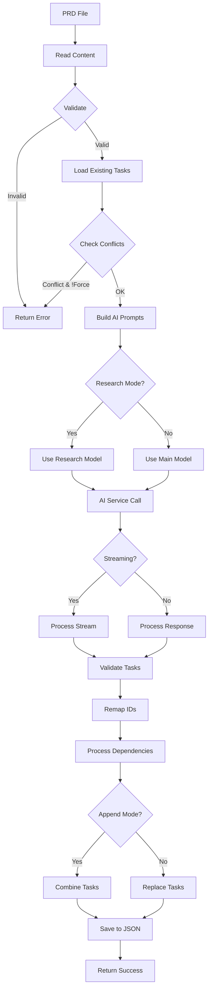

# Tool: parse_prd

## Purpose
Parse a Product Requirements Document (PRD) and use AI to automatically generate a structured, dependency-aware list of development tasks in JSON format.

## Business Value
- **Who uses this**: Developers and project managers starting new projects or features
- **What problem it solves**: Eliminates manual task breakdown, ensures comprehensive coverage of requirements, and creates logical task sequencing
- **Why it's better than manual approach**: AI-powered analysis ensures consistent task structure, identifies dependencies, includes implementation details and test strategies, and can research current best practices

## Functionality Specification

### Input Requirements

| Parameter | Type | Required | Default | Description |
|-----------|------|----------|---------|-------------|
| `input` | string | No | ".taskmaster/docs/prd.txt" | Absolute path to PRD document file (.txt or .md) |
| `projectRoot` | string | Yes | - | Absolute path to the project directory |
| `tag` | string | No | Current tag | Tag context to operate on |
| `output` | string | No | ".taskmaster/tasks/tasks.json" | Output path for tasks.json file |
| `numTasks` | string/number | No | "10" | Approximate number of top-level tasks to generate (0-50) |
| `force` | boolean | No | false | Overwrite existing tasks without prompting |
| `research` | boolean | No | false | Enable research mode for enhanced task generation |
| `append` | boolean | No | false | Append generated tasks to existing file |

#### Validation Rules
1. `input` file must exist and be readable (.txt or .md format)
2. `projectRoot` must be an existing directory
3. `numTasks` should be between 0-50 (0 means AI determines count)
4. Cannot overwrite existing tasks without `force` or `append` flags
5. `research` mode requires research model to be configured
6. File must contain non-empty PRD content

### Processing Logic

#### Step-by-Step Algorithm

```
1. VALIDATE_INPUTS
   - Check PRD file exists and is readable
   - Validate projectRoot exists
   - Parse numTasks (default to 10 if not specified)
   - Resolve target tag (use current tag if not specified)
   
2. LOAD_EXISTING_TASKS
   - Read tasks.json if exists
   - Extract tasks for target tag
   - Determine next available task ID
   - Count existing tasks
   
3. VALIDATE_OPERATIONS
   - If tasks exist and !append and !force:
     - Return error requiring --force or --append
   - If append mode:
     - Log appending to existing tasks
   - If force mode:
     - Log overwriting existing tasks
     
4. BUILD_AI_PROMPTS
   - Load prompt template from src/prompts/parse-prd.json
   - Inject variables:
     - numTasks: Target number of tasks
     - nextId: Starting ID for new tasks
     - research: Research mode flag
     - prdContent: Full PRD text
     - prdPath: Path to PRD file
     - defaultTaskPriority: From config (default "medium")
     - isClaudeCode: Whether using Claude Code
     - projectRoot: For codebase analysis
   - Generate system and user prompts
   
5. CALL_AI_SERVICE
   - Determine model (research mode uses research model)
   - Choose streaming vs non-streaming based on output format
   
   5.1 IF streaming:
      - Call streamObjectService with timeout (180 seconds)
      - Process stream chunks as they arrive
      - Report progress for each task generated
      - Handle partial objects and validation
      
   5.2 IF non-streaming:
      - Call generateObjectService
      - Wait for complete response
      - Parse entire response at once
      
6. PROCESS_AI_RESPONSE
   - Validate response against Zod schema
   - Extract tasks array from response
   - Remap task IDs starting from nextId
   - Process dependencies (only forward references)
   - Set default values:
     - status: "pending"
     - priority: defaultPriority or task-specific
     - subtasks: []
   - Validate all required fields present
   
7. COMBINE_TASKS
   - If append mode:
     - Combine existing + new tasks
   - If force/new:
     - Use only new tasks
     
8. SAVE_TO_FILE
   - Create .taskmaster/tasks/ directory if needed
   - Read existing tasks.json for other tags
   - Update target tag with new tasks
   - Add metadata (created, updated timestamps)
   - Write JSON with 2-space indentation
   
9. GENERATE_SUMMARY
   - Count tasks generated
   - Calculate token usage
   - Prepare success message
   
10. RETURN_SUCCESS
```

### AI Prompts Used

#### System Prompt (Exact Text)
```
You are an AI assistant specialized in analyzing Product Requirements Documents (PRDs) and generating a structured, logically ordered, dependency-aware and sequenced list of development tasks in JSON format.{{#if research}}
Before breaking down the PRD into tasks, you will:
1. Research and analyze the latest technologies, libraries, frameworks, and best practices that would be appropriate for this project
2. Identify any potential technical challenges, security concerns, or scalability issues not explicitly mentioned in the PRD without discarding any explicit requirements or going overboard with complexity -- always aim to provide the most direct path to implementation, avoiding over-engineering or roundabout approaches
3. Consider current industry standards and evolving trends relevant to this project (this step aims to solve LLM hallucinations and out of date information due to training data cutoff dates)
4. Evaluate alternative implementation approaches and recommend the most efficient path
5. Include specific library versions, helpful APIs, and concrete implementation guidance based on your research
6. Always aim to provide the most direct path to implementation, avoiding over-engineering or roundabout approaches

Your task breakdown should incorporate this research, resulting in more detailed implementation guidance, more accurate dependency mapping, and more precise technology recommendations than would be possible from the PRD text alone, while maintaining all explicit requirements and best practices and all details and nuances of the PRD.{{/if}}

Analyze the provided PRD content and generate {{#if (gt numTasks 0)}}approximately {{numTasks}}{{else}}an appropriate number of{{/if}} top-level development tasks. If the complexity or the level of detail of the PRD is high, generate more tasks relative to the complexity of the PRD
Each task should represent a logical unit of work needed to implement the requirements and focus on the most direct and effective way to implement the requirements without unnecessary complexity or overengineering. Include pseudo-code, implementation details, and test strategy for each task. Find the most up to date information to implement each task.
Assign sequential IDs starting from {{nextId}}. Infer title, description, details, and test strategy for each task based *only* on the PRD content.
Set status to 'pending', dependencies to an empty array [], and priority to '{{defaultTaskPriority}}' initially for all tasks.
Respond ONLY with a valid JSON object containing a single key "tasks", where the value is an array of task objects adhering to the provided Zod schema. Do not include any explanation or markdown formatting.

Each task should follow this JSON structure:
{
	"id": number,
	"title": string,
	"description": string,
	"status": "pending",
	"dependencies": number[] (IDs of tasks this depends on),
	"priority": "high" | "medium" | "low",
	"details": string (implementation details),
	"testStrategy": string (validation approach)
}

Guidelines:
1. {{#if (gt numTasks 0)}}Unless complexity warrants otherwise{{else}}Depending on the complexity{{/if}}, create {{#if (gt numTasks 0)}}exactly {{numTasks}}{{else}}an appropriate number of{{/if}} tasks, numbered sequentially starting from {{nextId}}
2. Each task should be atomic and focused on a single responsibility following the most up to date best practices and standards
3. Order tasks logically - consider dependencies and implementation sequence
4. Early tasks should focus on setup, core functionality first, then advanced features
5. Include clear validation/testing approach for each task
6. Set appropriate dependency IDs (a task can only depend on tasks with lower IDs, potentially including existing tasks with IDs less than {{nextId}} if applicable)
7. Assign priority (high/medium/low) based on criticality and dependency order
8. Include detailed implementation guidance in the "details" field{{#if research}}, with specific libraries and version recommendations based on your research{{/if}}
9. If the PRD contains specific requirements for libraries, database schemas, frameworks, tech stacks, or any other implementation details, STRICTLY ADHERE to these requirements in your task breakdown and do not discard them under any circumstance
10. Focus on filling in any gaps left by the PRD or areas that aren't fully specified, while preserving all explicit requirements
11. Always aim to provide the most direct path to implementation, avoiding over-engineering or roundabout approaches{{#if research}}
12. For each task, include specific, actionable guidance based on current industry standards and best practices discovered through research{{/if}}
```

#### User Prompt (Exact Text)
```
{{#if isClaudeCode}}## IMPORTANT: Codebase Analysis Required

You have access to powerful codebase analysis tools. Before generating tasks:

1. Use the Glob tool to explore the project structure (e.g., "**/*.js", "**/*.json", "**/README.md")
2. Use the Grep tool to search for existing implementations, patterns, and technologies
3. Use the Read tool to examine key files like package.json, README.md, and main entry points
4. Analyze the current state of implementation to understand what already exists

Based on your analysis:
- Identify what components/features are already implemented
- Understand the technology stack, frameworks, and patterns in use
- Generate tasks that build upon the existing codebase rather than duplicating work
- Ensure tasks align with the project's current architecture and conventions

Project Root: {{projectRoot}}

{{/if}}Here's the Product Requirements Document (PRD) to break down into {{#if (gt numTasks 0)}}approximately {{numTasks}}{{else}}an appropriate number of{{/if}} tasks, starting IDs from {{nextId}}:{{#if research}}

Remember to thoroughly research current best practices and technologies before task breakdown to provide specific, actionable implementation details.{{/if}}

{{prdContent}}


		Return your response in this format:
{
    "tasks": [
        {
            "id": 1,
            "title": "Setup Project Repository",
            "description": "...",
            ...
        },
        ...
    ],
    "metadata": {
        "projectName": "PRD Implementation",
        "totalTasks": {{#if (gt numTasks 0)}}{{numTasks}}{{else}}{number of tasks}{{/if}},
        "sourceFile": "{{prdPath}}",
        "generatedAt": "YYYY-MM-DD"
    }
}
```

### Output Specification

#### Success Response
```javascript
{
  success: true,
  tasksPath: ".taskmaster/tasks/tasks.json",
  telemetryData: {
    inputTokens: 2500,
    outputTokens: 3200,
    totalCost: 0.0145,
    currency: "USD",
    modelId: "claude-3-5-sonnet-20241022",
    provider: "anthropic"
  },
  tagInfo: {
    tag: "master",
    tasksGenerated: 10,
    totalTasks: 10
  }
}
```

#### Error Response
```javascript
{
  success: false,
  error: {
    code: "PRD_PARSE_FAILED",
    message: "Failed to parse PRD",
    details: "Input file is empty or could not be read"
  }
}
```

#### Task Structure Generated
```javascript
{
  "id": 1,
  "title": "Setup Project Repository and Development Environment",
  "description": "Initialize Git repository, configure development environment, and set up project structure with necessary configuration files",
  "status": "pending",
  "dependencies": [],
  "priority": "high",
  "details": "1. Initialize Git repository\n2. Create .gitignore file\n3. Setup package.json with dependencies\n4. Configure ESLint and Prettier\n5. Create folder structure: /src, /tests, /docs\n6. Setup environment variables (.env.example)",
  "testStrategy": "Verify all configuration files are present and valid, ensure Git is initialized with proper .gitignore, confirm development dependencies install correctly"
}
```

#### Error Codes
- `PRD_PARSE_FAILED`: General parsing failure
- `FILE_NOT_FOUND`: PRD file doesn't exist
- `EMPTY_FILE`: PRD file is empty
- `TASKS_EXIST`: Tasks already exist (use --force or --append)
- `AI_SERVICE_ERROR`: AI service call failed
- `VALIDATION_ERROR`: Response didn't match expected schema
- `TIMEOUT_ERROR`: Streaming operation timed out (180 seconds)

### Side Effects
1. Creates/updates `.taskmaster/tasks/tasks.json`
2. Creates `.taskmaster/tasks/` directory if needed
3. Updates tag metadata with timestamps
4. Logs telemetry data for token usage
5. May trigger AI service costs

## Data Flow



## Implementation Details

### Data Storage
- **Primary Storage**: `.taskmaster/tasks/tasks.json` - Tag-based task storage
- **Task Structure**: Hierarchical with ID, title, description, details, testStrategy
- **Tag Organization**: Tasks grouped by tags (master, feature branches, etc.)
- **Metadata**: Creation and update timestamps per tag

### Streaming vs Non-Streaming
- **Streaming**: Used for CLI and progress reporting
  - Timeout: 180 seconds
  - Progress updates per task
  - Partial object handling
- **Non-streaming**: Used for JSON output
  - No timeout
  - Single response processing

### Token Estimation
- Input tokens: ~4 characters per token
- Output tokens: Tracked during streaming
- Cost calculation based on model pricing

## AI Integration Points
This tool is heavily AI-integrated:
- **Task Generation**: AI analyzes PRD and generates structured tasks
- **Research Mode**: Optional enhanced analysis with web search
- **Dependency Mapping**: AI determines logical task dependencies
- **Priority Assignment**: AI assigns priorities based on criticality
- **Implementation Details**: AI provides pseudo-code and specifics
- **Test Strategies**: AI generates validation approaches
- **Claude Code Integration**: Special mode for codebase analysis

### Model Selection
- Main model: Used for standard PRD parsing
- Research model: Used when `research` flag is set
- Fallback model: Used if primary model fails

## Dependencies
- **File System Access**: Read PRD file, write tasks.json
- **AI Service**: Required for task generation
- **Prompt Manager**: Loads and renders prompt templates
- **Stream Parser**: For streaming response handling
- **Zod Validation**: Schema validation for AI responses
- **Other Task Master Tools**: Works with expand, analyze-complexity

## Test Scenarios

### 1. Basic PRD Parsing
```javascript
// Test: Parse simple PRD
Input: {
  input: "/project/prd.txt",
  projectRoot: "/project",
  numTasks: 5
}
Expected: Success with 5 tasks generated
```

### 2. Append Mode
```javascript
// Test: Append to existing tasks
Setup: 5 tasks already exist
Input: {
  input: "/project/prd2.txt",
  projectRoot: "/project",
  append: true,
  numTasks: 3
}
Expected: Success with 8 total tasks (5 existing + 3 new)
```

### 3. Force Overwrite
```javascript
// Test: Overwrite existing tasks
Setup: Tasks already exist
Input: {
  input: "/project/new-prd.txt",
  projectRoot: "/project",
  force: true,
  numTasks: 10
}
Expected: Success with 10 new tasks (old tasks replaced)
```

### 4. Research Mode
```javascript
// Test: Enhanced parsing with research
Input: {
  input: "/project/prd.txt",
  projectRoot: "/project",
  research: true,
  numTasks: 10
}
Expected: Success with detailed implementation guidance
```

### 5. Streaming Timeout
```javascript
// Test: Handle streaming timeout
Setup: Slow AI response
Input: {
  input: "/project/large-prd.txt",
  projectRoot: "/project",
  numTasks: 50
}
Expected: Timeout after 180 seconds, fallback to non-streaming
```

### 6. Empty PRD File
```javascript
// Test: Handle empty file
Setup: PRD file exists but is empty
Input: {
  input: "/project/empty.txt",
  projectRoot: "/project"
}
Expected: Error with code "EMPTY_FILE"
```

### 7. Auto Task Count
```javascript
// Test: Let AI determine task count
Input: {
  input: "/project/complex-prd.txt",
  projectRoot: "/project",
  numTasks: 0
}
Expected: Success with AI-determined number of tasks
```

## Implementation Notes
- **Complexity**: Complex (AI integration, streaming, validation)
- **Estimated Effort**: 8-10 hours for complete implementation
- **Critical Success Factors**:
  1. Robust prompt engineering for consistent output
  2. Proper streaming timeout handling
  3. Accurate dependency mapping
  4. Schema validation for AI responses
  5. Token usage tracking and cost calculation

## Performance Considerations
- Streaming timeout: 180 seconds default
- Token limits: Model-specific (typically 8K-200K)
- Response validation: Zod schema parsing overhead
- File I/O: Synchronous operations for consistency
- Progress reporting: Async updates during streaming

## Security Considerations
- Validate file paths to prevent directory traversal
- Sanitize PRD content before sending to AI
- Don't log sensitive PRD content
- API keys stored in environment variables
- Validate AI responses against strict schema

## Code References
- Current implementation: `scripts/modules/task-manager/parse-prd/parse-prd.js`
- MCP tool: `mcp-server/src/tools/parse-prd.js`
- Helpers: `scripts/modules/task-manager/parse-prd/parse-prd-helpers.js`
- Streaming: `scripts/modules/task-manager/parse-prd/parse-prd-streaming.js`
- Non-streaming: `scripts/modules/task-manager/parse-prd/parse-prd-non-streaming.js`
- Config: `scripts/modules/task-manager/parse-prd/parse-prd-config.js`
- Prompt template: `src/prompts/parse-prd.json`
- Key functions:
  - `parsePRD()`: Main entry point with fallback logic
  - `parsePRDWithStreaming()`: Streaming implementation
  - `parsePRDWithoutStreaming()`: Non-streaming implementation
  - `buildPrompts()`: Prompt construction
  - `processTasks()`: Task ID remapping and dependency processing
- Design patterns: Strategy pattern for streaming/non-streaming

---

*This documentation captures the actual current implementation of the parse_prd tool including exact AI prompts used.*