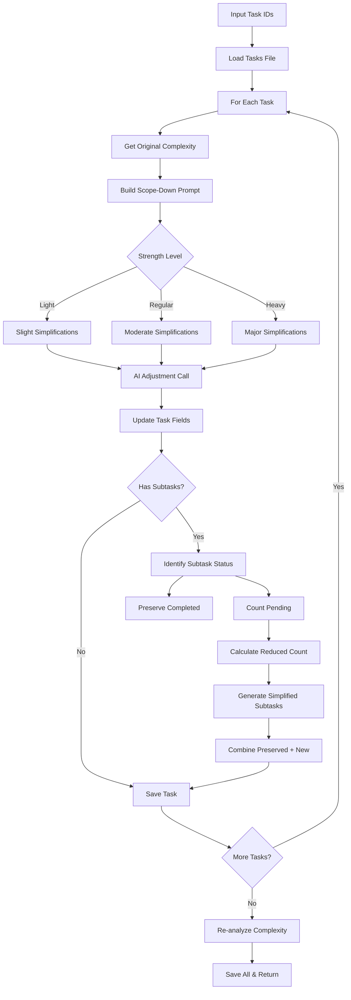

# Tool: scope_down

## Purpose
Decrease task complexity using AI to focus on core functionality, remove non-essential features, and simplify implementation while optionally regenerating pending subtasks to match the reduced complexity level.

## Business Value
- **Who uses this**: Developers and project managers adjusting task scope
- **What problem it solves**: Allows dynamic scope reduction when tasks prove simpler than estimated, time constraints emerge, or MVP approaches are needed
- **Why it's better than manual approach**: AI intelligently simplifies while preserving completed work, automatically regenerates subtasks to match new scope, and maintains task coherence

## Functionality Specification

### Input Requirements

| Parameter | Type | Required | Default | Description |
|-----------|------|----------|---------|-------------|
| `id` | string | Yes | - | Comma-separated list of task IDs (e.g., "1,3,5") |
| `strength` | string | No | "regular" | Strength level: "light", "regular", or "heavy" |
| `prompt` | string | No | - | Custom instructions for specific adjustments |
| `file` | string | No | ".taskmaster/tasks/tasks.json" | Path to tasks file |
| `projectRoot` | string | Yes | - | Absolute path to project directory |
| `tag` | string | No | Current tag | Tag context to operate on |
| `research` | boolean | No | false | Use research capabilities for scoping |

#### Validation Rules
1. `strength` must be one of: "light", "regular", "heavy"
2. All task IDs must exist in the tasks file
3. `projectRoot` must be an existing directory
4. Tasks cannot be completed (done/cancelled status)

### Processing Logic

#### Step-by-Step Algorithm

```
1. VALIDATE_INPUTS
   - Check strength is valid
   - Verify projectRoot exists
   - Resolve tag (use current if not specified)
   - Parse task IDs from comma-separated string
   
2. LOAD_TASK_DATA
   - Read tasks.json from specified path
   - Extract tasks for target tag
   - Validate all task IDs exist
   
3. FOR EACH TASK_ID:

   3.1 GET_ORIGINAL_COMPLEXITY
      - Read complexity report if exists
      - Find task's current complexity score
      - Use for intelligent adjustment calculations
      
   3.2 ADJUST_TASK_COMPLEXITY
      - Build AI prompt for complexity decrease
      - Include strength-specific instructions
      - Add custom prompt if provided
      - Call AI service with structured output
      
   3.3 REGENERATE_SUBTASKS (if has subtasks)
      - Identify subtasks by status:
         - Preserve: done, in-progress, review, cancelled, deferred, blocked
         - Regenerate: pending only
      - Calculate new subtask count based on:
         - Strength level
         - Original complexity score (aggressive reduction for high complexity)
         - Current pending count
         - Preserved count
      - Generate new pending subtasks via AI
      - Combine preserved + new subtasks
      
   3.4 UPDATE_TASK_DATA
      - Apply complexity changes to task
      - Replace subtasks if regenerated
      - Save to tasks.json
      
   3.5 REANALYZE_COMPLEXITY (optional)
      - If session available and original complexity known
      - Run complexity analysis on updated task
      - Compare new vs original scores
      - Log complexity change
      
4. AGGREGATE_RESULTS
   - Combine telemetry data from all tasks
   - Calculate total tokens and costs
   - Generate summary message
   
5. SAVE_AND_RETURN
   - Write updated tasks.json
   - Return updated tasks and telemetry
```

### AI Prompts Used

#### System Prompt for Task Complexity Adjustment
```
You are an expert software project manager who helps adjust task complexity while maintaining clarity and actionability.
```

#### User Prompt for Task Complexity Adjustment (Generated Dynamically)
```
You are tasked with adjusting the complexity of a task. 

CURRENT TASK:
Title: {{task.title}}
Description: {{task.description}}
Details: {{task.details}}
Test Strategy: {{task.testStrategy || 'Not specified'}}

ADJUSTMENT REQUIREMENTS:
- Direction: DECREASE complexity
- Strength: {{strength}} ({{strengthDescription}})
- Preserve the core purpose and functionality of the task
- Maintain consistency with the existing task structure
- Focus on core functionality and essential requirements
- Remove or simplify non-essential features  
- Streamline implementation details
- Simplify testing to focus on basic functionality

{{#if customPrompt}}
CUSTOM INSTRUCTIONS:
{{customPrompt}}
{{/if}}

Return a JSON object with the updated task containing these fields:
- title: Updated task title
- description: Updated task description  
- details: Updated implementation details
- testStrategy: Updated test strategy
- priority: Task priority ('low', 'medium', or 'high')

Ensure the JSON is valid and properly formatted.
```

#### System Prompt for Subtask Regeneration
```
You are an expert project manager who creates task breakdowns that match complexity levels.
```

#### User Prompt for Subtask Regeneration (Generated Dynamically)
```
Based on this updated task, generate {{newSubtasksNeeded}} NEW subtasks that reflect the decreased complexity level:

**Task Title**: {{task.title}}
**Task Description**: {{task.description}}
**Implementation Details**: {{task.details}}
**Test Strategy**: {{task.testStrategy}}

**Complexity Direction**: This task was recently scoped down ({{strength}} strength) to decrease complexity.
{{#if originalComplexity}}**Original Complexity**: {{originalComplexity}}/10 - consider this when determining appropriate scope level.{{/if}}

{{#if preservedCount > 0}}**Preserved Subtasks**: {{preservedCount}} existing subtasks with work already done will be kept.{{/if}}

Generate subtasks that:
{{#if strength === 'heavy'}}
- Focus ONLY on absolutely essential core functionality
- Strip out ALL non-critical features (error handling, advanced testing, etc.)
- Provide only the minimum viable implementation
- Eliminate any complex integrations or advanced scenarios
- Aim for the simplest possible working solution
{{else if strength === 'regular'}}
- Focus on core functionality only
- Simplify implementation steps
- Remove non-essential features
- Streamline to basic requirements
{{else}}
- Focus mainly on core functionality
- Slightly simplify implementation steps
- Remove some non-essential features
- Streamline most requirements
{{/if}}

Return a JSON object with a "subtasks" array. Each subtask should have:
- id: Sequential NUMBER starting from 1 (e.g., 1, 2, 3 - NOT "1", "2", "3")
- title: Clear, specific title
- description: Detailed description
- dependencies: Array of dependency IDs as STRINGS (use format ["{{task.id}}.1", "{{task.id}}.2"] for siblings, or empty array [] for no dependencies)
- details: Implementation guidance
- status: "pending"
- testStrategy: Testing approach

IMPORTANT: 
- The 'id' field must be a NUMBER, not a string!
- Dependencies must be strings, not numbers!

Ensure the JSON is valid and properly formatted.
```

### Output Specification

#### Success Response
```javascript
{
  success: true,
  data: {
    message: "Successfully scoped down 2 task(s)",
    updatedTasks: [
      {
        id: 1,
        title: "Basic Authentication System",
        description: "Implement simple authentication with email/password login",
        details: "Create basic authentication using JWT tokens with standard expiry. Focus on core login/logout functionality without advanced features...",
        testStrategy: "Basic unit tests for auth functions, simple integration tests for login flow",
        priority: "medium",
        subtasks: [/* preserved + regenerated simplified subtasks */]
      }
    ],
    telemetryData: {
      totalTokens: 2200,
      totalCost: 0.04
    }
  }
}
```

#### Error Response
```javascript
{
  success: false,
  error: {
    code: "TASK_NOT_FOUND",
    message: "Task with ID 5 not found"
  }
}
```

#### Error Codes
- `INVALID_STRENGTH`: Invalid strength level specified
- `TASK_NOT_FOUND`: One or more task IDs don't exist
- `MISSING_ARGUMENT`: Required parameters not provided
- `AI_SERVICE_ERROR`: Failed to generate complexity adjustments

### Side Effects
1. Updates task title, description, details, and test strategy
2. Regenerates pending subtasks while preserving completed ones
3. Updates complexity report if re-analysis is performed
4. Writes changes to tasks.json
5. Multiple AI service calls (adjustment + subtask regeneration)

## Data Flow



## Implementation Details

### Data Storage
- **Input**: `.taskmaster/tasks/tasks.json` - Task data by tag
- **Complexity Report**: `.taskmaster/reports/task-complexity-report.json` - For intelligent adjustments
- **Output**: Updates same tasks.json file

### Strength Levels
- **Light**: Slight simplifications, ~20% complexity reduction
- **Regular**: Moderate simplifications, ~50% scope reduction  
- **Heavy**: Major simplifications, ~75%+ reduction to core MVP

### Subtask Calculation Formula
```javascript
// For scope-down with aggressive reduction for high complexity tasks
const aggressiveFactor = 
  originalComplexity >= 8 ? 0.7 : 
  originalComplexity >= 6 ? 0.85 : 1.0;

if (strength === 'light') {
  base = Math.max(3, preservedCount + Math.ceil(currentPendingCount * 0.8));
  targetSubtaskCount = Math.ceil(base * aggressiveFactor);
} else if (strength === 'regular') {
  base = Math.max(3, preservedCount + Math.ceil(currentPendingCount * 0.5));
  targetSubtaskCount = Math.ceil(base * aggressiveFactor);
} else { // heavy
  // Ultra-aggressive for very high complexity tasks
  const ultraAggressiveFactor = 
    originalComplexity >= 9 ? 0.3 : 
    originalComplexity >= 7 ? 0.5 : 0.7;
  base = Math.max(2, preservedCount + Math.ceil(currentPendingCount * 0.25));
  targetSubtaskCount = Math.max(1, Math.ceil(base * ultraAggressiveFactor));
}
```

### Preserved Subtask Statuses
- done
- in-progress  
- review
- cancelled
- deferred
- blocked

### Aggressive Reduction for High Complexity
Tasks with high original complexity (8-10/10) get more aggressive reductions:
- Complexity 9-10: Ultra-aggressive reduction factors (0.3x for heavy)
- Complexity 7-8: Very aggressive reduction (0.5x for heavy)
- Complexity 6+: Moderately aggressive reduction (0.7-0.85x)

## AI Integration Points
This tool uses AI for multiple operations:
- **Task Complexity Adjustment**: AI modifies task fields to decrease scope
- **Subtask Regeneration**: AI generates new subtasks matching reduced complexity
- **Complexity Re-analysis**: Optional AI analysis to score new complexity
- **Research Mode**: Enhanced adjustments using research capabilities
- **Custom Prompts**: User-provided instructions for specific adjustments

## Dependencies
- **File System Access**: Read/write tasks.json
- **AI Service**: Required for adjustments and regeneration
- **Complexity Report**: Optional but recommended for intelligent adjustments
- **Zod**: Schema validation for AI responses
- **Task Analysis**: Optional re-analysis of complexity scores

## Test Scenarios

### 1. Basic Scope Down
```javascript
// Test: Decrease single task complexity
Input: {
  id: "1",
  strength: "regular",
  projectRoot: "/project"
}
Expected: Task complexity decreased, subtasks simplified
```

### 2. Multiple Tasks
```javascript
// Test: Scope down multiple tasks
Input: {
  id: "1,3,5",
  strength: "heavy",
  projectRoot: "/project"
}
Expected: All 3 tasks reduced to MVP functionality
```

### 3. Light Adjustment
```javascript
// Test: Minor complexity decrease
Input: {
  id: "2",
  strength: "light",
  projectRoot: "/project"
}
Expected: Small scope decrease, minimal subtask changes
```

### 4. With Custom Prompt
```javascript
// Test: Specific adjustment instructions
Input: {
  id: "4",
  prompt: "Remove all advanced features and integrations",
  projectRoot: "/project"
}
Expected: Task focused on basic implementation only
```

### 5. Preserve Completed Work
```javascript
// Test: Regenerate only pending subtasks
Setup: Task has 5 done, 4 pending subtasks
Input: {
  id: "6",
  strength: "regular",
  projectRoot: "/project"
}
Expected: 5 done preserved, 2-3 new simplified pending generated
```

### 6. High Complexity Reduction
```javascript
// Test: Aggressive reduction of complex task
Setup: Task has complexity score 9/10
Input: {
  id: "7",
  strength: "heavy",
  projectRoot: "/project"
}
Expected: Ultra-aggressive reduction to minimal MVP
```

### 7. Research Mode
```javascript
// Test: Enhanced adjustments with research
Input: {
  id: "8",
  research: true,
  projectRoot: "/project"
}
Expected: Research-informed complexity decreases
```

### 8. Already Simple Task
```javascript
// Test: Scope down low complexity task
Setup: Task has complexity score 3/10
Input: {
  id: "9",
  strength: "regular",
  projectRoot: "/project"
}
Expected: Minimal changes, already simple
```

## Implementation Notes
- **Complexity**: High (multiple AI calls, subtask regeneration logic)
- **Estimated Effort**: 10-12 hours for complete implementation (shares code with scope_up)
- **Critical Success Factors**:
  1. Intelligent complexity calculations based on original scores
  2. Aggressive reduction for high-complexity tasks
  3. Proper preservation of completed subtasks
  4. Coherent task adjustments maintaining core purpose
  5. Accurate subtask count calculations

## Performance Considerations
- Multiple AI calls per task (adjustment + regeneration)
- Complexity re-analysis adds overhead
- Token usage scales with task count and complexity
- File I/O for each task update
- Consider batching for large task lists

## Security Considerations
- Validate task IDs to prevent injection
- Sanitize custom prompts before AI calls
- Validate file paths for directory traversal
- API keys stored in environment variables
- Validate AI responses against schemas

## Code References
- Current implementation: `scripts/modules/task-manager/scope-adjustment.js`
- MCP tool: `mcp-server/src/tools/scope-down.js`
- Direct function: `mcp-server/src/core/direct-functions/scope-down.js`
- Key functions:
  - `scopeDownTask()`: Main scope-down logic
  - `adjustTaskComplexity()`: AI-based task adjustment (shared with scope_up)
  - `regenerateSubtasksForComplexity()`: Subtask regeneration with preservation
  - `reanalyzeTaskComplexity()`: Optional complexity re-scoring
  - `getCurrentComplexityScore()`: Reads current complexity
- Design patterns: Strategy pattern for strength levels, preservation pattern for completed work

---

*This documentation captures the actual current implementation of the scope_down tool including exact AI prompts used.*