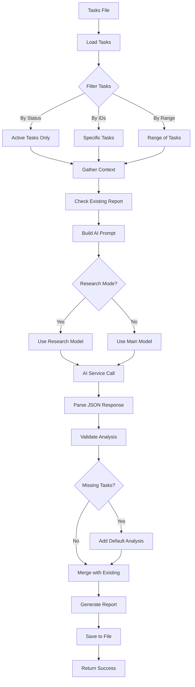

# Tool: analyze_project_complexity

## Purpose
Analyze task complexity using AI to determine difficulty scores (1-10 scale) and generate recommendations for the optimal number of subtasks needed for each task expansion.

## Business Value
- **Who uses this**: Developers and project managers planning task breakdown
- **What problem it solves**: Eliminates guesswork in determining task complexity and helps identify which tasks need further breakdown before implementation
- **Why it's better than manual approach**: AI-powered analysis provides consistent complexity scoring, considers project context, and generates specific expansion recommendations with implementation prompts

## Functionality Specification

### Input Requirements

| Parameter | Type | Required | Default | Description |
|-----------|------|----------|---------|-------------|
| `projectRoot` | string | Yes | - | Absolute path to the project directory |
| `threshold` | number | No | 5 | Complexity score threshold (1-10) to recommend expansion |
| `research` | boolean | No | false | Use research model for enhanced analysis |
| `output` | string | No | ".taskmaster/reports/task-complexity-report.json" | Output file path for report |
| `file` | string | No | ".taskmaster/tasks/tasks.json" | Path to tasks file |
| `ids` | string | No | - | Comma-separated list of specific task IDs to analyze |
| `from` | number | No | - | Starting task ID in a range to analyze |
| `to` | number | No | - | Ending task ID in a range to analyze |
| `tag` | string | No | Current tag | Tag context to operate on |

#### Validation Rules
1. `threshold` must be between 1-10
2. `projectRoot` must be an existing directory
3. Tasks file must exist and contain valid JSON
4. If `ids` specified, must be comma-separated integers
5. If `from`/`to` specified, must be positive integers with `from` <= `to`
6. Cannot use both `ids` and `from`/`to` range simultaneously

### Processing Logic

#### Step-by-Step Algorithm

```
1. VALIDATE_INPUTS
   - Check projectRoot exists
   - Validate threshold is 1-10
   - Resolve tag (use current if not specified)
   - Parse IDs or range if provided
   
2. LOAD_TASKS
   - Read tasks.json from specified path
   - Extract tasks for target tag
   - Count total tasks
   
3. FILTER_TASKS
   - Filter out completed/cancelled/deferred tasks (keep pending/blocked/in-progress)
   
   3.1 IF specific IDs provided:
      - Filter to only those task IDs
      - Warn if any IDs not found
      
   3.2 ELSE IF range (from/to) provided:
      - Filter to tasks within ID range
      - Use 1 as default 'from' if not specified
      - Use max task ID as default 'to' if not specified
      
   3.3 ELSE:
      - Use all active tasks
      
4. CHECK_EXISTING_REPORT
   - Try to load existing complexity report
   - Create lookup map of previous analyses by task ID
   - Will merge with new analysis later
   
5. GATHER_CONTEXT (Optional)
   - Use ContextGatherer to collect project context
   - Use FuzzyTaskSearch to find related tasks
   - Create searchQuery from task titles/descriptions
   - Gather context for up to 10 most relevant tasks
   
6. BUILD_AI_PROMPT
   - Load prompt template from src/prompts/analyze-complexity.json
   - Inject variables:
     - tasks: Array of filtered tasks
     - gatheredContext: Project context (if available)
     - useResearch: Research mode flag
     - isClaudeCode: Whether using Claude Code
     - projectRoot: For codebase analysis
     - threshold: Complexity threshold
   
7. CALL_AI_SERVICE
   - Use generateTextService (not streaming)
   - Role: 'research' if research mode, else 'main'
   - Parse JSON response
   
8. PROCESS_AI_RESPONSE
   - Clean response (remove markdown, extract JSON)
   - Parse JSON array of complexity analyses
   - Validate each entry has required fields:
     - taskId, taskTitle, complexityScore
     - recommendedSubtasks, expansionPrompt, reasoning
   
9. HANDLE_MISSING_ANALYSES
   - Check for tasks without analysis
   - Add default analysis for missing tasks:
     - complexityScore: 5
     - recommendedSubtasks: 3
     - Default reasoning
     
10. MERGE_WITH_EXISTING
    - If updating existing report:
      - Keep analyses for tasks not in current batch
      - Replace analyses for updated tasks
      - Preserve analysis for other tasks
      
11. GENERATE_REPORT
    - Create report structure:
      - metadata (timestamp, task counts, threshold)
      - complexityAnalysis array
      - summary statistics
    - Calculate high/medium/low complexity counts
    
12. SAVE_REPORT
    - Create output directory if needed
    - Write JSON report with formatting
    
13. RETURN_SUCCESS
    - Include summary statistics
    - Return telemetry data if available
```

### AI Prompts Used

#### System Prompt (from analyze-complexity.json)
```
You are an expert software architect and project manager analyzing task complexity. Respond only with the requested valid JSON array.
```

#### User Prompt (from analyze-complexity.json)
```
{{#if isClaudeCode}}## IMPORTANT: Codebase Analysis Required

You have access to powerful codebase analysis tools. Before analyzing task complexity:

1. Use the Glob tool to explore the project structure and understand the codebase size
2. Use the Grep tool to search for existing implementations related to each task
3. Use the Read tool to examine key files that would be affected by these tasks
4. Understand the current implementation state, patterns used, and technical debt

Based on your codebase analysis:
- Assess complexity based on ACTUAL code that needs to be modified/created
- Consider existing abstractions and patterns that could simplify implementation
- Identify tasks that require refactoring vs. greenfield development
- Factor in dependencies between existing code and new features
- Provide more accurate subtask recommendations based on real code structure

Project Root: {{projectRoot}}

{{/if}}Analyze the following tasks to determine their complexity (1-10 scale) and recommend the number of subtasks for expansion. Provide a brief reasoning and an initial expansion prompt for each.{{#if useResearch}} Consider current best practices, common implementation patterns, and industry standards in your analysis.{{/if}}

Tasks:
{{{json tasks}}}
{{#if gatheredContext}}

# Project Context

{{gatheredContext}}
{{/if}}

Respond ONLY with a valid JSON array matching the schema:
[
  {
    "taskId": <number>,
    "taskTitle": "<string>",
    "complexityScore": <number 1-10>,
    "recommendedSubtasks": <number>,
    "expansionPrompt": "<string>",
    "reasoning": "<string>"
  },
  ...
]

Do not include any explanatory text, markdown formatting, or code block markers before or after the JSON array.
```

### Output Specification

#### Success Response
```javascript
{
  success: true,
  data: {
    message: "Task complexity analysis complete. Report saved to .taskmaster/reports/task-complexity-report.json",
    reportPath: ".taskmaster/reports/task-complexity-report.json",
    reportSummary: {
      taskCount: 10,
      highComplexityTasks: 2,
      mediumComplexityTasks: 5,
      lowComplexityTasks: 3,
      recommendedForExpansion: 7
    }
  }
}
```

#### Report Structure (JSON file)
```javascript
{
  "meta": {
    "generatedAt": "2024-01-15T10:30:00.000Z",
    "tasksAnalyzed": 10,
    "thresholdScore": 5,
    "projectName": "My Project",
    "usedResearch": false
  },
  "complexityAnalysis": [
    {
      "taskId": 1,
      "taskTitle": "Setup authentication system",
      "complexityScore": 8,
      "recommendedSubtasks": 5,
      "expansionPrompt": "Break down the authentication system implementation into: 1) User model and database schema, 2) JWT token generation and validation, 3) Login/logout endpoints, 4) Password reset flow, 5) Session management",
      "reasoning": "Authentication involves multiple components including database models, security considerations, API endpoints, and session management. Each area requires careful implementation and testing."
    }
  ]
}
```

#### Error Response
```javascript
{
  success: false,
  error: {
    code: "ANALYZE_CORE_ERROR",
    message: "Error running core complexity analysis: No tasks found"
  }
}
```

#### Error Codes
- `MISSING_ARGUMENT`: Required parameters not provided
- `ANALYZE_CORE_ERROR`: Core analysis function failed
- `ANALYZE_REPORT_MISSING`: Analysis completed but no report created
- `INVALID_CORE_RESPONSE`: Invalid response from analysis
- `FILE_NOT_FOUND`: Tasks file doesn't exist
- `INVALID_THRESHOLD`: Threshold outside 1-10 range

### Side Effects
1. Creates/updates complexity report JSON file
2. Creates `.taskmaster/reports/` directory if needed
3. Logs telemetry data for AI usage
4. May trigger AI service costs

## Data Flow



## Implementation Details

### Data Storage
- **Input**: `.taskmaster/tasks/tasks.json` - Task data by tag
- **Output**: `.taskmaster/reports/task-complexity-report.json` - Analysis report
- **Report Format**: JSON with metadata and analysis array
- **Tag Support**: Reports can be tag-specific

### Complexity Scoring
- **1-3**: Low complexity - straightforward implementation
- **4-6**: Medium complexity - moderate effort required
- **7-10**: High complexity - significant effort, should be broken down

### Task Filtering
- Automatically excludes: done, cancelled, deferred tasks
- Includes: pending, blocked, in-progress tasks
- Supports selective analysis via IDs or ranges

### Context Gathering
- Uses FuzzyTaskSearch for relevance scoring
- Gathers context from up to 10 related tasks
- Formats context for AI consumption

## AI Integration Points
This tool is heavily AI-integrated:
- **Complexity Scoring**: AI analyzes each task to assign 1-10 score
- **Subtask Recommendations**: AI suggests optimal number of subtasks
- **Expansion Prompts**: AI generates specific prompts for task breakdown
- **Reasoning**: AI provides justification for scores and recommendations
- **Research Mode**: Enhanced analysis with current best practices
- **Claude Code Integration**: Special mode for codebase-aware analysis

## Dependencies
- **File System Access**: Read tasks, write report
- **AI Service**: Required for complexity analysis
- **Prompt Manager**: Loads and renders prompt templates
- **Context Gatherer**: Optional project context collection
- **Fuzzy Task Search**: Finding related tasks for context
- **Other Task Master Tools**: Works with expand_task, complexity_report

## Test Scenarios

### 1. Basic Analysis
```javascript
// Test: Analyze all active tasks
Input: {
  projectRoot: "/project",
  threshold: 5
}
Expected: Success with report for all active tasks
```

### 2. Specific Task IDs
```javascript
// Test: Analyze specific tasks
Input: {
  projectRoot: "/project",
  ids: "1,3,5,7"
}
Expected: Success with analysis for only those 4 tasks
```

### 3. Range Analysis
```javascript
// Test: Analyze task range
Input: {
  projectRoot: "/project",
  from: 5,
  to: 15
}
Expected: Success with analysis for tasks 5-15
```

### 4. Research Mode
```javascript
// Test: Enhanced analysis with research
Input: {
  projectRoot: "/project",
  research: true
}
Expected: Success with detailed reasoning using best practices
```

### 5. High Threshold
```javascript
// Test: Only recommend very complex tasks
Input: {
  projectRoot: "/project",
  threshold: 8
}
Expected: Report with only 8+ complexity tasks marked for expansion
```

### 6. Update Existing Report
```javascript
// Test: Partial update of existing report
Setup: Report exists with 10 task analyses
Input: {
  projectRoot: "/project",
  ids: "2,4,6"
}
Expected: Report updated for tasks 2,4,6; others preserved
```

### 7. No Active Tasks
```javascript
// Test: All tasks completed
Setup: All tasks marked as done
Input: {
  projectRoot: "/project"
}
Expected: Empty report with 0 tasks analyzed
```

## Implementation Notes
- **Complexity**: Medium (AI integration, context gathering)
- **Estimated Effort**: 6-8 hours for complete implementation
- **Critical Success Factors**:
  1. Accurate complexity scoring algorithm
  2. Meaningful subtask recommendations
  3. Clear expansion prompts for developers
  4. Proper handling of existing reports
  5. Robust JSON parsing from AI response

## Performance Considerations
- AI call is not streamed (single response)
- Context gathering adds overhead for large task sets
- Report merging preserves previous analyses
- Synchronous file I/O for consistency
- Token usage scales with number of tasks

## Security Considerations
- Validate file paths to prevent directory traversal
- Sanitize task content before sending to AI
- Don't include sensitive data in reports
- API keys stored in environment variables
- Validate AI response against expected schema

## Code References
- Current implementation: `scripts/modules/task-manager/analyze-task-complexity.js`
- MCP tool: `mcp-server/src/tools/analyze.js`
- Direct function: `mcp-server/src/core/direct-functions/analyze-task-complexity.js`
- Prompt template: `src/prompts/analyze-complexity.json`
- Key functions:
  - `analyzeTaskComplexity()`: Main analysis logic
  - `generateInternalComplexityAnalysisPrompt()`: Fallback prompt generation
  - `analyzeTaskComplexityDirect()`: MCP wrapper
- Design patterns: Strategy pattern for role selection

---

*This documentation captures the actual current implementation of the analyze_project_complexity tool including exact AI prompts used.*