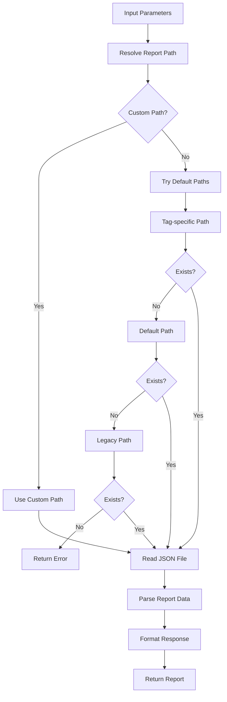

# Tool: complexity_report

## Purpose
Display the existing complexity analysis report in a readable format, showing task complexity scores, recommended subtask counts, and analysis reasoning for all tasks in the project.

## Business Value
- **Who uses this**: Developers and project managers reviewing task complexity
- **What problem it solves**: Provides visibility into task complexity analysis results and recommendations for task breakdown
- **Why it's better than manual approach**: Automatically formats and presents complexity data in a clear, actionable format

## Functionality Specification

### Input Requirements

| Parameter | Type | Required | Default | Description |
|-----------|------|----------|---------|-------------|
| `file` | string | No | ".taskmaster/reports/task-complexity-report.json" | Path to report file |
| `projectRoot` | string | Yes | - | Absolute path to project directory |

#### Validation Rules
1. `projectRoot` must be an existing directory
2. Complexity report file must exist
3. Report must contain valid JSON structure

### Processing Logic

#### Step-by-Step Algorithm

```
1. VALIDATE_INPUTS
   - Verify projectRoot exists
   - Resolve current tag context
   
2. FIND_REPORT_PATH
   - Check custom path if provided
   - Try tag-specific report path
   - Try default report path
   - Try legacy report path
   - Return error if not found
   
3. READ_REPORT_FILE
   - Load JSON from report file
   - Parse complexity data structure
   - Validate report format
   
4. FORMAT_REPORT_DATA
   - Extract task analyses
   - Include complexity scores
   - Include recommendations
   - Include telemetry data
   
5. RETURN_FORMATTED_REPORT
   - Return structured data
   - Include report path for reference
   - Include timestamp if available
```

### AI Prompts Used

**This tool does not use AI**. It's a pure data retrieval tool that:
- Reads existing complexity report
- Formats data for display
- No AI calls or prompts involved
- Report was generated by `analyze_project_complexity` tool

### Output Specification

#### Success Response
```javascript
{
  success: true,
  data: {
    report: {
      timestamp: "2024-01-15T10:30:00.000Z",
      tasksAnalyzed: 10,
      totalComplexity: 65,
      averageComplexity: 6.5,
      complexityDistribution: {
        low: 2,      // 1-3 complexity
        medium: 5,   // 4-6 complexity  
        high: 3      // 7-10 complexity
      },
      taskAnalyses: [
        {
          id: 1,
          title: "Implement authentication system",
          originalDescription: "Create JWT-based auth...",
          complexity: {
            score: 8,
            category: "high",
            reasoning: "Complex security requirements, multiple integration points, session management",
            recommendedSubtasks: 7,
            factors: {
              technical: "High - Security protocols, encryption",
              integration: "Medium - Database, API endpoints",
              testing: "High - Security testing required"
            }
          }
        }
      ],
      recommendations: {
        highComplexityTasks: [1, 3, 7],
        suggestedForBreakdown: [1, 3],
        totalRecommendedSubtasks: 45
      },
      telemetryData: {
        totalTokens: 12500,
        totalCost: 0.25,
        provider: "anthropic",
        model: "claude-3-5-sonnet-20241022"
      }
    },
    reportPath: "/project/.taskmaster/reports/task-complexity-report.json"
  }
}
```

#### Error Response
```javascript
{
  success: false,
  error: {
    code: "FILE_NOT_FOUND_ERROR",
    message: "No complexity report found at /project/.taskmaster/reports/task-complexity-report.json. Run 'analyze-complexity' first."
  }
}
```

#### Error Codes
- `MISSING_ARGUMENT`: Required parameters not provided
- `FILE_NOT_FOUND_ERROR`: Complexity report doesn't exist
- `READ_ERROR`: Error reading or parsing report file
- `UNEXPECTED_ERROR`: System error during retrieval

### Side Effects
1. **Read-only operation** - No modifications to data
2. Reads complexity report JSON file
3. No AI service calls
4. No file writes
5. No task modifications

## Data Flow



## Implementation Details

### Data Storage
- **Input**: `.taskmaster/reports/task-complexity-report.json` - Complexity analysis results
- **Legacy Path**: `.taskmaster/complexity-report.json` - Old location
- **Tag-specific**: `.taskmaster/reports/[tag]/task-complexity-report.json`
- **Output**: No data storage (read-only)

### Report Structure
```javascript
{
  timestamp: "ISO 8601 date",
  tasksAnalyzed: number,
  totalComplexity: number,
  averageComplexity: number,
  complexityDistribution: {
    low: number,    // Count of 1-3 complexity
    medium: number, // Count of 4-6 complexity
    high: number    // Count of 7-10 complexity
  },
  taskAnalyses: [
    {
      id: number,
      title: string,
      complexity: {
        score: number,        // 1-10
        category: string,     // "low", "medium", "high"
        reasoning: string,
        recommendedSubtasks: number
      }
    }
  ],
  telemetryData: {
    totalTokens: number,
    totalCost: number,
    provider: string,
    model: string
  }
}
```

### Path Resolution Priority
1. Custom path (if provided)
2. Tag-specific path
3. Default path
4. Legacy path (backward compatibility)

## AI Integration Points
**This tool has no AI integration**. It's a pure data operation that:
- Reads existing analysis results
- Displays previously calculated complexity scores
- No model calls or prompts
- Analysis was performed by `analyze_project_complexity`

## Dependencies
- **File System Access**: Read-only access to JSON files
- **Path Utils**: Report path resolution logic
- **Silent Mode**: Prevents console output interference

## Test Scenarios

### 1. Read Default Report
```javascript
// Test: Read report from default location
Input: {
  projectRoot: "/project"
}
Expected: Report data from default path
```

### 2. Custom Report Path
```javascript
// Test: Read from custom location
Input: {
  file: "/custom/path/report.json",
  projectRoot: "/project"
}
Expected: Report data from custom path
```

### 3. Tag-Specific Report
```javascript
// Test: Read tag-specific report
Setup: Current tag is "feature-auth"
Input: {
  projectRoot: "/project"
}
Expected: Report from .taskmaster/reports/feature-auth/
```

### 4. Report Not Found
```javascript
// Test: Handle missing report
Setup: No report file exists
Input: {
  projectRoot: "/project"
}
Expected: FILE_NOT_FOUND_ERROR with helpful message
```

### 5. Legacy Path Fallback
```javascript
// Test: Fall back to legacy location
Setup: Report only exists at legacy path
Input: {
  projectRoot: "/project"
}
Expected: Successfully reads from legacy path
```

### 6. Invalid JSON
```javascript
// Test: Handle corrupted report
Setup: Report file contains invalid JSON
Input: {
  projectRoot: "/project"
}
Expected: READ_ERROR with parse error details
```

### 7. Empty Report
```javascript
// Test: Handle empty report file
Setup: Report file exists but is empty
Input: {
  projectRoot: "/project"
}
Expected: Appropriate error or empty data response
```

### 8. Large Report
```javascript
// Test: Handle large task list
Setup: Report contains 100+ tasks
Input: {
  projectRoot: "/project"
}
Expected: Successfully loads and returns all data
```

## Implementation Notes
- **Complexity**: Low (simple file reading)
- **Estimated Effort**: 1-2 hours for complete implementation
- **Critical Success Factors**:
  1. Proper path resolution logic
  2. Graceful handling of missing reports
  3. Clear error messages
  4. Support for legacy paths
  5. Efficient JSON parsing

## Performance Considerations
- O(1) file read operation
- JSON parsing scales with report size
- No network calls or AI operations
- Fast response times
- Consider streaming for very large reports

## Security Considerations
- Read-only operation (no data modification risk)
- Validate file paths to prevent directory traversal
- No external API calls
- No sensitive data exposure
- Safe for concurrent access

## Code References
- Current implementation: `readComplexityReport()` utility function
- MCP tool: `mcp-server/src/tools/complexity-report.js`
- Direct function: `mcp-server/src/core/direct-functions/complexity-report.js`
- Key functions:
  - `complexityReportDirect()`: Main report retrieval logic
  - `readComplexityReport()`: File reading utility
  - `findComplexityReportPath()`: Path resolution logic
- Design patterns: Path fallback pattern, read-only data access

---

*This documentation captures the actual current implementation of the complexity_report tool.*