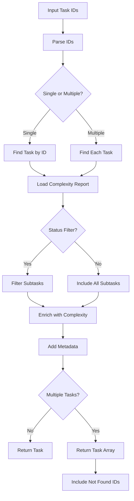

# Tool: get_task

## Purpose
Retrieve detailed information about a specific task or multiple tasks by ID, including subtasks, dependencies, and optional complexity scoring from reports.

## Business Value
- **Who uses this**: Developers needing task details for implementation
- **What problem it solves**: Provides complete task context including subtasks, dependencies, complexity scores, and implementation details
- **Why it's better than manual approach**: Automatically enriches task data with complexity analysis, supports multiple task lookups, and filters subtasks by status

## Functionality Specification

### Input Requirements

| Parameter | Type | Required | Default | Description |
|-----------|------|----------|---------|-------------|
| `id` | string | Yes | - | Task ID(s) - comma-separated for multiple |
| `status` | string | No | - | Filter subtasks by status |
| `file` | string | No | ".taskmaster/tasks/tasks.json" | Path to tasks file |
| `complexityReport` | string | No | - | Path to complexity report file |
| `projectRoot` | string | Yes | - | Absolute path to project directory |
| `tag` | string | No | Current tag | Tag context to operate on |

#### Validation Rules
1. `projectRoot` must be an existing directory
2. Task ID(s) must be provided (non-empty)
3. Tasks file must exist and contain valid JSON
4. Multiple IDs separated by commas are supported

### Processing Logic

#### Step-by-Step Algorithm

```
1. VALIDATE_INPUTS
   - Verify projectRoot exists
   - Resolve tag (use current if not specified)
   - Parse task IDs from comma-separated string
   
2. LOAD_TASK_DATA
   - Find tasks.json file path
   - Read tasks for specified tag
   - Validate data structure
   
3. LOAD_COMPLEXITY_REPORT (Optional)
   - Try to find complexity report path
   - Read complexity analysis if exists
   - Prepare for task enrichment
   
4. PROCESS_TASK_IDS
   - Split comma-separated IDs
   - Trim whitespace from each ID
   - Filter empty values
   
5. FOR SINGLE TASK ID:
   - Find task by ID in task hierarchy
   - If subtask requested, find parent and extract
   - Apply subtask status filter if provided
   - Enrich with complexity data if available
   - Return task with metadata
   
6. FOR MULTIPLE TASK IDS:
   - Iterate through each ID
   - Find each task independently
   - Track found vs not found
   - Collect all found tasks
   - Return batch results with metadata
   
7. ENRICH_TASK_DATA
   - Add complexity score if available
   - Include original subtask count before filtering
   - Add filter metadata if status filter applied
   
8. FORMAT_RESPONSE
   - Single task: Return task object directly
   - Multiple tasks: Return array with metadata
   - Include not found IDs for multiple requests
```

### AI Prompts Used

**This tool does not use AI**. It's a pure data retrieval tool that:
- Reads from JSON files
- Finds tasks by ID
- Enriches with complexity data
- Filters subtasks by status
- No AI calls or prompts involved

### Output Specification

#### Success Response (Single Task)
```javascript
{
  success: true,
  data: {
    id: "1.2",
    title: "Implement authentication system",
    description: "Create JWT-based authentication",
    status: "in-progress",
    priority: "high",
    dependencies: ["1.1"],
    details: "Use bcrypt for password hashing, JWT for tokens...",
    testStrategy: "Unit tests for auth functions, integration tests",
    subtasks: [
      {
        id: "1.2.1",
        title: "Create user model",
        status: "done"
      }
    ],
    complexity: {
      score: 7,
      reasoning: "Complex security requirements"
    },
    _originalSubtaskCount: 5,  // If status filter applied
    _subtaskFilter: "pending"   // If status filter applied
  }
}
```

#### Success Response (Multiple Tasks)
```javascript
{
  success: true,
  data: {
    tasks: [
      { /* task 1 data */ },
      { /* task 2 data */ }
    ],
    requestedIds: ["1", "2", "3"],
    foundCount: 2,
    notFoundIds: ["3"],
    isMultiple: true
  }
}
```

#### Error Response
```javascript
{
  success: false,
  error: {
    code: "TASK_NOT_FOUND",
    message: "Task or subtask with ID 1.5 not found"
  }
}
```

#### Error Codes
- `TASKS_FILE_NOT_FOUND`: Tasks file doesn't exist
- `INVALID_TASKS_DATA`: Invalid data structure in tasks file
- `INVALID_TASK_ID`: No valid task IDs provided
- `TASK_NOT_FOUND`: Specified task ID doesn't exist
- `TASK_OPERATION_ERROR`: Error during task retrieval

### Side Effects
1. **Read-only operation** - No modifications to data
2. Reads tasks.json file
3. Optionally reads complexity report file
4. No AI service calls
5. No file writes

## Data Flow



## Implementation Details

### Data Storage
- **Input**: `.taskmaster/tasks/tasks.json` - Task data by tag
- **Complexity Report**: `.taskmaster/reports/task-complexity-report.json` - Optional complexity scores
- **Output**: No data storage (read-only)

### Task Hierarchy Navigation
```javascript
// Finding nested tasks/subtasks
function findTaskById(tasks, id) {
  // Check main tasks
  for (const task of tasks) {
    if (task.id === id) return task;
    
    // Check subtasks recursively
    if (task.subtasks) {
      const found = findTaskById(task.subtasks, id);
      if (found) return found;
    }
  }
  return null;
}
```

### Subtask Filtering
- Applied when `status` parameter provided
- Preserves original subtask count in metadata
- Filters subtasks array to matching status only
- Useful for viewing only pending work

### Multiple Task Support
- Comma-separated IDs: "1,2,3" or "1.1,2.3,4"
- Batch retrieval for efficiency
- Tracks which IDs were not found
- Returns all found tasks with metadata

## AI Integration Points
**This tool has no AI integration**. It's a pure data operation that:
- Reads existing data
- Finds tasks by ID
- Enriches with stored complexity scores
- No model calls or prompts

## Dependencies
- **File System Access**: Read-only access to JSON files
- **Complexity Report**: Optional integration for scoring
- **Utils Module**: Task finding and data reading utilities

## Test Scenarios

### 1. Get Single Task
```javascript
// Test: Retrieve single task details
Input: {
  id: "1",
  projectRoot: "/project"
}
Expected: Complete task object with all fields
```

### 2. Get Subtask
```javascript
// Test: Retrieve subtask by ID
Input: {
  id: "1.2",
  projectRoot: "/project"
}
Expected: Subtask object with parent context
```

### 3. Filter Subtasks by Status
```javascript
// Test: Get task with only pending subtasks
Input: {
  id: "1",
  status: "pending",
  projectRoot: "/project"
}
Expected: Task with filtered subtasks, _originalSubtaskCount metadata
```

### 4. Multiple Tasks
```javascript
// Test: Retrieve multiple tasks at once
Input: {
  id: "1,2,3",
  projectRoot: "/project"
}
Expected: Array of tasks with metadata about found/not found
```

### 5. With Complexity Report
```javascript
// Test: Include complexity scoring
Input: {
  id: "1",
  complexityReport: ".taskmaster/reports/task-complexity-report.json",
  projectRoot: "/project"
}
Expected: Task with complexity field populated
```

### 6. Task Not Found
```javascript
// Test: Handle non-existent task
Input: {
  id: "999",
  projectRoot: "/project"
}
Expected: Error with TASK_NOT_FOUND code
```

### 7. Mixed Found/Not Found
```javascript
// Test: Multiple IDs with some not found
Input: {
  id: "1,999,2",
  projectRoot: "/project"
}
Expected: Found tasks returned, notFoundIds: ["999"]
```

### 8. Tag-Specific Task
```javascript
// Test: Get task from specific tag
Input: {
  id: "1",
  tag: "feature-auth",
  projectRoot: "/project"
}
Expected: Task from feature-auth tag context
```

## Implementation Notes
- **Complexity**: Low (no AI, simple lookups)
- **Estimated Effort**: 2-3 hours for complete implementation
- **Critical Success Factors**:
  1. Efficient task finding algorithm
  2. Proper subtask filtering logic
  3. Clean multiple task handling
  4. Graceful handling of missing complexity report
  5. Clear error messages for not found tasks

## Performance Considerations
- O(n) complexity for finding tasks
- Loads entire task file into memory
- No network calls or AI operations
- Fast response times even for multiple tasks
- Consider indexing for very large task lists

## Security Considerations
- Read-only operation (no data modification risk)
- Validate file paths to prevent directory traversal
- No external API calls
- No sensitive data exposure
- Safe for concurrent access

## Code References
- Current implementation: Uses `findTaskById` utility function
- MCP tool: `mcp-server/src/tools/get-task.js`
- Direct function: `mcp-server/src/core/direct-functions/show-task.js`
- Key functions:
  - `showTaskDirect()`: Main task retrieval logic
  - `findTaskById()`: Recursive task finding in hierarchy
  - `readComplexityReport()`: Loads complexity scores
  - `processTaskResponse()`: Cleans response data
- Design patterns: Recursive search pattern, batch processing for multiple IDs

---

*This documentation captures the actual current implementation of the get_task tool.*