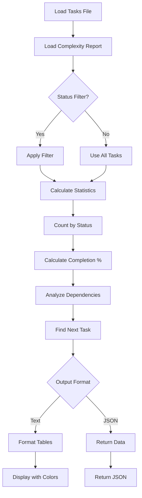

# Tool: get_tasks

## Purpose
Retrieve and display all tasks from the Task Master system with optional filtering by status, complexity scoring integration, and detailed statistics about task completion and progress.

## Business Value
- **Who uses this**: Developers, project managers, and team leads tracking work
- **What problem it solves**: Provides comprehensive visibility into all tasks, their statuses, dependencies, and overall project progress
- **Why it's better than manual approach**: Automatically calculates statistics, integrates complexity scores, validates dependencies, and provides multiple view formats

## Functionality Specification

### Input Requirements

| Parameter | Type | Required | Default | Description |
|-----------|------|----------|---------|-------------|
| `status` | string | No | "all" | Filter by status (single or comma-separated) |
| `withSubtasks` | boolean | No | false | Include subtasks in response |
| `file` | string | No | ".taskmaster/tasks/tasks.json" | Path to tasks file |
| `complexityReport` | string | No | - | Path to complexity report file |
| `projectRoot` | string | Yes | - | Absolute path to project directory |
| `tag` | string | No | Current tag | Tag context to operate on |

#### Validation Rules
1. `projectRoot` must be an existing directory
2. Tasks file must exist and contain valid JSON
3. Status filter can be single status or comma-separated list
4. Valid statuses: pending, in-progress, done, blocked, deferred, cancelled, review

### Processing Logic

#### Step-by-Step Algorithm

```
1. VALIDATE_INPUTS
   - Verify projectRoot exists
   - Resolve tag (use current if not specified)
   - Find tasks.json file path
   
2. LOAD_TASK_DATA
   - Read tasks.json from specified path
   - Extract tasks for target tag
   - Validate data structure
   
3. LOAD_COMPLEXITY_REPORT (Optional)
   - Try to find complexity report path
   - Read complexity analysis if exists
   - Map complexity scores to tasks
   
4. APPLY_STATUS_FILTER
   - IF status filter provided:
      - Parse comma-separated statuses
      - Filter tasks matching any status
   - ELSE:
      - Include all tasks
      
5. CALCULATE_TASK_STATISTICS
   - Count tasks by status:
      - done/completed
      - in-progress
      - pending
      - blocked
      - deferred
      - cancelled
      - review
   - Calculate completion percentage
   
6. CALCULATE_SUBTASK_STATISTICS
   - For each task with subtasks:
      - Count subtasks by status
      - Track total subtasks
   - Calculate subtask completion percentage
   
7. ANALYZE_DEPENDENCIES
   - Find completed task IDs
   - For each task:
      - Check if dependencies are met
      - Identify blocked dependencies
      - Count met vs unmet dependencies
      
8. BUILD_RESPONSE_STRUCTURE
   - Include filtered tasks
   - Add statistics object
   - Include dependency analysis
   - Add complexity scores if available
   
9. FORMAT_OUTPUT
   - IF text format:
      - Create visual tables
      - Add progress bars
      - Format with colors
   - IF json format:
      - Return structured data
      
10. RETURN_RESULTS
    - Tasks array
    - Statistics summary
    - Dependency information
    - Next task recommendation
```

### AI Prompts Used

**This tool does not use AI**. It's a pure data retrieval and calculation tool that:
- Reads from JSON files
- Performs statistical calculations
- Filters and formats data
- No AI calls or prompts involved

### Output Specification

#### Success Response (JSON Format)
```javascript
{
  success: true,
  data: {
    tasks: [
      {
        id: 1,
        title: "Setup authentication system",
        description: "Implement JWT-based auth",
        status: "in-progress",
        priority: "high",
        dependencies: [],
        subtasks: [
          {
            id: "1.1",
            title: "Create user model",
            status: "done",
            dependencies: []
          }
        ],
        complexity: {
          score: 8,
          recommendedSubtasks: 5,
          reasoning: "Complex security requirements"
        }
      }
    ],
    statistics: {
      totalTasks: 10,
      completedTasks: 3,
      completionPercentage: 30,
      byStatus: {
        done: 3,
        inProgress: 2,
        pending: 4,
        blocked: 1,
        deferred: 0,
        cancelled: 0,
        review: 0
      },
      subtasks: {
        total: 25,
        completed: 8,
        completionPercentage: 32,
        byStatus: {
          done: 8,
          inProgress: 5,
          pending: 10,
          blocked: 2
        }
      }
    },
    dependencies: {
      tasksWithDependencies: 4,
      allDependenciesMet: 2,
      someUnmetDependencies: 2
    },
    nextTask: {
      id: 5,
      title: "Implement login endpoint",
      reason: "No dependencies, high priority"
    }
  }
}
```

#### Text Format Output
```
╔══════════════════════════════════════════════════════════════════╗
║                         TASK MASTER                              ║
╠══════════════════════════════════════════════════════════════════╣
║ Project: My Project | Tag: master | Tasks: 10                    ║
╚══════════════════════════════════════════════════════════════════╝

📊 Overall Progress
Tasks:    [████████░░░░░░░░░░░░] 30% (3/10)
Subtasks: [████████░░░░░░░░░░░░] 32% (8/25)

📈 Task Status Breakdown
┌─────────────┬───────┬──────────┐
│ Status      │ Tasks │ Subtasks │
├─────────────┼───────┼──────────┤
│ ✅ Done     │   3   │    8     │
│ 🔄 Progress │   2   │    5     │
│ ⏳ Pending  │   4   │   10     │
│ 🚫 Blocked  │   1   │    2     │
└─────────────┴───────┴──────────┘

📋 Task List
┌────┬──────────────────────┬────────────┬──────┬─────────┬────────┐
│ ID │ Title                │ Status     │ Pri  │ Complex │ Deps   │
├────┼──────────────────────┼────────────┼──────┼─────────┼────────┤
│ 1  │ Setup authentication │ In Progress│ High │   8/10  │ ✅     │
│ 2  │ Create API endpoints │ Pending    │ Med  │   6/10  │ ⚠️ [1] │
└────┴──────────────────────┴────────────┴──────┴─────────┴────────┘

💡 Next Recommended Task: #5 - Implement login endpoint
```

#### Error Response
```javascript
{
  success: false,
  error: {
    code: "FILE_NOT_FOUND",
    message: "No valid tasks found in /project/.taskmaster/tasks/tasks.json"
  }
}
```

#### Error Codes
- `MISSING_ARGUMENT`: Required parameters not provided
- `FILE_NOT_FOUND`: Tasks file doesn't exist
- `INVALID_CORE_RESPONSE`: Invalid data structure in tasks file
- `LIST_TASKS_CORE_ERROR`: Error during task processing

### Side Effects
1. **Read-only operation** - No modifications to data
2. Reads tasks.json file
3. Optionally reads complexity report file
4. No AI service calls
5. No file writes

## Data Flow



## Implementation Details

### Data Storage
- **Input**: `.taskmaster/tasks/tasks.json` - Task data by tag
- **Complexity Report**: `.taskmaster/reports/task-complexity-report.json` - Optional complexity scores
- **Output**: No data storage (read-only)

### Status Filtering
- Supports single status: `"pending"`
- Supports multiple statuses: `"blocked,deferred"`
- Case-insensitive matching
- "all" or no filter returns all tasks

### Statistics Calculation
```javascript
// Task completion
completionPercentage = (completedTasks / totalTasks) * 100

// Subtask completion  
subtaskCompletionPercentage = (completedSubtasks / totalSubtasks) * 100

// Dependency analysis
tasksWithUnmetDeps = tasks.filter(task => 
  task.dependencies.some(dep => !completedTaskIds.has(dep))
)
```

### Next Task Selection
Prioritizes tasks by:
1. No unmet dependencies
2. Status is "pending"
3. Highest priority (critical > high > medium > low)
4. Lowest task ID as tiebreaker

## AI Integration Points
**This tool has no AI integration**. It's a pure data operation that:
- Reads existing data
- Performs calculations
- Formats output
- No model calls or prompts

## Dependencies
- **File System Access**: Read-only access to JSON files
- **Complexity Report**: Optional integration for scoring
- **UI Module**: For text formatting and colors
- **CLI Table**: For visual table generation
- **Chalk/Boxen**: For terminal styling

## Test Scenarios

### 1. Get All Tasks
```javascript
// Test: Retrieve all tasks without filtering
Input: {
  projectRoot: "/project"
}
Expected: All tasks with statistics
```

### 2. Filter by Status
```javascript
// Test: Get only pending tasks
Input: {
  status: "pending",
  projectRoot: "/project"
}
Expected: Only pending tasks returned
```

### 3. Multiple Status Filter
```javascript
// Test: Get blocked and deferred tasks
Input: {
  status: "blocked,deferred",
  projectRoot: "/project"
}
Expected: Tasks with blocked OR deferred status
```

### 4. With Subtasks
```javascript
// Test: Include subtask details
Input: {
  withSubtasks: true,
  projectRoot: "/project"
}
Expected: Tasks with nested subtask arrays
```

### 5. With Complexity Report
```javascript
// Test: Include complexity scores
Input: {
  complexityReport: ".taskmaster/reports/task-complexity-report.json",
  projectRoot: "/project"
}
Expected: Tasks include complexity field with scores
```

### 6. Empty Task List
```javascript
// Test: Handle empty tasks file
Setup: tasks.json contains empty tasks array
Input: {
  projectRoot: "/project"
}
Expected: Success with empty tasks array, 0% completion
```

### 7. Tag-Specific Tasks
```javascript
// Test: Get tasks for specific tag
Input: {
  tag: "feature-auth",
  projectRoot: "/project"
}
Expected: Only tasks for feature-auth tag
```

### 8. Invalid Status Filter
```javascript
// Test: Handle invalid status
Input: {
  status: "invalid-status",
  projectRoot: "/project"
}
Expected: Empty results (no tasks match)
```

## Implementation Notes
- **Complexity**: Low (no AI, simple data operations)
- **Estimated Effort**: 3-4 hours for complete implementation
- **Critical Success Factors**:
  1. Accurate statistics calculation
  2. Proper dependency analysis
  3. Efficient filtering logic
  4. Clean output formatting
  5. Graceful handling of missing complexity report

## Performance Considerations
- O(n) complexity for filtering
- O(n*m) for dependency analysis (n tasks, m deps)
- Minimal memory usage (loads entire file once)
- No network calls or AI operations
- Fast response times even for large task lists

## Security Considerations
- Read-only operation (no data modification risk)
- Validate file paths to prevent directory traversal
- No external API calls
- No sensitive data exposure
- Safe for concurrent access

## Code References
- Current implementation: `scripts/modules/task-manager/list-tasks.js`
- MCP tool: `mcp-server/src/tools/get-tasks.js`
- Direct function: `mcp-server/src/core/direct-functions/list-tasks.js`
- Key functions:
  - `listTasks()`: Main listing logic
  - `addComplexityToTask()`: Merges complexity scores
  - `formatDependenciesWithStatus()`: Dependency formatting
  - `findNextTask()`: Next task recommendation
  - `createProgressBar()`: Visual progress indicators
- Design patterns: Filter pattern, statistics aggregation

---

*This documentation captures the actual current implementation of the get_tasks tool.*