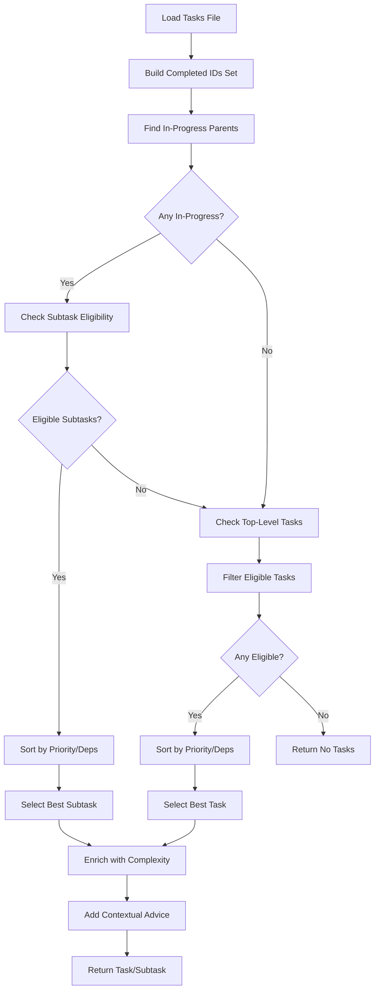

# Tool: next_task

## Purpose
Intelligently find the next task or subtask to work on based on priorities, dependencies, and task statuses, preferring subtasks of in-progress parent tasks over new top-level tasks.

## Business Value
- **Who uses this**: Developers needing to know what to work on next
- **What problem it solves**: Eliminates decision paralysis by automatically selecting the most appropriate task based on dependencies and priorities
- **Why it's better than manual approach**: Considers complex dependency graphs, prioritizes work already in progress, and ensures prerequisites are met before suggesting tasks

## Functionality Specification

### Input Requirements

| Parameter | Type | Required | Default | Description |
|-----------|------|----------|---------|-------------|
| `file` | string | No | ".taskmaster/tasks/tasks.json" | Path to tasks file |
| `complexityReport` | string | No | - | Path to complexity report file |
| `projectRoot` | string | Yes | - | Absolute path to project directory |
| `tag` | string | No | Current tag | Tag context to operate on |

#### Validation Rules
1. `projectRoot` must be an existing directory
2. Tasks file must exist and contain valid JSON
3. Tasks must have proper dependency structure

### Processing Logic

#### Step-by-Step Algorithm

```
1. VALIDATE_INPUTS
   - Verify projectRoot exists
   - Resolve tag (use current if not specified)
   - Find tasks.json file path
   
2. LOAD_TASK_DATA
   - Read tasks.json from specified path
   - Extract tasks for target tag
   - Validate data structure
   
3. LOAD_COMPLEXITY_REPORT (Optional)
   - Try to find complexity report path
   - Read complexity analysis if exists
   - Prepare for task enrichment
   
4. BUILD_COMPLETED_ID_SET
   - Iterate through all tasks and subtasks
   - Add IDs with status "done" or "completed" to set
   - Use for dependency satisfaction checking
   
5. PRIORITIZE_SUBTASKS_OF_IN_PROGRESS_TASKS
   - Find all parent tasks with status "in-progress"
   - For each parent's subtasks:
      - Check if status is "pending" or "in-progress"
      - Convert dependencies to full dotted notation
      - Check if all dependencies are satisfied
      - Add eligible subtasks to candidates list
   
6. IF SUBTASK_CANDIDATES_EXIST:
   - Sort candidates by:
      1. Priority (high > medium > low)
      2. Dependency count (fewer deps first)
      3. Parent ID (numerically)
      4. Subtask ID (numerically)
   - Return highest-ranked subtask
   
7. ELSE FALLBACK_TO_TOP_LEVEL_TASKS:
   - Filter tasks with status "pending" or "in-progress"
   - Check dependency satisfaction for each
   - Sort eligible tasks by:
      1. Priority (high > medium > low)
      2. Dependency count (fewer deps first)
      3. Task ID (numerically)
   - Return highest-ranked task
   
8. ENRICH_WITH_COMPLEXITY
   - If complexity report available
   - Add complexity score to selected task
   - Include in response
   
9. ADD_CONTEXTUAL_ADVICE
   - For subtasks: Suggest updating with progress notes
   - For tasks: Suggest high-level updates
   - Include guidance on using research mode
```

### AI Prompts Used

**This tool does not use AI**. It's a pure algorithmic tool that:
- Analyzes task dependencies
- Prioritizes based on status and priority
- Selects optimal next work item
- No AI calls or prompts involved

### Output Specification

#### Success Response (Task Found)
```javascript
{
  success: true,
  data: {
    nextTask: {
      id: "1.2",
      title: "Implement authentication module",
      status: "pending",
      priority: "high",
      dependencies: ["1.1"],
      parentId: 1,  // Only for subtasks
      complexity: {
        score: 7,
        reasoning: "Complex security requirements"
      }
    },
    isSubtask: true,
    nextSteps: "When ready to work on the subtask, use set-status to set the status to \"in progress\" Subtasks can be updated with timestamped details as you implement them..."
  }
}
```

#### Success Response (No Tasks Available)
```javascript
{
  success: true,
  data: {
    message: "No eligible next task found. All tasks are either completed or have unsatisfied dependencies",
    nextTask: null
  }
}
```

#### Error Response
```javascript
{
  success: false,
  error: {
    code: "INVALID_TASKS_FILE",
    message: "No valid tasks found in /project/.taskmaster/tasks/tasks.json"
  }
}
```

#### Error Codes
- `MISSING_ARGUMENT`: Required parameters not provided
- `INVALID_TASKS_FILE`: Tasks file doesn't exist or invalid
- `CORE_FUNCTION_ERROR`: Error during task finding logic
- `UNEXPECTED_ERROR`: Unexpected system error

### Side Effects
1. **Read-only operation** - No modifications to data
2. Reads tasks.json file
3. Optionally reads complexity report file
4. No AI service calls
5. No file writes

## Data Flow



## Implementation Details

### Data Storage
- **Input**: `.taskmaster/tasks/tasks.json` - Task data by tag
- **Complexity Report**: `.taskmaster/reports/task-complexity-report.json` - Optional complexity scores
- **Output**: No data storage (read-only)

### Priority Values
```javascript
const priorityValues = { 
  high: 3, 
  medium: 2, 
  low: 1 
};
```

### Dependency Resolution
```javascript
// Convert to full dotted notation
const toFullSubId = (parentId, maybeDotId) => {
  // "12.3" -> "12.3" (already full)
  // 4 -> "12.4" (numeric/short form)
  if (typeof maybeDotId === 'string' && maybeDotId.includes('.')) {
    return maybeDotId;
  }
  return `${parentId}.${maybeDotId}`;
};
```

### Selection Algorithm Priority
1. **Subtasks of in-progress tasks** (keeps focus on started work)
2. **Top-level tasks** (fallback when no in-progress work)

### Sorting Criteria
- Primary: Priority level (high > medium > low)
- Secondary: Dependency count (fewer is better)
- Tertiary: Numeric ID (lowest first for consistency)

### Contextual Advice
- **For Subtasks**: Detailed implementation tracking advice
- **For Tasks**: High-level direction change guidance
- Both suggest using research mode for solving blockers

## AI Integration Points
**This tool has no AI integration**. It's a pure algorithmic operation that:
- Uses deterministic selection logic
- Applies consistent prioritization rules
- No model calls or prompts

## Dependencies
- **File System Access**: Read-only access to JSON files
- **Complexity Report**: Optional integration for scoring
- **Utils Module**: Task finding and priority utilities

## Test Scenarios

### 1. Subtask of In-Progress Task
```javascript
// Test: Prefer subtask when parent is in-progress
Setup: Task 1 is in-progress with pending subtasks
Input: {
  projectRoot: "/project"
}
Expected: Returns subtask 1.1 (first eligible subtask)
```

### 2. Top-Level Task (No In-Progress)
```javascript
// Test: Fall back to top-level when no in-progress
Setup: No tasks have in-progress status
Input: {
  projectRoot: "/project"
}
Expected: Returns highest priority pending task
```

### 3. Dependency Blocking
```javascript
// Test: Skip tasks with unmet dependencies
Setup: Task 2 depends on incomplete Task 1
Input: {
  projectRoot: "/project"
}
Expected: Task 2 not selected, Task 1 selected
```

### 4. Priority Ordering
```javascript
// Test: Select high priority over medium
Setup: Task 1 (medium), Task 2 (high), both eligible
Input: {
  projectRoot: "/project"
}
Expected: Returns Task 2 (high priority)
```

### 5. All Tasks Complete
```javascript
// Test: Handle when all work is done
Setup: All tasks have status "done"
Input: {
  projectRoot: "/project"
}
Expected: Returns null with appropriate message
```

### 6. With Complexity Report
```javascript
// Test: Include complexity scoring
Input: {
  complexityReport: ".taskmaster/reports/task-complexity-report.json",
  projectRoot: "/project"
}
Expected: Selected task includes complexity field
```

### 7. Subtask Dependencies
```javascript
// Test: Respect subtask-to-subtask dependencies
Setup: Subtask 1.2 depends on 1.1 (completed)
Input: {
  projectRoot: "/project"
}
Expected: Subtask 1.2 is eligible and selected
```

### 8. Mixed Status Filtering
```javascript
// Test: Only consider pending/in-progress
Setup: Tasks with various statuses (blocked, deferred, etc.)
Input: {
  projectRoot: "/project"
}
Expected: Only pending/in-progress tasks considered
```

## Implementation Notes
- **Complexity**: Low (deterministic algorithm)
- **Estimated Effort**: 3-4 hours for complete implementation
- **Critical Success Factors**:
  1. Correct dependency satisfaction logic
  2. Proper subtask prioritization
  3. Clear sorting criteria implementation
  4. Graceful handling of edge cases
  5. Helpful contextual advice generation

## Performance Considerations
- O(n*m) complexity (n tasks, m subtasks)
- Single pass through task hierarchy
- Minimal memory usage
- No network calls or AI operations
- Fast response times even for large task lists

## Security Considerations
- Read-only operation (no data modification risk)
- Validate file paths to prevent directory traversal
- No external API calls
- No sensitive data exposure
- Safe for concurrent access

## Code References
- Current implementation: `scripts/modules/task-manager/find-next-task.js`
- MCP tool: `mcp-server/src/tools/next-task.js`
- Direct function: `mcp-server/src/core/direct-functions/next-task.js`
- Key functions:
  - `findNextTask()`: Main selection algorithm
  - `toFullSubId()`: Dependency ID normalization
  - `addComplexityToTask()`: Complexity enrichment
  - Priority sorting logic
- Design patterns: Priority queue pattern, dependency graph traversal

---

*This documentation captures the actual current implementation of the next_task tool.*