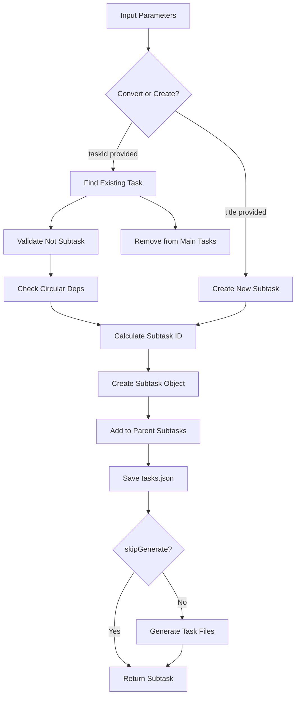

# Tool: add_subtask

## Purpose
Add a subtask to an existing parent task, either by creating a new subtask or converting an existing task into a subtask, maintaining proper dependency relationships and preventing circular dependencies.

## Business Value
- **Who uses this**: Developers breaking down tasks into smaller work items
- **What problem it solves**: Enables hierarchical task organization for better work breakdown structure
- **Why it's better than manual approach**: Automatically handles ID assignment, dependency validation, and prevents circular dependencies

## Functionality Specification

### Input Requirements

| Parameter | Type | Required | Default | Description |
|-----------|------|----------|---------|-------------|
| `id` | string | Yes | - | Parent task ID (e.g., "1", "2") |
| `taskId` | string | Conditional | - | Existing task ID to convert to subtask |
| `title` | string | Conditional | - | Title for new subtask (required if taskId not provided) |
| `description` | string | No | "" | Description for new subtask |
| `details` | string | No | "" | Implementation details for new subtask |
| `status` | string | No | "pending" | Status for new subtask |
| `dependencies` | string | No | "" | Comma-separated list of dependency IDs |
| `file` | string | No | ".taskmaster/tasks/tasks.json" | Path to tasks file |
| `skipGenerate` | boolean | No | false | Skip regenerating task files |
| `projectRoot` | string | Yes | - | Absolute path to project directory |
| `tag` | string | No | Current tag | Tag context to operate on |

#### Validation Rules
1. Parent task ID must exist
2. Either `taskId` OR `title` must be provided (not both)
3. Cannot convert a task that's already a subtask
4. Cannot create circular dependencies
5. Cannot make a task a subtask of itself
6. `projectRoot` must be an existing directory

### Processing Logic

#### Step-by-Step Algorithm

```
1. VALIDATE_INPUTS
   - Check parent task ID is provided
   - Verify either taskId or title is provided
   - Parse dependencies if provided
   - Resolve tag context
   
2. LOAD_TASK_DATA
   - Read tasks.json from specified path
   - Find parent task by ID
   - Initialize subtasks array if needed
   
3. IF CONVERTING_EXISTING_TASK:
   - Find existing task by ID
   - Verify not already a subtask
   - Check for circular dependencies
   - Determine next subtask ID
   - Clone task with new subtask ID
   - Add parentTaskId reference
   - Move to parent's subtasks array
   - Remove from main tasks array
   
4. IF CREATING_NEW_SUBTASK:
   - Determine next subtask ID
   - Create subtask object with fields
   - Add parentTaskId reference
   - Add to parent's subtasks array
   
5. SAVE_AND_GENERATE
   - Write updated tasks.json
   - Optionally regenerate task files
   - Return created/converted subtask
```

### Output Specification

#### Success Response
```javascript
{
  success: true,
  data: {
    message: "New subtask 1.3 successfully created",
    subtask: {
      id: 3,
      title: "Implement validation",
      description: "Add input validation",
      details: "",
      status: "pending",
      dependencies: [],
      parentTaskId: 1
    }
  }
}
```

#### Error Response
```javascript
{
  success: false,
  error: {
    code: "INPUT_VALIDATION_ERROR",
    message: "Parent task with ID 99 not found"
  }
}
```

#### Error Codes
- `MISSING_ARGUMENT`: Required parameters not provided
- `INPUT_VALIDATION_ERROR`: Parent task not found or invalid inputs
- `CORE_FUNCTION_ERROR`: Error during subtask creation
- `CIRCULAR_DEPENDENCY`: Would create circular dependency

### Side Effects
1. **Modifies tasks.json** by adding subtask to parent
2. May remove task from main array (when converting)
3. Optionally regenerates task markdown files
4. Updates tag metadata

## Data Flow



## Implementation Details

### Data Storage
- **Input/Output**: `.taskmaster/tasks/tasks.json` - Task data by tag
- Subtasks stored in parent task's `subtasks` array
- Subtask IDs are sequential within parent (1, 2, 3...)
- Full subtask reference: "parentId.subtaskId" (e.g., "1.3")

### Subtask ID Management
```javascript
// Find highest existing subtask ID
const highestSubtaskId = parentTask.subtasks.length > 0
  ? Math.max(...parentTask.subtasks.map(st => st.id))
  : 0;
const newSubtaskId = highestSubtaskId + 1;
```

### Circular Dependency Prevention
```javascript
// Check if parent is dependent on the task being converted
if (isTaskDependentOn(data.tasks, parentTask, existingTaskIdNum)) {
  throw new Error(`Cannot create circular dependency`);
}
```

### Two Operation Modes
1. **Convert Existing Task**: Moves task from main array to parent's subtasks
2. **Create New Subtask**: Creates fresh subtask with provided data

## AI Integration Points
This tool does not use AI - it's a pure data manipulation operation.

## Dependencies
- **File System Access**: Read/write access to JSON files
- **Task Dependency Validator**: `isTaskDependentOn()` function
- **Task File Generator**: Optional file generation
- **Tag Resolution**: Determines active tag context

## Test Scenarios

### 1. Create New Subtask
```javascript
// Test: Add subtask to task 1
Input: {
  id: "1",
  title: "Implement validation",
  description: "Add input validation",
  projectRoot: "/project"
}
Expected: New subtask 1.1 created
```

### 2. Convert Existing Task
```javascript
// Test: Convert task 5 to subtask of task 1
Input: {
  id: "1",
  taskId: "5",
  projectRoot: "/project"
}
Expected: Task 5 becomes subtask 1.1
```

### 3. With Dependencies
```javascript
// Test: Create subtask with dependencies
Input: {
  id: "2",
  title: "Write tests",
  dependencies: "2.1,2.2",
  projectRoot: "/project"
}
Expected: Subtask with dependencies [2.1, 2.2]
```

### 4. Circular Dependency Prevention
```javascript
// Test: Prevent circular dependency
Setup: Task 3 is subtask of task 1
Input: {
  id: "3",
  taskId: "1",
  projectRoot: "/project"
}
Expected: Error - circular dependency
```

### 5. Already Subtask Prevention
```javascript
// Test: Cannot convert subtask
Setup: Task 5 is already subtask of task 2
Input: {
  id: "1",
  taskId: "5",
  projectRoot: "/project"
}
Expected: Error - already a subtask
```

### 6. Skip File Generation
```javascript
// Test: Skip regenerating files
Input: {
  id: "1",
  title: "Quick subtask",
  skipGenerate: true,
  projectRoot: "/project"
}
Expected: Subtask created, no file generation
```

### 7. Tag-Specific Subtask
```javascript
// Test: Add subtask to specific tag
Input: {
  id: "1",
  title: "Feature subtask",
  tag: "feature-auth",
  projectRoot: "/project"
}
Expected: Subtask added to feature-auth tag
```

### 8. Custom Status
```javascript
// Test: Create with custom status
Input: {
  id: "1",
  title: "Urgent fix",
  status: "in-progress",
  projectRoot: "/project"
}
Expected: Subtask with status "in-progress"
```

## Implementation Notes
- **Complexity**: Medium (dependency validation, ID management)
- **Estimated Effort**: 3-4 hours for complete implementation
- **Critical Success Factors**:
  1. Proper subtask ID generation
  2. Circular dependency detection
  3. Clean task conversion logic
  4. Maintaining data integrity

## Performance Considerations
- File I/O for each operation
- Dependency checking can be recursive
- Task file generation adds overhead
- Consider batching for multiple subtasks

## Security Considerations
- Validate all user inputs
- Prevent directory traversal in file paths
- Check task ID injection attempts
- Maintain data consistency during conversion

## Code References
- Current implementation: `scripts/modules/task-manager/add-subtask.js`
- MCP tool: `mcp-server/src/tools/add-subtask.js`
- Direct function: `mcp-server/src/core/direct-functions/add-subtask.js`
- Key functions:
  - `addSubtask()`: Main subtask addition logic
  - `isTaskDependentOn()`: Circular dependency check
  - `generateTaskFiles()`: Optional file generation
- Design patterns: Command pattern (two operation modes)

---

*This documentation captures the actual current implementation of the add_subtask tool.*