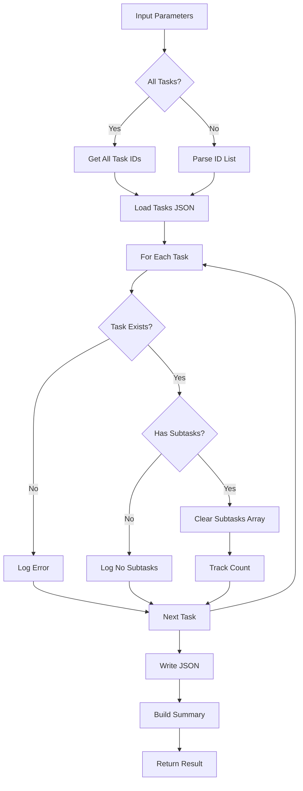

# Tool: clear_subtasks

## Purpose
Remove all subtasks from one or more specified tasks without AI assistance.

## Business Value
- **Who uses this**: Developers needing to reset task breakdown or reorganize subtasks
- **What problem it solves**: Allows bulk removal of subtasks when task scope changes or needs re-planning
- **Why it's better than manual approach**: Efficiently clears multiple tasks' subtasks in a single operation

## Functionality Specification

### Input Requirements

| Parameter | Type | Required | Default | Description |
|-----------|------|----------|---------|-------------|
| `id` | string | No* | - | Task IDs (comma-separated) to clear subtasks from |
| `all` | boolean | No* | false | Clear subtasks from all tasks |
| `file` | string | No | "tasks/tasks.json" | Path to tasks file |
| `projectRoot` | string | Yes | - | Absolute path to project directory |
| `tag` | string | No | Current tag | Tag context to operate on |

*Note: Either `id` or `all` must be provided

#### Validation Rules
1. Either `id` or `all` parameter must be provided (not both)
2. Task IDs must be valid integers when provided
3. Tasks must exist in the specified tag context
4. `projectRoot` must be an existing directory
5. Tasks file must exist at specified path

### Processing Logic

#### Step-by-Step Algorithm

```
1. VALIDATE_INPUTS
   - Check either id or all is provided
   - Validate projectRoot exists
   - Resolve tag context
   - Verify tasks file exists
   
2. DETERMINE_SCOPE
   If all === true:
   - Load all task IDs from tag
   - Build ID list from all tasks
   Else:
   - Parse comma-separated ID list
   - Validate each ID format
   
3. PROCESS_EACH_TASK
   For each task ID:
   - Find task in tasks array
   - Check if task exists
   - Check if task has subtasks
   - If has subtasks:
     * Count subtasks for summary
     * Set task.subtasks = []
     * Track cleared count
   - If no subtasks:
     * Log "no subtasks to clear"
   
4. SAVE_AND_SUMMARIZE
   - Write updated tasks.json
   - Build summary of operations:
     * Tasks processed
     * Subtasks cleared per task
     * Total subtasks removed
   - Return operation summary
```

### Output Specification

#### Success Response
```javascript
{
  success: true,
  data: {
    message: "Successfully cleared subtasks from 3 task(s) in tag 'master'",
    tasksCleared: [
      { id: 5, title: "Implement authentication" },
      { id: 6, title: "Create API endpoints" },
      { id: 7, title: "Setup database" }
    ],
    tag: "master"
  }
}
```

#### Error Response
```javascript
{
  success: false,
  error: {
    code: "INPUT_VALIDATION_ERROR",
    message: "Either task IDs with id parameter or all parameter must be provided"
  }
}
```

#### Error Codes
- `MISSING_ARGUMENT`: Required parameters not provided
- `INPUT_VALIDATION_ERROR`: Invalid parameters or no tasks found
- `FILE_NOT_FOUND_ERROR`: Tasks file doesn't exist
- `CORE_FUNCTION_ERROR`: Error during clearing operation

### Side Effects
1. **Removes all subtasks** from specified tasks
2. Sets `task.subtasks = []` (empty array, not undefined)
3. Does not affect task dependencies or status
4. Does not regenerate task files
5. Operation cannot be undone

## Data Flow



## Implementation Details

### Data Storage
- **Input/Output**: `.taskmaster/tasks/tasks.json` - Task data by tag
- Subtasks stored in parent task's `subtasks` array
- Clearing sets array to empty `[]`, not undefined
- Preserves all other task properties

### Batch Processing
```javascript
// Handle multiple task IDs
const taskIdArray = taskIds.split(',').map((id) => id.trim());

taskIdArray.forEach((taskId) => {
  const id = parseInt(taskId, 10);
  const task = data.tasks.find((t) => t.id === id);
  if (task && task.subtasks) {
    task.subtasks = [];
  }
});
```

### All Tasks Mode
```javascript
// Get all task IDs when all=true
if (all) {
  taskIds = tasks.map((t) => t.id).join(',');
}
```

### Summary Generation
```javascript
const taskSummary = taskIdArray.map((id) => {
  const task = updatedTasks.find((t) => t.id === id);
  return task ? 
    { id, title: task.title } : 
    { id, title: 'Task not found' };
});
```

## AI Integration Points
This tool **does not use AI**. It performs pure data operations:
- Direct array clearing for subtasks
- No content generation or analysis
- Simple data manipulation
- No external API calls

## Dependencies
- **File System Access**: Read/write access to JSON files
- **Silent Mode**: Console output suppression for MCP
- **UI Components**: Tables and boxes for CLI display
- **Path Utils**: Path resolution and validation

## Test Scenarios

### 1. Clear Single Task
```javascript
// Test: Clear subtasks from one task
Input: {
  id: "5",
  projectRoot: "/project"
}
Expected: Task 5 subtasks cleared
```

### 2. Clear Multiple Tasks
```javascript
// Test: Clear from multiple tasks
Input: {
  id: "5,6,7",
  projectRoot: "/project"
}
Expected: Subtasks cleared from all three tasks
```

### 3. Clear All Tasks
```javascript
// Test: Clear all tasks' subtasks
Input: {
  all: true,
  projectRoot: "/project"
}
Expected: All tasks have subtasks cleared
```

### 4. Task Without Subtasks
```javascript
// Test: Task has no subtasks
Input: {
  id: "5",
  projectRoot: "/project"
}
Setup: Task 5 has no subtasks
Expected: Success with "No subtasks" message
```

### 5. Invalid Task ID
```javascript
// Test: Non-existent task
Input: {
  id: "999",
  projectRoot: "/project"
}
Expected: Error logged, task skipped
```

### 6. No Parameters
```javascript
// Test: Neither id nor all provided
Input: {
  projectRoot: "/project"
}
Expected: Error - must provide id or all
```

### 7. Empty Task List
```javascript
// Test: No tasks in tag
Input: {
  all: true,
  tag: "empty-tag",
  projectRoot: "/project"
}
Expected: Error - no tasks found
```

### 8. Mixed Valid/Invalid IDs
```javascript
// Test: Some valid, some invalid
Input: {
  id: "5,999,6",
  projectRoot: "/project"
}
Expected: Valid tasks cleared, invalid logged
```

## Implementation Notes
- **Complexity**: Low (simple array operations)
- **Estimated Effort**: 1-2 hours for complete implementation
- **Critical Success Factors**:
  1. Proper parameter validation (id or all)
  2. Batch processing efficiency
  3. Clear summary generation
  4. Graceful handling of missing tasks
  5. Tag context preservation

## Performance Considerations
- Single file read/write operation
- Linear search for each task
- Efficient batch processing
- No file regeneration overhead
- No external API calls

## Security Considerations
- Validate task IDs are integers
- Path traversal protection
- Tag isolation maintained
- No sensitive data exposure
- Operation is destructive (no undo)

## Code References
- Current implementation: `scripts/modules/task-manager/clear-subtasks.js`
- MCP tool: `mcp-server/src/tools/clear-subtasks.js`
- Direct function: `mcp-server/src/core/direct-functions/clear-subtasks.js`
- Key functions:
  - `clearSubtasks()`: Main clearing logic
  - `readJSON()`/`writeJSON()`: Tag-aware file operations
  - UI display functions for CLI output
- Design patterns: Batch processing pattern, Either/Or parameter pattern

---

*This documentation captures the actual current implementation of the clear_subtasks tool as a pure data operation without AI integration.*