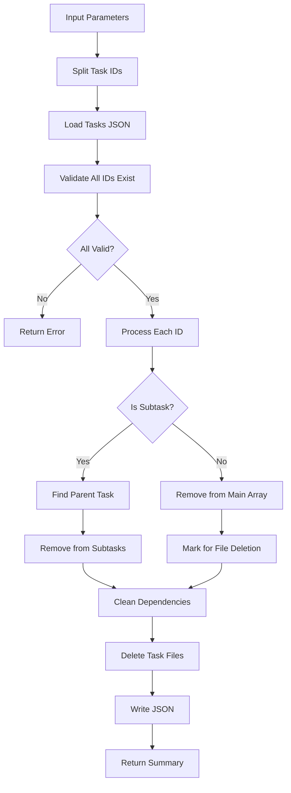

# Tool: remove_task

## Purpose
Remove one or more tasks or subtasks permanently from the tasks list without AI assistance.

## Business Value
- **Who uses this**: Developers cleaning up completed or obsolete tasks from their task list
- **What problem it solves**: Removes unwanted tasks to maintain a clean and relevant task list
- **Why it's better than manual approach**: Automatically handles dependencies cleanup and file deletion

## Functionality Specification

### Input Requirements

| Parameter | Type | Required | Default | Description |
|-----------|------|----------|---------|-------------|
| `id` | string | Yes | - | ID(s) of task/subtask to remove (e.g., "5", "5.2"). Comma-separated for multiple |
| `file` | string | No | ".taskmaster/tasks/tasks.json" | Path to tasks file |
| `projectRoot` | string | Yes | - | Absolute path to project directory |
| `confirm` | boolean | No | false | Whether to skip confirmation prompt |
| `tag` | string | No | Current tag | Tag context to operate on |

#### Validation Rules
1. `id` must be provided and non-empty
2. Task IDs can be main tasks (e.g., "5") or subtasks (e.g., "5.2")
3. Multiple IDs supported via comma separation
4. All task IDs must exist before removal proceeds
5. `projectRoot` must be an existing directory

### Processing Logic

#### Step-by-Step Algorithm

```
1. VALIDATE_INPUTS
   - Check id parameter is provided
   - Split comma-separated IDs into array
   - Validate projectRoot exists
   - Resolve tag context
   
2. LOAD_AND_VALIDATE
   - Read tasks.json file
   - Verify all task IDs exist
   - Return error if any ID not found
   - Prepare removal list
   
3. REMOVE_TASKS
   For each task ID:
   - If subtask (contains dot):
     * Find parent task
     * Find subtask in parent's array
     * Remove subtask from array
   - If main task:
     * Find task in main array
     * Remove task from array
     * Mark for file deletion
   
4. CLEANUP_DEPENDENCIES
   - For all remaining tasks in all tags:
     * Remove deleted task IDs from dependencies
     * Clean subtask dependencies
   - Ensure no orphaned dependencies
   
5. DELETE_FILES
   - For each main task removed:
     * Delete corresponding task_XXX.txt file
     * Log file deletion
   - Handle file deletion errors gracefully
   
6. SAVE_AND_RETURN
   - Write updated tasks.json
   - Return removal summary
   - Include removed task details
```

### Output Specification

#### Success Response
```javascript
{
  success: true,
  data: {
    totalTasks: 3,
    successful: 3,
    failed: 0,
    removedTasks: [
      {
        id: 5,
        title: "Implement authentication",
        status: "done",
        // ... other task fields
      },
      {
        id: 2,
        parentTaskId: 6,
        title: "Write unit tests",
        // ... subtask fields
      }
    ],
    message: "Successfully removed task 5 from tag 'master'\nSuccessfully removed subtask 6.2 from tag 'master'",
    tasksPath: ".taskmaster/tasks/tasks.json",
    tag: "master"
  }
}
```

#### Error Response
```javascript
{
  success: false,
  error: {
    code: "INVALID_TASK_ID",
    message: "The following tasks were not found in tag 'master': 99, 100.5"
  }
}
```

#### Error Codes
- `MISSING_ARGUMENT`: Required parameters not provided
- `INPUT_VALIDATION_ERROR`: Task ID is required
- `INVALID_TASKS_FILE`: Tasks file is invalid or empty
- `INVALID_TASK_ID`: One or more task IDs not found
- `REMOVE_TASK_ERROR`: Error during removal operation
- `UNEXPECTED_ERROR`: Unexpected system error

### Side Effects
1. **Permanently deletes tasks** from tasks.json
2. **Removes task files** (task_XXX.txt) for main tasks
3. **Cleans up dependencies** across all tasks and tags
4. Updates task array indices after removal
5. Cannot be undone without backup

## Data Flow



## Implementation Details

### Data Storage
- **Input/Output**: `.taskmaster/tasks/tasks.json` - Task data by tag
- **Task Files**: Individual `.txt` files deleted for main tasks
- Works with full tagged data structure
- Preserves all tags while updating target tag

### Dependency Cleanup
```javascript
// Remove from all tags
for (const tagName in fullTaggedData) {
  const currentTagTasks = fullTaggedData[tagName].tasks;
  currentTagTasks.forEach((task) => {
    if (task.dependencies) {
      task.dependencies = task.dependencies.filter(
        (depId) => !allRemovedIds.has(depId)
      );
    }
  });
}
```

### File Deletion
```javascript
const taskFileName = path.join(
  path.dirname(tasksPath),
  `task_${taskIdNum.toString().padStart(3, '0')}.txt`
);
if (fs.existsSync(taskFileName)) {
  fs.unlinkSync(taskFileName);
}
```

### Batch Operations
```javascript
// Support comma-separated IDs
const taskIdsToRemove = taskIds
  .split(',')
  .map((id) => id.trim())
  .filter(Boolean);
```

## AI Integration Points
This tool **does not use AI**. It performs pure data operations:
- Direct array manipulation for task removal
- File system operations for cleanup
- No content generation or analysis
- No external API calls

## Dependencies
- **File System Access**: Read/write access to JSON and text files
- **Path Utils**: Path resolution and validation
- **Task Exists**: Validation utility for checking task existence
- **Silent Mode**: Console output suppression for MCP

## Test Scenarios

### 1. Remove Single Task
```javascript
// Test: Remove main task
Input: {
  id: "5",
  projectRoot: "/project"
}
Expected: Task 5 removed, dependencies cleaned, file deleted
```

### 2. Remove Subtask
```javascript
// Test: Remove subtask
Input: {
  id: "5.2",
  projectRoot: "/project"
}
Expected: Subtask removed from parent, dependencies cleaned
```

### 3. Batch Removal
```javascript
// Test: Remove multiple tasks
Input: {
  id: "5,6.2,7",
  projectRoot: "/project"
}
Expected: All three items removed in single operation
```

### 4. Invalid Task ID
```javascript
// Test: Non-existent task
Input: {
  id: "999",
  projectRoot: "/project"
}
Expected: Error - task not found
```

### 5. Mixed Valid/Invalid
```javascript
// Test: Some valid, some invalid
Input: {
  id: "5,999,6.2",
  projectRoot: "/project"
}
Expected: Error - lists invalid IDs before any removal
```

### 6. Dependency Cleanup
```javascript
// Test: Task with dependents
Setup: Task 7 depends on task 5
Input: {
  id: "5",
  projectRoot: "/project"
}
Expected: Task 5 removed, task 7 dependencies updated
```

### 7. File Deletion Error
```javascript
// Test: File locked/protected
Setup: task_005.txt is read-only
Input: {
  id: "5",
  projectRoot: "/project"
}
Expected: Task removed from JSON, warning about file
```

### 8. Tag-Specific Removal
```javascript
// Test: Remove from specific tag
Input: {
  id: "5",
  tag: "feature-branch",
  projectRoot: "/project"
}
Expected: Task removed only from feature-branch tag
```

## Implementation Notes
- **Complexity**: Low (direct data manipulation)
- **Estimated Effort**: 2-3 hours for complete implementation
- **Critical Success Factors**:
  1. Validate all IDs before any removal
  2. Clean dependencies across all tags
  3. Handle file deletion failures gracefully
  4. Support batch operations
  5. Preserve data integrity

## Performance Considerations
- Single file read/write operation
- Linear search for task validation
- Batch operations more efficient than individual
- File deletion adds I/O overhead
- No external API calls

## Security Considerations
- Validate all task IDs exist
- Permanent deletion - no undo
- File system permissions for deletion
- Path traversal protection
- Tag isolation maintained

## Code References
- Current implementation: `scripts/modules/task-manager/remove-task.js`
- MCP tool: `mcp-server/src/tools/remove-task.js`
- Direct function: `mcp-server/src/core/direct-functions/remove-task.js`
- Key functions:
  - `removeTask()`: Main removal logic
  - `taskExists()`: Validation helper
  - `findTaskById()`: Task location utility
  - `generateTaskFiles()`: File regeneration (commented out)
- Design patterns: Batch processing pattern, Transaction-like pattern (validate all before removing any)

---

*This documentation captures the actual current implementation of the remove_task tool as a pure data operation without AI integration.*