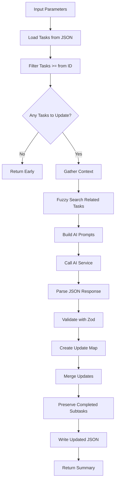

# Tool: update

## Purpose
Update multiple upcoming tasks (with ID >= specified 'from' ID) based on new context or changes using AI to intelligently modify task details while preserving completed work and maintaining task structure.

## Business Value
- **Who uses this**: Developers needing to update multiple tasks after requirement changes
- **What problem it solves**: Bulk updates to future tasks when project direction or implementation details change
- **Why it's better than manual approach**: AI intelligently applies context changes across multiple tasks while preserving completed subtasks and maintaining consistency

## Functionality Specification

### Input Requirements

| Parameter | Type | Required | Default | Description |
|-----------|------|----------|---------|-------------|
| `from` | string | Yes | - | Task ID from which to start updating (inclusive) |
| `prompt` | string | Yes | - | Explanation of changes or new context to apply |
| `research` | boolean | No | false | Use Perplexity AI for research-backed updates |
| `file` | string | No | ".taskmaster/tasks/tasks.json" | Path to tasks file |
| `projectRoot` | string | Yes | - | Absolute path to project directory |
| `tag` | string | No | Current tag | Tag context to operate on |

#### Validation Rules
1. `from` must be a valid task ID
2. `prompt` must describe the changes to apply
3. Only updates tasks with status != 'done'
4. `projectRoot` must be an existing directory

### Processing Logic

#### Step-by-Step Algorithm

```
1. VALIDATE_INPUTS
   - Check from ID and prompt are provided
   - Resolve project root and tag context
   - Load tasks from JSON file
   
2. FILTER_TASKS
   - Select tasks with ID >= from
   - Exclude tasks with status 'done'
   - If no tasks match, exit early
   
3. GATHER_CONTEXT
   - Use fuzzy search to find related tasks
   - Gather codebase context
   - Build comprehensive update context
   
4. BUILD_AI_PROMPTS
   - Load update-tasks prompt template
   - Include filtered tasks array
   - Add update prompt and context
   - Configure for research mode if requested
   
5. CALL_AI_SERVICE
   - Send prompts to AI service
   - Parse JSON array response
   - Validate structure with Zod schema
   
6. PARSE_RESPONSE
   - Extract JSON array from response
   - Try multiple parsing strategies:
     - Content between []
     - JSON code blocks
     - Prefix stripping
   - Apply preprocessing for defaults
   
7. UPDATE_TASKS
   - Create map of updated tasks
   - Merge updates with existing tasks
   - Preserve subtasks if not modified
   - Maintain completed subtask status
   
8. SAVE_AND_RETURN
   - Write updated tasks.json
   - Return update summary
   - Include telemetry data
```

### AI Prompts Used

#### System Prompt (Default)
```
You are an AI assistant helping to update software development tasks based on new context.
You will be given a set of tasks and a prompt describing changes or new implementation details.
Your job is to update the tasks to reflect these changes, while preserving their basic structure.

CRITICAL RULES:
1. Return ONLY a JSON array - no explanations, no markdown, no additional text before or after
2. Each task MUST have ALL fields from the original (do not omit any fields)
3. Maintain the same IDs, statuses, and dependencies unless specifically mentioned in the prompt
4. Update titles, descriptions, details, and test strategies to reflect the new information
5. Do not change anything unnecessarily - just adapt what needs to change based on the prompt
6. You should return ALL the tasks in order, not just the modified ones
7. Return a complete valid JSON array with all tasks
8. VERY IMPORTANT: Preserve all subtasks marked as "done" or "completed" - do not modify their content
9. For tasks with completed subtasks, build upon what has already been done rather than rewriting everything
10. If an existing completed subtask needs to be changed/undone based on the new context, DO NOT modify it directly
11. Instead, add a new subtask that clearly indicates what needs to be changed or replaced
12. Use the existence of completed subtasks as an opportunity to make new subtasks more specific and targeted

The changes described in the prompt should be applied to ALL tasks in the list.
```

#### User Prompt (Default)
```
Here are the tasks to update:
{{{json tasks}}}

Please update these tasks based on the following new context:
{{updatePrompt}}

IMPORTANT: In the tasks JSON above, any subtasks with "status": "done" or "status": "completed" should be preserved exactly as is. Build your changes around these completed items.{{#if projectContext}}

# Project Context

{{projectContext}}{{/if}}

Required JSON structure for EACH task (ALL fields MUST be present):
{
  "id": <number>,
  "title": <string>,
  "description": <string>,
  "status": <string>,
  "dependencies": <array>,
  "priority": <string or null>,
  "details": <string or null>,
  "testStrategy": <string or null>,
  "subtasks": <array or null>
}

Return a valid JSON array containing ALL the tasks with ALL their fields:
- id (number) - preserve existing value
- title (string)
- description (string)
- status (string) - preserve existing value unless explicitly changing
- dependencies (array) - preserve existing value unless explicitly changing
- priority (string or null)
- details (string or null)
- testStrategy (string or null)
- subtasks (array or null)

Return ONLY the JSON array now:
```

### Output Specification

#### Success Response
```javascript
{
  success: true,
  data: {
    message: "Successfully updated 5 tasks.",
    tasksPath: ".taskmaster/tasks/tasks.json",
    updatedCount: 5,
    telemetryData: {
      totalTokens: 2500,
      totalCost: 0.05,
      provider: "anthropic",
      model: "claude-3-5-sonnet-20241022"
    },
    tagInfo: {
      currentTag: "master",
      taskCount: 25
    }
  }
}
```

#### Error Response
```javascript
{
  success: false,
  error: {
    code: "MISSING_ARGUMENT",
    message: "Starting task ID (from) is required"
  }
}
```

#### Error Codes
- `MISSING_ARGUMENT`: Required parameters not provided
- `CORE_FUNCTION_ERROR`: Error during task update
- `UPDATE_TASKS_CORE_ERROR`: Error executing core update function

### Side Effects
1. **Modifies tasks.json** for all eligible tasks
2. Makes AI service call for update generation
3. Preserves completed subtasks without modification
4. May add new subtasks for revisions instead of modifying completed ones

## Data Flow



## Implementation Details

### Data Storage
- **Input/Output**: `.taskmaster/tasks/tasks.json` - Task data by tag
- Updates multiple tasks in single operation
- Preserves task IDs and dependencies
- Maintains subtask completion status

### Response Parsing Strategy
```javascript
// Try multiple parsing approaches in order
1. Extract content between [ and ]
2. Extract from ```json code blocks
3. Strip common prefixes
4. Attempt raw parse
```

### Zod Schema Validation
```javascript
const updatedTaskSchema = z.object({
  id: z.number().int(),
  title: z.string(),
  description: z.string(),
  status: z.string(),
  dependencies: z.array(z.union([z.number().int(), z.string()])),
  priority: z.string().nullable(),
  details: z.string().nullable(),
  testStrategy: z.string().nullable(),
  subtasks: z.array(z.any()).nullable()
}).strip();
```

### Preprocessing for Defaults
```javascript
// Add defaults for missing fields before validation
const preprocessTaskSchema = z.preprocess((task) => {
  return {
    ...task,
    id: task.id ?? 0,
    title: task.title ?? 'Untitled Task',
    description: task.description ?? '',
    status: task.status ?? 'pending',
    dependencies: Array.isArray(task.dependencies) ? task.dependencies : [],
    priority: task.hasOwnProperty('priority') ? task.priority : null,
    details: task.hasOwnProperty('details') ? task.details : null,
    testStrategy: task.hasOwnProperty('testStrategy') ? task.testStrategy : null,
    subtasks: Array.isArray(task.subtasks) ? task.subtasks : null
  };
}, updatedTaskSchema);
```

### Completed Subtask Preservation
- Subtasks with status 'done' or 'completed' are never modified
- New subtasks are added for revisions rather than changing completed work
- Maintains clear audit trail of what was done vs what needs revision

## AI Integration Points
This tool uses AI for bulk task updates:
- **Context Gathering**: Fuzzy search for related tasks and codebase context
- **Prompt Generation**: Uses template system with Handlebars
- **AI Service Call**: Generates updated task array
- **Response Parsing**: Multiple strategies to extract JSON
- **Schema Validation**: Ensures AI response matches expected format
- **Research Mode**: Optional enhanced updates with current practices

## Dependencies
- **File System Access**: Read/write access to JSON files
- **AI Service**: Required for task updates
- **Context Gatherer**: Searches for relevant context
- **Fuzzy Task Search**: Finds related tasks
- **Prompt Manager**: Loads and processes prompt templates
- **Zod**: Schema validation for AI responses

## Test Scenarios

### 1. Basic Update
```javascript
// Test: Update tasks 5+ with new context
Input: {
  from: "5",
  prompt: "Change authentication to OAuth2",
  projectRoot: "/project"
}
Expected: Tasks 5+ updated with OAuth2 context
```

### 2. With Research Mode
```javascript
// Test: Research-backed updates
Input: {
  from: "10",
  prompt: "Update to use latest React patterns",
  research: true,
  projectRoot: "/project"
}
Expected: Tasks updated with researched patterns
```

### 3. Skip Completed Tasks
```javascript
// Test: Don't update done tasks
Setup: Task 7 has status "done"
Input: {
  from: "5",
  prompt: "Change database to PostgreSQL",
  projectRoot: "/project"
}
Expected: Task 7 unchanged, tasks 5,6,8+ updated
```

### 4. Preserve Completed Subtasks
```javascript
// Test: Keep done subtasks intact
Setup: Task 5 has subtask 5.1 with status "done"
Input: {
  from: "5",
  prompt: "Add error handling",
  projectRoot: "/project"
}
Expected: Subtask 5.1 unchanged, new subtasks added
```

### 5. No Tasks to Update
```javascript
// Test: All tasks are done
Setup: All tasks >= 10 have status "done"
Input: {
  from: "10",
  prompt: "Update implementation",
  projectRoot: "/project"
}
Expected: No updates performed
```

### 6. Parse Different Response Formats
```javascript
// Test: Handle various AI response formats
AI responses handled:
- Raw JSON array
- Markdown code blocks
- Arrays with prefixes
- Content between brackets
```

### 7. Tag-Specific Updates
```javascript
// Test: Update tasks in specific tag
Input: {
  from: "1",
  prompt: "Update for mobile version",
  tag: "feature-mobile",
  projectRoot: "/project"
}
Expected: Only feature-mobile tasks updated
```

### 8. Context Integration
```javascript
// Test: Include gathered context
Input: {
  from: "3",
  prompt: "Refactor user service",
  projectRoot: "/project"
}
Expected: Related user service context included
```

## Implementation Notes
- **Complexity**: High (AI integration, response parsing, preservation logic)
- **Estimated Effort**: 8-10 hours for complete implementation
- **Critical Success Factors**:
  1. Robust response parsing
  2. Completed work preservation
  3. Context gathering accuracy
  4. Schema validation
  5. Clear prompt engineering

## Performance Considerations
- AI calls add 3-5 second latency
- Token usage scales with task count
- Context gathering for large codebases
- Batch updates more efficient than individual
- File I/O for each update operation

## Security Considerations
- Validate all user inputs
- Sanitize prompts before AI calls
- API keys stored in environment variables
- Validate file paths for directory traversal
- Schema validation prevents injection

## Code References
- Current implementation: `scripts/modules/task-manager/update-tasks.js`
- MCP tool: `mcp-server/src/tools/update.js`
- Direct function: `mcp-server/src/core/direct-functions/update-tasks.js`
- Prompt template: `src/prompts/update-tasks.json`
- Key functions:
  - `updateTasks()`: Main update logic
  - `parseUpdatedTasksFromText()`: Response parsing
  - `preprocessTaskSchema`: Default value handling
  - `ContextGatherer.gather()`: Context collection
  - `FuzzyTaskSearch.findRelevantTasks()`: Related task search
- Design patterns: Strategy pattern (parsing), Template pattern (prompts)

---

*This documentation captures the actual current implementation of the update tool including exact AI prompts used.*