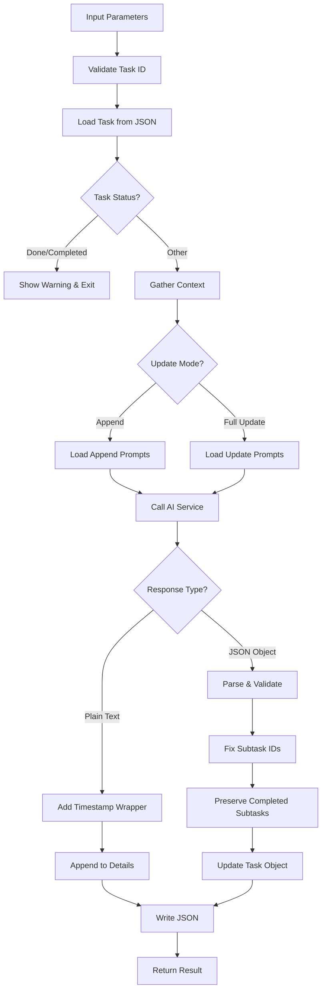

# Tool: update_task

## Purpose
Update a single task by ID with new information or context using AI to intelligently modify task details while preserving completed work, maintaining title, and supporting both full updates and append mode for incremental changes.

## Business Value
- **Who uses this**: Developers needing to update individual tasks with new requirements or context
- **What problem it solves**: Keeps single tasks current with changing requirements or implementation details
- **Why it's better than manual approach**: AI intelligently applies changes while preserving completed subtasks, maintaining consistency, and supporting incremental updates

## Functionality Specification

### Input Requirements

| Parameter | Type | Required | Default | Description |
|-----------|------|----------|---------|-------------|
| `id` | string | Yes | - | ID of the task to update (e.g., "15") |
| `prompt` | string | Yes | - | New information or context to incorporate |
| `research` | boolean | No | false | Use Perplexity AI for research-backed updates |
| `append` | boolean | No | false | Append timestamped info to details instead of full update |
| `file` | string | No | ".taskmaster/tasks/tasks.json" | Path to tasks file |
| `projectRoot` | string | Yes | - | Absolute path to project directory |
| `tag` | string | No | Current tag | Tag context to operate on |

#### Validation Rules
1. `id` must be a positive integer (subtasks handled by update-subtask tool)
2. `prompt` must describe the changes to apply
3. Cannot update tasks with status 'done' or 'completed'
4. `projectRoot` must be an existing directory

### Processing Logic

#### Step-by-Step Algorithm

```
1. VALIDATE_INPUTS
   - Check task ID is valid positive integer
   - Verify prompt is not empty
   - Resolve project root and tag context
   
2. LOAD_AND_CHECK_TASK
   - Read tasks.json file
   - Find task by ID
   - Check if task status is done/completed
   - If completed, show warning and exit
   
3. GATHER_CONTEXT
   - Use fuzzy search to find related tasks
   - Include task title, description, and prompt in search
   - Gather codebase context for relevant tasks
   
4. DETERMINE_MODE
   - If append=true: Use append mode prompts
   - If research=true: Use research variant
   - Otherwise: Use default update prompts
   
5. BUILD_AI_PROMPTS
   - Load update-task prompt template
   - Include task JSON, update prompt, context
   - Select variant based on mode
   
6. CALL_AI_SERVICE
   - Send prompts to AI service
   - Get response based on mode
   
7. PROCESS_RESPONSE
   IF APPEND_MODE:
   - Add timestamp wrapper to new content
   - Append to existing task details
   - Update description with date if prompt < 100 chars
   ELSE (FULL_UPDATE):
   - Parse JSON object from response
   - Validate structure with Zod schema
   - Fix subtask IDs to be sequential
   - Preserve completed subtasks
   
8. SAVE_AND_RETURN
   - Write updated task to JSON
   - Return updated task and telemetry
```

### AI Prompts Used

#### System Prompt (Default)
```
You are an AI assistant helping to update a software development task based on new context.{{#if useResearch}} You have access to current best practices and latest technical information to provide research-backed updates.{{/if}}
You will be given a task and a prompt describing changes or new implementation details.
Your job is to update the task to reflect these changes, while preserving its basic structure.

Guidelines:
1. VERY IMPORTANT: NEVER change the title of the task - keep it exactly as is
2. Maintain the same ID, status, and dependencies unless specifically mentioned in the prompt{{#if useResearch}}
3. Research and update the description, details, and test strategy with current best practices
4. Include specific versions, libraries, and approaches that are current and well-tested{{/if}}{{#if (not useResearch)}}
3. Update the description, details, and test strategy to reflect the new information
4. Do not change anything unnecessarily - just adapt what needs to change based on the prompt{{/if}}
5. Return a complete valid JSON object representing the updated task
6. VERY IMPORTANT: Preserve all subtasks marked as "done" or "completed" - do not modify their content
7. For tasks with completed subtasks, build upon what has already been done rather than rewriting everything
8. If an existing completed subtask needs to be changed/undone based on the new context, DO NOT modify it directly
9. Instead, add a new subtask that clearly indicates what needs to be changed or replaced
10. Use the existence of completed subtasks as an opportunity to make new subtasks more specific and targeted
11. Ensure any new subtasks have unique IDs that don't conflict with existing ones
12. CRITICAL: For subtask IDs, use ONLY numeric values (1, 2, 3, etc.) NOT strings ("1", "2", "3")
13. CRITICAL: Subtask IDs should start from 1 and increment sequentially (1, 2, 3...) - do NOT use parent task ID as prefix{{#if useResearch}}
14. Include links to documentation or resources where helpful
15. Focus on practical, implementable solutions using current technologies{{/if}}

The changes described in the prompt should be thoughtfully applied to make the task more accurate and actionable.
```

#### User Prompt (Default)
```
Here is the task to update{{#if useResearch}} with research-backed information{{/if}}:
{{{taskJson}}}

Please {{#if useResearch}}research and {{/if}}update this task based on the following {{#if useResearch}}context:
{{updatePrompt}}

Incorporate current best practices, latest stable versions, and proven approaches.{{/if}}{{#if (not useResearch)}}new context:
{{updatePrompt}}{{/if}}

IMPORTANT: {{#if useResearch}}Preserve any subtasks marked as "done" or "completed".{{/if}}{{#if (not useResearch)}}In the task JSON above, any subtasks with "status": "done" or "status": "completed" should be preserved exactly as is. Build your changes around these completed items.{{/if}}
{{#if gatheredContext}}

# Project Context

{{gatheredContext}}
{{/if}}

Return only the updated task as a valid JSON object{{#if useResearch}} with research-backed improvements{{/if}}.
```

#### System Prompt (Append Mode)
```
You are an AI assistant helping to append additional information to a software development task. You will be provided with the task's existing details, context, and a user request string.

Your Goal: Based *only* on the user's request and all the provided context (including existing details if relevant to the request), GENERATE the new text content that should be added to the task's details.
Focus *only* on generating the substance of the update.

Output Requirements:
1. Return *only* the newly generated text content as a plain string. Do NOT return a JSON object or any other structured data.
2. Your string response should NOT include any of the task's original details, unless the user's request explicitly asks to rephrase, summarize, or directly modify existing text.
3. Do NOT include any timestamps, XML-like tags, markdown, or any other special formatting in your string response.
4. Ensure the generated text is concise yet complete for the update based on the user request. Avoid conversational fillers or explanations about what you are doing (e.g., do not start with "Okay, here's the update...")
```

#### User Prompt (Append Mode)
```
Task Context:

Task: {{{json task}}}
Current Task Details (for context only):
{{currentDetails}}

User Request: "{{updatePrompt}}"

Based on the User Request and all the Task Context (including current task details provided above), what is the new information or text that should be appended to this task's details? Return ONLY this new text as a plain string.
{{#if gatheredContext}}

# Additional Project Context

{{gatheredContext}}
{{/if}}
```

### Output Specification

#### Success Response (Full Update)
```javascript
{
  success: true,
  data: {
    message: "Successfully updated task with ID 15 based on the prompt",
    taskId: 15,
    tasksPath: ".taskmaster/tasks/tasks.json",
    useResearch: false,
    updated: true,
    updatedTask: {
      id: 15,
      title: "Original title preserved",
      description: "Updated description",
      status: "pending",
      dependencies: [1, 3],
      priority: "high",
      details: "Updated implementation details",
      testStrategy: "Updated test approach",
      subtasks: []
    },
    telemetryData: {
      totalTokens: 1500,
      totalCost: 0.03
    },
    tagInfo: {
      currentTag: "master",
      taskCount: 25
    }
  }
}
```

#### Success Response (Append Mode)
```javascript
{
  success: true,
  data: {
    message: "Successfully appended to task 15",
    taskId: 15,
    updated: true,
    updatedTask: {
      details: "Original details\n<info added on 2024-01-15T10:30:00Z>\nNew appended content here\n</info added on 2024-01-15T10:30:00Z>"
    },
    telemetryData: {...}
  }
}
```

#### Error Response
```javascript
{
  success: false,
  error: {
    code: "MISSING_TASK_ID",
    message: "No task ID specified. Please provide a task ID to update."
  }
}
```

#### Error Codes
- `MISSING_ARGUMENT`: Required parameters not provided
- `MISSING_TASK_ID`: Task ID not specified
- `MISSING_PROMPT`: Update prompt not provided
- `INVALID_TASK_ID`: Task ID is not valid positive integer
- `UPDATE_TASK_CORE_ERROR`: Error during task update
- `DIRECT_FUNCTION_SETUP_ERROR`: Setup error

### Side Effects
1. **Modifies tasks.json** for the specified task
2. Makes AI service call for update generation
3. Preserves completed subtasks without modification
4. In append mode, adds timestamped content blocks
5. May add new subtasks for revisions instead of modifying completed ones

## Data Flow



## Implementation Details

### Data Storage
- **Input/Output**: `.taskmaster/tasks/tasks.json` - Task data by tag
- Updates single task in place
- Preserves task ID and core structure
- Maintains subtask completion status

### Response Parsing Strategy
```javascript
// Try multiple parsing approaches for JSON object
1. Extract content between { and }
2. Extract from ```json code blocks
3. Strip common prefixes
4. Attempt raw parse
```

### Zod Schema Validation
```javascript
const updatedTaskSchema = z.object({
  id: z.number().int(),
  title: z.string(),
  description: z.string(),
  status: z.string(),
  dependencies: z.array(z.union([z.number().int(), z.string()])),
  priority: z.string().nullable().default('medium'),
  details: z.string().nullable().default(''),
  testStrategy: z.string().nullable().default(''),
  subtasks: z.array(subtaskSchema).nullable().default([])
}).strip();
```

### Subtask ID Correction
```javascript
// Fix AI-generated subtask IDs to be sequential
let currentSubtaskId = 1;
updatedTask.subtasks = updatedTask.subtasks.map((subtask) => {
  return {
    ...subtask,
    id: currentSubtaskId++, // Override with correct sequential ID
    dependencies: validateDependencies(subtask.dependencies)
  };
});
```

### Append Mode Formatting
```javascript
const timestamp = new Date().toISOString();
const formattedBlock = `<info added on ${timestamp}>
${generatedContentString.trim()}
</info added on ${timestamp}>`;
```

## AI Integration Points
This tool uses AI for single task updates:
- **Context Gathering**: Fuzzy search for related tasks and codebase context
- **Prompt Generation**: Uses template system with Handlebars
- **Mode Selection**: Default, research, or append mode
- **AI Service Call**: Generates updated task or new content
- **Response Parsing**: Different strategies for JSON vs plain text
- **Schema Validation**: Ensures AI response matches expected format
- **Research Mode**: Optional enhanced updates with current practices

## Dependencies
- **File System Access**: Read/write access to JSON files
- **AI Service**: Required for task updates
- **Context Gatherer**: Searches for relevant context
- **Fuzzy Task Search**: Finds related tasks
- **Prompt Manager**: Loads and processes prompt templates
- **Zod**: Schema validation for AI responses

## Test Scenarios

### 1. Basic Update
```javascript
// Test: Update task with new context
Input: {
  id: "15",
  prompt: "Change to use TypeScript",
  projectRoot: "/project"
}
Expected: Task 15 updated with TypeScript context
```

### 2. Research Mode
```javascript
// Test: Research-backed update
Input: {
  id: "20",
  prompt: "Update to latest React patterns",
  research: true,
  projectRoot: "/project"
}
Expected: Task updated with researched patterns
```

### 3. Append Mode
```javascript
// Test: Append information to task
Input: {
  id: "5",
  prompt: "Add note about performance optimization",
  append: true,
  projectRoot: "/project"
}
Expected: Timestamped note added to details
```

### 4. Completed Task Protection
```javascript
// Test: Cannot update completed task
Setup: Task 10 has status "done"
Input: {
  id: "10",
  prompt: "Update implementation",
  projectRoot: "/project"
}
Expected: Warning shown, task not updated
```

### 5. Preserve Completed Subtasks
```javascript
// Test: Keep done subtasks intact
Setup: Task 15 has subtask 1 with status "done"
Input: {
  id: "15",
  prompt: "Add error handling",
  projectRoot: "/project"
}
Expected: Subtask 1 unchanged, new subtasks added
```

### 6. Title Preservation
```javascript
// Test: Never change task title
Input: {
  id: "8",
  prompt: "Rename to authentication service",
  projectRoot: "/project"
}
Expected: Title remains unchanged
```

### 7. Subtask ID Correction
```javascript
// Test: Fix incorrect subtask IDs
AI returns: Subtasks with IDs "15.1", "15.2"
Expected: Corrected to numeric IDs 1, 2
```

### 8. Context Integration
```javascript
// Test: Include gathered context
Input: {
  id: "12",
  prompt: "Update user service integration",
  projectRoot: "/project"
}
Expected: Related user service context included
```

## Implementation Notes
- **Complexity**: High (AI integration, multiple modes, preservation logic)
- **Estimated Effort**: 6-8 hours for complete implementation
- **Critical Success Factors**:
  1. Robust response parsing
  2. Completed work preservation
  3. Subtask ID correction
  4. Append mode formatting
  5. Clear prompt engineering

## Performance Considerations
- AI calls add 2-4 second latency
- Token usage varies by task complexity
- Context gathering for large codebases
- Append mode more efficient than full updates
- File I/O for each update operation

## Security Considerations
- Validate all user inputs
- Sanitize prompts before AI calls
- API keys stored in environment variables
- Validate file paths for directory traversal
- Schema validation prevents injection

## Code References
- Current implementation: `scripts/modules/task-manager/update-task-by-id.js`
- MCP tool: `mcp-server/src/tools/update-task.js`
- Direct function: `mcp-server/src/core/direct-functions/update-task-by-id.js`
- Prompt template: `src/prompts/update-task.json`
- Key functions:
  - `updateTaskById()`: Main update logic
  - `parseUpdatedTaskFromText()`: Response parsing
  - `preprocessedTask`: Default value handling
  - `ContextGatherer.gather()`: Context collection
  - `FuzzyTaskSearch.findRelevantTasks()`: Related task search
- Design patterns: Strategy pattern (modes), Template pattern (prompts)

---

*This documentation captures the actual current implementation of the update_task tool including exact AI prompts used.*