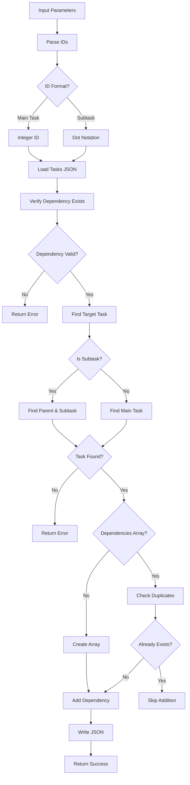

# Tool: add_dependency

## Purpose
Add a dependency relationship between two tasks or subtasks without AI assistance.

## Business Value
- **Who uses this**: Developers establishing task prerequisites and execution order
- **What problem it solves**: Creates clear task dependencies to ensure proper workflow sequencing
- **Why it's better than manual approach**: Validates task existence and prevents circular dependencies

## Functionality Specification

### Input Requirements

| Parameter | Type | Required | Default | Description |
|-----------|------|----------|---------|-------------|
| `id` | string | Yes | - | ID of task that will depend on another (e.g., "5" or "5.2") |
| `dependsOn` | string | Yes | - | ID of task that will become a dependency (e.g., "3" or "3.1") |
| `file` | string | No | "tasks/tasks.json" | Path to tasks file |
| `projectRoot` | string | Yes | - | Absolute path to project directory |
| `tag` | string | No | Current tag | Tag context to operate on |

#### Validation Rules
1. Both task IDs must exist in the specified tag
2. Task cannot depend on itself
3. Dependency must not create a circular reference
4. Both main tasks and subtasks can have dependencies
5. Cross-subtask dependencies use dot notation (e.g., "5.2" depends on "3.1")

### Processing Logic

#### Step-by-Step Algorithm

```
1. VALIDATE_INPUTS
   - Check both IDs are provided
   - Parse task/subtask IDs
   - Validate projectRoot exists
   - Resolve tag context
   
2. LOAD_AND_VERIFY
   - Read tasks.json file
   - Format task IDs correctly:
     * Main tasks as integers
     * Subtasks as "parent.sub" strings
   - Verify dependency target exists
   - Verify dependent task exists
   
3. FIND_TARGET_TASK
   If task ID contains dot (subtask):
   - Parse parent and subtask IDs
   - Find parent task
   - Find subtask in parent's array
   Else (main task):
   - Find task in main array
   
4. CHECK_EXISTING_DEPENDENCIES
   - Initialize dependencies array if null
   - Check if dependency already exists
   - Prevent duplicate dependencies
   
5. ADD_DEPENDENCY
   - Add dependency ID to task's array
   - Format correctly based on type:
     * Integer for main task dependencies
     * String for subtask dependencies
   
6. SAVE_AND_RETURN
   - Write updated tasks.json
   - Return success confirmation
   - Include task and dependency IDs
```

### Output Specification

#### Success Response
```javascript
{
  success: true,
  data: {
    message: "Successfully added dependency: Task 5 now depends on 3",
    taskId: 5,
    dependencyId: 3
  }
}
```

#### Success Response (Subtask)
```javascript
{
  success: true,
  data: {
    message: "Successfully added dependency: Task 5.2 now depends on 3.1",
    taskId: "5.2",
    dependencyId: "3.1"
  }
}
```

#### Error Response
```javascript
{
  success: false,
  error: {
    code: "CORE_FUNCTION_ERROR",
    message: "Dependency target 99 does not exist in tasks.json"
  }
}
```

#### Error Codes
- `MISSING_ARGUMENT`: Required parameters not provided
- `INPUT_VALIDATION_ERROR`: Task ID or dependency ID missing
- `CORE_FUNCTION_ERROR`: Error during dependency addition
- Task not found errors
- Dependency target not found errors
- Circular dependency detected (if implemented)

### Side Effects
1. **Modifies task's dependencies array** in tasks.json
2. Creates dependencies array if it doesn't exist
3. Does not validate circular dependencies (current implementation)
4. Does not regenerate task files
5. Changes affect task execution order

## Data Flow



## Implementation Details

### Data Storage
- **Input/Output**: `.taskmaster/tasks/tasks.json` - Task data by tag
- Dependencies stored as arrays in task objects
- Integer IDs for main task dependencies
- String IDs for subtask dependencies (dot notation)

### ID Formatting
```javascript
// Format task IDs correctly
const formattedTaskId = 
  typeof taskId === 'string' && taskId.includes('.')
    ? taskId
    : parseInt(taskId, 10);

const formattedDependencyId = 
  typeof dependencyId === 'string' && dependencyId.includes('.')
    ? dependencyId
    : parseInt(dependencyId, 10);
```

### Subtask Handling
```javascript
// Handle dot notation for subtasks
if (typeof formattedTaskId === 'string' && formattedTaskId.includes('.')) {
  const [parentId, subtaskId] = formattedTaskId
    .split('.')
    .map((id) => parseInt(id, 10));
  const parentTask = data.tasks.find((t) => t.id === parentId);
  targetTask = parentTask.subtasks.find((s) => s.id === subtaskId);
  isSubtask = true;
}
```

### Dependency Addition
```javascript
// Initialize dependencies if needed
if (!targetTask.dependencies) {
  targetTask.dependencies = [];
}

// Check for duplicates
if (!targetTask.dependencies.includes(formattedDependencyId)) {
  targetTask.dependencies.push(formattedDependencyId);
}
```

## AI Integration Points
This tool **does not use AI**. It performs pure data operations:
- Direct array manipulation for dependencies
- Simple validation checks
- No content generation or analysis
- No external API calls

## Dependencies
- **File System Access**: Read/write access to JSON files
- **Dependency Manager**: Core dependency management functions
- **Utils**: Task existence checks, JSON operations
- **Silent Mode**: Console output suppression for MCP

## Test Scenarios

### 1. Main Task Dependency
```javascript
// Test: Task depends on another task
Input: {
  id: "5",
  dependsOn: "3",
  projectRoot: "/project"
}
Expected: Task 5.dependencies = [3]
```

### 2. Subtask Dependency
```javascript
// Test: Subtask depends on another subtask
Input: {
  id: "5.2",
  dependsOn: "3.1",
  projectRoot: "/project"
}
Expected: Subtask 5.2.dependencies = ["3.1"]
```

### 3. Mixed Dependencies
```javascript
// Test: Subtask depends on main task
Input: {
  id: "5.2",
  dependsOn: "3",
  projectRoot: "/project"
}
Expected: Subtask 5.2.dependencies = [3]
```

### 4. Duplicate Prevention
```javascript
// Test: Adding existing dependency
Setup: Task 5 already depends on 3
Input: {
  id: "5",
  dependsOn: "3",
  projectRoot: "/project"
}
Expected: No duplicate added, dependencies = [3]
```

### 5. Invalid Dependency
```javascript
// Test: Dependency doesn't exist
Input: {
  id: "5",
  dependsOn: "99",
  projectRoot: "/project"
}
Expected: Error - dependency target not found
```

### 6. Invalid Task
```javascript
// Test: Task doesn't exist
Input: {
  id: "99",
  dependsOn: "3",
  projectRoot: "/project"
}
Expected: Error - task not found
```

### 7. Self-Dependency
```javascript
// Test: Task depends on itself
Input: {
  id: "5",
  dependsOn: "5",
  projectRoot: "/project"
}
Expected: Should be prevented (implementation may vary)
```

### 8. Initialize Dependencies Array
```javascript
// Test: Task has no dependencies array
Setup: Task 5 has no dependencies property
Input: {
  id: "5",
  dependsOn: "3",
  projectRoot: "/project"
}
Expected: Creates array, task 5.dependencies = [3]
```

## Implementation Notes
- **Complexity**: Low (simple array operations)
- **Estimated Effort**: 2-3 hours for complete implementation
- **Critical Success Factors**:
  1. Proper ID parsing and formatting
  2. Task existence validation
  3. Subtask handling with dot notation
  4. Duplicate prevention
  5. Array initialization when needed

## Performance Considerations
- Single file read/write operation
- Linear search for task finding
- Array operations for dependency management
- No circular dependency checking (could be expensive)
- No external API calls

## Security Considerations
- Validate all task IDs
- Prevent self-dependencies
- Path traversal protection
- Tag isolation maintained
- No circular dependency detection (potential DoS)

## Code References
- Current implementation: `scripts/modules/dependency-manager.js` (addDependency function)
- MCP tool: `mcp-server/src/tools/add-dependency.js`
- Direct function: `mcp-server/src/core/direct-functions/add-dependency.js`
- Key functions:
  - `addDependency()`: Main dependency addition logic
  - `taskExists()`: Validates task/subtask existence
  - `formatTaskId()`: Formats IDs correctly
  - `readJSON()`/`writeJSON()`: Tag-aware file operations
- Design patterns: Simple command pattern

---

*This documentation captures the actual current implementation of the add_dependency tool as a pure data operation without AI integration.*