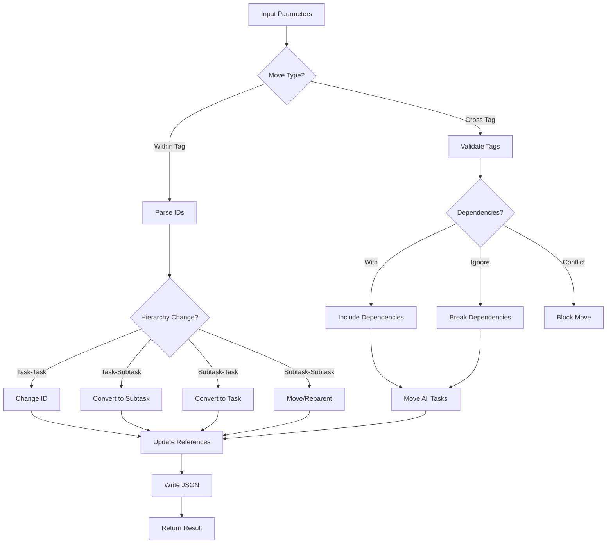

# Tool: move_task

## Purpose
Move tasks or subtasks to new positions within or between tags without AI assistance, supporting hierarchy changes and bulk operations.

## Business Value
- **Who uses this**: Developers reorganizing task structure and priorities
- **What problem it solves**: Allows flexible task reorganization including hierarchy changes and cross-tag moves
- **Why it's better than manual approach**: Automatically handles dependencies, ID conflicts, and maintains data integrity

## Functionality Specification

### Input Requirements

| Parameter | Type | Required | Default | Description |
|-----------|------|----------|---------|-------------|
| `from` | string | Yes | - | ID(s) of task/subtask to move (e.g., "5", "5.2", "5,6,7") |
| `to` | string | No* | - | ID(s) of destination (e.g., "7", "7.3", "8,9,10") |
| `file` | string | No | "tasks/tasks.json" | Path to tasks file |
| `projectRoot` | string | Yes | - | Absolute path to project directory |
| `tag` | string | No | Current tag | Tag context for within-tag moves |
| `fromTag` | string | No | - | Source tag for cross-tag moves |
| `toTag` | string | No | - | Target tag for cross-tag moves |
| `withDependencies` | boolean | No | false | Move dependent tasks along |
| `ignoreDependencies` | boolean | No | false | Break cross-tag dependencies |

*Note: `to` required for within-tag moves, not used for cross-tag moves

#### Validation Rules
1. Source IDs must exist in source location
2. For batch moves, source and destination counts must match
3. Cannot move to existing task/subtask IDs (no overwriting)
4. Cannot move subtasks across tags (only whole tasks)
5. Cross-tag moves require `fromTag` and `toTag` parameters

### Processing Logic

#### Step-by-Step Algorithm

```
1. DETERMINE_MOVE_TYPE
   If fromTag && toTag && fromTag !== toTag:
   - Cross-tag move mode
   - Validate no subtasks in source IDs
   Else:
   - Within-tag move mode
   - Require destination ID(s)
   
2. PARSE_AND_VALIDATE_IDS
   - Split comma-separated IDs
   - For batch moves:
     * Validate ID count match
     * Skip same-to-same moves
   - Validate all source IDs exist
   
3. WITHIN_TAG_MOVE
   Determine hierarchy change:
   - Subtask to Subtask: Move within/between parents
   - Subtask to Task: Convert to standalone task
   - Task to Subtask: Convert to subtask
   - Task to Task: Change task ID/position
   
4. CROSS_TAG_MOVE
   - Validate source and target tags exist
   - Check for ID conflicts in target
   - Handle dependencies:
     * If withDependencies: Include all dependent tasks
     * If ignoreDependencies: Break cross-tag dependencies
     * Otherwise: Block if conflicts exist
   - Move tasks preserving metadata
   
5. UPDATE_DEPENDENCIES
   - Update references to moved tasks
   - Handle subtask dependency updates
   - Preserve dependency integrity
   
6. SAVE_AND_GENERATE
   - Write updated tasks.json
   - Optionally regenerate task files
   - Return move summary
```

### Move Type Matrix

| Source Type | Destination Type | Operation | Result |
|------------|------------------|-----------|---------|
| Task | Task | ID change | Task with new ID |
| Task | Subtask | Conversion | Task becomes subtask |
| Subtask | Task | Conversion | Subtask becomes task |
| Subtask | Subtask (same parent) | Reorder | Position change |
| Subtask | Subtask (different parent) | Reparent | Parent change |
| Task | Different Tag | Cross-tag | Task in new tag |

### Output Specification

#### Success Response (Single Move)
```javascript
{
  success: true,
  data: {
    message: "Successfully moved task/subtask 5.2 to 7.3",
    movedItem: {
      id: 3,
      title: "Implement validation",
      // ... task/subtask data
    }
  }
}
```

#### Success Response (Batch Move)
```javascript
{
  success: true,
  data: {
    moves: [
      { message: "Moved task 5 to 8", movedItem: {...} },
      { message: "Moved task 6 to 9", movedItem: {...} }
    ],
    skipped: [
      { fromId: "7", toId: "7", reason: "same ID" }
    ],
    message: "Successfully moved 2 tasks, skipped 1"
  }
}
```

#### Success Response (Cross-Tag)
```javascript
{
  success: true,
  data: {
    message: "Successfully moved 3 tasks from 'feature' to 'main'",
    movedTasks: [
      { id: 5, fromTag: "feature", toTag: "main" },
      { id: 6, fromTag: "feature", toTag: "main" },
      { id: 7, fromTag: "feature", toTag: "main" }
    ]
  }
}
```

#### Error Response
```javascript
{
  success: false,
  error: {
    code: "TASK_ALREADY_EXISTS",
    message: "Task with ID 7 already exists. Use a different destination ID."
  }
}
```

#### Error Codes
- `MISSING_SOURCE_ID`: Source ID required
- `MISSING_DESTINATION_ID`: Destination ID required for within-tag
- `TASK_NOT_FOUND`: Source task doesn't exist
- `SUBTASK_NOT_FOUND`: Source subtask doesn't exist
- `PARENT_TASK_NOT_FOUND`: Parent task doesn't exist
- `TASK_ALREADY_EXISTS`: Destination ID already in use
- `ID_COUNT_MISMATCH`: Batch move ID count mismatch
- `CROSS_TAG_DEPENDENCY_CONFLICTS`: Unresolved dependencies
- `CANNOT_MOVE_SUBTASK`: Cannot move subtasks across tags
- `INVALID_SOURCE_TAG`: Source tag doesn't exist
- `INVALID_TARGET_TAG`: Target tag doesn't exist

### Side Effects
1. **Changes task/subtask IDs** and positions
2. **Updates all dependency references** to moved tasks
3. **Creates or removes subtask arrays** as needed
4. **Adds move history metadata** for cross-tag moves
5. **May break dependencies** if ignoreDependencies used

## Data Flow



## Implementation Details

### Data Storage
- **Input/Output**: `.taskmaster/tasks/tasks.json` - Task data by tag
- Preserves tagged structure for cross-tag moves
- Updates dependency references globally
- Maintains metadata and move history

### Hierarchy Conversion
```javascript
// Task to Subtask conversion
const newSubtask = {
  id: destSubtaskId,
  title: sourceTask.title,
  description: sourceTask.description,
  status: sourceTask.status || 'pending',
  dependencies: sourceTask.dependencies || [],
  details: sourceTask.details || '',
  testStrategy: sourceTask.testStrategy || ''
};
```

### Dependency Updates
```javascript
// Update references to moved task
tasks.forEach((task) => {
  if (task.dependencies?.includes(sourceTask.id)) {
    const depIndex = task.dependencies.indexOf(sourceTask.id);
    task.dependencies[depIndex] = destTaskId;
  }
});
```

### Cross-Tag Move
```javascript
// Preserve metadata during cross-tag move
function preserveTaskMetadata(task, sourceTag, targetTag) {
  task.tag = targetTag;
  if (!task.metadata) task.metadata = {};
  if (!task.metadata.moveHistory) task.metadata.moveHistory = [];
  task.metadata.moveHistory.push({
    fromTag: sourceTag,
    toTag: targetTag,
    timestamp: new Date().toISOString()
  });
  return task;
}
```

### Batch Processing
```javascript
// Process multiple moves sequentially
for (let i = 0; i < sourceIds.length; i++) {
  const result = await moveTask(
    tasksPath,
    sourceIds[i],
    destinationIds[i],
    false, // Don't generate files for each
    options
  );
  results.push(result);
}
```

## AI Integration Points
This tool **does not use AI**. It performs pure data operations:
- Direct manipulation of task positions and IDs
- Deterministic conversion between types
- Rule-based dependency resolution
- No content generation or analysis

## Dependencies
- **File System Access**: Read/write access to JSON files
- **Path Utils**: Path resolution and validation
- **Dependency Manager**: Cross-tag dependency analysis
- **Generate Task Files**: Optional file regeneration
- **Silent Mode**: Console output suppression for MCP

## Test Scenarios

### 1. Simple Task Move
```javascript
// Test: Move task to new ID
Input: {
  from: "5",
  to: "8",
  projectRoot: "/project"
}
Expected: Task 5 becomes task 8, dependencies updated
```

### 2. Subtask Reparenting
```javascript
// Test: Move subtask to different parent
Input: {
  from: "5.2",
  to: "7.3",
  projectRoot: "/project"
}
Expected: Subtask moved from task 5 to task 7
```

### 3. Task to Subtask Conversion
```javascript
// Test: Convert task to subtask
Input: {
  from: "5",
  to: "7.3",
  projectRoot: "/project"
}
Expected: Task 5 becomes subtask 7.3
```

### 4. Subtask to Task Promotion
```javascript
// Test: Convert subtask to task
Input: {
  from: "5.2",
  to: "8",
  projectRoot: "/project"
}
Expected: Subtask 5.2 becomes task 8
```

### 5. Batch Move
```javascript
// Test: Move multiple tasks
Input: {
  from: "5,6,7",
  to: "8,9,10",
  projectRoot: "/project"
}
Expected: Three tasks moved to new IDs
```

### 6. Cross-Tag Move
```javascript
// Test: Move tasks between tags
Input: {
  from: "5,6",
  fromTag: "feature",
  toTag: "main",
  projectRoot: "/project"
}
Expected: Tasks moved from feature to main tag
```

### 7. Move with Dependencies
```javascript
// Test: Move task and its dependencies
Input: {
  from: "5",
  fromTag: "feature",
  toTag: "main",
  withDependencies: true,
  projectRoot: "/project"
}
Expected: Task 5 and all dependent tasks moved
```

### 8. ID Conflict Detection
```javascript
// Test: Destination ID exists
Input: {
  from: "5",
  to: "6",
  projectRoot: "/project"
}
Setup: Task 6 already exists
Expected: Error - task already exists
```

## Implementation Notes
- **Complexity**: Medium-High (multiple move types, dependency handling)
- **Estimated Effort**: 6-8 hours for complete implementation
- **Critical Success Factors**:
  1. Proper move type detection
  2. Hierarchy conversion logic
  3. Dependency reference updates
  4. Cross-tag validation
  5. Batch operation support

## Performance Considerations
- Sequential processing for batch moves
- Multiple array operations for dependency updates
- File I/O for each move operation
- Optional file generation adds overhead
- No external API calls

## Security Considerations
- Validate all task IDs
- Prevent overwriting existing tasks
- Path traversal protection
- Tag isolation for cross-tag moves
- Preserve data integrity during moves

## Code References
- Current implementation: `scripts/modules/task-manager/move-task.js`
- MCP tool: `mcp-server/src/tools/move-task.js`
- Direct functions: 
  - `mcp-server/src/core/direct-functions/move-task.js`
  - `mcp-server/src/core/direct-functions/move-task-cross-tag.js`
- Key functions:
  - `moveTask()`: Main within-tag move logic
  - `moveTasksBetweenTags()`: Cross-tag move logic
  - `moveSubtaskToSubtask()`: Subtask reparenting
  - `moveTaskToSubtask()`: Task to subtask conversion
  - `preserveTaskMetadata()`: Metadata preservation
  - `findAllDependenciesRecursively()`: Dependency resolution
- Design patterns: Strategy pattern (move types), Command pattern (move operations)

---

*This documentation captures the actual current implementation of the move_task tool as a pure data operation without AI integration.*