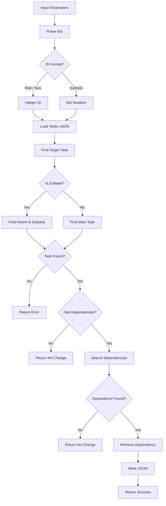

# Tool: remove_dependency

## Purpose
Remove a dependency relationship from a task or subtask without AI assistance.

## Business Value
- **Who uses this**: Developers managing task dependencies and workflows
- **What problem it solves**: Removes incorrect or obsolete dependency relationships between tasks
- **Why it's better than manual approach**: Validates task existence and maintains dependency integrity

## Functionality Specification

### Input Requirements

| Parameter | Type | Required | Default | Description |
|-----------|------|----------|---------|-------------|
| `id` | string | Yes | - | ID of task to remove dependency from (e.g., "5" or "5.2") |
| `dependsOn` | string | Yes | - | ID of task to remove as a dependency (e.g., "3" or "3.1") |
| `file` | string | No | "tasks/tasks.json" | Path to tasks file |
| `projectRoot` | string | Yes | - | Absolute path to project directory |
| `tag` | string | No | Current tag | Tag context to operate on |

#### Validation Rules
1. Both task IDs must be provided
2. Task with specified ID must exist
3. Dependency must actually exist on the task
4. Both main tasks and subtasks can have dependencies removed
5. Uses dot notation for subtasks (e.g., "5.2")

### Processing Logic

#### Step-by-Step Algorithm

```
1. VALIDATE_INPUTS
   - Check both IDs are provided
   - Parse task/subtask IDs
   - Validate projectRoot exists
   - Resolve tag context
   
2. LOAD_TASKS
   - Read tasks.json file
   - Format task IDs correctly:
     * Main tasks as integers
     * Subtasks as "parent.sub" strings
   
3. FIND_TARGET_TASK
   If task ID contains dot (subtask):
   - Parse parent and subtask IDs
   - Find parent task
   - Find subtask in parent's array
   Else (main task):
   - Find task in main array
   
4. CHECK_DEPENDENCIES
   - Verify task has dependencies array
   - If no dependencies, return early
   - Normalize dependency ID for comparison
   
5. FIND_AND_REMOVE
   - Search for dependency in array
   - Handle different ID formats:
     * String to string comparison
     * Numeric comparison for relative refs
   - Remove dependency if found
   
6. SAVE_AND_RETURN
   - Write updated tasks.json
   - Return success confirmation
   - Include task and dependency IDs
```

### Output Specification

#### Success Response (Dependency Removed)
```javascript
{
  success: true,
  data: {
    message: "Successfully removed dependency: Task 5 no longer depends on 3",
    taskId: 5,
    dependencyId: 3
  }
}
```

#### Success Response (Subtask)
```javascript
{
  success: true,
  data: {
    message: "Successfully removed dependency: Task 5.2 no longer depends on 3.1",
    taskId: "5.2",
    dependencyId: "3.1"
  }
}
```

#### Info Response (No Dependency)
```javascript
{
  success: true,
  data: {
    message: "Task 5 does not depend on 3, no changes made",
    taskId: 5,
    dependencyId: 3
  }
}
```

#### Error Response
```javascript
{
  success: false,
  error: {
    code: "CORE_FUNCTION_ERROR",
    message: "Task 99 not found."
  }
}
```

#### Error Codes
- `MISSING_ARGUMENT`: Required parameters not provided
- `INPUT_VALIDATION_ERROR`: Task ID or dependency ID missing
- `CORE_FUNCTION_ERROR`: Error during dependency removal
- Task not found errors
- Parent task not found errors
- Subtask not found errors

### Side Effects
1. **Modifies task's dependencies array** in tasks.json
2. Does not create empty dependencies array (leaves unchanged)
3. Does not validate remaining dependencies
4. Does not regenerate task files
5. Changes affect task execution order

## Data Flow



## Implementation Details

### Data Storage
- **Input/Output**: `.taskmaster/tasks/tasks.json` - Task data by tag
- Dependencies stored as arrays in task objects
- Integer IDs for main task dependencies
- String IDs for subtask dependencies (dot notation)

### ID Formatting
```javascript
// Format task IDs correctly
const formattedTaskId = 
  typeof taskId === 'string' && taskId.includes('.')
    ? taskId
    : parseInt(taskId, 10);

const formattedDependencyId = formatTaskId(dependencyId);
```

### Subtask Handling
```javascript
// Handle dot notation for subtasks
if (typeof formattedTaskId === 'string' && formattedTaskId.includes('.')) {
  const [parentId, subtaskId] = formattedTaskId
    .split('.')
    .map((id) => parseInt(id, 10));
  const parentTask = data.tasks.find((t) => t.id === parentId);
  targetTask = parentTask.subtasks.find((s) => s.id === subtaskId);
  isSubtask = true;
}
```

### Dependency Search
```javascript
// Find dependency by comparing string representations
const dependencyIndex = targetTask.dependencies.findIndex((dep) => {
  // Convert both to strings for comparison
  let depStr = String(dep);
  
  // Special handling for numeric IDs in subtask context
  if (typeof dep === 'number' && dep < 100 && isSubtask) {
    const [parentId] = formattedTaskId.split('.');
    depStr = `${parentId}.${dep}`;
  }
  
  return depStr === normalizedDependencyId;
});
```

### Array Modification
```javascript
// Remove the dependency if found
if (dependencyIndex !== -1) {
  targetTask.dependencies.splice(dependencyIndex, 1);
}
```

## AI Integration Points
This tool **does not use AI**. It performs pure data operations:
- Direct array manipulation for dependencies
- Simple validation checks
- No content generation or analysis
- No external API calls

## Dependencies
- **File System Access**: Read/write access to JSON files
- **Dependency Manager**: Core dependency management functions
- **Utils**: Task existence checks, JSON operations, formatting
- **Silent Mode**: Console output suppression for MCP

## Test Scenarios

### 1. Remove Main Task Dependency
```javascript
// Test: Remove dependency from task
Setup: Task 5 depends on [3, 4]
Input: {
  id: "5",
  dependsOn: "3",
  projectRoot: "/project"
}
Expected: Task 5.dependencies = [4]
```

### 2. Remove Subtask Dependency
```javascript
// Test: Remove dependency from subtask
Setup: Subtask 5.2 depends on ["3.1", "4.1"]
Input: {
  id: "5.2",
  dependsOn: "3.1",
  projectRoot: "/project"
}
Expected: Subtask 5.2.dependencies = ["4.1"]
```

### 3. Remove Mixed Dependency
```javascript
// Test: Remove main task from subtask deps
Setup: Subtask 5.2 depends on [3, "4.1"]
Input: {
  id: "5.2",
  dependsOn: "3",
  projectRoot: "/project"
}
Expected: Subtask 5.2.dependencies = ["4.1"]
```

### 4. Non-Existent Dependency
```javascript
// Test: Remove dependency that doesn't exist
Setup: Task 5 depends on [3, 4]
Input: {
  id: "5",
  dependsOn: "7",
  projectRoot: "/project"
}
Expected: No changes, info message returned
```

### 5. Task Without Dependencies
```javascript
// Test: Remove from task with no dependencies
Setup: Task 5 has no dependencies property
Input: {
  id: "5",
  dependsOn: "3",
  projectRoot: "/project"
}
Expected: No changes, info message returned
```

### 6. Invalid Task
```javascript
// Test: Task doesn't exist
Input: {
  id: "99",
  dependsOn: "3",
  projectRoot: "/project"
}
Expected: Error - task not found
```

### 7. Remove Last Dependency
```javascript
// Test: Remove only remaining dependency
Setup: Task 5 depends on [3]
Input: {
  id: "5",
  dependsOn: "3",
  projectRoot: "/project"
}
Expected: Task 5.dependencies = []
```

### 8. Relative Subtask Reference
```javascript
// Test: Remove relative subtask dependency
Setup: Subtask 5.2 depends on [1, 2] (relative to parent)
Input: {
  id: "5.2",
  dependsOn: "5.1",
  projectRoot: "/project"
}
Expected: Removes dependency if 1 refers to 5.1
```

## Implementation Notes
- **Complexity**: Low (simple array operations)
- **Estimated Effort**: 2-3 hours for complete implementation
- **Critical Success Factors**:
  1. Proper ID parsing and normalization
  2. Task existence validation
  3. Dependency array search logic
  4. Handling different ID formats
  5. Graceful handling of missing dependencies

## Performance Considerations
- Single file read/write operation
- Linear search for task finding
- Linear search for dependency finding
- Array splice operation for removal
- No external API calls

## Security Considerations
- Validate all task IDs
- Path traversal protection
- Tag isolation maintained
- No data corruption on missing dependencies
- Graceful error handling

## Code References
- Current implementation: `scripts/modules/dependency-manager.js` (removeDependency function, lines 245-367)
- MCP tool: `mcp-server/src/tools/remove-dependency.js`
- Direct function: `mcp-server/src/core/direct-functions/remove-dependency.js`
- Key functions:
  - `removeDependency()`: Main dependency removal logic
  - `taskExists()`: Validates task/subtask existence
  - `formatTaskId()`: Formats IDs correctly
  - `readJSON()`/`writeJSON()`: Tag-aware file operations
- Design patterns: Simple command pattern

---

*This documentation captures the actual current implementation of the remove_dependency tool as a pure data operation without AI integration.*