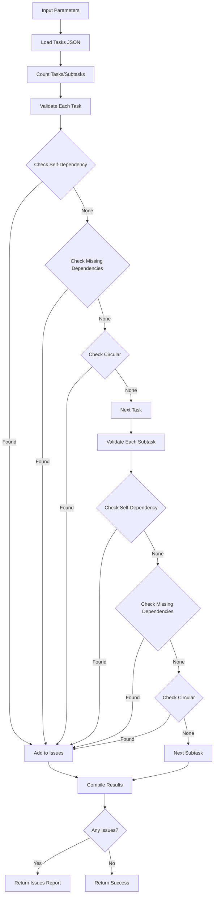

# Tool: validate_dependencies

## Purpose
Check tasks for dependency issues like circular references, self-dependencies, or links to non-existent tasks without making any changes.

## Business Value
- **Who uses this**: Developers ensuring dependency integrity
- **What problem it solves**: Identifies invalid dependencies that could break task execution order
- **Why it's better than manual approach**: Automatically detects complex issues like circular dependencies

## Functionality Specification

### Input Requirements

| Parameter | Type | Required | Default | Description |
|-----------|------|----------|---------|-------------|
| `file` | string | No | "tasks/tasks.json" | Path to tasks file |
| `projectRoot` | string | Yes | - | Absolute path to project directory |
| `tag` | string | No | Current tag | Tag context to operate on |

#### Validation Rules
1. Tasks file must exist at specified path
2. Validates all tasks and subtasks in the tag
3. Does not modify any data (read-only operation)
4. Reports all issues found without fixing them

### Processing Logic

#### Step-by-Step Algorithm

```
1. LOAD_TASKS
   - Read tasks.json file
   - Validate JSON structure
   - Count tasks and subtasks
   
2. VALIDATE_TASK_DEPENDENCIES
   For each task:
   - Check for self-dependencies
   - Verify dependency targets exist
   - Check for circular dependencies
   
3. VALIDATE_SUBTASK_DEPENDENCIES
   For each subtask:
   - Create full subtask ID (parent.subtask)
   - Check for self-dependencies
   - Verify dependency targets exist
   - Handle relative subtask references
   - Check for circular dependencies
   
4. ISSUE_COLLECTION
   Track issues by type:
   - self: Task depends on itself
   - missing: Dependency target doesn't exist
   - circular: Part of circular dependency chain
   
5. GENERATE_REPORT
   - Count all dependencies verified
   - Compile issue list
   - Format validation summary
   - Return validation result
```

### Validation Types

| Issue Type | Description | Example |
|-----------|-------------|---------|
| `self` | Task depends on itself | Task 5 depends on 5 |
| `missing` | Dependency target doesn't exist | Task 5 depends on non-existent task 99 |
| `circular` | Part of circular dependency chain | Task 5 → 6 → 7 → 5 |

### Output Specification

#### Success Response (All Valid)
```javascript
{
  success: true,
  data: {
    message: "Dependencies validated successfully",
    tasksPath: "/project/.taskmaster/tasks/tasks.json",
    summary: {
      tasksChecked: 10,
      subtasksChecked: 25,
      totalDependencies: 45,
      issuesFound: 0
    }
  }
}
```

#### Success Response (Issues Found)
```javascript
{
  success: true,
  data: {
    message: "Dependency validation failed. Found 3 issue(s)",
    tasksPath: "/project/.taskmaster/tasks/tasks.json",
    issues: [
      {
        type: "self",
        taskId: "5",
        message: "Task 5 depends on itself"
      },
      {
        type: "missing",
        taskId: "7",
        dependencyId: "99",
        message: "Task 7 depends on non-existent task 99"
      },
      {
        type: "circular",
        taskId: "10",
        message: "Task 10 is part of a circular dependency chain"
      }
    ],
    summary: {
      tasksChecked: 10,
      subtasksChecked: 25,
      totalDependencies: 45,
      issuesFound: 3
    }
  }
}
```

#### Error Response
```javascript
{
  success: false,
  error: {
    code: "FILE_NOT_FOUND",
    message: "Tasks file not found at /project/.taskmaster/tasks/tasks.json"
  }
}
```

#### Error Codes
- `MISSING_ARGUMENT`: Required parameters not provided
- `FILE_NOT_FOUND`: Tasks file doesn't exist
- `VALIDATION_ERROR`: Error during validation process

### Side Effects
1. **No data modifications** - read-only operation
2. Does not fix any issues found
3. Does not regenerate task files
4. Logs validation results for debugging
5. Returns comprehensive issue report

## Data Flow



## Implementation Details

### Data Storage
- **Input**: `.taskmaster/tasks/tasks.json` - Task data by tag (read-only)
- No output files generated
- Results returned in response only
- Issues tracked in memory during validation

### Circular Dependency Detection
```javascript
function isCircularDependency(tasks, taskId, chain = []) {
  const taskIdStr = String(taskId);
  
  // If we've seen this task before, circular found
  if (chain.some((id) => String(id) === taskIdStr)) {
    return true;
  }
  
  // Find task and check its dependencies recursively
  const task = findTask(tasks, taskIdStr);
  if (!task || !task.dependencies) return false;
  
  const newChain = [...chain, taskIdStr];
  return task.dependencies.some((depId) => 
    isCircularDependency(tasks, depId, newChain)
  );
}
```

### Subtask Validation
```javascript
// Handle subtask dependencies with relative references
task.subtasks.forEach((subtask) => {
  const fullSubtaskId = `${task.id}.${subtask.id}`;
  
  subtask.dependencies?.forEach((depId) => {
    // Check for self-dependencies
    if (String(depId) === String(fullSubtaskId) ||
        (typeof depId === 'number' && depId === subtask.id)) {
      issues.push({
        type: 'self',
        taskId: fullSubtaskId,
        message: `Subtask ${fullSubtaskId} depends on itself`
      });
    }
    
    // Check if dependency exists
    if (!taskExists(tasks, depId)) {
      issues.push({
        type: 'missing',
        taskId: fullSubtaskId,
        dependencyId: depId,
        message: `Subtask ${fullSubtaskId} depends on non-existent task/subtask ${depId}`
      });
    }
  });
});
```

### Issue Counting
```javascript
function countAllDependencies(tasks) {
  let count = 0;
  
  tasks.forEach((task) => {
    // Count main task dependencies
    if (task.dependencies) {
      count += task.dependencies.length;
    }
    
    // Count subtask dependencies
    if (task.subtasks) {
      task.subtasks.forEach((subtask) => {
        if (subtask.dependencies) {
          count += subtask.dependencies.length;
        }
      });
    }
  });
  
  return count;
}
```

## AI Integration Points
This tool **does not use AI**. It performs pure data validation:
- Algorithmic dependency checking
- Graph traversal for circular detection
- Simple existence validation
- No content generation or analysis

## Dependencies
- **File System Access**: Read access to JSON files
- **Dependency Manager**: Core validation functions
- **Utils**: Task existence checks, JSON operations
- **Silent Mode**: Console output suppression for MCP

## Test Scenarios

### 1. All Dependencies Valid
```javascript
// Test: Clean dependency structure
Setup: Tasks with valid dependencies only
Input: {
  projectRoot: "/project"
}
Expected: Success with 0 issues
```

### 2. Self-Dependency Detection
```javascript
// Test: Task depends on itself
Setup: Task 5 has dependencies: [5, 3]
Input: {
  projectRoot: "/project"
}
Expected: Issue - self dependency for task 5
```

### 3. Missing Dependency Detection
```javascript
// Test: Dependency doesn't exist
Setup: Task 5 depends on non-existent task 99
Input: {
  projectRoot: "/project"
}
Expected: Issue - missing dependency 99
```

### 4. Circular Dependency Detection
```javascript
// Test: Circular dependency chain
Setup: 
  Task 5 depends on 6
  Task 6 depends on 7
  Task 7 depends on 5
Input: {
  projectRoot: "/project"
}
Expected: Issues - circular dependencies for tasks 5, 6, 7
```

### 5. Subtask Self-Dependency
```javascript
// Test: Subtask depends on itself
Setup: Subtask 5.2 has dependencies: [2]
Input: {
  projectRoot: "/project"
}
Expected: Issue - subtask 5.2 self dependency
```

### 6. Cross-Subtask Dependencies
```javascript
// Test: Valid cross-subtask dependencies
Setup: 
  Subtask 5.2 depends on "3.1"
  Subtask 3.1 exists
Input: {
  projectRoot: "/project"
}
Expected: Success - valid dependency
```

### 7. Mixed Issue Types
```javascript
// Test: Multiple issue types
Setup: 
  Task 5 depends on itself
  Task 6 depends on non-existent 99
  Tasks 7-8-9 form circular chain
Input: {
  projectRoot: "/project"
}
Expected: 4+ issues of different types
```

### 8. Empty Dependencies
```javascript
// Test: Tasks with no dependencies
Setup: All tasks have empty or no dependencies arrays
Input: {
  projectRoot: "/project"
}
Expected: Success with 0 dependencies verified
```

## Implementation Notes
- **Complexity**: Medium (graph traversal for circular detection)
- **Estimated Effort**: 3-4 hours for complete implementation
- **Critical Success Factors**:
  1. Accurate circular dependency detection
  2. Proper handling of subtask references
  3. Comprehensive issue reporting
  4. Performance with large task sets
  5. Clear issue categorization

## Performance Considerations
- Single file read operation
- O(n²) worst case for circular detection
- Memory usage proportional to task count
- No file writes or external calls
- Results cached during single validation run

## Security Considerations
- Read-only operation
- No data modification risks
- Path traversal protection
- Tag isolation maintained
- Safe for production use

## Code References
- Current implementation: `scripts/modules/dependency-manager.js` (validateDependenciesCommand function, lines 595-685)
- MCP tool: `mcp-server/src/tools/validate-dependencies.js`
- Direct function: `mcp-server/src/core/direct-functions/validate-dependencies.js`
- Key functions:
  - `validateDependenciesCommand()`: Main validation logic
  - `validateTaskDependencies()`: Core validation algorithm
  - `isCircularDependency()`: Circular detection
  - `taskExists()`: Dependency existence check
  - `countAllDependencies()`: Statistics gathering
- Design patterns: Visitor pattern (task traversal), Strategy pattern (issue types)

---

*This documentation captures the actual current implementation of the validate_dependencies tool as a pure data validation operation without AI integration.*