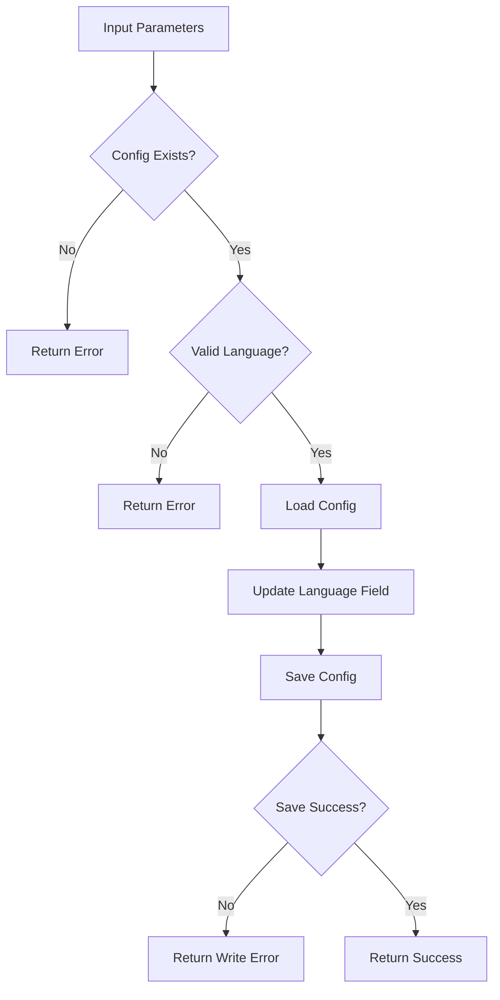

# Tool: response_language

## Purpose
Set the response language for all AI-generated content in the Task Master system.

## Business Value
- **Who uses this**: Developers working in non-English environments
- **What problem it solves**: Ensures all AI responses are in the developer's preferred language
- **Why it's better than manual approach**: Centralizes language configuration for consistent responses

## Functionality Specification

### Input Requirements

| Parameter | Type | Required | Default | Description |
|-----------|------|----------|---------|-------------|
| `projectRoot` | string | Yes | - | Absolute path to project directory |
| `language` | string | Yes | - | Language name or code (e.g., "中文", "English", "español") |

#### Validation Rules
1. Project must be initialized (config.json must exist)
2. Language must be a non-empty string
3. Any valid language name or code is accepted
4. Changes persist across all AI operations

### Processing Logic

#### Step-by-Step Algorithm

```
1. VALIDATE_PROJECT
   - Check if config file exists
   - Verify project initialization
   
2. VALIDATE_LANGUAGE
   - Ensure language is non-empty string
   - Trim whitespace
   
3. LOAD_CONFIGURATION
   - Read current config.json
   - Access global settings
   
4. UPDATE_LANGUAGE
   - Set global.responseLanguage field
   - Preserve other settings
   
5. SAVE_CONFIGURATION
   - Write updated config to file
   - Verify write success
   
6. RETURN_CONFIRMATION
   - Return success with new language
   - Include confirmation message
```

### Output Specification

#### Success Response
```javascript
{
  success: true,
  data: {
    responseLanguage: "中文",
    message: "Successfully set response language to: 中文"
  }
}
```

#### Error Response (Not Initialized)
```javascript
{
  success: false,
  error: {
    code: "CONFIG_MISSING",
    message: "The configuration file is missing. Run \"task-master init\" to create it."
  }
}
```

#### Error Response (Invalid Language)
```javascript
{
  success: false,
  error: {
    code: "INVALID_RESPONSE_LANGUAGE",
    message: "Invalid response language: . Must be a non-empty string."
  }
}
```

#### Error Codes
- `CONFIG_MISSING`: Project not initialized
- `INVALID_RESPONSE_LANGUAGE`: Empty or invalid language string
- `WRITE_ERROR`: Failed to save configuration
- `SET_RESPONSE_LANGUAGE_ERROR`: General error during operation

### Side Effects
1. **Modifies config.json** file permanently
2. Affects all future AI-generated responses
3. Applies to all AI tools and commands
4. Does not affect existing task content
5. Takes effect immediately

## Data Flow



## Implementation Details

### Data Storage
- **Configuration**: `.taskmaster/config.json`
- Language stored in `global.responseLanguage` field
- Default language: "English"
- Persists across sessions

### Configuration Structure
```json
{
  "global": {
    "responseLanguage": "español",
    // other global settings
  }
  // other configuration sections
}
```

### AI Integration
When AI services are called, the response language is automatically appended to system prompts:
```javascript
const responseLanguage = getResponseLanguage(projectRoot);
const systemPromptWithLanguage = `${systemPrompt} \n\n Always respond in ${responseLanguage}.`;
```

### Language Examples
- English: "English"
- Chinese: "中文" or "Chinese"
- Spanish: "español" or "Spanish"
- Japanese: "日本語" or "Japanese"
- French: "français" or "French"
- German: "Deutsch" or "German"
- Portuguese: "português" or "Portuguese"
- Russian: "русский" or "Russian"

## AI Integration Points
This tool **configures AI behavior** but doesn't directly use AI:
- Sets language preference for all AI operations
- Affects system prompt generation
- Applied to all AI providers (OpenAI, Anthropic, Google, etc.)
- Language instruction added to every AI request

### Affected AI Operations
All AI-powered tools respect this setting:
- `parse_prd` - PRD parsing responses
- `analyze_project_complexity` - Analysis reports
- `expand_task` - Subtask generation
- `add_task` - Task creation
- `update` - Task updates
- `update_task` - Single task updates
- `update_subtask` - Subtask updates
- `research` - Research outputs

## Dependencies
- **Config Manager**: Configuration read/write operations
- **Path Utils**: Config file path resolution
- **Silent Mode**: Console output suppression for MCP

## Test Scenarios

### 1. Set English Language
```javascript
// Test: Set to English
Input: {
  projectRoot: "/project",
  language: "English"
}
Expected: config.global.responseLanguage = "English"
```

### 2. Set Chinese Language
```javascript
// Test: Set to Chinese
Input: {
  projectRoot: "/project",
  language: "中文"
}
Expected: config.global.responseLanguage = "中文"
```

### 3. Set Spanish Language
```javascript
// Test: Set to Spanish
Input: {
  projectRoot: "/project",
  language: "español"
}
Expected: config.global.responseLanguage = "español"
```

### 4. Project Not Initialized
```javascript
// Test: Missing config
Setup: No config.json file
Input: {
  projectRoot: "/project",
  language: "French"
}
Expected: Error - CONFIG_MISSING
```

### 5. Empty Language String
```javascript
// Test: Invalid language
Input: {
  projectRoot: "/project",
  language: ""
}
Expected: Error - INVALID_RESPONSE_LANGUAGE
```

### 6. Whitespace Language
```javascript
// Test: Whitespace only
Input: {
  projectRoot: "/project",
  language: "   "
}
Expected: Error - INVALID_RESPONSE_LANGUAGE
```

### 7. Language Persistence
```javascript
// Test: Setting persists
Input: {
  projectRoot: "/project",
  language: "日本語"
}
Action: Read config after setting
Expected: Language persists in config file
```

### 8. AI Response Verification
```javascript
// Test: AI uses language
Setup: Set language to "français"
Action: Call any AI tool
Expected: Response in French
```

## Implementation Notes
- **Complexity**: Low (simple configuration update)
- **Estimated Effort**: 1-2 hours for complete implementation
- **Critical Success Factors**:
  1. Config file validation
  2. Language string validation
  3. Proper config persistence
  4. Integration with AI services
  5. Error handling

## Performance Considerations
- Single file read/write operation
- No validation of language validity
- Immediate effect on AI operations
- No migration of existing content
- No external API calls

## Security Considerations
- No validation of language codes
- Path traversal protection for config
- No injection risks (string value only)
- Config file permissions preserved
- No sensitive data exposure

## Code References
- Current implementation: `scripts/modules/task-manager/response-language.js`
- MCP tool: `mcp-server/src/tools/response-language.js`
- Direct function: `mcp-server/src/core/direct-functions/response-language.js`
- AI integration: `scripts/modules/ai-services-unified.js` (lines 607-608)
- Key functions:
  - `setResponseLanguage()`: Main language setting logic
  - `getResponseLanguage()`: Retrieves current language
  - `getConfig()`/`writeConfig()`: Config management
  - `findConfigPath()`: Config file location
- Design patterns: Configuration pattern, Strategy pattern (language selection)

---

*This documentation captures the actual current implementation of the response_language tool as a configuration operation that affects all AI-generated content.*