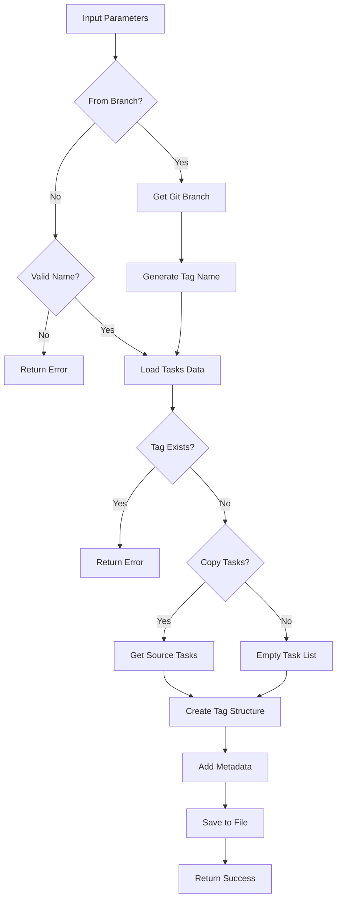

# Tool: add_tag

## Purpose
Create a new tag for parallel task management, optionally copying tasks from existing tags or matching git branches.

## Business Value
- **Who uses this**: Developers working on multiple features or contexts in parallel
- **What problem it solves**: Enables context switching between different work streams without losing task progress
- **Why it's better than manual approach**: Automates tag creation with proper metadata and task copying

## Functionality Specification

### Input Requirements

| Parameter | Type | Required | Default | Description |
|-----------|------|----------|---------|-------------|
| `name` | string | Yes* | - | Name of the new tag to create (*unless fromBranch=true) |
| `copyFromCurrent` | boolean | No | false | Copy tasks from the current tag |
| `copyFromTag` | string | No | - | Specific tag to copy tasks from |
| `fromBranch` | boolean | No | false | Create tag name from current git branch |
| `description` | string | No | Auto-generated | Optional description for the tag |
| `file` | string | No | "tasks/tasks.json" | Path to tasks file |
| `projectRoot` | string | Yes | - | Absolute path to project directory |

#### Validation Rules
1. Tag name must be alphanumeric with hyphens/underscores only
2. Reserved names: "master", "main", "default" (cannot be used)
3. Tag name must not already exist
4. If `fromBranch=true`, must be in a git repository
5. Cannot specify both `copyFromCurrent` and `copyFromTag`

### Processing Logic

#### Step-by-Step Algorithm

```
1. VALIDATE_TAG_NAME
   - Check if name provided (unless fromBranch)
   - Validate format: /^[a-zA-Z0-9_-]+$/
   - Check against reserved names
   
2. IF_FROM_BRANCH
   - Check git repository exists
   - Get current branch name
   - Generate tag name from branch
   - Check git-tag mapping
   
3. LOAD_TASKS_DATA
   - Read tasks.json file
   - Extract raw tagged data
   - Handle legacy format conversion
   
4. CHECK_EXISTING_TAG
   - Verify tag doesn't exist
   - Prevent duplicate creation
   
5. DETERMINE_SOURCE_TASKS
   If copyFromCurrent or copyFromTag:
   - Get source tag (current or specified)
   - Load tasks from source
   - Create deep copy of tasks
   Else:
   - Create empty task array
   
6. CREATE_TAG_STRUCTURE
   - Initialize tag object
   - Copy tasks if specified
   - Add metadata (created, updated, description)
   
7. SAVE_TO_FILE
   - Write updated tags to tasks.json
   - Preserve other tags
   - Update tag mappings if from branch
   
8. RETURN_CONFIRMATION
   - Return success with tag details
   - Include task copy count
```

### Output Specification

#### Success Response
```javascript
{
  success: true,
  data: {
    tagName: "feature-auth",
    created: true,
    tasksCopied: 15,
    sourceTag: "master",
    description: "Authentication feature implementation",
    message: "Successfully created tag \"feature-auth\""
  }
}
```

#### Success Response (From Branch)
```javascript
{
  success: true,
  data: {
    branchName: "feature/auth-system",
    tagName: "feature-auth-system",
    created: true,
    mappingUpdated: true,
    message: "Successfully created tag \"feature-auth-system\" from git branch \"feature/auth-system\""
  }
}
```

#### Error Response
```javascript
{
  success: false,
  error: {
    code: "TAG_EXISTS",
    message: "Tag \"feature-auth\" already exists"
  }
}
```

#### Error Codes
- `MISSING_ARGUMENT`: Required parameters not provided
- `MISSING_PARAMETER`: Tag name not provided
- `TAG_EXISTS`: Tag already exists
- `INVALID_TAG_NAME`: Invalid tag name format
- `RESERVED_NAME`: Attempted to use reserved tag name
- `NOT_GIT_REPO`: Not in git repository (for fromBranch)
- `NO_CURRENT_BRANCH`: Cannot determine git branch
- `ADD_TAG_ERROR`: General error during tag creation

### Side Effects
1. **Creates new tag** in tasks.json file
2. Copies tasks if specified (deep copy, not reference)
3. Updates git-tag mappings if fromBranch used
4. Adds metadata with creation timestamp
5. Does not switch to new tag automatically

## Data Flow



## Implementation Details

### Data Storage
- **Input**: `.taskmaster/tasks/tasks.json` - Tagged task data
- New tag added as top-level key in JSON
- Each tag contains tasks array and metadata object
- Git-tag mappings stored in `.taskmaster/config.json`

### Tag Structure
```javascript
{
  "feature-auth": {
    "tasks": [
      // Array of task objects (copied or empty)
    ],
    "metadata": {
      "created": "2024-01-20T14:30:00Z",
      "updated": "2024-01-20T14:30:00Z",
      "description": "Authentication feature implementation"
    }
  }
}
```

### Git Branch Mapping
When `fromBranch=true`, creates mapping:
```javascript
{
  "gitTagMappings": {
    "feature/auth-system": "feature-auth-system"
  }
}
```

### Tag Name Generation from Branch
```javascript
// Branch name transformations
"feature/auth-system" → "feature-auth-system"
"bugfix/123-login" → "bugfix-123-login"
"release/v2.0" → "release-v2-0"
```

## AI Integration Points
This tool **does not use AI**. It performs pure data operations:
- Tag structure creation
- Task copying (if requested)
- Metadata generation
- Git branch name processing
- No content generation or analysis

## Dependencies
- **File System Access**: Read/write JSON files
- **Tag Management**: Tag creation utilities
- **Git Utils**: Branch detection (when fromBranch=true)
- **Utils**: JSON operations, current tag detection
- **Silent Mode**: Console output suppression for MCP

## Test Scenarios

### 1. Create Empty Tag
```javascript
// Test: Basic tag creation
Input: {
  projectRoot: "/project",
  name: "feature-auth"
}
Expected: Empty tag with auto-generated description
```

### 2. Copy from Current Tag
```javascript
// Test: Copy current tasks
Setup: Current tag has 10 tasks
Input: {
  projectRoot: "/project",
  name: "feature-auth",
  copyFromCurrent: true
}
Expected: New tag with 10 copied tasks
```

### 3. Copy from Specific Tag
```javascript
// Test: Copy from specific tag
Setup: "master" tag has 15 tasks
Input: {
  projectRoot: "/project",
  name: "feature-auth",
  copyFromTag: "master"
}
Expected: New tag with 15 copied tasks
```

### 4. Create from Git Branch
```javascript
// Test: Branch-based creation
Setup: Current branch is "feature/auth-system"
Input: {
  projectRoot: "/project",
  fromBranch: true
}
Expected: Tag "feature-auth-system" created
```

### 5. Tag Already Exists
```javascript
// Test: Duplicate tag
Setup: Tag "feature-auth" exists
Input: {
  projectRoot: "/project",
  name: "feature-auth"
}
Expected: Error - TAG_EXISTS
```

### 6. Invalid Tag Name
```javascript
// Test: Invalid characters
Input: {
  projectRoot: "/project",
  name: "feature@auth!"
}
Expected: Error - INVALID_TAG_NAME
```

### 7. Reserved Name
```javascript
// Test: Reserved tag name
Input: {
  projectRoot: "/project",
  name: "master"
}
Expected: Error - RESERVED_NAME
```

### 8. Custom Description
```javascript
// Test: With description
Input: {
  projectRoot: "/project",
  name: "feature-auth",
  description: "OAuth implementation"
}
Expected: Tag with custom description
```

## Implementation Notes
- **Complexity**: Low (simple data structure creation)
- **Estimated Effort**: 2-3 hours for complete implementation
- **Critical Success Factors**:
  1. Proper tag name validation
  2. Deep copying of tasks (not references)
  3. Git branch integration
  4. Metadata preservation
  5. Atomic file operations

## Performance Considerations
- Single file read/write operation
- Task copying is O(n) where n = number of tasks
- No external API calls
- Git operations cached when possible
- Memory usage proportional to task count

## Security Considerations
- Tag name validation prevents injection
- Path traversal protection
- No execution of tag names
- Git branch names sanitized
- File permissions preserved

## Code References
- Current implementation: `scripts/modules/task-manager/tag-management.js` (createTag function, lines 36-204)
- MCP tool: `mcp-server/src/tools/add-tag.js`
- Direct function: `mcp-server/src/core/direct-functions/add-tag.js`
- Git utilities: `scripts/modules/utils/git-utils.js`
- Key functions:
  - `createTag()`: Main tag creation logic
  - `createTagFromBranch()`: Git branch integration
  - `getCurrentTag()`: Current tag detection
  - `getTasksForTag()`: Task extraction
  - `readJSON()`/`writeJSON()`: File operations
- Design patterns: Factory pattern (tag creation), Repository pattern (tag storage)

---

*This documentation captures the actual current implementation of the add_tag tool as a pure data operation without AI integration.*