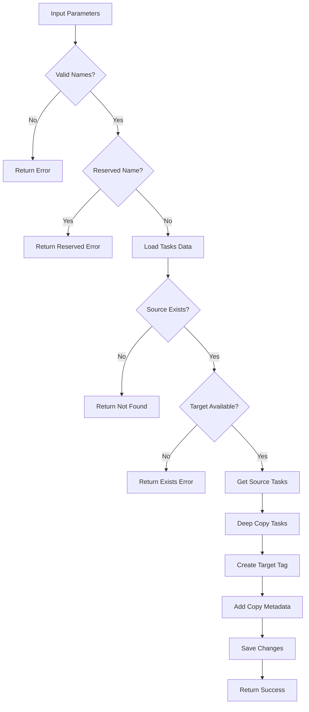

# Tool: copy_tag

## Purpose
Create a complete duplicate of an existing tag with all its tasks, enabling experimentation or branching of work without affecting the original.

## Business Value
- **Who uses this**: Developers who need to create variations of existing work or experiment safely
- **What problem it solves**: Allows creating tag duplicates for experimentation, backup, or alternative approaches
- **Why it's better than manual approach**: Ensures deep copy of all tasks with proper metadata tracking

## Functionality Specification

### Input Requirements

| Parameter | Type | Required | Default | Description |
|-----------|------|----------|---------|-------------|
| `sourceName` | string | Yes | - | Name of the source tag to copy from |
| `targetName` | string | Yes | - | Name of the new tag to create |
| `description` | string | No | Auto-generated | Optional description for the new tag |
| `file` | string | No | "tasks/tasks.json" | Path to tasks file |
| `projectRoot` | string | Yes | - | Absolute path to project directory |

#### Validation Rules
1. Both source and target names must be provided as strings
2. Target name must be alphanumeric with hyphens/underscores only
3. Target name cannot be reserved ("master", "main", "default")
4. Source tag must exist
5. Target tag name must not already exist

### Processing Logic

#### Step-by-Step Algorithm

```
1. VALIDATE_PARAMETERS
   - Check both names provided
   - Validate target name format
   - Check not using reserved name
   
2. LOAD_TASKS_DATA
   - Read tasks.json file
   - Extract raw tagged data
   
3. VERIFY_SOURCE_EXISTS
   - Check source tag exists
   - Return error if not found
   
4. CHECK_TARGET_AVAILABLE
   - Verify target name not taken
   - Return error if exists
   
5. GET_SOURCE_TASKS
   - Extract tasks from source tag
   - Prepare for deep copy
   
6. CREATE_DEEP_COPY
   - Deep clone all tasks (not references)
   - Preserve all task properties
   - Maintain subtask structure
   
7. CREATE_TARGET_TAG
   - Initialize new tag structure
   - Add copied tasks
   - Set metadata with copy info
   
8. SAVE_CHANGES
   - Write updated data to file
   - Exclude internal fields
   
9. RETURN_CONFIRMATION
   - Return copy details
   - Include task count
```

### Output Specification

#### Success Response
```javascript
{
  success: true,
  data: {
    sourceName: "feature-auth",
    targetName: "feature-auth-v2",
    copied: true,
    tasksCopied: 15,
    description: "Copy of \"feature-auth\" created on 1/20/2024",
    message: "Successfully copied tag from \"feature-auth\" to \"feature-auth-v2\""
  }
}
```

#### Success Response (Custom Description)
```javascript
{
  success: true,
  data: {
    sourceName: "master",
    targetName: "experiment-1",
    copied: true,
    tasksCopied: 25,
    description: "Experimental branch for new architecture",
    message: "Successfully copied tag from \"master\" to \"experiment-1\""
  }
}
```

#### Error Response
```javascript
{
  success: false,
  error: {
    code: "SOURCE_NOT_FOUND",
    message: "Source tag \"feature-xyz\" does not exist"
  }
}
```

#### Error Codes
- `MISSING_ARGUMENT`: Required parameters not provided
- `MISSING_PARAMETER`: Source or target name not provided
- `SOURCE_NOT_FOUND`: Source tag doesn't exist
- `TARGET_EXISTS`: Target tag name already taken
- `RESERVED_NAME`: Target name is reserved
- `INVALID_TAG_NAME`: Invalid target tag name format
- `COPY_TAG_ERROR`: General error during copy

### Side Effects
1. **Creates new tag** in tasks.json file
2. **Deep copies all tasks** (not references)
3. Adds copy metadata with source tracking
4. Does not affect source tag
5. Does not switch current tag

## Data Flow



## Implementation Details

### Data Storage
- **Input**: `.taskmaster/tasks/tasks.json` - Tagged task data
- New tag created as top-level key
- Tasks are deep cloned (independent copies)
- Copy metadata tracks source and date

### Copy Metadata
```javascript
{
  "feature-auth-v2": {
    "tasks": [
      // Deep copies of all tasks
    ],
    "metadata": {
      "created": "2024-01-20T14:30:00Z",
      "updated": "2024-01-20T14:30:00Z",
      "description": "Copy of \"feature-auth\" created on 1/20/2024",
      "copiedFrom": {
        "tag": "feature-auth",
        "date": "2024-01-20T14:30:00Z"
      }
    }
  }
}
```

### Deep Copy Implementation
```javascript
// Tasks are deep cloned, not referenced
rawData[targetName] = {
  tasks: JSON.parse(JSON.stringify(sourceTasks)),
  metadata: { ... }
};
```

### Name Validation
```javascript
// Valid target name pattern
/^[a-zA-Z0-9_-]+$/

// Reserved names (cannot use as target)
const reservedNames = ['master', 'main', 'default'];
```

## AI Integration Points
This tool **does not use AI**. It performs pure data operations:
- Deep copying of task structures
- Metadata generation
- JSON manipulation
- No content generation or analysis

## Dependencies
- **File System Access**: Read/write JSON files
- **Tag Management**: Tag copying utilities
- **Utils**: JSON operations, deep cloning
- **Silent Mode**: Console output suppression for MCP

## Test Scenarios

### 1. Basic Tag Copy
```javascript
// Test: Simple copy
Input: {
  projectRoot: "/project",
  sourceName: "feature-auth",
  targetName: "feature-auth-backup"
}
Expected: Tag copied with all tasks
```

### 2. Copy with Custom Description
```javascript
// Test: Custom description
Input: {
  projectRoot: "/project",
  sourceName: "master",
  targetName: "experiment-1",
  description: "Testing new approach"
}
Expected: Tag with custom description
```

### 3. Source Doesn't Exist
```javascript
// Test: Non-existent source
Input: {
  projectRoot: "/project",
  sourceName: "feature-xyz",
  targetName: "feature-abc"
}
Expected: Error - SOURCE_NOT_FOUND
```

### 4. Target Already Exists
```javascript
// Test: Duplicate target
Setup: Tag "feature-v2" exists
Input: {
  projectRoot: "/project",
  sourceName: "feature-v1",
  targetName: "feature-v2"
}
Expected: Error - TARGET_EXISTS
```

### 5. Reserved Target Name
```javascript
// Test: Reserved name
Input: {
  projectRoot: "/project",
  sourceName: "feature-auth",
  targetName: "master"
}
Expected: Error - RESERVED_NAME
```

### 6. Invalid Target Name
```javascript
// Test: Invalid characters
Input: {
  projectRoot: "/project",
  sourceName: "feature-auth",
  targetName: "feature@v2!"
}
Expected: Error - INVALID_TAG_NAME
```

### 7. Copy Many Tasks
```javascript
// Test: Large tag copy
Setup: Source has 100 tasks with subtasks
Input: {
  projectRoot: "/project",
  sourceName: "large-feature",
  targetName: "large-feature-copy"
}
Expected: All 100 tasks deep copied
```

### 8. Task Independence
```javascript
// Test: Verify deep copy
Setup: Copy tag, then modify original
Input: {
  projectRoot: "/project",
  sourceName: "feature-auth",
  targetName: "feature-auth-copy"
}
Action: Modify task in original
Expected: Copy remains unchanged
```

## Implementation Notes
- **Complexity**: Low (deep copy operation)
- **Estimated Effort**: 2 hours for complete implementation
- **Critical Success Factors**:
  1. Deep copy implementation (not references)
  2. Name validation (source and target)
  3. Metadata tracking with source info
  4. Reserved name checking
  5. Atomic copy operation

## Performance Considerations
- Single file read/write operation
- Deep copy is O(n) where n = total task properties
- Memory usage doubles temporarily during copy
- JSON serialization for deep cloning
- No external API calls

## Security Considerations
- Reserved names prevented
- Target name validation prevents injection
- Deep copy prevents reference manipulation
- Path traversal protection
- File permissions preserved

## Code References
- Current implementation: `scripts/modules/task-manager/tag-management.js` (copyTag function, lines 975-1115)
- MCP tool: `mcp-server/src/tools/copy-tag.js`
- Direct function: `mcp-server/src/core/direct-functions/copy-tag.js`
- Key functions:
  - `copyTag()`: Main copy logic
  - `getTasksForTag()`: Source task extraction
  - `JSON.parse(JSON.stringify())`: Deep copy mechanism
  - `readJSON()`/`writeJSON()`: File operations
- Design patterns: Prototype pattern (deep copy), Factory pattern (tag creation)

---

*This documentation captures the actual current implementation of the copy_tag tool as a pure data operation without AI integration.*