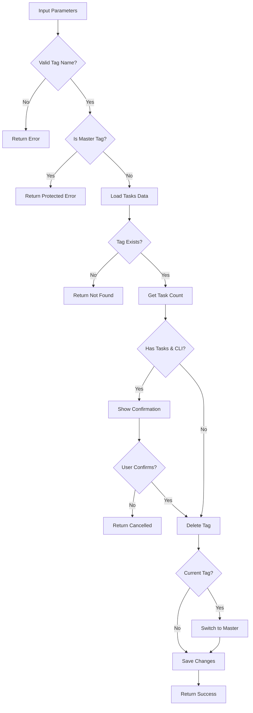

# Tool: delete_tag

## Purpose
Delete an existing tag and permanently remove all its associated tasks from the system.

## Business Value
- **Who uses this**: Developers cleaning up completed feature branches or obsolete work streams
- **What problem it solves**: Removes unused tags and their tasks to maintain a clean workspace
- **Why it's better than manual approach**: Safely handles tag deletion with proper checks and current tag switching

## Functionality Specification

### Input Requirements

| Parameter | Type | Required | Default | Description |
|-----------|------|----------|---------|-------------|
| `name` | string | Yes | - | Name of the tag to delete |
| `yes` | boolean | No | true (MCP), false (CLI) | Skip confirmation prompts |
| `file` | string | No | "tasks/tasks.json" | Path to tasks file |
| `projectRoot` | string | Yes | - | Absolute path to project directory |

#### Validation Rules
1. Tag name must be provided and must be a string
2. Cannot delete the "master" tag (protected)
3. Tag must exist in the system
4. If deleting current tag, automatically switches to "master"
5. CLI requires double confirmation for tags with tasks

### Processing Logic

#### Step-by-Step Algorithm

```
1. VALIDATE_TAG_NAME
   - Check tag name provided
   - Verify not "master" tag
   
2. LOAD_TASKS_DATA
   - Read tasks.json file
   - Extract raw tagged data
   - Handle legacy format
   
3. CHECK_TAG_EXISTS
   - Verify tag exists in data
   - Get task count for tag
   
4. CHECK_CURRENT_TAG
   - Determine if deleting current tag
   - Prepare to switch if needed
   
5. CONFIRMATION_FLOW (CLI only)
   If not yes and has tasks:
   - Show warning with task count
   - First confirmation prompt
   - Second confirmation (type tag name)
   
6. DELETE_TAG
   - Remove tag from data structure
   - Delete all associated tasks
   
7. SWITCH_TAG_IF_NEEDED
   If was current tag:
   - Switch to "master" tag
   - Update current tag setting
   
8. SAVE_CHANGES
   - Write updated data to file
   - Exclude internal fields
   
9. RETURN_CONFIRMATION
   - Return deletion details
   - Include switch information
```

### Output Specification

#### Success Response
```javascript
{
  success: true,
  data: {
    tagName: "feature-auth",
    deleted: true,
    tasksDeleted: 15,
    wasCurrentTag: false,
    switchedToMaster: false,
    message: "Successfully deleted tag \"feature-auth\""
  }
}
```

#### Success Response (Current Tag Deleted)
```javascript
{
  success: true,
  data: {
    tagName: "feature-auth",
    deleted: true,
    tasksDeleted: 15,
    wasCurrentTag: true,
    switchedToMaster: true,
    message: "Successfully deleted tag \"feature-auth\""
  }
}
```

#### Error Response
```javascript
{
  success: false,
  error: {
    code: "PROTECTED_TAG",
    message: "Cannot delete the \"master\" tag"
  }
}
```

#### Error Codes
- `MISSING_ARGUMENT`: Required parameters not provided
- `MISSING_PARAMETER`: Tag name not provided
- `PROTECTED_TAG`: Attempted to delete master tag
- `TAG_NOT_FOUND`: Tag doesn't exist
- `DELETE_TAG_ERROR`: General error during deletion
- `DELETION_CANCELLED`: User cancelled deletion (CLI only)

### Side Effects
1. **Permanently deletes tag** and all its tasks
2. **Switches to master** if deleting current tag
3. Tasks cannot be recovered after deletion
4. Updates git-tag mappings if applicable
5. Modifies tasks.json file

## Data Flow



## Implementation Details

### Data Storage
- **Input**: `.taskmaster/tasks/tasks.json` - Tagged task data
- Tag removed from top-level keys
- All tasks within tag are deleted
- Current tag setting in `.taskmaster/config.json`

### Confirmation Flow (CLI)
1. **Warning Display**: Shows tag name and task count
2. **First Confirmation**: Yes/No prompt
3. **Second Confirmation**: Type exact tag name
4. **MCP Always Skips**: yes=true by default for MCP

### Protected Tags
```javascript
// Cannot be deleted
const protectedTags = ['master'];

// Reserved names (cannot be created, but can be deleted if they exist)
const reservedNames = ['main', 'default'];
```

### Current Tag Switching
```javascript
if (currentTag === deletedTag) {
  // Automatically switch to master
  await switchCurrentTag(projectRoot, 'master');
}
```

## AI Integration Points
This tool **does not use AI**. It performs pure data operations:
- Tag structure deletion
- File system operations
- Current tag management
- No content generation or analysis

## Dependencies
- **File System Access**: Read/write JSON files
- **Tag Management**: Tag deletion utilities
- **Config Manager**: Current tag switching
- **Inquirer**: CLI confirmation prompts
- **Silent Mode**: Console output suppression for MCP

## Test Scenarios

### 1. Delete Empty Tag
```javascript
// Test: Delete tag with no tasks
Setup: Tag "feature-old" exists with 0 tasks
Input: {
  projectRoot: "/project",
  name: "feature-old"
}
Expected: Tag deleted, tasksDeleted: 0
```

### 2. Delete Tag with Tasks
```javascript
// Test: Delete tag with tasks
Setup: Tag "feature-auth" has 15 tasks
Input: {
  projectRoot: "/project",
  name: "feature-auth",
  yes: true
}
Expected: Tag deleted, tasksDeleted: 15
```

### 3. Delete Current Tag
```javascript
// Test: Delete active tag
Setup: Current tag is "feature-auth"
Input: {
  projectRoot: "/project",
  name: "feature-auth",
  yes: true
}
Expected: Tag deleted, switchedToMaster: true
```

### 4. Attempt Delete Master
```javascript
// Test: Try to delete master
Input: {
  projectRoot: "/project",
  name: "master"
}
Expected: Error - PROTECTED_TAG
```

### 5. Delete Non-Existent Tag
```javascript
// Test: Tag doesn't exist
Input: {
  projectRoot: "/project",
  name: "feature-xyz"
}
Expected: Error - TAG_NOT_FOUND
```

### 6. CLI Confirmation Flow
```javascript
// Test: User cancels deletion
Setup: Tag has tasks, CLI mode
Input: {
  projectRoot: "/project",
  name: "feature-auth",
  yes: false
}
User Action: Decline confirmation
Expected: Error - DELETION_CANCELLED
```

### 7. CLI Type Tag Name
```javascript
// Test: Second confirmation
Setup: Tag has tasks, CLI mode
Input: {
  projectRoot: "/project",
  name: "feature-auth",
  yes: false
}
User Action: Type wrong tag name
Expected: Error - DELETION_CANCELLED
```

### 8. MCP Auto-Confirm
```javascript
// Test: MCP skips confirmation
Setup: Tag has tasks, MCP mode
Input: {
  projectRoot: "/project",
  name: "feature-auth"
  // yes defaults to true in MCP
}
Expected: Tag deleted without prompts
```

## Implementation Notes
- **Complexity**: Low (simple data deletion)
- **Estimated Effort**: 2-3 hours for complete implementation
- **Critical Success Factors**:
  1. Protected tag validation
  2. Current tag switching logic
  3. Confirmation flow (CLI)
  4. Atomic deletion operation
  5. Data consistency

## Performance Considerations
- Single file read/write operation
- Task deletion is O(1) (delete object key)
- No migration of task data
- No external API calls
- Immediate deletion (no soft delete)

## Security Considerations
- Protected tags cannot be deleted
- Double confirmation for destructive action
- No recovery mechanism (permanent deletion)
- Path traversal protection
- File permissions preserved

## Code References
- Current implementation: `scripts/modules/task-manager/tag-management.js` (deleteTag function, lines 218-415)
- MCP tool: `mcp-server/src/tools/delete-tag.js`
- Direct function: `mcp-server/src/core/direct-functions/delete-tag.js`
- Key functions:
  - `deleteTag()`: Main deletion logic
  - `getCurrentTag()`: Current tag detection
  - `switchCurrentTag()`: Tag switching
  - `getTasksForTag()`: Task counting
  - `readJSON()`/`writeJSON()`: File operations
- Design patterns: Command pattern (deletion), State pattern (current tag)

---

*This documentation captures the actual current implementation of the delete_tag tool as a pure data operation without AI integration.*