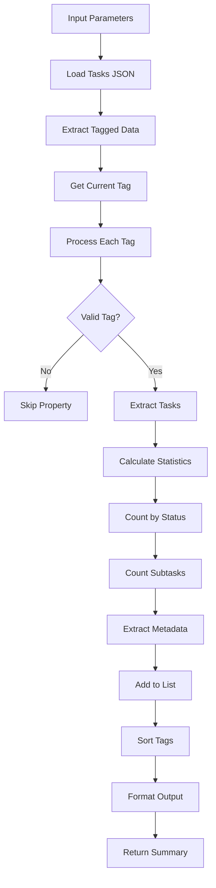

# Tool: list_tags

## Purpose
List all available tags with task counts, completion status, and optional metadata without AI assistance.

## Business Value
- **Who uses this**: Developers managing multiple parallel workflows
- **What problem it solves**: Provides overview of all available task contexts and their status
- **Why it's better than manual approach**: Automatically aggregates task statistics and metadata across tags

## Functionality Specification

### Input Requirements

| Parameter | Type | Required | Default | Description |
|-----------|------|----------|---------|-------------|
| `showMetadata` | boolean | No | false | Include creation date and description |
| `file` | string | No | "tasks/tasks.json" | Path to tasks file |
| `projectRoot` | string | Yes | - | Absolute path to project directory |

#### Validation Rules
1. Tasks file must exist at specified path
2. Reads all tags from the tagged data structure
3. Identifies current active tag
4. Calculates statistics for each tag

### Processing Logic

#### Step-by-Step Algorithm

```
1. LOAD_TASKS_DATA
   - Read tasks.json file
   - Extract raw tagged data structure
   - Get current tag from environment
   
2. PROCESS_EACH_TAG
   For each tag in data:
   - Skip non-tag properties
   - Extract tasks array
   - Extract metadata object
   - Calculate task statistics
   
3. CALCULATE_STATISTICS
   For each tag:
   - Count total tasks
   - Count completed tasks
   - Break down by status
   - Count subtasks
   - Subtask status breakdown
   
4. SORT_TAGS
   - Current tag first
   - Others alphabetically
   
5. FORMAT_OUTPUT
   - Include tag names
   - Add task counts
   - Add completion metrics
   - Optional metadata
   
6. RETURN_SUMMARY
   - Return structured tag list
   - Include current tag indicator
   - Provide totals
```

### Output Specification

#### Success Response
```javascript
{
  success: true,
  data: {
    tags: [
      {
        name: "master",
        isCurrent: true,
        taskCount: 15,
        completedTasks: 5,
        statusBreakdown: {
          pending: 8,
          in_progress: 2,
          done: 5
        },
        subtaskCounts: {
          totalSubtasks: 45,
          subtasksByStatus: {
            pending: 30,
            in_progress: 10,
            done: 5
          }
        },
        created: "2024-01-15T10:00:00Z",
        description: "Main development branch"
      },
      {
        name: "feature-auth",
        isCurrent: false,
        taskCount: 8,
        completedTasks: 3,
        statusBreakdown: {
          pending: 4,
          in_progress: 1,
          done: 3
        },
        subtaskCounts: {
          totalSubtasks: 20,
          subtasksByStatus: {
            pending: 12,
            in_progress: 5,
            done: 3
          }
        },
        created: "2024-01-20T14:30:00Z",
        description: "Authentication feature implementation"
      }
    ],
    currentTag: "master",
    totalTags: 2,
    message: "Found 2 tag(s)"
  }
}
```

#### Error Response
```javascript
{
  success: false,
  error: {
    code: "FILE_NOT_FOUND",
    message: "Could not read tasks file at /project/.taskmaster/tasks/tasks.json"
  }
}
```

#### Error Codes
- `MISSING_ARGUMENT`: Required parameters not provided
- `FILE_NOT_FOUND`: Tasks file doesn't exist
- `LIST_TAGS_ERROR`: Error during tag listing

### Side Effects
1. **No data modifications** - read-only operation
2. May enhance tags with default metadata if missing
3. Does not change current tag
4. Does not affect task data
5. Provides snapshot of current state

## Data Flow



## Implementation Details

### Data Storage
- **Input**: `.taskmaster/tasks/tasks.json` - Tagged task data
- Current tag stored in `.taskmaster/config.json`
- Tags organized as top-level keys
- Each tag contains tasks array and metadata

### Tag Structure
```javascript
{
  "master": {
    "tasks": [...],
    "metadata": {
      "created": "2024-01-15T10:00:00Z",
      "updated": "2024-01-15T10:00:00Z",
      "description": "Main development branch"
    }
  },
  "feature-auth": {
    "tasks": [...],
    "metadata": {...}
  }
}
```

### Statistics Calculation
```javascript
// Status breakdown
const statusBreakdown = tasks.reduce((acc, task) => {
  const status = task.status || 'pending';
  acc[status] = (acc[status] || 0) + 1;
  return acc;
}, {});

// Subtask counts
const subtaskCounts = tasks.reduce((acc, task) => {
  if (task.subtasks && task.subtasks.length > 0) {
    acc.totalSubtasks += task.subtasks.length;
    task.subtasks.forEach(subtask => {
      const subStatus = subtask.status || 'pending';
      acc.subtasksByStatus[subStatus] = 
        (acc.subtasksByStatus[subStatus] || 0) + 1;
    });
  }
  return acc;
}, { totalSubtasks: 0, subtasksByStatus: {} });
```

### Tag Validation
```javascript
// Skip non-tag properties
if (tagName === 'tasks' || 
    tagName === 'tag' || 
    tagName === '_rawTaggedData' ||
    !tagData || 
    typeof tagData !== 'object' ||
    !Array.isArray(tagData.tasks)) {
  continue;
}
```

## AI Integration Points
This tool **does not use AI**. It performs pure data operations:
- Direct reading of tag structure
- Statistical calculations
- Metadata extraction
- No content generation or analysis

## Dependencies
- **File System Access**: Read access to JSON files
- **Tag Management**: Tag structure utilities
- **Utils**: JSON operations, current tag detection
- **Silent Mode**: Console output suppression for MCP

## Test Scenarios

### 1. Single Tag (Master Only)
```javascript
// Test: Default setup
Setup: Only master tag exists
Input: {
  projectRoot: "/project"
}
Expected: One tag with isCurrent: true
```

### 2. Multiple Tags
```javascript
// Test: Multiple tags
Setup: master, feature-auth, bugfix-123
Input: {
  projectRoot: "/project"
}
Expected: 3 tags, current tag first
```

### 3. With Metadata
```javascript
// Test: Include metadata
Input: {
  projectRoot: "/project",
  showMetadata: true
}
Expected: Tags include created date and description
```

### 4. Empty Tags
```javascript
// Test: Tag with no tasks
Setup: Tag exists but tasks: []
Input: {
  projectRoot: "/project"
}
Expected: Tag shown with taskCount: 0
```

### 5. Complex Statistics
```javascript
// Test: Various task statuses
Setup: Tasks with mixed statuses and subtasks
Input: {
  projectRoot: "/project"
}
Expected: Accurate status breakdowns
```

### 6. No Tags File
```javascript
// Test: Missing file
Setup: No tasks.json
Input: {
  projectRoot: "/project"
}
Expected: Error - FILE_NOT_FOUND
```

### 7. Legacy Format
```javascript
// Test: Old format conversion
Setup: tasks.json with legacy structure
Input: {
  projectRoot: "/project"
}
Expected: Auto-converts to master tag
```

### 8. Current Tag Detection
```javascript
// Test: Correct current tag
Setup: Current tag set to "feature-auth"
Input: {
  projectRoot: "/project"
}
Expected: feature-auth has isCurrent: true
```

## Implementation Notes
- **Complexity**: Low (simple data aggregation)
- **Estimated Effort**: 2-3 hours for complete implementation
- **Critical Success Factors**:
  1. Accurate statistics calculation
  2. Proper tag structure handling
  3. Current tag identification
  4. Legacy format support
  5. Metadata preservation

## Performance Considerations
- Single file read operation
- Linear traversal of tags and tasks
- Memory usage proportional to task count
- No external API calls
- Results calculated on demand

## Security Considerations
- Read-only operation
- No data modification risks
- Path traversal protection
- Tag isolation maintained
- Safe for concurrent access

## Code References
- Current implementation: `scripts/modules/task-manager/tag-management.js` (tags function, lines 513-670)
- MCP tool: `mcp-server/src/tools/list-tags.js`
- Direct function: `mcp-server/src/core/direct-functions/list-tags.js`
- Key functions:
  - `tags()`: Main tag listing logic
  - `getCurrentTag()`: Current tag detection
  - `getTasksForTag()`: Task extraction
  - `enhanceTagsWithMetadata()`: Metadata defaults
  - `readJSON()`: Tag-aware file reading
- Design patterns: Repository pattern (tag storage), Factory pattern (tag creation)

---

*This documentation captures the actual current implementation of the list_tags tool as a pure data operation without AI integration.*