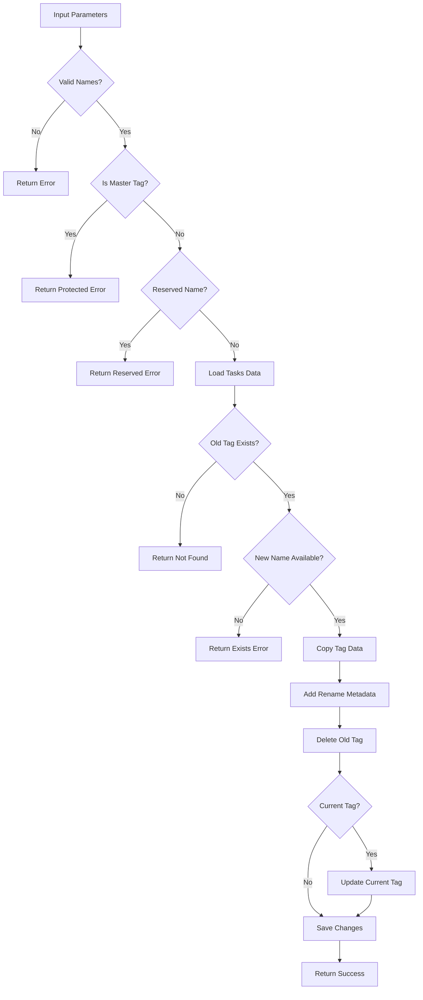

# Tool: rename_tag

## Purpose
Rename an existing tag while preserving all its tasks and metadata, automatically updating the current tag reference if needed.

## Business Value
- **Who uses this**: Developers who need to rename tags to better reflect their purpose or align with naming conventions
- **What problem it solves**: Allows tag renaming without losing task data or disrupting workflow
- **Why it's better than manual approach**: Safely handles tag renaming with validation and automatic current tag updates

## Functionality Specification

### Input Requirements

| Parameter | Type | Required | Default | Description |
|-----------|------|----------|---------|-------------|
| `oldName` | string | Yes | - | Current name of the tag to rename |
| `newName` | string | Yes | - | New name for the tag |
| `file` | string | No | "tasks/tasks.json" | Path to tasks file |
| `projectRoot` | string | Yes | - | Absolute path to project directory |

#### Validation Rules
1. Both old and new names must be provided as strings
2. New name must be alphanumeric with hyphens/underscores only
3. Cannot rename the "master" tag (protected)
4. New name cannot be reserved ("master", "main", "default")
5. Old tag must exist, new tag name must not exist

### Processing Logic

#### Step-by-Step Algorithm

```
1. VALIDATE_PARAMETERS
   - Check both names provided
   - Validate new name format
   - Check not renaming master
   - Check not using reserved name
   
2. LOAD_TASKS_DATA
   - Read tasks.json file
   - Extract raw tagged data
   
3. VERIFY_OLD_TAG_EXISTS
   - Check old tag exists
   - Return error if not found
   
4. CHECK_NEW_TAG_AVAILABLE
   - Verify new name not taken
   - Return error if exists
   
5. CHECK_CURRENT_TAG
   - Determine if renaming current tag
   - Prepare to update if needed
   
6. RENAME_TAG_DATA
   - Copy data to new tag name
   - Add rename metadata
   - Delete old tag entry
   
7. UPDATE_CURRENT_IF_NEEDED
   If was current tag:
   - Switch current tag to new name
   - Update config.json
   
8. SAVE_CHANGES
   - Write updated data to file
   - Exclude internal fields
   
9. RETURN_CONFIRMATION
   - Return rename details
   - Include current tag update info
```

### Output Specification

#### Success Response
```javascript
{
  success: true,
  data: {
    oldName: "feature-auth",
    newName: "feature-authentication",
    renamed: true,
    taskCount: 15,
    wasCurrentTag: false,
    message: "Successfully renamed tag from \"feature-auth\" to \"feature-authentication\""
  }
}
```

#### Success Response (Current Tag Renamed)
```javascript
{
  success: true,
  data: {
    oldName: "feature-auth",
    newName: "feature-authentication", 
    renamed: true,
    taskCount: 15,
    wasCurrentTag: true,
    message: "Successfully renamed tag from \"feature-auth\" to \"feature-authentication\""
  }
}
```

#### Error Response
```javascript
{
  success: false,
  error: {
    code: "PROTECTED_TAG",
    message: "Cannot rename the \"master\" tag"
  }
}
```

#### Error Codes
- `MISSING_ARGUMENT`: Required parameters not provided
- `MISSING_PARAMETER`: Old or new name not provided
- `PROTECTED_TAG`: Attempted to rename master tag
- `RESERVED_NAME`: New name is reserved
- `INVALID_TAG_NAME`: Invalid new tag name format
- `TAG_NOT_FOUND`: Old tag doesn't exist
- `TAG_EXISTS`: New tag name already taken
- `RENAME_TAG_ERROR`: General error during rename

### Side Effects
1. **Renames tag** in tasks.json file
2. **Updates current tag** if renaming active tag
3. Preserves all tasks and their data
4. Adds rename metadata with timestamp
5. Updates any git-tag mappings if applicable

## Data Flow



## Implementation Details

### Data Storage
- **Input**: `.taskmaster/tasks/tasks.json` - Tagged task data
- Tag renamed by copying data to new key and deleting old
- All tasks preserved exactly as they were
- Current tag setting in `.taskmaster/config.json`

### Rename Metadata
```javascript
{
  "feature-authentication": {
    "tasks": [...],
    "metadata": {
      "created": "2024-01-15T10:00:00Z",
      "updated": "2024-01-20T14:30:00Z",
      "renamed": {
        "from": "feature-auth",
        "date": "2024-01-20T14:30:00Z"
      },
      "description": "Authentication feature implementation"
    }
  }
}
```

### Name Validation
```javascript
// Valid tag name pattern
/^[a-zA-Z0-9_-]+$/

// Examples:
"feature-auth" ✓
"bugfix_123" ✓
"release-v2-0" ✓
"feature@auth" ✗ (special characters)
"feature auth" ✗ (spaces)
```

### Protected and Reserved Tags
```javascript
// Cannot rename from:
const protectedTags = ['master'];

// Cannot rename to:
const reservedNames = ['master', 'main', 'default'];
```

## AI Integration Points
This tool **does not use AI**. It performs pure data operations:
- Tag key renaming in JSON structure
- Metadata updates
- Current tag reference updates
- No content generation or analysis

## Dependencies
- **File System Access**: Read/write JSON files
- **Tag Management**: Tag renaming utilities
- **Config Manager**: Current tag updates
- **Utils**: JSON operations
- **Silent Mode**: Console output suppression for MCP

## Test Scenarios

### 1. Basic Tag Rename
```javascript
// Test: Simple rename
Input: {
  projectRoot: "/project",
  oldName: "feature-auth",
  newName: "feature-authentication"
}
Expected: Tag renamed successfully
```

### 2. Rename Current Tag
```javascript
// Test: Rename active tag
Setup: Current tag is "feature-auth"
Input: {
  projectRoot: "/project",
  oldName: "feature-auth",
  newName: "feature-authentication"
}
Expected: Tag renamed, current tag updated
```

### 3. Attempt Rename Master
```javascript
// Test: Try to rename master
Input: {
  projectRoot: "/project",
  oldName: "master",
  newName: "main"
}
Expected: Error - PROTECTED_TAG
```

### 4. Reserved New Name
```javascript
// Test: Use reserved name
Input: {
  projectRoot: "/project",
  oldName: "feature-auth",
  newName: "master"
}
Expected: Error - RESERVED_NAME
```

### 5. Invalid New Name Format
```javascript
// Test: Invalid characters
Input: {
  projectRoot: "/project",
  oldName: "feature-auth",
  newName: "feature@auth!"
}
Expected: Error - INVALID_TAG_NAME
```

### 6. Old Tag Doesn't Exist
```javascript
// Test: Non-existent tag
Input: {
  projectRoot: "/project",
  oldName: "feature-xyz",
  newName: "feature-abc"
}
Expected: Error - TAG_NOT_FOUND
```

### 7. New Name Already Exists
```javascript
// Test: Duplicate name
Setup: Tag "bugfix-123" exists
Input: {
  projectRoot: "/project",
  oldName: "feature-auth",
  newName: "bugfix-123"
}
Expected: Error - TAG_EXISTS
```

### 8. Rename with Many Tasks
```javascript
// Test: Tag with tasks
Setup: Tag has 50 tasks
Input: {
  projectRoot: "/project",
  oldName: "feature-auth",
  newName: "feature-authentication"
}
Expected: All 50 tasks preserved
```

## Implementation Notes
- **Complexity**: Low (simple key rename operation)
- **Estimated Effort**: 2 hours for complete implementation
- **Critical Success Factors**:
  1. Name validation (old and new)
  2. Protected tag checking
  3. Current tag update logic
  4. Metadata preservation
  5. Atomic rename operation

## Performance Considerations
- Single file read/write operation
- Tag rename is O(1) (key rename)
- All tasks copied by reference
- No task data migration needed
- Instant rename operation

## Security Considerations
- Protected tags cannot be renamed
- Reserved names prevented
- Tag name validation prevents injection
- Path traversal protection
- File permissions preserved

## Code References
- Current implementation: `scripts/modules/task-manager/tag-management.js` (renameTag function, lines 810-960)
- MCP tool: `mcp-server/src/tools/rename-tag.js`
- Direct function: `mcp-server/src/core/direct-functions/rename-tag.js`
- Key functions:
  - `renameTag()`: Main rename logic
  - `getCurrentTag()`: Current tag detection
  - `switchCurrentTag()`: Current tag update
  - `getTasksForTag()`: Task counting
  - `readJSON()`/`writeJSON()`: File operations
- Design patterns: Command pattern (rename), State pattern (current tag)

---

*This documentation captures the actual current implementation of the rename_tag tool as a pure data operation without AI integration.*